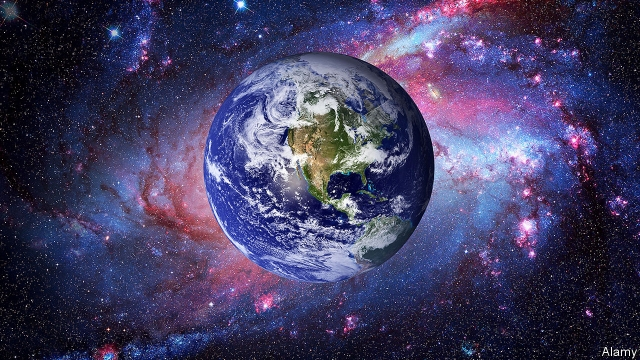

###### Gaia meets AI

# Cyborgs will save humanity, says James Lovelock 

 

> print-edition iconPrint edition | Books and arts | Jul 27th 2019 

Novacene: The Coming Age of Hyperintelligence. By James Lovelock with Bryan Appleyard. The MIT Press; 160 pages; $22.95. Allen Lane; £14.99. 

“MY FATHER WAS, in many ways, a hunter-gatherer,” recalls James Lovelock on the patio of his cottage above Chesil Beach, on England’s south coast. In a poor household, the elder Lovelock not only scrabbled to feed the family, but taught young Jim the virtue of respecting nature and Earth. As a scientist, Mr Lovelock went on to develop Gaia theory, the idea that Earth is a single, complex, self-regulating system. Though initially rejected by life scientists, it became the main way many people conceive of the planet. 

That is just one of his many contributions to science. Mr Lovelock honed a method to look for life on other planets while at NASA in the 1960s. He found and quantified CFCs in the atmosphere in the 1970s, which led eventually to a ban on the harmful chemicals. His nomination to Britain’s Royal Society in 1974 cited a plethora of work in biology, chemistry and physics—all before the popularisation of the theory for which he is best-known (it is named after Gaia, the ancient Greek goddess of Earth). 

To coincide with his 100th birthday, he has published a slim book on artificial intelligence (AI), written with Bryan Appleyard, a journalist. It is mind-stretching stuff. Mr Lovelock thinks the world is leaving the Anthropocene (ie, the current geological age, when human activity has a dominant impact on the planet), for the Novacene, in which “cyborgs” (AI systems) will play the central role. 

This is the next step in natural selection, he argues, because cyborgs can reproduce and evolve. They can think thousands of times faster than humans: they are as cleverer than people as people are than plants. Don’t panic, Mr Lovelock counsels, terrifying as this sounds. Cyborgs will have an incentive to conserve humans rather than wipe them out, since they will need life-forms to help cool the planet for their own survival—though mortals may be relegated to the status of pets and play-things. Cyborgs may “exhibit collections of live humans”, he writes, just as today people “go to Kew Gardens [in London] to watch the plants”. 

In the end, AI systems may save humankind as well as themselves. Besides climate change, Mr Lovelock fears other natural ways that Gaia—the principle that maintains the balance in the planet’s climate—could be destroyed, such as a severe volcanic eruption. Keeping the planet cool will make it more resilient to such threats, he contends; so, as well as preserving organic life, the cyborgs will probably enact other kinds of geoengineering that lower Earth’s temperature. Hence the Novacene is to be welcomed, not feared. “Whatever harm we have done to the Earth, we have, just in time, redeemed ourselves by acting simultaneously as parents and midwives to the cyborgs. They alone can guide Gaia through the astronomical crises now imminent,” Mr Lovelock writes. 

As a thinker, he defies categorisation. He adamantly favours nuclear energy and rejects the Green movement as utopian. He considers work on autonomous weapons to be as foolish as it is deadly. He attributes his originality to a decision to abandon academia for independent research, which allowed his curiosity to roam. In “Novacene”, his most impassioned argument is that humans are cursed by language because it forces causal, linear thinking at the expense of intuition, which is a truer way to understand the reality of the world. 

He expands on this point on his seaside patio. Most of his own inventions came from intuition, he reflects on a warm summer day, not from following the logical steps from known science. A statue of Gaia stares back at him blankly from his garden. But it gets hot, and Mr Lovelock goes inside to escape the sun. ■ 

