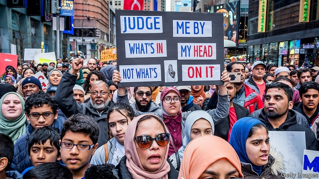

###### Taking liberties

# For some in America, religious freedom has limits 

 

> print-edition iconPrint edition | Books and arts | Jul 27th 2019 

When Islam is Not a Religion: Inside America’s Fight for Religious Freedom. By Asma Uddin.Pegasus Books; 336 pages; $27.95. 

WHEN JOHN LOCKE built a case for religious toleration in 1689, he had a few caveats. Atheists were out—they could not be trusted—as was anyone whose faith threatened the social order. Also excluded were believers who “deliver themselves up to the protection and service of another prince” in a foreign land—such as a “Mahometan” with “blind obedience to the Mufti of Constantinople”. This category included Catholics (due to their fealty to the pope) as well as Muslims. Divided loyalties, Locke reasoned, made dangerous subjects. 

In her new book on the fragile status of America’s roughly 3.5m Muslims after the attacks of September 11th 2001, Asma Uddin identifies a similar prejudice. It may sound like a “crazy fact”, Ms Uddin writes, but a central thread of Islamophobia in the United States is the preposterous notion that Islam is not, properly speaking, a religion. Michael Flynn, briefly Donald Trump’s national security adviser, said in 2016 that Islam is a “political ideology” that “hides behind the notion of being a religion”. When Sebastian Gorka, formerly an adviser to Mr Trump, was asked if the president believed Islam is a religion, he demurred. “We aren’t going to get into theological debates,” Mr Gorka said. 

Ms Uddin folds bits of theology, and her own experience as a Muslim in America, into her legal and political narrative. “Islam” means “peaceful submission”, she writes in response to a claim to the contrary from Steve Bannon, Mr Trump’s erstwhile strategist. Islamic law is more flexible than is commonly believed: sharia may be God’s “divine blueprint”, but “the rules we derive from it”, or fiqh, are subject to reinterpretation. Some American Muslim scholars, for example, now say the Koran permits gay and lesbian Muslims to “worship and engage meaningfully in the community”. For Ms Uddin’s part, after concluding that the hijab was “hopelessly politicised” and hazardous to her safety, in 2006 she stopped wearing hers in public. 

Peril for women wearing religious garb is only one example of anti-Muslim discrimination in America. The author also adduces xenophobic anti-sharia laws and resistance to Muslim buildings. After arsonists targeted the site of a new Islamic centre in Tennessee in 2010, a candidate for Congress said that the building would “fracture the moral and political foundation” of the region; the state’s lieutenant-governor declared Islam a “violent political philosophy”. The mosque opened in 2012, but five years later vandals wrapped bacon on the door handles and scrawled “Fuck Allah” on the wall. 

Ms Uddin wants to forge stronger links with opponents of Mr Trump’s restrictions on immigration and on travel from Muslim countries. Both Muslims and LGBTQ people, she says, are “fighting for their civil rights” and should “support each other’s causes”. Nevertheless the author defends Christian conservatives who resist laws requiring businesses to serve customers of all sexual and gender identities. As a lawyer at Becket, a non-profit firm, Ms Uddin represented Hobby Lobby, a textile shop, when its religious proprietors demanded an exemption from the Obamacare rule that companies must provide contraceptive coverage for employees. Her firm also sided with a group of nuns who complained that an accommodation releasing them from the contraceptive mandate was itself a violation of their conscience. 

This is a fraught political stance. Ms Uddin wants to ally with liberals and begin a “conversation” with conservatives. But many on the left oppose religious exemptions that impede the rights of women and minorities, while many on the right—as this book disturbingly documents—deny that Islam is even worth protecting. ■ 

