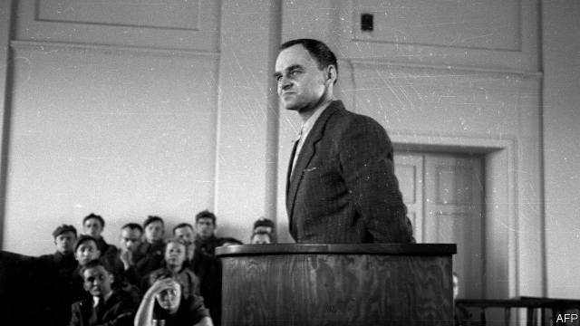

###### Message from hell

# Witold Pilecki is an unsung hero of the second world war 

 

> print-edition iconPrint edition | Books and arts | Jul 27th 2019 

The Volunteer. By Jack Fairweather. Custom House; 529 pages; $28.99. WH Allen; £20. 

WITOLD PILECKI is one of the great—perhaps the greatest—unsung heroes of the second world war. He volunteered to be infiltrated into Auschwitz and spent two and a half years there, not only surviving but organising an extensive resistance network. Among other feats, he chronicled the murders and tortures meted out to the inmates, and the transformation of a modest internment and labour camp into the giant centrepiece of Hitler’s extermination of the Jews. His first-hand accounts were smuggled to the Polish government-in-exile in London, from which they reached the British and American leadership. 

It would be nice to think two things. One is that the allies reacted speedily to the news by doing everything they could to halt the murder machine—bombing the camp and the rail lines that supplied it, arming the Polish underground army so that it could co-ordinate with the resistance inside Auschwitz over a mass break-out, and highlighting the plight of the Jews in occupied Europe as one of the greatest humanitarian crimes of all time. Another consoling assumption would be that after the war Pilecki’s courage, determination and ingenuity would be celebrated, not only in his native Poland, but everywhere. 

On both scores, think again. The news about Auschwitz trickled out slowly. One agent took over six months to make the hazardous journey to Britain. The stories were initially dismissed as fanciful, or, later, overshadowed by reports of other atrocities, such as the destruction of the Warsaw Ghetto. President Franklin Roosevelt worried that publicising Auschwitz would stoke anti-Semitism—that Americans would believe Nazi propaganda that the war was being waged on behalf of the Jews. Military commanders thought attacking Auschwitz would be a distraction, and that the bombs and planes were needed for the only task that mattered, defeating Hitler (a leading British sceptic of targeting the camp was Charles Portal, chief of the air staff, and this reviewer’s great-uncle). 

Nor, alas, was Pilecki treated as a hero by Poland’s post-war communist regime. His resistance activities, under the direction of the émigré leadership in London, led to his arrest and torture—which was so bad, he told his family, that Auschwitz was “just a game” in comparison. His work fighting the Nazis counted for nothing in this new tyranny. He was executed on May 25th 1948; his body has never been found. 

Jack Fairweather’s meticulous and insightful book is likely to be the definitive version of this extraordinary life (even if, slightly jarringly, he calls his subject by his first name, Witold). The author, a British former foreign correspondent now living in America, has tracked down survivors, unearthed archival documents and obtained family papers. He has woven them together with Pilecki’s own powerful accounts, written after his escape from Auschwitz in 1943, to draw a sympathetic and imaginative picture of wartime Poland under Nazi occupation. The book is all the more powerful for the restraint with which he describes Nazi atrocities and Western shilly-shallying. And it is all the more welcome for its projection of an often-missed view of the war, in which Poles take a leading and positive role, rather than being mere bystanders, victims or accomplices. The maps and pictures are illuminating. 

This is not, as its publicity bumf claimed, “the first account” of an “untold story”. In fact, Pilecki’s deeds are already the subject of films, much journalism and many books, mostly in Polish but also in English and Italian. For his part, though, the author scrupulously cites these sources in his admirably comprehensive notes. He ends the book by reiterating Pilecki’s frustration that he had failed to deliver his message effectively. Then, as now, non-Western stories and viewpoints are all too often overlooked. ■ 
<<<<<<< HEAD

-- 

 单词注释:

1.witold[]:[网络] 愚蠢 

2.pilecki[]:[网络] 堆栈 

3.unsung[.ʌn'sʌŋ]:a. 未被唱颂的, 未赞颂的 

4.Jul[]:七月 

5.jack[dʒæk]:n. 插座, 千斤顶, 男人 vt. 抬起, 提醒, 扛举, 增加, 提高, 放弃 a. 雄的 [计] 插座 

6.Fairweather[]:n. 费尔韦瑟（姓氏） 

7.wh[]:abbr. 瓦特小时（Watt Hours）；白宫（White House）；白色（white） 

8.allen['ælin, 'ælәn]:n. 艾伦（男子名） 

9.witold[]:[网络] 愚蠢 

10.pilecki[]:[网络] 堆栈 

11.infiltrate[in'filtreit]:vt. 使浸润, 使潜入, 使渗入 vi. 渗入 n. 渗透物 

12.Auschwitz['auʃ,vits]:n. 奥许维次（波兰城市名） n. (Auschwitz)人名；(德)奥施维茨 

13.feat[fi:t]:n. 壮举, 功绩, 技艺表演 a. 灵巧的, 合适的, 整洁的 

14.chronicle['krɒnikl]:n. 年代记, 记录, 编年史 vt. 把...载入编年史 

15.mete[mi:t]:vt. 量, 测量, 分配 n. 边界, 界石 

16.inmate['inmeit]:n. 同住者, 被收容者 [法] 内部的, 接近中心的, 内在的 

17.internment[in'tә:nmәnt]:n. 拘留 [法] 拘留, 收容, 禁闭 

18.centrepiece['sentәpi:s]:n. 中心装饰品 

19.extermination[ik.stә:mi'neiʃәn]:n. 消灭, 根绝 

20.Jew[dʒu:]:n. 犹太人, 守财奴, 犹太教信徒 vt. 欺骗, 杀价 

21.smuggle['smʌgl]:vt. 偷运, 走私, 私运 vi. 走私 

22.ally['ælai. ә'lai]:n. 同盟者, 同盟国, 助手 vt. 使联盟, 使联合, 使有关系 vi. 结盟 

23.speedily['spi:dili]:adv. 赶紧, 快快地 

24.plight[plait]:n. 困境, 窘境 vt. 宣誓, 保证 

25.humanitarian[hju:.mæni'tєәriәn]:n. 人道主义者, 博爱者, 基督凡人论者 a. 人道主义的, 博爱的, 凡人论的 

26.console[kәn'sәul]:vt. 安慰, 藉慰 n. 控制台 [计] 控制台 

27.ingenuity[.indʒi'nju:iti]:n. 心灵手巧, 精巧, 精巧设计 

28.Poland['pәulәnd]:n. 波兰 

29.trickle['trikl]:n. 滴, 细流 vi. 滴, 细细地流 vt. 使滴, 使小量流动 [计] 信息透露 

30.hazardous['hæzәdәs]:a. 危险的, 冒险的, 碰运气的 [法] 危险的, 冒险的, 碰运气的 

31.initially[i'niʃәli]:adv. 最初, 开头 

32.fanciful['fænsiful]:a. 奇怪的, 稀奇的, 想像的 

33.overshadow[.әuvә'ʃædәu]:vt. 遮阴, 使阴暗, 使失色, 使相形见绌, 使蒙上阴影 

34.atrocity[ә'trɒsiti]:n. 残暴, 凶恶, 暴行 [法] 暴行, 残酷, 残忍 

35.warsaw['wɔ:sɔ:]:n. 华沙（波兰首都） 

36.ghetto['getәu]:n. 犹太人区 

37.Franklin['fræŋklin]:[计] 富兰克林 

38.Roosevelt['rәuzәvelt, 'ru:svelt]:罗斯福( ①姓氏 ②Franklin Delano, 1882-1945, 于1933-1945任美国第32任总统 ③Theodore, 1858-1919, 于1901-1909任美国第26任总统,曾获1906年诺贝尔和平奖) 

39.publicise['pʌblisaiz]:vt. 公布, 为...做广告, 宣传 

40.stoke[stәuk]:v. 司炉, (使)大吃 

41.Nazi['nɑ:tsi]:n. 纳粹党人 a. 纳粹党的 

42.propaganda[.prɒpә'gændә]:n. 宣传, 宣传活动 [医] 宣传 

43.distraction[dis'trækʃәn]:n. 娱乐, 分心的事物, 分心 [医] 注意力分散, 内脱位, 牙弓过宽 

44.hitler['hitlә]:n. 希特勒（纳粹德国元首） 

45.sceptic['skeptik]:n. 怀疑论者 

46.charle[]:n. 查理（男子名）；查理（姓氏） 

47.portal['pɒ:tl]:n. 入口, 大门 a. 肝门的 

48.ala['eilә]:n. 翼, 翅 [化] 丙氨酸 

49.regime[rei'ʒi:m]:n. 政权, 当权期间, 政体, 社会制度, 体制, 情态 [医] 制度, 生活制度 

50.Nazi['nɑ:tsi]:n. 纳粹党人 a. 纳粹党的 

51.tyranny['tirәni]:n. 专制, 暴政 [法] 苛政, 暴政, 专横 

52.meticulous[mә'tikjulәs]:a. 一丝不苟的, 精确的, 过细的 

53.insightful['in.saitful]:a. 有深刻见解的, 富有洞察力的 

54.definitive[di'finitiv]:n. 限定词 a. 限定的, 决定性的 

55.jarringly['dʒɑ:riŋli]:adv. jar（刺耳的）的变形 

56.survivor[sә'vaivә]:n. 生还者, 幸存者 [法] 生还者, 生存者, 辛存者 

57.unearth[.ʌn'ә:θ]:vt. 发掘, 掘出, 从洞中赶出, 揭露, 发现 

58.archival[ɑ: 'kaivәl]:a. 档案的, 档案中的 

59.imaginative[i'mædʒinәtiv]:a. 想像的, 虚构的 

60.wartime['wɒ:taim]:n. 战时 

61.projection[prә'dʒekʃәn]:n. 发射, 计划, 突出部分, 设计, 推测 [计] 投影 

62.bystander['baistændә(r)]:n. 旁观者, 目击者 [法] 候补陪审员, 旁观者 

63.accomplice[ә'kʌmplis]:n. 共犯, 同谋 [医] 协同菌 

64.illuminate[i'lju:mineit]:vt. 照明, 用灯装饰, 阐明, 说明, 使灿烂 vi. 照亮, 用灯装饰 

65.publicity[pʌb'lisiti]:n. 名声, 宣传, 公开场合 [经] 宣传, 广告 

66.bumf[bʌmf]:n. 卫生纸, 纸, 公文 

67.untold['ʌn'tәuld]:a. 未说过的, 未透露的, 未加叙述的, 数不清的, 无限的, 不可计量的, 无数的 [法] 未说明的, 未方露的, 未说出的 

68.journalism['dʒә:nәlizm]:n. 新闻业, 报章杂志 [法] 报刊, 新闻业, 新闻出版 

69.scrupulously[]:adv. 严谨, 一丝不苟, 用心, 准确, 多顾虑, 小心翼翼, 审慎, 诚实, 真心实意 

70.cite[sait]:vt. 引用, 引证, 表彰 [建] 引证, 指引 

71.admirably['ædmәrәbli]:adv. 极好地, 美好地 

72.reiterate[ri:'itәreit]:vt. 反复地说, 重申, 反复地做 [法] 重述, 重申, 反覆地做 

73.frustration[frʌs'treiʃәn]:n. 挫折, 顿挫 [医] 挫折 

74.effectively[i'fektivli]:adv. 有效地, 有力地, 实际上 
=======
>>>>>>> 50f1fbac684ef65c788c2c3b1cb359dd2a904378

