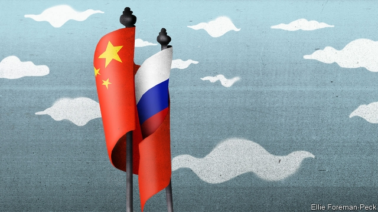
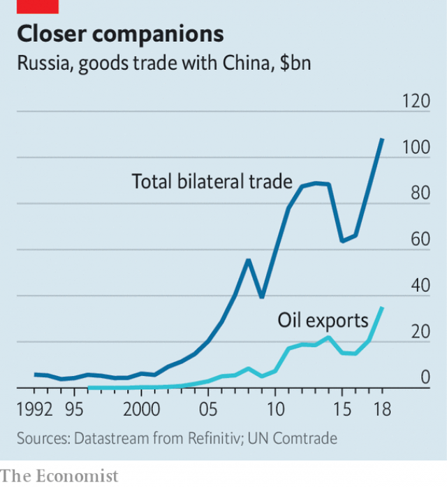
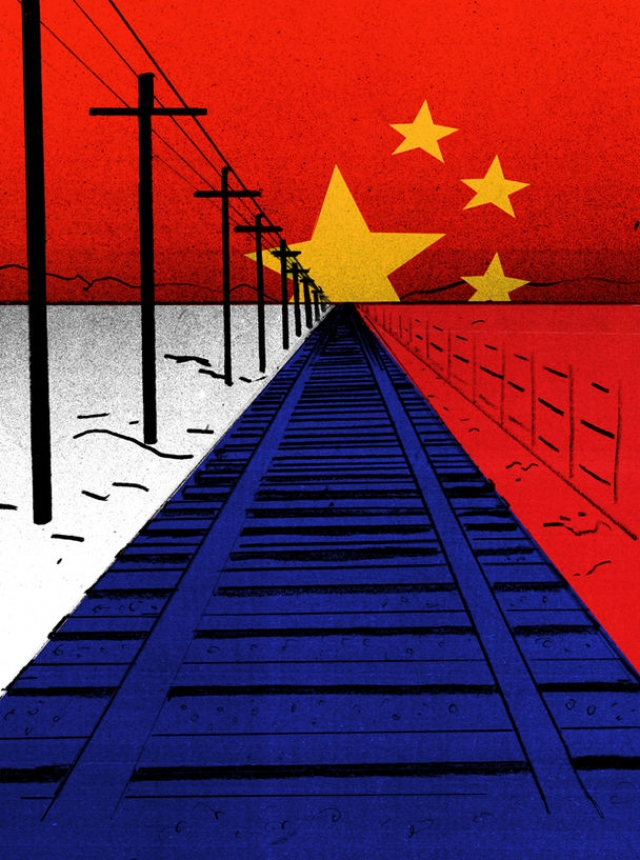
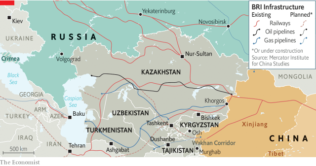
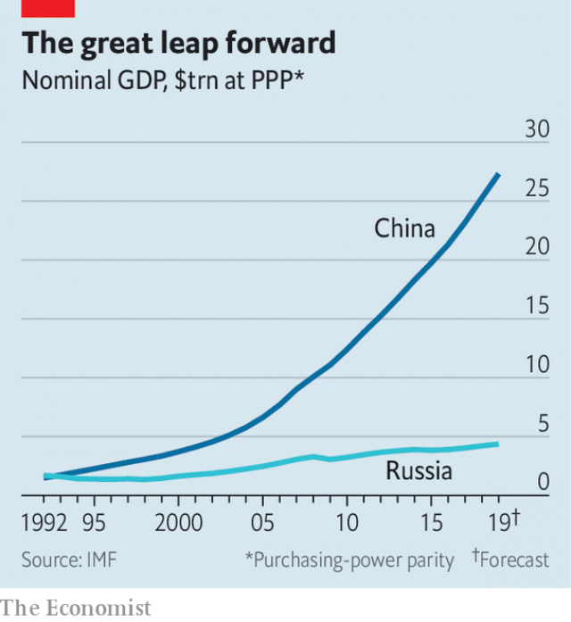
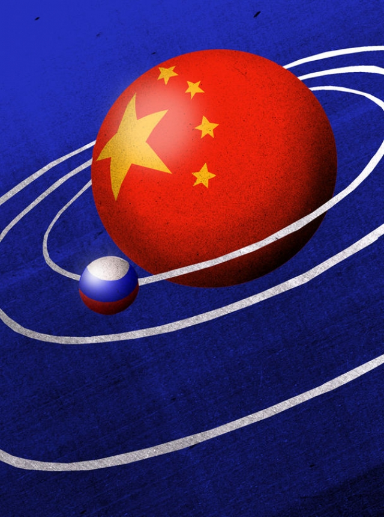

###### The junior partner

# How Vladimir Putin’s embrace of China weakens Russia 

 

> print-edition iconPrint edition | Briefing | Jul 25th 2019 

THE PALACE OF OFFICERS in Dushanbe, the capital of the former Soviet republic of Tajikistan, acts among other things as a hotel for visiting dignitaries. It is marked out by tinted windows, purple neon and an excellent Chinese restaurant. The last is not all that surprising. The distinctly swanky edifice was built and presented to the Tajik ministry of defence by the People’s Republic of China. 

It is not the only such gift. The imposing new government palace and the accompanying parliament now under construction come courtesy of the Chinese Communist Party. One Western diplomat recalls that the voicemail system at the ministry of foreign affairs, another such gift, used to talk to callers in Mandarin. China has built schools, paved roads, bored tunnels and lent Tajikistan $1.3bn—nearly half its foreign debt. It mines the country’s gold and silver and heats its homes with a large coal-fired combined heat and power plant. It supplies its CCTV and traffic cameras; the logo on Dushanbe’s shiny police cars says “China Aid”. 

Tajikistan is the poorest of the Central Asian states, lacking the natural resources of Kazakhstan, Uzbekistan and Turkmenistan, and has been further debilitated by civil war. That makes China’s munificence stand out. But it can be seen in the better-off neighbours, too. 

There are various reasons for this largesse. China is suppressing and interning people from Muslim ethnicities, most notably Uighurs, on a vast scale in the Xinjiang autonomous region, which borders Tajikistan and Kazakhstan. To buy influence in nearby largely Muslim countries makes sense. And Central Asia is as important to China’s new silk road, the Belt and Road Initiative (BRI), as it was to the original one. So China has piled in. “China is doing what the Soviet Union used to do,” a former Tajik official says. 

What does that mean for the Soviet Union’s successors? Russia still considers Central Asia, which the tsars colonised in the 19th century, its backyard, especially in military matters. Hence Tajikistan’s membership of the Collective Security Treaty Organisation, a Russian-led alliance. As long as China’s interest in the region remained mostly in the realm of investment, it was tolerable to Russia, even welcome. 

But by 2016, if not before, Chinese army units had begun to appear in Tajikistan, ostensibly to watch over the Wakhan Corridor—a strip of Afghanistan that separates Tajikistan from Pakistan. Later that year China staged a war game with the Tajik army, some of whose younger officers have been trained in Shanghai. 

China and Tajikistan deny China’s military presence in the country. “Remember, you never saw us here,” a uniformed Chinese soldier told a Washington Post reporter who came across a Chinese outpost near the town of Murghab. But military attachés have spotted dozens of Chinese military personnel, training camps and guard posts in the Pamir mountains, which have played a role in grand strategy since the days of Alexander the Great. 

This increased military activity rattled Moscow, says Alexander Gabuev, a sinologist at the Carnegie Moscow Centre, a think-tank. But as an Indian diplomat points out, it could hardly complain: “Russia cannot confront China, because it depends on it.” Instead it showed off. In 2018 Russia pointedly brought its most modern kit to Tajikistan for its own war games close to the site of the Chinese ones. Sergei Shoigu, Russia’s defence minister, recently visited Dushanbe’s Palace of Officers when in Tajikistan to inspect the 7,000-strong 201st Motor Rifle Division, Russia’s largest foreign deployment. Perhaps he stopped for some duck and glass noodles under the watchful eye of China’s president, Xi Jinping, whose picture is proudly displayed on the ministry restaurant’s wall. The chef can be seen in his entourage. 

Military posturing in this remote region provides a rare glimpse of the tension that underlies the official friendship between Russia and China, a friendship Vladimir Putin, Russia’s president, has done much to foster since the mid 2000s. It is one in which he places much public store. “In recent years, thanks to your direct participation, the relationship between Russia and China has reached an unprecedentedly high level,” Mr Putin told Mr Xi on June 5th, when the Chinese president and a thousand-strong delegation flew in for the St Petersburg Economic Forum that Mr Putin holds every year. 

“Russia is the country that I have visited the most times, and President Putin is my best friend and colleague,” said Mr Xi. They strolled around Moscow Zoo, inspected two pandas lent by China as a sign of great trust and were greeted in Mandarin by Russian children. No one actually sang “Russian and Chinese—Brothers for ever”, written 70 years ago to celebrate the unending friendship between Joseph Stalin and Mao Zedong: 

But it felt as if they might have. 

Like those butchers of yesteryear, Mr Putin and Mr Xi are brought together by a shared adversary, America. But there are crucial differences between today’s resentments and the mortal combat of the past. One is that the cold war was a struggle over which side’s model represented the future for the world. Today’s confrontation rejects the idea of any singular future. Russia and China justify their authoritarianism on the basis of civilisational difference. They do not claim their values are universal; they do not accept Western values as such. 

More practically, in 1949 Mao was a junior partner Stalin felt he could control. Today Mr Xi holds most of the cards. As late as 1989, the Soviet Union’s GDP was more than twice the size of China’s. Today China’s GDP is six times larger than Russia’s, measured at purchasing-power parity. Russia ranks tenth among China’s export markets, a little above the Philippines but well below India. China is Russia’s second-largest export market after the EU. It buys more Russian oil than any other country. 

 

Such economic asymmetry plays into foreign policy. When a Western diplomat asked a Chinese official whether China’s military presence in Tajikistan had been cleared with Russia, he was told “We also trade with Russia” in a tone that suggested that Russia would do well to keep that in mind. But the changed dynamic of the relationship goes beyond this. Mr Putin’s approach to China is making Russia technologically and politically dependent on its neighbour. As Alexei Navalny, an opposition leader, puts it: “What Mr Putin is doing today will almost certainly make the next leader of Russia hostage to his China policy…It would be very difficult for a future leader to bring co-operation with China into a format that would be beneficial for Russia and supported by the population.” 

The question of support by the population shows up a second asymmetry in the two countries’ dealings. For China, a relationship with Russia is a foreign relationship like others—an important one, a complex one, but a matter of statecraft. For Russia, the new closeness strikes at questions of national identity. Russia’s elites have defined themselves by looking west for centuries. Becoming the first European power to fall into China’s orbit is a reversal—even a rejection—of that history. 

From the late-17th century on, those ruling Russia were determined that it be a European power—St Petersburg was the physical manifestation of the choice—and rejected its Asian traditions with a fervour of the convert. Catherine the Great, of German descent, swore to drive the Turks from Europe, tame China and open trade with India. In the 19th century, Russian Westernisers perceived China as an example of stagnation, bureaucracy, corruption and despotism. When Russia expanded into the east, subjugating the states of Central Asia, it saw itself doing so as a modernising, European power. 

 

Communist ideology complicated matters. Karl Marx had identified what he called the “Asiatic mode of production”, distinguished by a lack of private property rights and a centralised despotic state. Revolutionary Russia, true believers felt, had the opportunity to sweep away that system as well as the capitalist one. It could be to Asia what Europe had long been to Russia: an exemplar of progress in the west. Stalin had no problem with centralised despotic states per se, but still saw Asian communism as a force to support. He helped Mao take Tibet and Xinjiang and brought him into an alliance. After Stalin’s death, relations deteriorated. In the Khrushchev thaw, China was the unreconstructed past; Mao proclaimed Russia revisionist. By the late 1960s there were clashes between Soviet and Chinese troops along the border. 

After the fall of the Soviet Union, the dream of Russia as a fully Western power was revived in full force. “Our principles are clear and simple: supremacy of democracy, human rights and freedoms, legal and moral standards,” Russia’s president, Boris Yeltsin, told the UN in 1992, aligning the country with America and Europe. No such comity for the East. “Ideology differentiates us from China, but we are neighbours and must co-operate.” 

During the 1990s things soured. Russia’s introduction to capitalism saw economic decline and the rise of oligarchs; NATO’s bombing of Serbia over Russia’s objections was a deep blow to its Slavic pride. But when Mr Putin—by no means a believer in the common values of which Mr Yeltsin had spoken—rose to power he still saw the West as a model for Russia’s modernisation and made appropriate efforts to get along. He did not object to the Baltic states joining NATO and said all the right things after the attacks of September 11th 2001. 

In return, say Russian critics of the West like Alexander Lukin of the Higher School of Economics in Moscow, he got nothing but aggravation: encroachment on Russia’s sphere of influence through “colour revolutions” in Ukraine and other machinations and criticism of human-rights abuses. In a book on Russia-China relations, Mr Lukin writes: “It was...the West that destroyed the idea of creating a new system of global politics based on international law. It was...the West that used its temporary omnipotence to create a world in which powerful states could seize anything that was there for the taking, destroy any borders and violate any treaties for the sake of a ‘good cause’.” Russia’s pivot towards China, by this logic, followed a Western failure to accept Russia, with all its shortcomings, and assimilate it into the civilised world. 

But that is hardly the full story. In 1994 Yegor Gaidar, the architect of Russia’s market reforms, argued that there were two ways for Russia to turn to the West. It could try to catch up with the West by mobilising state resources—the model followed from Peter the Great to the 1930s, at great human cost. Or it could try to become truly Western by “taming the state” and developing the sort of institutions which stimulate entrepreneurship and long-term growth. 

If Russia followed neither of those paths, Mr Gaidar said, it would have to look to the east—an alternative he summed up in an aphorism of the ancient Chinese statesman Shang Yang: “When the people are weak, the state is strong”. That could serve as Mr Putin’s motto. In his “millennium manifesto” Mr Putin straightforwardly declared the supremacy of the state over individual rights and freedoms. 

Mr Putin’s satraps in the security services—siloviki—appropriated private companies. Their assets were redistributed among Mr Putin’s associates, many of whom would also become beneficiaries of Chinese investments. “The lion’s share of Chinese money goes to Mr Putin’s friends,” says Mr Gabuev of the Carnegie centre. Gennady Timchenko, who amassed an estimated $13.4bn by selling Russian oil to the West but has since been forced out of Europe by American sanctions, is now the chair of Mr Putin’s Russian-Chinese business council. 

Russian rent-seekers and their short-term interests play a central role in the Sino-Russian relationship. “Sometimes it seems that Russia’s policy towards China is shaped by the lobbying interests of the Kremlin’s heavyweights,” says Andrei Kortunov, head of the Russian International Affairs Council, a think-tank. The same is not true in reverse. Private Chinese firms are reluctant to invest in Russia. Some fear American sanctions; others worry about the lack of property rights and clear rules. To operate in Russia, you need what Chinese businessmen now call bao hu san—a protective umbrella provided by siloviki. For such a small market, why bother? There is an irony here. Russia’s regime has opted for the East; but Chinese people and investors are interested in Russia only to the extent that it is Western. Investors want rule of law, not cronyism. Tourists want St Petersburg, not Tuva. 

But if businessmen did not make much of the fall of the Soviet Union, China’s Communist Party officials saw it as a terrible threat. The communist superpower had fallen, not to outside forces, but to discontent within; China’s party was keenly aware that protesters in Tiananmen Square had taken quite a shine to Mikhail Gorbachev in 1989. It also meant that China had to deal with a new litter of predominantly Muslim states on its borders, and brought the possibility of a Western-dominated bloc stretching from Vancouver to Vladivostok. 

China’s main task thus became ensuring that a reassured Russia would act as a buffer, at best a friendly and at least a neutral one, between itself and America. It did not want a weak neighbour; but nor did it want a mighty one. It invested; it smiled; it bought oil and weapons (though it was not, then, allowed the best). It tended to vote with Russia in the UN Security Council, except when it would cause additional problems with America. Thus, for example, it did not criticise Russia’s annexation of Crimea. But it did not recognise it either. 

Instead, it profited from it. The annexation of Crimea and the invasion of Ukraine eliminated, for the foreseeable future, any risk of an alliance between Russia and America. Mr Putin’s actions diverted Western attention from China; they also made Russia much more dependent on China. In May 2014, weeks after the invasion, Mr Putin and a retinue of businessmen and officials flew to Shanghai to forge a new partnership. The deals reached included a $400bn 30-year gas contract, to be enabled by a far-eastern pipeline called “The Power of Siberia”. It is due to start operations by the end of this year. Russia and China have also increased their co-operation on finding ways to open up the north-west passage to shipping, notably that of liquefied natural gas (LNG). Informal restrictions on the sorts of investment China could make in oil companies have been lifted; the full range of Russia’s non-nuclear weaponry is now available to Beijing, including the S-400 anti-aircraft system. 

 

This dependence should not be mistaken for an alliance. Russian propagandists, at home and in China, have taken advantage of the current trade war to fan the flames of conflict and offer their nation as a fellow victim of America’s aggression. But China is sticking with its professed position of avoiding both alliances and enmities. “The most important relationship for us is the one with America. We don’t want to repeat the mistakes of Stalin and Mao,” says Feng Yujun, the head of the Centre for Russian and Central Asian Studies at Fudan University. “Russia is more dependent on China than China is on Russia.” 

If China does not seek alliance, it relishes that dependency, and wants to ensure its continuation. Russia may in time try to turn again westward, either because of a change in power in the Kremlin—which tends to cause such reversals, as it did when Khrushchev succeeded Stalin—or because the people start to resent Chinese actions, as some in Siberia already do. “Russia will push back when China encroaches on the psychological definition of what it means to be a Russian society,” a Western diplomat says. To keep its interests safe from such a reversal, China is working to create a powerful pro-Chinese lobby inside Russia’s political circles and to create both structural and hardware dependencies that would survive any political change in Russia, says Mr Gabuev. 

In the energy sector China has access to some of Russia’s most valuable assets. Chinese state energy firms own one-fifth of an Arctic LNG project developed by Novatek, an energy firm partly owned by Mr Timchenko. Nearly half of all drilling equipment used by Russian oil firms comes from China. China has helped Rosneft, Russia’s national oil company, to make acquisitions, and buys ever more of its oil. Mr Putin and Mr Xi have agreed to increase the amount of their trade valued in yuan and roubles, in part to avoid sanctions. Russia’s central bank’s yuan holdings now account for 14% of its total reserves, even though the yuan is not fully convertible. That is ten times more than at any other central bank, according to Mr Gabuev. 

Russia is growing dependent on China in technology, too. Huawei, a company deeply distrusted by America, is rolling out its 5G telecoms equipment in Russia. Alibaba, a Chinese e-commerce giant, has entered into a joint venture with Mail.ru, the owner of Russia’s largest social-media networks. Russia’s draconian law on the “sovereignty of the internet”, currently before parliament, is copied from China, and it is hoping to use Chinese technology to implement it. Dahua Technology is helping Russia with face recognition. Hikvision cameras are watching Moscow residents. Grigory Yavlinsky, a liberal politician, argues in a recent article on these deals that turning Russia into “China’s satellite...for the sake of sticking it to the USA is an unforgivable shortsightedness.” 

Leonid Kovachich, a journalist who monitors Russia’s use of Chinese tech, says Russian officials are aware of security risks associated with China’s penetration and are trying to use Russian-made software and algorithms. But they cannot get away from the Chinese hardware. Mr Putin once said that the countries and companies which dominate artificial intelligence will rule the world. Russia’s AI is highly likely to come almost entirely from China. 

 

The asymmetries and contradictions in the relationship are most obvious in Central Asia. Take the Shanghai Co-operation Organisation (SCO), which was created in the late 1990s. China saw it as a way of extending its economic and political influence in Central Asia; it is at an SCO institute in Shanghai that Tajik and other Central Asian officers are trained. Russia saw it as a way of checking such expansion. That is why, two years ago, it insisted that India and Pakistan be allowed to join. Russia also tried to push back against China’s attempt to create a free-trade zone within the SCO by setting up a Eurasian Union alongside the Collective Security Treaty Organisation. The purpose, one Indian diplomat says, was to protect Russia’s own market from the flood of Chinese goods. 

For their part, the Central Asian countries see the SCO as a security guarantee not so much against China as against Russia, particularly after the annexation of Crimea and the war in Ukraine. The fears are particularly palpable in Kazakhstan, the richest of the Central Asian countries and the one with the longest border with Russia. Like Ukraine, in 1994 Kazakhstan gave up the Soviet nuclear weapons it had inherited in return for a commitment that America, Britain and Russia would protect its territorial integrity and sovereignty. 

Two decades later Russia’s annexation of Crimea revealed the true value of that “Budapest memorandum”. Within weeks Nursultan Nazarbayev, Kazakhstan’s first president, was asking Mr Xi for assurances on his country’s security. To placate Moscow, Kazakhstan also joined Russia’s Eurasian Union, albeit a slimmed down version. “Russia wanted it to be a political and economic union, with a single currency and a single parliament. We managed to water it down,” one of Kazakhstan’s negotiators says. 

The difference between the approaches Russia and China take to Central Asia is striking. Russia brandishes sticks, China offers carrots. It is using every tool in its sometimes rather seedy soft-power toolbox to win over the governing elites in Central Asia and offset public resentment of China that has been strengthened by China’s increasing abuse of Muslims—Kazakhs as well as Uighurs—in Xinjiang on internal-security grounds. Playing the generous neighbour seems to work. When America sounded out governments in the area to see if they might criticise China’s repression in Xinjiang at the UN or the Organisation of Islamic States it got no takers. Kazakhstan has locked up activists trying to talk about their experiences in Xinjiang’s re-education camps. 

“Russia still sees us as part of the empire and does not think it needs to earn our trust,” says a senior government official in Kazakhstan. “It always talks about alliances, which implies a confrontation with a third party, whereas China talks of ‘friends’.” This friendship matters a lot to the countries’ elites, for reasons rich in historical irony. In the 19th century Central Asia wanted to stay as it was, but Russia wanted to Westernise it by force. Today Russia wants to keep things as they were, but Central Asian elites want to Westernise. And, compass be damned, they see Chinese friendship as the way to achieve that goal. 

 

Though most Central Asian governments recoil from Russia’s Eurasian Union and its Collective Security Treaty Organisation, they embrace China’s BRI—which was formally announced in Kazakhstan in 2013—as both an economic opportunity and a security guarantee. It was Mr Nazarbayev who first proposed the revival of the old silk route through the landlocked Kazakhstan. “We are in the middle of a continent,” he once observed. “We don’t have access to the sea. But as one [Chinese] businessman said: ‘China is our ocean’.” 

Unlike Russia, China puts its money where its mouth is. Two years ago, China Ocean Shipping Company became a 49% owner of the “dry port” of Khorgos—a vast road-and-rail terminal on the Khazak-Chinese border seen as central to the BRI. Within a few months, a city with shopping centres, a Ferris wheel, high-rise housing and Uighur restaurants sprang up on the Chinese side of the border. 

“China sees Central Asia first and foremost as a way of stabilising Xinjiang. But it is also a testing ground for China’s foreign policy and the country’s ability to push into Russia’s normative space,” says Raffaello Pantucci of the Royal United Services Institute, a think-tank in London. Over the past 20 years China has broken Russia’s monopoly over energy pipelines in Central Asia. Transneft, a Russian pipeline operator, used to control the flow of Kazakh oil. Now Kazakhstan exports its oil to China through a new pipeline built in 2009. “China is rewiring the whole region. All roads used to lead to Moscow. Now all roads lead to Beijing,” says Mr Pantucci. 

Russia still has a cultural, linguistic and political hold on Central Asia. It employs millions of its migrant workers, controls the media and information space, and believes that it can make or break governments there. Perhaps it can. But that does not bother China much. “It does not matter who the tenant is if you own the building,” as another Western diplomat says. 

The shift in balance is obvious on the central avenue in the city of Osh, in Kyrgyzstan. Near the vast statue of Lenin, arm outstretched, which dominates the main square is a new landmark: Shanghai City, the largest hotel in town. Azizbek Karabaev, its 31-year-old manager, worked in Russia in the early 2000s, but in 2012 started to learn Chinese and went to China to study the hotel business. Shanghai City also provides language practice for students learning Chinese. “There is a huge demand for Chinese interpreters,” Mr Karabaev says. His six-year-old son, Adilkhan, barely understands Russian, but speaks fluent Mandarin. He has a Chinese name, too: Wang Xiao Long, or “Little Dragon”. ■ 

-- 

 单词注释:

1.Vladimir[vlɑ'dimɪr]:n. 弗拉基米尔（古罗斯弗拉基米尔-苏兹达里公国的古都） 

2.Jul[]:七月 

3.Dushanbe[dju:'ʃɑ:nbi]:杜尚别[塔吉克斯坦首都] 

4.Tajikistan[tɑ:dʒiki'stɑ:n]:n. 塔吉克斯坦 

5.dignitary['dignitәri]:n. 高贵的人, 高官, 高僧, 要人 

6.tint[tint]:n. 色彩, 浅色 vt. 染色于 

7.neon['ni:ɒn]:n. 氖 [化] 氖Ne 

8.distinctly[dis'tiŋktli]:adv. 显然地, 明显地, 清楚地 

9.swanky['swæŋki]:a. 爱出风头的, 炫耀的 

10.edifice['edifis]:n. 大厦, 大建筑物 

11.Tajik['tɑ:dʒik]:塔吉克人[族] 

12.courtesy['kә:tisi]:n. 礼貌, 谦恭, 好意 [法] 优待, 礼貌, 恩惠 

13.diplomat['diplәmæt]:n. 外交官, 有外交手腕的人 [法] 外交家, 外交官, 有权谋的人 

14.voicemail[ˈvɔɪsmeɪl]:n. 语音信箱 

15.caller['kɒ:lә]:n. 访客, 召集员, 传唤员 a. 新鲜的 [计] 呼叫方标识 

16.mandarin['mændәrin]:n. 中国官话, 国语, 满清官吏, 柑橘 a. (中国式)紧身马褂的 

17.CCTV[]:[计] 闭路电视 

18.logo['lәugәu]:n. 连合活字, 商标, 徽标 [计] 徽标 

19.shiny['ʃaini]:a. 有光泽的, 发光的, 辉煌的, 磨光的, 磨损的 

20.Kazakhstan[ˌkæzək'stæn]:n. 哈萨克斯坦（原苏联加盟共和国之一, 已于1991年宣布独立） 

21.Uzbekistan[,uzbeki'stɑ:n]:n. 乌兹别克斯坦 

22.TURKMENISTAN[,tә:kmeni'stɑ:n]:n. 土库曼斯坦(位于中亚) 

23.debilitate[di'biliteit]:vt. 使衰弱 

24.munificence[mju:'nifisns]:n. 丰厚, 慷慨给与 

25.largesse[lɑ:'dʒes]:n. 慷慨的赠与, 慷慨赠与物, 慷慨的赏钱 

26.suppress[sә'pres]:vt. 镇压, 使止住, 禁止, 抑制, 查禁 [法] 镇压, 平定, 禁止出版 

27.Muslim['mjzlim; (?@) 'mʌzlem]:n. 伊斯兰教, 伊斯兰教教徒 

28.ethnicity[eθ'nisәti]:n. 种族划分 

29.notably['nәjtbәli]:adv. 显著地, 著名地, 尤其, 特别 

30.Uighur[]:n. 维吾尔族人, 维吾尔语, 维吾尔人 

31.BRI[]:[计] 基本速率综合业务数字网 

32.tsar[zɑ:]:n. 沙皇 

33.colonise['kɔlәnaiz]:vi. 开拓殖民地；移民于殖民地 

34.backyard['bæk'jɑ:d]:n. 后院, 后庭 

35.membership['membәʃip]:n. 会员的资格, 全体会员, 会员数目 [法] 会员资格, 成员资格, 会籍 

36.organisation[,ɔ: ^әnaizeiʃən; - ni'z-]:n. 组织, 团体, 体制, 编制 

37.alliance[ә'laiәns]:n. 联盟, 联合 [法] 同盟, 联盟, 联姻 

38.tolerable['tɒlәrәbl]:a. 可容忍的, 可以的 

39.ostensibly[]:adv. 可公开, 显然, 表面, 外表, 诡称, 假装 

40.Afghanistan[æf'gænistæn]:n. 阿富汗 

41.Pakistan[.pɑ:ki'stɑ:n]:n. 巴基斯坦 

42.Washington['wɒʃiŋtn]:n. 华盛顿 

43.outpost['autpәust]:n. 前哨, 前哨部队, 前哨基地 

44.pamir[]: [地名] [中国·塔吉克斯坦·阿富汗] 帕米尔高原 

45.alexander[,æli^'zɑ:ndә]:n. 亚历山大（男子名） 

46.rattle['rætl]:vt. 使嘎嘎响, 喋喋不休地说 vi. 格格响, 喋喋不休 n. 格格声, 拨浪鼓, 喋喋不休的话 

47.Sinologist[sai'nɔlәdʒist,si-]:n. 汉学家, 研究中国问题专家 

48.carnegie[kɑ:'ne^i]:n. 卡内基（姓氏） 

49.cannot['kænɒt]:aux. 无法, 不能 

50.confront[kәn'frʌnt]:vt. 使面对, 对抗, 遭遇, 使对质, 比较 [法] 对证, 使对质, 比较 

51.pointedly[]:adv. 指向地；尖锐地 

52.kit[kit]:n. 装备, 工具箱, 成套工具 [计] 成套部件; 成套零件 

53.Sergei[]:塞奇（人名） 

54.shoigu[]:[网络] 绍伊古 

55.deployment[]:[计] 展开 

56.watchful['wɒtʃful]:a. 注意的, 警戒的, 警醒的, (时间)醒着换过的 

57.proudly['praudli]:adv. 傲慢地, 自大地, 得意洋洋地 

58.entourage[,ɔntu'rɑ:ʒ]:n. 全体随行人员, 陪同人员 

59.posture['pɒstʃә]:n. 姿势, 态度, 情形, 形势 vt. 作...的姿势 vi. 作姿势 

60.underly[]:[网络] 潜在的；标的资产 

61.putin['putin]:n. 普京（人名） 

62.foster['fɒstә]:a. 收养的, 养育的 vt. 养育, 抚育, 培养, 鼓励, 抱(希望) 

63.mid[mid]:a. 中间的, 中央的, 中部的 prep. 在...之中 

64.participation[.pɑ:tisi'peiʃәn]:n. 参与, 分享 [经] 参与, 参股 

65.unprecedentedly[ʌn'presɪdentɪdlɪ]:adv. 空前地 

66.ST[]:[计] 段表, 状态, 系统测试, 直端连接器 [化] 磺胺噻唑 

67.petersburg['pi:tәzbә:^]:n. 彼得斯堡（美国城市）；彼得堡（苏联城市列宁格勒旧称） 

68.forum['fɒ:rәm]:n. 论坛, 公开讨论的广场, 法庭, 讨论会 [法] 讨论会, 专题讨论, 公共论坛 

69.unending[.ʌn'endiŋ]:a. 无穷尽的, 无止境的, 不停的 

70.Joseph['dʒәuzif]:n. 约瑟夫（男子名）；约瑟（圣经中雅各的第十一子） 

71.stalin['stɑ:lin]:n. 斯大林（前苏联领导人） 

72.yesteryear['jestәjiә(r)]:n. 去年, 不久以前 adv. 过去不久的岁月 

73.adversary['ædvәsәri]:n. 敌手, 对手 a. 敌手的, 敌对的 

74.resentment[ri'zentmәnt]:n. 怨恨, 愤恨 

75.combat['kɒmbæt]:n. 争斗, 战斗 vi. 战斗, 争斗 vt. 与...战斗, 与...斗争 

76.confrontation[.kɔnfrʌn'teiʃәn]:n. 对抗；对质；面对 

77.authoritarianism[ə,θɔrə'tɛrɪənɪzəm]:n. 独裁主义；权力主义 

78.civilisational[]:[网络] 文明 

79.parity['pærәti]:n. 同等, 同位, 平价, 奇偶性 [计] 奇偶性 

80.Philippine['filipi:n]:a. 菲律宾(群岛)的, 菲律宾人的 

81.EU[]:[化] 富集铀; 浓缩铀 [医] 铕(63号元素) 

82.asymmetry[æ'simitri]:n. 不匀称, 不对称 [医] 不对称, 偏位 

83.technologically[teknә'lɔdʒikәli]:adv. 技术上地；科技地 

84.politically[]:adv. 政治上 

85.Alexei[]:n. (Alexei)人名；(捷、罗、俄)阿列克谢 

86.Navalny[]:[网络] 纳瓦尔内；瓦尔尼 

87.opposition[.ɒpә'ziʃәn]:n. 反对, 敌对, 相反, 在野党 [医] 对生, 对向, 反抗, 反对症 

88.hostage['hɒstidʒ]:n. 人质, 抵押品 [经] 人质, 抵押品 

89.dealing['di:liŋ]:n. 经营行为, 行为, 交易 [法] 待遇, 处置, 行为 

90.statecraft['steitkræft]:n. 治国才能 

91.closeness['klәusnis]:[建] 密闭, 紧密 

92.elite[ei'li:t]:n. 精华, 精锐, 中坚分子 

93.manifestation[.mænifes'teiʃәn]:n. 显示, 证明, 示威运动 [医] 表现, 表示 

94.fervour['fә:vә]:n. 炽热, 热诚, 热情, 热烈 

95.catherine['kæθәrin]:n. 轮圈外缘装有倒钩的车轮, 侧翻筋斗, 轮转烟火, 车轮窗 

96.descent[di'sent]:n. 降落, 家系, 侵袭, 血统 [医] 下降, 世代, 血统 

97.Turk[tә:k]:n. 土耳其人, 土耳其马 

98.westernisers[]:[网络] 西方主义派 

99.stagnation[stæg'neiʃәn]:n. 淤塞, 停滞 [医] 停滞, 滞留, 郁积 

100.bureaucracy[bjuә'rɒkrәsi]:n. 官僚, 官吏 [法] 官僚主义, 官僚政治, 官僚机构 

101.corruption[kә'rʌpʃәn]:n. 腐败, 堕落, 贪污 [计] 论误 

102.despotism['despәtizәm]:n. 独裁, 专制, 专制政治 [法] 专制政体, 专制政治 

103.subjugate['sʌbdʒugeit]:vt. 征服, 使服从, 抑制, 克制 

104.modernise['mɔdәnaiz]:vt.vi. (使)现代化, (使)适应现代需要 vi. 用现代方法 

105.ideology[.aidi'ɒlәdʒi]:n. 思想体系, 意识形态, 观念学, 空论 [医] 观念学, 观念形态 

106.karl[kɑ:l]:n. 卡尔（男子名, 等于Charles） 

107.marx[mɑ:ks]:n. 马克思（无产阶级的伟大领袖） 

108.asiatic[,eiʃi'ætik]:n. 亚洲人 

109.centralise['sentrәlɑiz]:vt. 形成中心, 把统治权集中于中央, 把...集中起来, 成为...的中心, 集中 

110.despotic[de'spɒtik]:a. 专制的, 专横的, 暴虐的 [法] 专制的, 专横的 

111.believer[bi'li:vә]:n. 信徒 

112.capitalist['kæpitәlist]:n. 资本家, 资本主义者 a. 资本主义的 

113.exemplar[ig'zemplә]:n. 模范, 榜样, 原型, 标本 

114.SE[]:[计] 栈空, 系统扩充 [医] 硒(34号元素) 

115.deteriorate[di'tiәriәreit]:v. (使)恶化 

116.Khrushchev[kru'ʃtʃɒf]:n. 赫鲁晓夫 

117.thaw[θɒ:]:n. 融解, 融化, 解冻时期 vt. 使融解, 使缓和 vi. 融化, 解冻 

118.unreconstructed['ʌn,ri:kәn'strʌktid]:a. 未重建的, 反对变革的, 脑筋转不过来的, 旧思想的 

119.revisionist[ri'viʒәnist]:n. 修正主义者 a. 修正主义的 

120.clash[klæʃ]:n. 冲突, 撞击声, 抵触 vi. 冲突, 抵触 vt. 使发出撞击声 [计] 对撞 

121.fully['fuli]:adv. 十分地, 完全地, 充分地 

122.revive[ri'vaiv]:vt. 使苏醒, 使复兴, 使振奋, 回想起, 重播 vi. 苏醒, 复活, 复兴, 恢复精神 

123.supremacy[sju'premәsi]:n. 至高无上, 霸权地位, 优势, 至上 [法] 至高权力, 无上权力, 霸权 

124.boris['bɔris]:n. 鲍里斯（男子名） 

125.Yeltsin[]:n. 叶利钦（俄罗斯前总统） 

126.UN[ʌn]:pron. 家伙, 东西 [经] 联合国 

127.align[ә'lain]:vi. 排列, 排成一行, 结盟 vt. 使结盟, 使成一行, 校正 

128.comity['kɒmiti]:n. 礼貌, 礼让 [法] 礼让, 友谊 

129.ideology[.aidi'ɒlәdʒi]:n. 思想体系, 意识形态, 观念学, 空论 [医] 观念学, 观念形态 

130.differentiate[.difә'renʃieit]:v. 区别, 区分 

131.capitalism['kæpitәlizәm]:n. 资本主义 [经] 资本主义 

132.oligarch['ɒligɑ:k]:n. 寡头政治执政者 

133.serbia['sә:bjә]:n. 塞尔维亚（南斯拉夫成员共和国名） 

134.Slavic['slævik, 'slɑ:v-]:a. 斯拉夫的, 斯拉夫人的 

135.modernisation[,mɔdәnai'zeiʃәn;-ni'z-]:n. <主英>=modernization 

136.Baltic['bɒ:ltik]:a. 波罗的海的 

137.NATO['neitәj]:北大西洋公约组织, 北约组织 [经] 北大西洋公约组织 

138.lukin[]: [人名] 卢金 

139.encroachment[in'krәutʃmәnt]:n. 侵蚀, 侵犯 [法] 侵犯, 侵占, 侵入 

140.ukraine[ju(:)'krein]:n. 乌克兰（原苏联一加盟共和国, 现已独立） 

141.machination[mæki'neiʃәn]:n. 阴谋, 图谋, 策划 [法] 诡计, 奸计, 阴谋 

142.wasthe[]:[网络] 浪费了 

143.politic['pɒlitik]:a. 精明的, 明智的, 策略的 

144.omnipotence[ɒm'nipәtәns]:n. 全能, 无限力量, 全能之神 [医] 全能 

145.pivot['pivәt]:n. 枢轴, 支点, 旋转运动, 中枢, 关键人物 a. 枢轴的, (如)在枢轴上转动的 vi. 在枢轴上转动, 随着转移 vt. 装枢轴于, 以...为中心旋转 [计] 程序员交互验证和编制工具, 数据透视表 

146.assimilate[ә'simileit]:vt. 使同化, 吸收, 使相拟, 把...比作 vi. 被吸收, 被同化 

147.civilise['sivilaiz]:vt. 开化, 使文明, (非正式)教化, 使文雅, 教育, 教导 vi. 变成文明社会 

148.Yegor[]:n. (Yegor)人名；(俄)叶戈尔 

149.gaidar[]:[网络] 盖达尔；凯达 

150.mobilise['mәjbilɑiz]:vi.vt. 动员, 松动, 使活动, 调动, 发动 

151.peter['pi:tә]:vi. 逐渐消失, 逐渐减少 

152.entrepreneurship[,ɑntrəprə'nɝʃɪp]: 企业家能力/职能; 企业家[主办人等]的身份[地位、职权、能力] 

153.aphorism['æfәrizm]:n. 格言, 警语 

154.shang[ʃæŋ]:n. 商（中国古朝代名） 

155.millennium[mi'leniәm]:n. 千禧年, 一千年 

156.manifesto[.mæni'festәu]:n. 宣言, 声明 

157.straightforwardly[ˌstreɪt'fɔ:wədlɪ]:adv. 正直地 

158.satrap['sætrәp]:n. 总督 

159.asset['æset]:n. 资产, 有益的东西 

160.redistribute[.ri:di'stribjut]:vt. 重新分配, 再分发 [经] 再分配, 重新分配 

161.beneficiary[.beni'fiʃәri]:n. 受惠者, 受益人 a. 受封的 

162.Gennady[]:n. (Gennady)人名；(俄)根纳季 

163.Timchenko[]:[网络] 吉姆琴科 

164.amass[ә'mæs]:vt. 积聚, 堆积 

165.sanction['sæŋkʃәn]:n. 核准, 制裁, 处罚, 约束力 vt. 制定制裁规则, 认可, 核准, 同意 

166.lobby['lɒbi]:n. 大厅, 休息室, 游说议员者 vi. 游说议员, 游说 vt. 游说 

167.heavyweight['heviweit]:n. 重量级拳击运动员, (非正式)有影响的要人 a. 最重量级的 

168.Andrei[]:安德烈（人名） 

169.kortunov[]:[网络] 科尔图诺夫 

170.bao[bau]:n. 非洲石子游戏棋 

171.hu[]:abbr. 海南航空公司在国际航空运输协会中的二字代码；匈牙利（Hungary）；英国无国界卫生组织（Health Limited） 

172.siloviki[]:[网络] 西罗维基；强力集团；西罗维琪 

173.irony['aiәrәni]:n. 反语, 讽刺, 具有讽刺意味的事 

174.regime[rei'ʒi:m]:n. 政权, 当权期间, 政体, 社会制度, 体制, 情态 [医] 制度, 生活制度 

175.opt[ɒpt]:vi. 选择 

176.investor[in'vestә]:n. 投资者 [经] 投资者 

177.cronyism['krәjniizəm]:n. 任人唯亲 

178.Tuva[]:[网络] 图瓦；图瓦共和国；图瓦族 

179.superpower[.sju:pә'pauә]:n. 超级强权, 超级大国 [经] 超级大国 

180.discontent[.diskәn'tent]:n. 不满 

181.keenly['ki:nli]:adv. 锐利地, 敏捷地, 激烈地 

182.protester[]:n. 抗议者, 持异议者, 拒付者 [经] 反对者 

183.Mikhail[]:米哈伊尔（人名） 

184.Gorbachev[]:[经] 戈尔巴乔夫 

185.predominantly[]:adv. 主要地, 显著地, 大多数地, 突出地 

186.bloc[blɒk]:n. 集团 

187.vancouver[væn'ku:vә]:n. 温哥华（加拿大主要港市） 

188.Vladivostok[vlædi'vɔstɔk]:符拉迪沃斯托克[苏联远东区港市]( 中国传统称海参崴) 

189.reassure[.ri:ә'ʃuә]:vt. 使...安心, 向...再保证 [法] 重新保证, 再保险, 使清除疑虑 

190.buffer['bʌfә]:n. 缓冲器, 缓冲区 vt. 缓冲 [计] 缓冲区, 缓冲器 

191.mighty['maiti]:n. 有势力的人 a. 有势力的, 强大的, 有力的 adv. 很, 极 

192.criticise['kritisaiz]:v. 批评, 吹毛求疵, 非难 

193.annexation[ænek'seiʃәn]:n. 合并, 附加, 附加物 [法] 兼并, 侵吞, 附加物 

194.Crimea[krai'miә]:n. 克里米亚, 克里米亚半岛 

195.foreseeable['fɒ:'si:әbl]:a. 可预知的, 能预测的 [法] 可预见的, 可预料的 

196.divert[dai'vә:t]:vt. 转移, 使欢娱 vi. 转移 

197.retinue['retinju:]:n. 随行人员, 侍从们 

198.forge[fɒ:dʒ]:n. 熔炉, 铁工厂 vt. 打制, 锻造, 伪造 vi. 锻造, 伪造 

199.partnership['pɑ:tnәʃip]:n. 合伙, 合股, 合作关系 [经] 合伙(合作)关系, 全体合伙人 

200.siberia[sai'biәriә]:n. 西伯利亚 

201.liquefy['likwifai]:v. (使)溶解, (使)液化 

202.lng[]:abbr. 液化天然气（Liquefied Natural Gas） 

203.informal[in'fɒ:mәl]:a. 非正式的, 不拘礼的, 通俗的 [经] 非正式的, 日常使用的 

204.weaponry['wepәnri]:n. 武器, 军备, 武器设计研制学 

205.dependence[di'pendәns]:n. 依赖, 依存, 信赖 [医] 依赖(如对药物的依赖,即瘾或癖), 从属, 偏利共生 

206.propagandist[.prɒpә'gændist]:n. 宣传者 a. 宣传的, 宣传者的 

207.profess[prә'fes]:vt. 声称, 以...为业, 伪称, 讲授 vi. 表白, 承认, 当教授 

208.enmity['enmәti]:n. 敌意, 憎恨 

209.feng[]:n. 冯（中文姓氏） 

210.fudan[]:[网络] 复旦；普通 

211.relish['reliʃ]:n. 滋味, 风味, 美味, 爱好, 食欲, 调味品 vt. 调味, 喜欢, 玩味 vi. 有味道 

212.dependency[di'pendәnsi]:n. 属国, 保护地, 从属物 [医] 从属, 从属部 

213.continuation[kәn.tinju'eiʃәn]:n. 继续, 续集, 补编 [医] 连续 

214.reversal[ri'vә:sl]:n. 翻转, 颠倒, 反转 [医] 逆转, 颠倒 

215.resent[ri'zent]:vt. 愤恨, 憎恶, 怨恨 

216.encroach[in'krәutʃ]:vi. 侵犯, 侵蚀, 蚕食 [法] 侵犯, 侵入, 侵占 

217.sector['sektә]:n. 扇形, 部门, 部分, 函数尺, 象限仪, 段, 区段 vt. 把...分成扇形 [计] 扇面; 扇区; 段; 区段 

218.Novatek[]:[网络] 联咏；诺瓦泰克公司；联咏科技 

219.rosneft[]:[网络] 俄罗斯石油公司；俄罗斯国家石油公司；俄罗斯石油工业公司 

220.rouble['ru:bl]:n. 卢布 

221.holding['hәuldiŋ]:n. 把持, 支持, 保持 [法] 租借地, 占有物, 拥有的财产 

222.convertible[kәn'vә:tәbl]:a. 可改变的, 可交换的 n. 有活动篷的汽车 

223.huawei[]: 华为 

224.distrust[dis'trʌst]:n. 不信任 vt. 不信任 

225.telecom['telәkɔm]:telecommunication 电信 

226.alibaba[]:n. 阿里巴巴（公司名） 

227.draconian[drә'kәjniәn]:a. 严厉的, 残酷的 

228.sovereignty['sɒvrәnti]:n. 主权, 独立国 [法] 主权, 主权国家, 统治权 

229.currently['kʌrәntli]:adv. 现在, 当前, 一般, 普通 [计] 当前 

230.grigory[]:n. (Grigory)人名；(俄)格里戈里 

231.yavlinsky[]:[网络] 亚夫林斯基 

232.USA[ju: es 'ei]:美国, 美利坚合众国, 美国陆军 

233.unforgivable['ʌnfә'^ivәbl]:a. 不可原谅的, 不可饶恕的 

234.shortsightedness[]:[医] 近视 

235.Leonid['li:әunid]:n. 狮子座流星 

236.tech[tek]:n. 技术学院或学校 

237.penetration[.peni'treiʃәn]:n. 穿透, 渗透, 侵入, 识穿, 洞察(力) [化] 渗入 

238.algorithm['ælgәriðm]:n. 算法 [计] 算法 

239.AI[ai]:[计] 附加信息, 人工智能 [化] 人工智能 

240.entirely[in'taiәli]:adv. 完全, 全然, 一概 

241.sco[]:abbr. 位置时间计数器（Set Time Counter）；[计]一个常用的Unix操作系统 

242.Eurasian[ju'reiʒәn]:n. 欧亚混血儿 a. 欧亚的, 欧亚人的 

243.palpable['pælpәbl]:a. 可感知的, 明显的, 触摸得到的 [医] 可触知的 

244.territorial[.teri'tɒ:riәl]:a. 领土的, 土地的, 地方的, 区域性的 n. 本土自卫队队员 

245.integrity[in'tegriti]:n. 正直, 廉正, 完整 [计] 完整性 

246.Budapest[bju:dә'pest]:n. 布达佩斯(匈牙利首都) 

247.memorandum[.memә'rændәm]:n. 备忘录, 外交备忘录, 交易备忘录 [经] 备忘录, 便笺, 便函 

248.nursultan[]:[网络] 努苏坦 

249.nazarbayev[]:[网络] 纳扎尔巴耶夫；总统纳扎尔巴耶夫；哈萨克的纳扎尔巴耶夫 

250.assurance[ә'ʃuәrәns]:n. 保证, 把握, 信心, 保险 [经] 保证, 担保, 保险 

251.placate[plә'keit]:vt. 抚慰, 平息, 使和解, 怀柔 

252.albeit[ɔ:l'bi:it]:conj. 尽管, 虽然 

253.negotiator[ni'gәuʃieitә]:n. 磋商者, 交涉者, 议定者 [经] 谈判者, 交易者, 协商者 

254.brandish['brændiŋ]:vt. 挥, 挥舞 n. 挥舞 

255.seedy['si:di]:a. 多种子的, 结籽的, 破烂的, 肮脏的 

256.toolbox['tu:lbɒks]:n. 工具箱 [计] 工具箱 

257.offset['ɒ:fset]:n. 抵消, 把...并列, 旁系, 支管, 用胶印法印 vt. 弥补, 抵消, 胶印 vi. 装支管 n. 偏移量 [计] 偏移量 

258.repression[ri'preʃәn]:n. 抑制, 压抑, 制止 [医] 压抑, 抑制 

259.Islamic[iz'læmik]:a. 伊斯兰教的, 穆斯林的 

260.taker['teikә]:n. 取者, 捕者, 接受者, 收取者 [法] 受者, 收票人, 接受打赌的人 

261.activist['æktivist]:n. 激进主义分子 

262.alway['ɔ:lwei]:adv. 永远；总是（等于always） 

263.westernise['westɚˌnaɪz]:vt.& vi. （使）西洋化, （使）欧化 

264.damn[dæm]:n. 一点, 诅咒, 丝毫 interj. 该死, 该死的 vt. 诅咒, 罚...下地狱 vi. 指责, 谴责, 骂...该死, 证明...有罪 

265.recoil[ri'kɒil]:n. 畏缩, 后退, 弹回, 反作用, 后坐力 vi. 退却, 畏缩, 弹回, 撤退, 反冲, 报应 

266.formally['fɒ:mәli]:adv. 正式地, 形式上 

267.revival[ri'vaivl]:n. 复兴, 复活, 恢复精神, 苏醒 [医] 复苏, 回生, 精神重振 

268.landlock['lændlɔk]:n. 内陆国 

269.Ferris['feris]:n. 费理斯（男子名） 

270.Uighur[]:n. 维吾尔族人, 维吾尔语, 维吾尔人 

271.stabilise['steibilaiz]:vt.vi. (使)稳定, (使)安定, (使)坚固 vt. 装稳定器 

272.normative['nɒ:mәtiv]:a. 合乎规范的, 标准的, 规范的 [法] 标准的, 规范的, 合乎规范的 

273.raffaello[]:[网络] 拉斐尔；拉斐尔酒店；拉斐尔·圣齐奥 

274.pantucci[]:n. (Pantucci)人名；(意)潘图奇 

275.monopoly[mә'nɒpәli]:n. 垄断, 专卖权, 独占事业 [经] 垄断, 专利品, 垄断(权)独占 

276.transneft[]:[网络] 俄罗斯石油管道运输公司；俄罗斯石油运输公司；国家石油管道运输公司 

277.kazakh[kɑ:'zɑ:k]:n. 哈萨克人[族] 

278.rewire[ri:'waiә]:vt. 换电线, 再打电报 

279.cultural['kʌltʃәrәl]:a. 文化的, 教养的, 修养的 [医] 培养的 

280.linguistic[liŋ'^wistik]:a. 语言的, 语言学的 [计] 语言的, 语言学的 

281.migrant['maigrәnt]:n. 候鸟, 移居者 [法] 移居者 

282.bother['bɒðә]:vt. 烦扰, 迷惑 vi. 烦恼, 操心 n. 麻烦, 纠纷, 讨厌的人 

283.osh['ɒʃ]: [医][=omni singula hora]（拉）每小时 

284.Kyrgyzstan[kiə'ɡizstən]:n. 吉尔吉斯斯坦（国名） 

285.lenin['lenin]:n. 列宁（俄国无产阶级革命领袖） 

286.outstretched[.aut'stretʃt]:a. 伸开的, 扩张的, 延伸的 

287.wang[]:n. 王（姓氏）；王安电脑公司 

288.xiao[]:箫 

