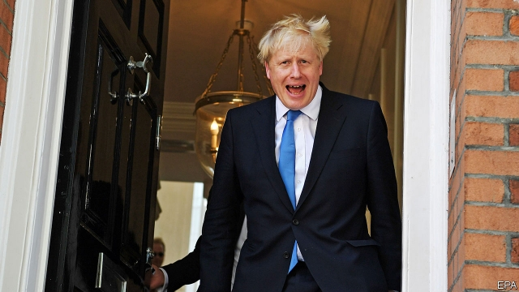

###### Britain finds its BoJo

# Ditching the gags (and his enemies) Boris Johnson claims his prize 

 

> print-edition iconPrint edition | Britain | Jul 25th 2019 

THE NEW prime minister’s first statement to the House of Commons on July 25th summoned the ghost of his hero. The rhetoric was Churchillian; in the absence of Nazis, “sceptics and doubters”, “negativity” and the Labour Party would have to do as enemies. His mission, he thundered, was to deliver Brexit on October 31st with or without a deal; the country would make preparations for the latter with “the kind of national effort that the British people have made before and will make again.” Never mind that the spirit of the Blitz resonates with none but the oldest of his countrymen; once victory has been achieved, Britain will be “clean, green, prosperous, united, confident and ambitious”—indeed, he promised to make it “the greatest place on earth”. 

But Boris Johnson’s ability to steer his country towards the “golden age” he promises is constrained. He will lead a fragile government, with a working majority that will fall to just one if the Conservatives lose a by-election in Wales next week, as seems likely. His promise to leave the EU by October 31st, along with a further commitment to the “abolition” of the backstop, a default position designed to avert a hard border in Ireland by keeping Britain in a customs union with the EU, make it hard to see how he can get a new deal with the EU; and yet reconciling a majority of MPs to leaving without a deal seems close to impossible. 

This conundrum makes an election this autumn likely, suggest Mr Johnson’s friends and foes alike. Win it, and Mr Johnson will be remembered as a political Houdini. Lose, and he could become the answer to a future trivia question: who was Britain’s shortest-serving prime minister? 

To support him in his difficult task, Mr Johnson has scooped up advisers from the two most successful phases of his political career. First came allies from his two terms as mayor of London, such as Sir Edward Lister, a local-government grandee. Next came veterans from Vote Leave, the Brexit campaign that turned Mr Johnson into a political bulldozer, crashing through Britain’s four-decades-old political settlement. Dominic Cummings, the cantankerous head of the campaign and a staunch critic of how the government has handled negotiations, is an adviser. 

The prime minister has also stuffed his cabinet with Leavers. Priti Patel, who was prominent in the campaign, is the new home secretary. Dominic Raab, who quit in protest over Theresa May’s EU deal, heads to the foreign office. Jacob Rees-Mogg, a leading Brexiteer, has become Leader of the House of Commons, charged with seeing off legislative tricks that could thwart Brexit. Converts to the cause also have a role: Sajid Javid, who has become a vocal supporter of leaving, was appointed chancellor of the exchequer. He will have the tough job of making sure his boss’s limitless pledges add up. 

All prime ministers rely on their teams, but Mr Johnson—a self-professed chairman rather than chief executive—is happy to let others do the work, provided he can take the credit. Although many prime ministers have promised a return to cabinet government over the years, Mr Johnson may actually deliver it. That could lead to discord. One adviser predicts a Tudor court in Downing Street, where rivals stab each other for the ear of the king, who sits serenely above it all. 

Former cabinet ministers who left government in varying degrees of disgrace are back. Gavin Williamson, who took a key role in Mr Johnson’s campaign and has been appointed education secretary, was sacked for leaking details of a national-security meeting (a charge he denies). Sir Michael Fallon, another campaign stalwart, resigned for inappropriate behaviour with female journalists. Ms Patel, the incoming home secretary, stepped down in 2017 after she was caught running diplomatic back-channels with the Israeli government. 

A government dominated by Brexiteers will have to force Britain’s departure from the EU through a much less gung-ho Parliament. Mr Johnson must woo two very different caucuses within his party. On one side sit the self-styled “Spartans”—the two dozen MPs who voted against Theresa May’s exit deal every time. By its third outing, other hard-core Brexiteers such as Mr Raab, Mr Rees-Mogg and even Mr Johnson had folded and voted for the deal. The holdouts are a tougher bunch—and, having crushed one pragmatic deal, they are unlikely to vote for a dolled-up version of the same document. On the other side sit increasingly recalcitrant Remainers. Former cabinet ministers such as David Gauke and Philip Hammond have made it clear that they will fight any attempt by Mr Johnson to leave without a deal. 

Mr Johnson’s government hangs by a thread that is easily snipped. If his majority falls to one, a single hitherto unknown Conservative MP, hardly recognised beyond close relatives, could decide the fate of Britain by backing a no-confidence vote. 

Mr Johnson’s supporters insist that tough talk about Conservative MPs being willing to bring down their own government, or cross the floor to the Liberal Democrats or Plaid Cymru, is just bluster. They point out that Labour MPs were expected to pile in and support Mrs May’s deal earlier this year; in the event, few defied the party line. But there is a difference of scale. Whereas it would have taken a squadron of rogue Labour MPs to force through Mrs May’s deal, Mr Johnson could be brought down by just a few. “You blow your career up,” admits one former cabinet minister, before adding: “Some won’t care.” 

An election without Brexit being sorted would be hazardous for the prime minister, as some Tory voters switch to a surging Brexit Party. A ballot after a no-deal Brexit, with chaos at ports, livestock slaughtered en masse and medicine shortages, could be a massacre. By comparison, a vote following a successful Brexit deal could become a victory lap. Supporters predict an election this autumn regardless. If Brexit is sorted, it would make no sense for a government to limp on without a majority, explains an aide. If Brexit rumbles on, then fed-up hardliners may bring down the man who once led them. Either way a vote is coming, which Mr Johnson will probably relish. His rhetoric is better suited to the campaign trail than to governing.■ 

