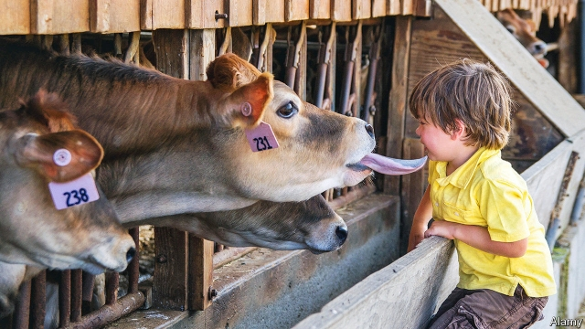

###### Pastures old

# Farming is tougher than ever. Young Britons can’t wait to get started. 

 

> print-edition iconPrint edition | Britain | Jul 25th 2019 

THE ROYAL WELSH SHOW tempts its 250,000 visitors with competition, spectacle and wackiness. There are lumberjack contests, plastic cows to “milk” and lots of farm machines to ogle. Roaming the fields are the Prince of Wales, a bunch of Zulu warriors and the regimental goat of the Royal Welsh Guards. 

It is the show’s centenary, but there is little else to celebrate. Agricultural productivity growth in Britain has lagged behind that of America, France and Germany since the 1960s. Veganism is fashionable. Now Brexit threatens to up-end subsidies; if Britain leaves the European Union without a deal, exporters could be hit by steep tariffs on products like lamb. “We’re in a bit of a pickle,” says Dennis Ashton, a farmer in tweed jacket and flat cap. “If I was young again, I wouldn’t start.” 

Yet plenty are. The show has a separate “young people’s village”, with DJs and 4,000 campers. One caravan is christened a “passion wagon”. “There was some passion there earlier,” smirks a neighbour. Four in ten English farmers have a nominated successor within the family, a slight increase on recent years. Since 2013 the number of agriculture students in Britain has risen in line with overall higher-education trends. 

Many are the children of farmers. About four in five students at Coleg Cambria Llysfasi, an agricultural college, have farming backgrounds. “It’s in the blood,” says Llyr Jones, 18, who began helping on the family farm when he was seven. “I’ve always been tractor mad.” But some lack that excuse. Molly Hodge, an 18-year-old, got her first job on a farm last month. Her mother manages a casino; her father works in construction. Her motivation is the same as that of farmers for generations: to work outdoors. 

Oddly, Brexit has enhanced the appeal for some. Even those who voted for it (as most farmers did) think it will unleash at least a decade of agricultural upheaval. “You’ve got to be ballsy about it,” says Andrew Fisher, 23, on his annual holiday from the farm. Dafydd Jones, the 29-year-old chairman of the Welsh young farmers’ association, casts it as nothing less than a battle for the Welsh soul. “Everyone loves a challenge,” he says. “We can farm like we’ve never farmed before.” More prosaically, the domestic farm lobby could become far more powerful after Brexit. 

As farming begins to make better use of data and drones, it is becoming a little more appealing to those who are reluctant to get up at five in the morning to milk the cows. Automation will allow farmers to work more sociable hours, says Dewi Jones of Coleg Cambria. “Traditionally it was a lot of menial work,” he says. “It’s up to us to make it attractive, otherwise it sounds a little bit like you’re the kid who’s been sent up a chimney.”■ 

-- 

 单词注释:

1.pasture['pæstʃә]:n. 牧场, 草地, 牧草 vt. 放牧 vi. 吃草 

2.Briton['britәn]:n. 大不列颠人, 英国人 

3.Jul[]:七月 

4.Welsh[welʃ]:a. 威尔士的 n. 威尔士人 vi. 赖赌帐, 逃避责任 

5.wackiness[]:n. wacky的变形 

6.lumberjack['lʌmbәdʒæk]:n. 伐木工人, 板材上垛装置 

7.ogle['әugl]:n. 眉目传情 vt. 挑逗地注视 vi. 做媚眼 

8.roam[rәum]:v. 漫游, 闲逛, 徜徉 n. 漫步, 漫游 

9.wale[weil]:n. 隆起的伤痕, 鞭痕, 凸条纹, 精华, 选择 vt. 在...上留下鞭痕, 织成棱纹, 挑选, 撑住 vi. 挑选 

10.zulu['zu:lu:]:n. 祖鲁语；祖鲁人 

11.warrior['wɒ:riә]:n. 战士, 勇士, 武士, 鼓吹战争的人, 战斗, 尚武 

12.regimental[.redʒi'mentl]:a. 团的, 附属于团的 n. 团服, 军服 

13.Welsh[welʃ]:a. 威尔士的 n. 威尔士人 vi. 赖赌帐, 逃避责任 

14.centenary[sen'ti:nәri]:n. 一百年 a. 一百年的 

15.productivity[.prәudʌk'tiviti]:n. 生产力 [经] 生产率, 生产能力 

16.veganism[]:[医] 绝对素食主义 

17.Brexit[]:[网络] 英国退出欧盟 

18.exporter[ik'spɒ:tә]:n. 出口商, 输出者, 出口公司 [经] 出口商, 输出者 

19.tariff['tærif]:n. 关税, 关税表, 价格表, 收费表 vt. 课以关税 [计] 价目表 

20.pickle['pikl]:n. 盐卤, 腌汁, 泡菜, 困境, 讨厌鬼 vt. 腌制, 酸洗, 葬送(机会等), 泡 

21.dennis['denis]:n. 丹尼斯（男子名） 

22.Ashton[]:n. 阿什顿（人名） 

23.tweed[twi:d]:n. (粗)花呢, 花呢服装 

24.DJ[]:n. 唱片流行音乐节目播音员, 唱片骑师 

25.camper['kæmpә]:n. 露营者 

26.caravan['kærәvæn]:n. 旅行队, 有篷顶的大车 [经] 商队, 结队商贩 

27.christen['krisәn]:vt. 为...施洗礼, 命名 

28.smirk[smә:k]:vi. 傻笑, 假笑, 得意地笑 n. 傻笑, 假笑, 得意的笑 

29.nominate['nɒmineit]:vt. 提名, 任命, 命名 [法] 提名...为候选人, 指定, 推荐 

30.successor[sәk'sesә]:n. 继承者, 接任者 [计] 后继 

31.Cambria['kæmbriә]:n. 威尔士的中世纪名称 

32.Llyr[]:[网络] 席尔；希儿；来源 

33.jones[dʒәunz]:n. 琼斯（姓氏） 

34.alway['ɔ:lwei]:adv. 永远；总是（等于always） 

35.molly['mɔli]:n. [俚]懦夫；娘娘腔的男人 

36.hodge[hɔdʒ]:n. 霍奇（男子名, 等于Roger） 

37.casino[kә'si:nәu]:n. 卡西诺赌场, 卡西诺牌戏 

38.oddly['ɒdli]:adv. 奇怪地 

39.unleash[.ʌn'li:ʃ]:vt. 解开...的皮带, 发出, 发动 

40.upheaval[ʌp'hi:vl]:n. 举起, 隆起, 大变动, 剧变 

41.ballsy['bɔ:lzi]:a. 有胆量的, 有种的 

42.andrew['ændru:]:n. 安德鲁（男子名） 

43.fisher['fiʃә]:n. 渔夫, 食鱼动物, 渔船 

44.Dafydd[]:n. (Dafydd)人名；(英)戴维兹 

45.les[lei]:abbr. 发射脱离系统（Launch Escape System） 

46.prosaically[prәu'zeiikli]:adv. 散文式地, 平凡地 

47.lobby['lɒbi]:n. 大厅, 休息室, 游说议员者 vi. 游说议员, 游说 vt. 游说 

48.datum['deitәm]:n. 论据, 材料, 资料, 已知数 [医] 材料, 资料, 论据 

49.drone[drәun]:n. 雄蜂, 懒惰者, 嗡嗡的声音, 无人驾驶飞机(或船) vi. 嗡嗡作声, 混日子 vt. 低沉地说 

50.sociable['sәuʃәbl]:a. 好交际的, 社交的, 过社会生活的 n. 联谊会 

51.Dewi[]:n. (Dewi)人名；(英)戴维, 黛维(女名)；(印尼)黛维 

52.traditionally[]:adv. 传统上；传说上；习惯上 

53.menial['mi:niәl]:a. 适合仆人做的, 卑微的 n. 仆人 

