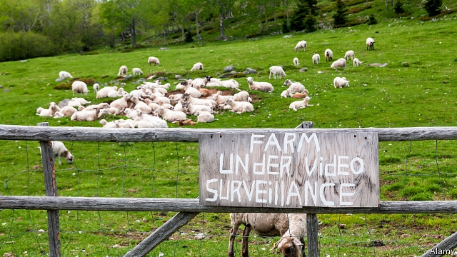

###### Easy pickings

# From fly-tipping to sheep rustling, Britain’s cops crack down on rural crime 

 

> print-edition iconPrint edition | Britain | Jul 25th 2019 

“IF YOU POP down and say I’m going to steal some sheep, good luck to you. It’ll be entertaining to watch,” says Robyn Mason. “It’s not like ‘Shaun the Sheep’. You have to have certain expertise in rural issues before you rock up and steal a sheep.” 

Mr Mason has plenty of expertise in rural issues. He is the son of a farmer. His son is a farmer too. And he is the Dyfed-Powys police superintendent in charge of rural crime. Mr Mason was appointed last year when the force—which covers the largest land area in England and Wales—started its rural crime team, with 11 officers, specialist vehicles and a focus on building trust with country folk. The very first such team was set up next door, in North Wales, in 2013. The latest force to establish a rural squad, in January, was just to the south, in Gwent. In the interim at least 30 of the 43 police forces in England and Wales, as well as the Scottish and Northern Irish services, have started their own dedicated teams. 

The surprising thing about this focus on rural crime is not that it is happening but that it took so long. About one in five Britons lives in the countryside. More than half the nation is farmland. And, although rural crime is less common than the urban kind, it is surprisingly hard to tackle—sometimes for the same reasons that inner-city offending is so intractable. 

Consider sheep. Welsh farmers typically graze their flocks on a hillside for a season, so they may not know when a dozen—or a hundred—go missing. By the time the police are alerted, little evidence remains. Things are worse in lambing season when criminals can double or triple their takings. Nor is it always obvious when a crime is being committed. A passer-by who sees someone herding a flock into a trailer would assume it was a legitimate farmer. Sheep are also attacked by dogs, says Rob Taylor, who runs the North Wales team from a decommissioned police air base near Rhuddlan. The laws to prevent that are lax and gathering evidence is hard. The victims, as Mr Taylor points out, cannot provide testimony. 

For farmers, this is equivalent to somebody else having a factory or office burgled or vandalised. “If somebody steals £60,000 ($75,000) of jewels all hell would break loose,” says Julia Mulligan, chair of the National Rural Crime Network (NRCN), an association of police commissioners and other interested parties. “But if somebody steals £60,000 worth of sheep that have been bred over generations, people somehow think it is funny.” 

An investigation in 2017 by Farmers Weekly, a trade publication, found that 0.75% of sheep-rustling incidents ended in a conviction. According to NFU Mutual, Britain’s biggest farming insurer, the cost of livestock theft was £2.4m in 2017. It estimates the cost of all rural crime at £44.5m, up 13.4% from the previous year. (Overall theft in England and Wales declined for several years to the end of 2017, though it rose again in 2018.) 

Not all thefts are of livestock. Tractors and other expensive machines are common targets; police officers say they are often shipped and sold abroad or stripped for parts. Quad bikes, which farmers use to get around their estates, are easy to nick. Fuel theft from farms is another problem. Rural crime teams also tackle fly-tipping, unlicensed raves, illegal off-roading, poaching and other types of animal abuse. 

One reason police forces have been setting up dedicated teams is that rural crime requires special training and equipment. You cannot just go from one farm to another in the same boots, says Mr Mason, because of the danger that you might spread disease. High-visibility uniforms can spook animals. Officers need thermal-imaging cameras for night-time patrols, and vehicles that can go off-road. Thinly populated rural areas are hard to patrol. North Wales Police has just acquired three drones to add to the two it operates. Gwent Police is training all its rural crime officers as drone pilots. 

The other reason is that the police recognised they were losing the trust of rural people. Along with banks and shops, police stations have vanished from more remote areas over the past decade. People were unwilling to report crimes even when they knew who had committed them, says Mr Mason, likening the situation to inner-city estates where nobody wants to be a grass. The artificially low tally of crimes in turn meant that fewer resources were dedicated to rural areas, says Ms Mulligan. A rural crime survey by the NRCN found that last year a third of country folk who suffered a crime did not bother to report it. 

Dedicated teams have helped rebuild some of that trust, as have smaller things like publishing officers’ mobile phone numbers on the web. But cracking down on crime will always be difficult. What American cops call “the thin blue line” is, in rural Britain, often very thin indeed. ■ 

-- 

 单词注释:

1.picking['pikiŋ]:n. 掘, 选择, 挑选, 采摘, 撬开, [U]采得物, 捡得物, 赃物, 扒窃物 [经] 挑拣 

2.rustle['rʌsl]:n. 沙沙声, 瑟瑟声, 飒飒声, 急忙 vi. 发出沙沙声 vt. 使飒飒作响 

3.cop[kɒp]:n. 警官 vt. 抓住 

4.Jul[]:七月 

5.Robyn[]:n. (Robyn)人名；(法)罗宾；(英)罗宾, 萝宾(女名) 

6.mason[meisn]:n. 泥瓦匠, 共济会会员 vt. 用砖瓦砌成 

7.expertise[.ekspә:'ti:z]:n. 专家意见, 专门技术 [法] 专门知识, 专家意见 

8.superintendent[,sju:pәrin'tendәnt]:n. 监督人, 主管人, 主日学校校长 [经] 监督人, 主管人(部门) 

9.wale[weil]:n. 隆起的伤痕, 鞭痕, 凸条纹, 精华, 选择 vt. 在...上留下鞭痕, 织成棱纹, 挑选, 撑住 vi. 挑选 

10.squad[skwɒd]:n. 班, 小队, 小集团 vt. 编成班 

11.Gwent[^went]:格温特郡[英国威尔士郡名] 

12.interim['intәrim]:a. 暂时的, 临时的, 间歇的 n. 过渡时期 

13.dedicate['dedikeit]:vt. 献出, 贡献 

14.Briton['britәn]:n. 大不列颠人, 英国人 

15.farmland['fɑ:mlænd]:n. 农田 

16.les[lei]:abbr. 发射脱离系统（Launch Escape System） 

17.intractable[in'træktәbl]:a. 不听话的, 倔强的, 棘手的 [医] 顽固的, 难治的 

18.Welsh[welʃ]:a. 威尔士的 n. 威尔士人 vi. 赖赌帐, 逃避责任 

19.typically['tipikәli]:adv. 代表性地；作为特色地 

20.graze[greiz]:n. 吃草, 放牧, 擦伤, 轻擦 v. (使)吃草, 放牧, 轻擦, 擦伤 

21.lambing['læmɪŋ]: 产羔 

22.triple['tripl]:n. 三倍数, 三个一组 a. 三倍的 vt. 使增至三倍 vi. 增至三倍 

23.taking['teikiŋ]:n. 取得, 捕获, 进款 a. 迷人的, 可爱的, 会传染的 

24.alway['ɔ:lwei]:adv. 永远；总是（等于always） 

25.trailer['treilә]:n. 追踪者, 拖车 [电] 拖车 

26.legitimate[li'dʒitimәt]:a. 合法的, 正当的, 婚生的 vt. 认为正当, 立为嫡嗣, 使合法 

27.taylor['teilә]:n. 泰勒 

28.decommission[.di:kә'miʃәn]:vt. 使退役 

29.Rhuddlan[]:[地名] 里兹兰 ( 英 ) 

30.lax[læks]:a. 松的, 不严格的, 腹泻的, 松弛的 n. 腹泻, 松元音 

31.cannot['kænɒt]:aux. 无法, 不能 

32.testimony['testimәni]:n. 证言, 证据, 声明 [医] 证据 

33.burgle['bә:gl]:v. 破门盗窃 

34.vandalise['vændәlaiz]:vt. 摧残(文化), 破坏(公共财产), 故意破坏 

35.julia['dʒu:ljә]:n. 朱莉娅（女子名） 

36.mulligan['mʌligәn]:n. 蔬菜烩肉(或鱼) 

37.commissioner[kә'miʃәnә]:n. 委员, 理事, 行政长官 [法] 委员, 政府的特派员, 地方地官 

38.conviction[kәn'vikʃәn]:n. 定罪, 信服, 坚信 [法] 定罪, 证明有罪, 判罪 

39.NFU[]:abbr. （英）全国农场主联合会（National Farmers’ Union） 

40.insurer[in'ʃuәrә]:n. 保险公司 [法] 保险人, 承保人, 保险公司 

41.quad[kwɔd]:n. 铅块, 监狱, 四方院子, 四胞胎, 四胞胎中的一个孩子, 成套的四件东西 [计] 四芯导线 

42.nick[nik]:n. 刻痕, 缺口, 划痕 vt. 刻痕于, 弄缺, 擦伤 vi. 狙击 

43.tackle['tækl]:n. 工具, 复滑车, 滑车, 装备, 扭倒 vt. 固定, 处理, 抓住 vi. 扭倒 

44.unlicensed[.ʌn'laisnst]:a. 没有执照的, 未经当局许可的 [法] 未经当局许可的, 无执照的, 无节制的 

45.rave[reiv]:n. 狂吼, 狂暴 v. 愤怒地说, 叫嚷, 咆哮 

46.poach[pәutʃ]:vt. 水煮(蛋), 偷猎, 侵入, 窃取 vi. 偷猎, 陷入泥中 

47.spook[spu:k]:n. 幽灵, 鬼 vt. 惊吓, 鬼怪般地出没 vi. 惊吓而逃窜, 受惊 

48.patrol[pә'trәul]:n. 巡逻, 巡逻员, 侦察队 v. 巡逻, 巡视 

49.thinly['θinli]:adv. 薄, 细, 瘦 

50.populate['pɔpjuleit]:vt. 使人口聚居在...中, 殖民于, 移民于, 居住于, 定居于 

51.drone[drәun]:n. 雄蜂, 懒惰者, 嗡嗡的声音, 无人驾驶飞机(或船) vi. 嗡嗡作声, 混日子 vt. 低沉地说 

52.liken['laikәn]:vt. 比喻, 比拟 

53.artificially[.ɑ:ti'fiʃәli]:adv. 人工地, 人为地, 不自然地 

54.tally['tæli]:n. 符木, 记账, 得分, 比分, 计数器, 标签, 符合, 对应物 vt. 记录, 点数, 计算, 加标签于, 使符合 vi. 记帐, 符合, 吻合, 记分 [计] 计数 

55.bother['bɒðә]:vt. 烦扰, 迷惑 vi. 烦恼, 操心 n. 麻烦, 纠纷, 讨厌的人 

