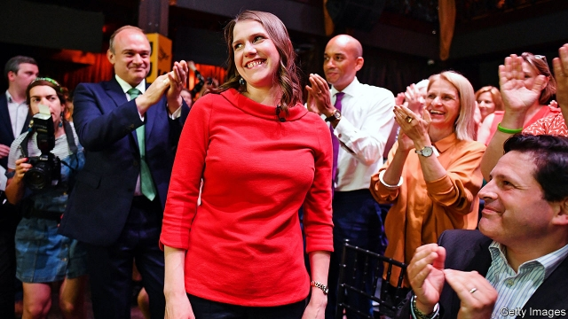
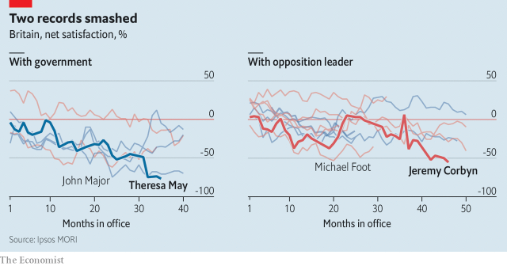

###### Brexit boom to Brexit bust?

# Jo Swinson takes over the Liberal Democrats 

 

> print-edition iconPrint edition | Britain | Jul 25th 2019 

IT WAS, as usual, an upbeat atmosphere at Proud Embankment. But the typical cabaret acts—including Chastity Belt, Vicious Delicious and Dave the Bear—were nowhere to be seen. Instead, the nightclub was adorned with bright yellow “stop Brexit” banners as it played host to the announcement of a new Liberal Democrat leader on July 22nd. Raucous cheers greeted the declaration of Jo Swinson’s comfortable victory, with 63% of the vote, over Sir Edward Davey. 

The joyful mood reflects a remarkable turnaround for the Lib Dems. The party was almost wiped out in the 2015 general election, falling to just eight MPs, as voters expressed their displeasure with its record as a junior coalition partner to the Conservatives. Since then two leaders, Tim Farron and Sir Vince Cable, have begun the slow job of rebuilding the party. Both have focused on opposing Brexit. 

Only recently has that strategy started to pay dividends. The Lib Dems finished third in this year’s local elections and second in the European elections, suggesting voters are beginning once again to see them as an acceptable protest option. Polls by YouGov indicate that the party is on about a fifth of the vote, with a quarter of people who voted Labour at the last general election backing it. Theresa May’s government was deeply unpopular by the end; Jeremy Corbyn is viewed as a hopeless leader of the opposition (see chart). Although the Lib Dems have always struggled under the first-past-the-post system used for elections to Parliament, the new four-way split—between them, the Tories, Labour and the Brexit Party—should make it easier for them to pick up seats. 

 

Ms Swinson, a sober, state-educated, 39-year-old former business minister who worked as a diversity consultant for two years when she lost her seat in Parliament and enjoys playing board games in her spare time, appears well-suited to the role of Boris Johnson’s opposite. In her victory speech, she was quick to brand the new Tory leader “unfit to be prime minister” and to link him to Donald Trump and Nigel Farage. She has repeatedly labelled Mr Corbyn a Brexiteer. 

The Liberal Democrats have their principles—but they also have a useful ability to say different things to different voters, which parties facing more scrutiny struggle to match. As memories of the coalition government fade, the party can return to its own form of “cakeism”, says Robert Ford of the University of Manchester (as in having your cake and eating it). Candidates can campaign as anti-Brexit warriors in urban, Labour-held constituencies and as sensible moderates in suburban Tory ones. 

Yet the party’s future depends on factors beyond Ms Swinson’s control. Alliances with other remain-supporting parties offer the Lib Dems a route to gains in Parliament, and they are expected to win a forthcoming by-election in Brecon, Wales, where the Greens and Plaid Cymru have stepped aside to help their candidate. But any alliance, formal or otherwise, between the Conservatives and the Brexit Party would go some way to balancing out the Lib Dems’ advantage. As would Labour’s embrace of a more anti-Brexit position, which many of its activists want. 

The Liberal Democrats’ recent improvement owes a good deal to their vehement opposition to leaving the European Union (their slogan for the European elections was “Bollocks to Brexit”). Scarred by the punishment that voters meted out in 2015, Ms Swinson has said there is no chance of the party entering a coalition with a Labour government led by Mr Corbyn or a Conservative one led by Mr Johnson. But a confidence-and-supply arrangement, in which the party backs the government on key issues, remains possible. 

These potential routes to greater influence are all based on one assumption: that Mr Johnson does not manage to leave the European Union before the next election. If he does, the Lib Dems would be in a much trickier position. Tom Brake, the party’s Brexit spokesperson, admits that they would have to work out whether to seek immediate re-entry to the EU. The party’s clarity of purpose, on which its recent electoral improvement has been based, would be gone. In which case, leaving the EU would be a double disaster for the Liberal Democrats. ■ 

-- 

 单词注释:

1.Brexit[]:[网络] 英国退出欧盟 

2.jo[dʒәu]:abbr. 乔（女子名, 等于Joseph, Josephine） 

3.swinson[]:[网络] 胡才 

4.democrat['demәkræt]:n. 民主人士, 民主主义者, 民主党党员 [经] 民主党 

5.Jul[]:七月 

6.upbeat['ʌpbi:t]:n. 弱拍, 上升, 兴旺 a. 上升的, 乐观的 

7.embankment[im'bæŋkmәnt]:n. 堤防, 筑堤 

8.cabaret['kæbәrei]:n. 卡巴莱(有歌舞表演的餐馆或夜总会), 卡巴莱歌舞表演 

9.chastity['tʃæstiti]:n. 纯洁, 贞操 [法] 贞操, 纯洁 

10.vicious['viʃәs]:a. 邪恶的, 堕落的, 品性不端的, 恶毒的, 恶性的, 有错误的 [医] 缺点的, 恶的 

11.dave[deiv]:n. 戴夫（男子名） 

12.nightclub['naitklʌb]:n. 夜总会 

13.adorn[ә'dɒ:n]:vt. 装饰, 使生色 

14.democrat['demәkræt]:n. 民主人士, 民主主义者, 民主党党员 [经] 民主党 

15.raucous['rɒ:kәs]:a. 沙哑的, 粗声的, 喧闹的 

16.declaration[.deklә'reiʃәn]:n. 宣告, 说明, 宣布 [计] 说明 

17.edward['edwәd]:n. 爱德华（男子名） 

18.Davey['deivi]:n. 戴维(David 的昵称)(m.) 

19.turnaround['tә:nә.raund]:n. 转向, 回车道, 转变 [化] 小修; 预防(性)修理 

20.lib[lib]:a. [口]解放的（等于liberal）；解放论者的 

21.DEM[dem]:[计] 解调器 

22.MP[]:国会议员, 下院议员 [计] 宏处理程序, 维护程序, 线性规划, 微程序, 多处理器 

23.voter['vәutә]:n. 选民, 投票人 [法] 选民, 选举人, 投票人 

24.displeasure[dis'pleʒә]:n. 不愉快, 生气, 不满 

25.coalition[.kәuә'liʃәn]:n. 结合体, 结合, 联合 [经] 联合, 联盟 

26.tim[tim]:n. 蒂姆（男子名） 

27.farron[]:[网络] 古龙 

28.vince[vins]:n. 文斯（男子名, Vincent的昵称） 

29.dividend['dividend]:n. 被除数, 股利 [计] 被除数 

30.YouGov[]:[网络] 民治调查公司；尤格夫；民治公司 

31.theresa[ti'ri:zә]:n. 特丽萨（女子名） 

32.unpopular['ʌn'pɔpjulә]:a. 不得人心的, 不受欢迎的, 不流行的 

33.jeremy['dʒerimi]:n. 杰里米（男子名） 

34.Corbyn[]:科尔宾（人名） 

35.opposition[.ɒpә'ziʃәn]:n. 反对, 敌对, 相反, 在野党 [医] 对生, 对向, 反抗, 反对症 

36.alway['ɔ:lwei]:adv. 永远；总是（等于always） 

37.Tory['tɒ:ri]:n. 托利党党员, 保守党员, 亲英分子 a. 保守分子的 

38.diversity[dai'vә:siti]:n. 差异, 多样性 [化] 多样性 

39.boris['bɔris]:n. 鲍里斯（男子名） 

40.Tory['tɒ:ri]:n. 托利党党员, 保守党员, 亲英分子 a. 保守分子的 

41.nigel['naidʒәl]:n. 奈杰尔（男子名） 

42.farage[]:[网络] 人B淋巴瘤细胞系；法拉格 

43.Brexiteer[]: 

44.scrutiny['skru:tini]:n. 细看, 仔细检查, 监视, 选票检查 [经] 复查, 评核, 仔细检查 

45.Robert['rɔbәt]:[法] 警察 

46.ford[fɒ:d]:n. 浅滩, 福特汽车 v. 涉过, 涉水 

47.Manchester['mæntʃestә]:n. 曼彻斯特 

48.warrior['wɒ:riә]:n. 战士, 勇士, 武士, 鼓吹战争的人, 战斗, 尚武 

49.constituency[kәn'stitjuәnsi]:n. 选民, 顾客, 读者 [法] 选区, 全体选民, 选区内的选民 

50.suburban[sә'bә:bәn]:a. 郊外的, 郊区的, (贬)偏狭的, 土气的, 见识不广的 n. 郊区居民 

51.alliance[ә'laiәns]:n. 联盟, 联合 [法] 同盟, 联盟, 联姻 

52.forthcoming['fɒ:θ'kʌmɑŋ]:a. 即将来临的 n. 来临 

53.Brecon['brekən]:n. 布雷肯（英国威尔士一城镇） 

54.wale[weil]:n. 隆起的伤痕, 鞭痕, 凸条纹, 精华, 选择 vt. 在...上留下鞭痕, 织成棱纹, 挑选, 撑住 vi. 挑选 

55.plaid[plæd]:n. 格子花呢披风, 格子花呢, 格子图案 

56.cymru[]: （威尔士语）威尔士 

57.activist['æktivist]:n. 激进主义分子 

58.vehement['vi:imәnt]:a. 热烈的, 激烈的 

59.bollock['bɒlək]:vt. 臭骂 

60.mete[mi:t]:vt. 量, 测量, 分配 n. 边界, 界石 

61.johnson['dʒɔnsn]:n. 约翰逊（姓氏） 

62.tricky['triki]:a. 狡猾的, 机敏的 

63.tom[tɒm]:n. 雄性动物, 雄猫 

64.spokesperson['spәukspә:sn]:n. 发言人, 代言人 

65.EU[]:[化] 富集铀; 浓缩铀 [医] 铕(63号元素) 

66.clarity['klærәti]:n. 清楚, 明晰 [化] 透明度; 透明性; 清晰性 

67.electoral[i'lektәrәl]:a. 选举人的, 选举的, (有关)选举的 [法] 选举的, 选举人的, 由选举人组成的 

