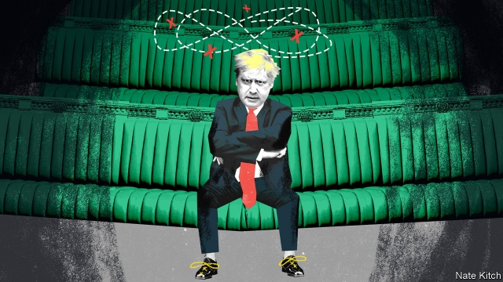

###### Bagehot

# The loneliness of Boris Johnson 

 

> print-edition iconPrint edition | Britain | Jul 25th 2019 

IN BORIS JOHNSON’S biography of Winston Churchill, the author deals with a number of accusations against his subject, including the charge “that he didn’t really have real friends—only people he ‘used’ for his own advancement.” This line, like many in the book, could have been written as easily about the author as about his subject; and the charge would be hard to rebut. 

Mr Johnson has become prime minister largely because he is an entertaining fellow who, on television and in print, makes people laugh. In the past lots of voters liked him: during a London mayoral race the Tories’ election guru, Lynton Crosby, found that pictures of Mr Johnson triggered feelings of affection even among those who disagreed with his policies. These days only Brexit enthusiasts quiver when his blond mop heaves into view. But even those who loathe the man concede that he has bags of personality. At a time of national gloom and division, that is a great asset. 

Yet although he is capable of immense charm, Mr Johnson is a solitary figure. He has never been one for the aimless socialising that builds friendships, and few former colleagues trust him. Max Hastings, who as editor of the Daily Telegraph hired Mr Johnson after he was fired by the Times for lying, recently wrote that “there is room for debate about whether he is a scoundrel or mere rogue, but not much about his moral bankruptcy”. It is telling that for a profile of Mr Johnson, broadcast the evening he was appointed prime minister, the only person the BBC could find to speak favourably about him was his publicist. 

Nor does Mr Johnson benefit from the domestic support which Churchill enjoyed through his long and devoted marriage to Clemmie. Mr Johnson was ejected by his second wife, Marina Wheeler, a barrister with whom he has four children, after a series of affairs culminating in one with a Conservative Party public-relations officer which has proved so volatile that worried neighbours called the police when the couple were having a row. It is unclear whether she will be moving into 10 Downing Street with him. 

Mr Johnson will not necessarily be able to lean on his birth family, either. He comes from a clever, pushy clan of journalists and politicians. “We’re like rats, basically,” wrote his sister Rachel, a newspaper columnist. “In London, you’re never more than a few feet from at least two Johnsons.” The siblings are fiercely loyal to each other, but also, Boris aside, fiercely pro-European. Rachel was a candidate for a Remain splinter group in the recent European elections, brother Jo was a Remainer Tory minister and father Stanley was a member of the European Parliament—so Boris’s recent political trajectory has strained relations. 

Mr Johnson does not have a gang of parliamentary chums and supporters. He has spent only a decade as an MP, and when in Parliament was so busy making money by writing or speechifying elsewhere that he never had much time for dull Westminster work, such as sitting on committees. His fellow MPs didn’t like that. And although he is in great demand as an after-dinner speaker, his parliamentary performances have underwhelmed. Jollying along a bunch of drunk bankers is a very different business to commanding the floor of the house. 

But although Mr Johnson puts less work than most people do into winning affection and approbation, he craves these things more than most people—even most politicians—do. He is intensely sensitive to criticism. This weakness leads to the gravest charge his former boss, Mr Hastings, levels against him—“cowardice, reflected in his willingness to tell any audience whatever he thinks most likely to please, heedless of the inevitability of its contradiction an hour later”—and which has already tripped him up. 

During his campaign for the leadership, Mr Johnson promised to leave the EU by October 31st, “do or die”. He has rejected any version of the Irish “backstop”, the default position which would keep Britain, in effect, in the customs union. The EU insists on the backstop; the hard Brexiteers abhor it. If he sticks to these commitments, the only way forward is to leave the EU without a deal. Given that everybody knew he was going to win the leadership contest easily, Mr Johnson did not need to limit his room for manoeuvre thus. But his yearning to be loved by the Eurosceptic extremists who dominate his party’s membership led him into a trap the hardliners had set for him. 

For however passionately Mr Johnson wants to leave the European Union—which, given his historical willingness to adjust his beliefs to circumstance, is probably not very—his interests are different to the hardliners’. Their priority is to leave the EU, and damn the consequences; his is to stay in power. And the contingency plans for leaving without a deal that the mandarins will show him over the next few weeks—which, according to leaks, include imposing direct rule on Northern Ireland, averting widespread bankruptcies and managing civil disorder—will make it painfully clear how much could go wrong. He will be responsible for whatever happens, and many voters will be very angry with him. 

The alternative is for Mr Johnson to renege on those Eurosceptic commitments, get some wriggle-room from the EU on the backstop—putting lipstick on the pig, as a putative attempt to improve on the deal his predecessor did with the EU is widely described—and use his undoubted charm to sell to Parliament the porker that it refused three times to buy from his predecessor. Given his record, nobody, and especially not the Eurosceptics with whom he has surrounded himself, would be greatly astonished by such a betrayal, but they would be very angry with him. 

For a man who hates to be hated, neither is an attractive prospect. The only way of avoiding both would be to hold an election before October 31st. Very likely he would gain unwelcome fame as the shortest-lived prime minister ever, but—who knows?—maybe he could persuade the voters to love him.■ 

-- 

 单词注释:

1.Bagehot[ˈbædʒət]:白芝浩；巴杰特（人名） 

2.loneliness['lәunlinis]:n. 寂寞, 孤独, 清静 

3.boris['bɔris]:n. 鲍里斯（男子名） 

4.johnson['dʒɔnsn]:n. 约翰逊（姓氏） 

5.Jul[]:七月 

6.boris['bɔris]:n. 鲍里斯（男子名） 

7.winston['winstәn]:n. 温斯顿（姓氏, 男子名） 

8.Churchill['tʃә:tʃil]:n. 邱吉尔 

9.accusation[ækju:'zeiʃәn]:n. 控告, 指控, 指责 [法] 控告, 起诉, 告发 

10.advancement[әd'vɑ:nsmәnt]:n. 前进, 进步, 提升 [医] 徙前术 

11.rebut[ri'bʌt]:vi. 反驳 vt. 辩驳, 反驳, 揭露 

12.voter['vәutә]:n. 选民, 投票人 [法] 选民, 选举人, 投票人 

13.mayoral['mєәrәl]:a. 市长的 

14.guru['guru:]:n. 古鲁(印度教导师) [医] 柯拉子 

15.Lynton[]:n. (Lynton)人名；(英)林顿 

16.crosby[]:n. 克罗斯比（英国利物浦地名）；克罗斯比（人名） 

17.trigger['trigә]:n. 触发器, 扳机 vt. 触发, 发射, 引起 vi. 松开扳柄 [计] 切换开关 

18.Brexit[]:[网络] 英国退出欧盟 

19.enthusiast[in'θju:ziæst]:n. 热心家, 狂热者, 爱好者 

20.quiver['kwivә]:n. 震动, 颤抖, 箭袋 vi. 颤抖, 振动 vt. 使颤动 a. 敏捷的 

21.blond[blɒnd]:a. 金发的 n. 白肤碧眼金发的人 

22.heave[hi:v]:n. 举, 抛, 起伏, 鼓起 vt. 用力举起, 使举起, 使鼓起 vi. 抛出, 起伏, 喘息, 凸起 

23.loathe[lәuð]:vt. 厌恶, 憎恶 

24.concede[kәn'si:d]:vt. 承认, 退让 vi. 让步 

25.gloom[glu:m]:n. 忧郁, 暗处, 幽暗 vi. 变忧沉, 变黑暗 vt. 使忧郁, 使黑暗 

26.asset['æset]:n. 资产, 有益的东西 

27.charm[tʃɑ:m]:n. 吸引力, 魔力, 符咒 vt. 迷住, 使陶醉, 行魔法 vi. 用符咒, 有魅力 

28.solitary['sɒlitәri]:n. 独居者 a. 孤独的, 独居的 

29.aimless['eimlis]:a. 无目的的, 没有目标的 

30.socialise['sәjʃәlaiz]:vt. 使社会化, 使社会主义化, 使适合社会需要 vi. (美)(非正式)参加社交活动, 发生社交往来 

31.MAX[mæks]:[计] 最大 

32.hasting[heistɪŋ]:v. 急忙, 匆忙( haste的现在分词 ) 

33.scoundrel['skaundrәl]:n. 恶棍 a. 卑鄙的 

34.rogue[rәug]:n. 恶棍, 流氓, 小淘气 vt. 欺骗 vi. 游手好闲 

35.bankruptcy['bæŋkrәptsi]:n. 破产者 [经] 破产, 倒闭 

36.profile['prәufail]:n. 侧面, 轮廓, 传略 vt. 描绘...轮廓, 写...的传略 [计] 提问档; 剖面图法; 剖面法 

37.BBC[]:英国广播公司 

38.favourably[]:adv. 顺利地；有利地；好意地（等于favorably） 

39.publicist['pʌblisist]:n. 国际法学家, 政治评论家, 政治作家, 广告员 [法] 国际法学家, 公法学家, 政治学 

40.Clemmie['klemi]:n. 克莱米(Clementine的昵称)(f.) 

41.eject[i'dʒekt]:vt. 逐放, 放逐, 喷射 [化] 排出 

42.marina[mә'rinә]:n. 码头 

43.wheeler['hwi:lә]:n. 旋转物, 推车人, 车轮制造人, 辕马, 精明的政客 

44.barrister['bæristә]:n. 出庭律师, 律师 [法] 律师, 专门律师, 大律师 

45.sery[]:n. (Sery)人名；(俄)谢雷；(科特)塞里 

46.culminate['kʌlmineit]:vi. 到绝顶, 达于极点, 达到高潮 vt. 使到绝顶, 使达到高潮 

47.volatile['vɒlәtail]:a. 挥发性的, 可变的, 不稳定的, 飞行的, 轻快的, 爆炸性的 n. 有翅动物, 挥发物 [计] 易失的 

48.unclear[.ʌn'kliә]:a. 不易了解的, 不清楚的, 含混的 

49.pushy['puʃi]:a. 粗鲁的, 固执己见的, 好胜而爱出风头的 

50.clan[klæn]:n. 氏族, 宗族, 集团 [医] 支 

51.rachel['reitʃәl]:n. 雷切尔（女子名） 

52.columnist['kɒlәmist]:n. 专栏作家 

53.johnson['dʒɔnsn]:n. 约翰逊（姓氏） 

54.sibling['sibliŋ]:n. 兄弟, 同胞 [医] 同胞(兄弟姐妹) 

55.fiercely['fiәsli]:adv. 猛烈地, 厉害地 

56.splinter['splintә]:n. 碎片, 尖片, 分裂出来的小派别, 微小的东西 v. 使分裂, (使)破裂 

57.jo[dʒәu]:abbr. 乔（女子名, 等于Joseph, Josephine） 

58.remainer[]:[网络] 剩下的 

59.Tory['tɒ:ri]:n. 托利党党员, 保守党员, 亲英分子 a. 保守分子的 

60.stanley['stænli]:n. 斯坦利（男子名） 

61.trajectory[trә'dʒektri]:n. 轨道, 弹道, 轨线 [化] 轨道 

62.parliamentary[.pɑ:lә'mentәri]:a. 国会的, 议会的, 议会制度的 

63.chum[tʃʌm]:n. 密友, 室友 vi. 结为密友 

64.supporter[sә'pɒ:tә]:n. 支持者, 后盾, 迫随者, 护身织物 [法] 支持者, 赡养者, 抚养者 

65.MP[]:国会议员, 下院议员 [计] 宏处理程序, 维护程序, 线性规划, 微程序, 多处理器 

66.speechifying[ˈspi:tʃɪfaɪɪŋ]:v. 演说, 演说似地说个不完( speechify的现在分词 ) 

67.Westminster['westminstә]:n. 威斯敏斯特 

68.MP[]:国会议员, 下院议员 [计] 宏处理程序, 维护程序, 线性规划, 微程序, 多处理器 

69.underwhelmed[ˌʌndəˈwelmd]:a. 无动于衷的；不感到兴奋的 

70.banker['bæŋkә]:n. 银行家, 庄家 [经] 银行业者, 银行家 

71.les[lei]:abbr. 发射脱离系统（Launch Escape System） 

72.approbation[æprәu'beiʃәn]:n. 认可, 满意 [经] 许可, 认可, 批准 

73.crave[kreiv]:v. 渴望, 热望, 恳求 

74.intensely[ɪn'tenslɪ]:adv. 强烈地; 极度; 剧烈地 

75.heedless['hi:dlis]:a. 不注意的, 不留心的, 不谨慎的 

76.inevitability[in.evitә'biliti]:n. 无法逃避之事, 不可逃避, 必然性 [法] 不能避免 

77.EU[]:[化] 富集铀; 浓缩铀 [医] 铕(63号元素) 

78.backstop['bækstɒp]:n. 挡球网, 接球手 [电] 背向停止 

79.default[di'fɒ:lt]:n. 违约, 不履行责任, 缺席, 默认值 v. 疏怠职责, 缺席, 拖欠, 默认 [计] 默认; 默认值; 缺省值 

80.Brexiteers[]:支持英国退欧的人（Brexiteer的复数） 

81.abhor[әb'hɒ:]:vt. 憎恶, 痛恨, 回避, 拒绝 

82.manoeuvre[mә'nu:vә]:n. 调遣, 演习, 策略 vi. 调动, 演习, 用策略 vt. 调动, 操纵 

83.yearn[jә:n]:vi. 渴望, 想念, 怀念, 同情 

84.eurosceptic[ˌjʊərəʊ'skeptɪk]:n. 欧洲统一怀疑论者；反对英国亲近欧盟的人 

85.extremist[iks'tri:mist]:[经] 偏激份子 

86.membership['membәʃip]:n. 会员的资格, 全体会员, 会员数目 [法] 会员资格, 成员资格, 会籍 

87.hardliner[ˌhɑ:d'laɪnə(r)]:n. 强硬路线者 

88.passionately['pæʃənətlɪ]:adv. 热情地, 激昂地 

89.damn[dæm]:n. 一点, 诅咒, 丝毫 interj. 该死, 该死的 vt. 诅咒, 罚...下地狱 vi. 指责, 谴责, 骂...该死, 证明...有罪 

90.contingency[kәn'tindʒәnsi]:n. 偶然性, 可能性, 意外事故 [经] 意外事故, 意外开支, 偶然事故 

91.mandarin['mændәrin]:n. 中国官话, 国语, 满清官吏, 柑橘 a. (中国式)紧身马褂的 

92.avert[ә'vә:t]:vt. 转开, 避免, 防止 

93.painfully['peinfuli]:adv. 痛苦地, 苦恼地, 费力地 

94.renege[ri'ni:g]:vi. 违例出牌, 食言, 毁约 vt. 否认, 放弃, 拒绝 n. 出牌违例 

95.lipstick['lipstik]:n. 口红, 唇膏 [机] 口红 

96.putative['pju:tәtiv]:a. 推定的, 被公认的 [法] 被公认的, 推定的, 假定的 

97.predecessor[.predi'sesә]:n. 前任, 先辈, 前身 [医] 初牙, 前辈, 祖先 

98.undoubted[.ʌn'dautid]:a. 无疑的, 确实的 [法] 无疑的, 确实的 

99.porker['pɒ:kә]:n. 食用猪, 肥小猪 

100.eurosceptic[ˌjʊərəʊ'skeptɪk]:n. 欧洲统一怀疑论者；反对英国亲近欧盟的人 

101.betrayal[bi'treiәl]:n. 背叛, 辜负 [法] 背叛, 通敌, 背信 

102.unwelcome[ʌn'welkәm]:a. 不受欢迎的, 讨厌的 n. 冷淡 vt. 冷淡地对待, 冷淡地接受 

