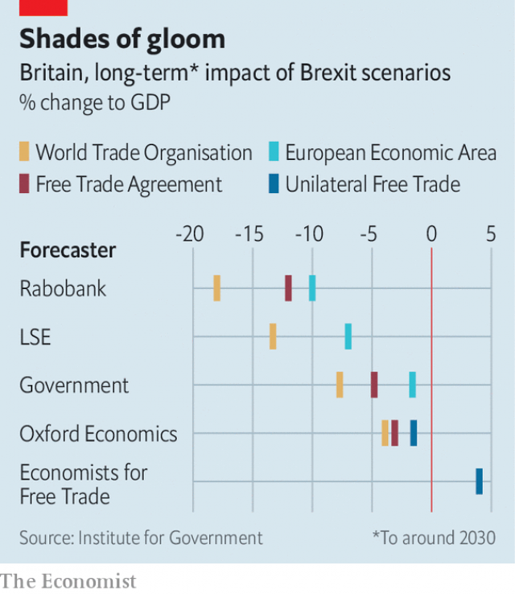

###### Long way down

# Why predicting the impact of a no-deal Brexit is so hard 

 

> print-edition iconPrint edition | Britain | Jul 25th 2019 

APART FROM Economists for Free Trade (EFT), a pro-Brexit group, almost no wonks believe that leaving the EU without a deal would be good for the economy. The majority flinch when Boris Johnson, the new prime minister, promises that Britain will push off by October 31st “come what may”. Yet the question of just how bad a no-deal Brexit would be has many answers. 

On July 18th the Office for Budget Responsibility (OBR), the fiscal watchdog, warned that a no-deal exit would “push the economy into recession”. The next day Oxford Economics argued that “no-deal Brexit might be bad, but not OBR bad.” Capital Economics, another consultancy, wrote last year that in its central no-deal scenario “we don’t expect...a full-blown recession.” Estimates of the long-term effect on GDP are even more varied (see chart). 

If Britain leaves without a deal it will become a member of the World Trade Organisation on its own, not as part of the EU. Britain would generally have to charge the same tariffs on EU imports as on non-EU ones. Regulations governing everything from medicines to electricity connections to financial services could lapse. 

 

Three big judgments shape economists’ views of the eventual impact of this. The first is precisely what happens to tariffs. The EFT assumes that Britain unilaterally cuts all of them to zero, boosting trade and thus economic growth. Most economists think that too optimistic. 

The second issue is what happens to non-tariff barriers, such as regulations, between Britain and its trading partners. Plenty of academic work looks at the economic impact of entering a big trading bloc, but there is much less on countries leaving, since this rarely happens. Will the non-tariff barriers that were lowered during Britain’s membership of the EU rise again when it pushes off? The government estimate shown in the chart assumes that the majority will be. Others, including from Rabobank, use estimates of non-tariff barriers between the EU and America as a guide to what Britain could face. 

The third judgment concerns so-called “dynamic effects”. Economists often assume that a reduction in openness to trade will crimp long-term productivity growth, in part because specialisation is more difficult and in part because inward investment from abroad would be lower. One paper from the London School of Economics, which looks at the impact of Britain moving to WTO rules, finds that including these dynamic effects triples the estimate of lost GDP per person. 

Brexiteers argue that most economists are too negative—just as they were about the impact of the vote to leave the EU in 2016. Following a chaotic exit, the Bank of England could radically loosen monetary policy, and the government could ramp up spending or slash taxes. Perhaps. But even the gloomiest economic forecasts only paint a partial picture of what could happen following a chaotic exit. Shortages of medicines, violence at the Irish border, shuttered farms and panicky immigrants might not affect the economy much. But there is more to life than GDP. ■ 
<<<<<<< HEAD

-- 

 单词注释:

1.Brexit[]:[网络] 英国退出欧盟 

2.Jul[]:七月 

3.economist[i:'kɒnәmist]:n. 经济学者, 经济家 [经] 经济学家 

4.eft[eft]:n. 水蜥, 小蜥蜴 

5.wonk[wɔŋk]:[俚]书呆子, 死用功的学生 

6.EU[]:[化] 富集铀; 浓缩铀 [医] 铕(63号元素) 

7.flinch[flintʃ]:vi. 畏缩, 退缩, 畏首畏尾 n. 退缩, 弗林奇戏 

8.boris['bɔris]:n. 鲍里斯（男子名） 

9.johnson['dʒɔnsn]:n. 约翰逊（姓氏） 

10.OBR[]:abbr. Optical Beam Riding,光波驾束 

11.fiscal['fiskәl]:a. 财政的, 国库的 [经] 财政上的, 会计的, 国库的 

12.watchdog['wɒtʃdɒg]:n. 看门狗, 监察人 [化] 监控设备; 监视器 

13.recession[ri'seʃәn]:n. 后退, 凹处, 衰退, 归还 [医] 退缩 

14.Oxford['ɒksfәd]:n. 牛津, 牛津大学 

15.consultancy[]:n. 商量, 协商, 磋商, 会诊, 与...商量, 咨询, 请教, 找(医生)看病, 查阅, 考虑 [经] 咨询业务, 咨询服务 

16.scenario[si'nɑ:riәu]:n. 剧本提纲, 情节, 剧本, 方案, 事态 [计] 方案 

17.expecta[]:[网络] 美赞臣 

18.organisation[,ɔ: ^әnaizeiʃən; - ni'z-]:n. 组织, 团体, 体制, 编制 

19.tariff['tærif]:n. 关税, 关税表, 价格表, 收费表 vt. 课以关税 [计] 价目表 

20.lapse[læps]:n. 过失, 流逝, 失效 vi. 犯错, 堕落, 减退, 消失, 流逝 vt. 使失效 

21.judgment['dʒʌdʒmәnt]:n. 裁判, 宣告, 判决书 [医] 判断 

22.eventual[i'ventʃuәl]:a. 最后的, 终于的 

23.precisely[pri'saisli]:adv. 精确地, 明确地, 刻板地, 拘泥地, 正好, 恰恰, 对, 正是如此, 确实如此, 不错 

24.unilaterally[]:[计] 单侧地 

25.bloc[blɒk]:n. 集团 

26.les[lei]:abbr. 发射脱离系统（Launch Escape System） 

27.membership['membәʃip]:n. 会员的资格, 全体会员, 会员数目 [法] 会员资格, 成员资格, 会籍 

28.rabobank[]: 拉博银行公司总部所在地：荷兰主要业务：银行 

29.openness['әupәnnis]:n. 公开；宽阔；率真 

30.crimp[krimp]:n. 诱人当兵的人, 拳曲, 鬈发 vt. 诱...去当兵, 使拳曲, 使有褶 

31.productivity[.prәudʌk'tiviti]:n. 生产力 [经] 生产率, 生产能力 

32.specialisation[,speʃәlai'zeiʃәn]:n. <主英> =specialization 

33.WTO[]:[计] 给操作员送信息 

34.triple['tripl]:n. 三倍数, 三个一组 a. 三倍的 vt. 使增至三倍 vi. 增至三倍 

35.Brexiteers[]:支持英国退欧的人（Brexiteer的复数） 

36.chaotic[kei'ɒtik]:a. 混乱的, 无秩序的 [法] 混乱的, 混沌的 

37.radically['rædikәli]:adv. 根本地, 完全地 

38.monetary['mʌnitәri]:a. 货币的, 金钱的 [经] 货币的, 金融的 

39.ramp[ræmp]:n. 斜坡, 坡道, 敲诈 vi. 狂跳乱撞, 乱冲, 敲诈, 蔓延 vt. 使有斜面, 敲诈 

40.slash[slæʃ]:v. 猛砍, 乱砍 n. 猛砍, 乱砍, 删减 [计] 斜线 

41.shutter['ʃʌtә]:n. 百叶窗, 关闭物, 照相机快门, 关闭者 vt. 为...装百叶窗, 以百叶窗遮闭 

42.panicky['pæniki]:a. 恐慌的, 惊慌失措的 [法] 恐慌的, 由恐慌引起的 
=======
>>>>>>> 50f1fbac684ef65c788c2c3b1cb359dd2a904378

