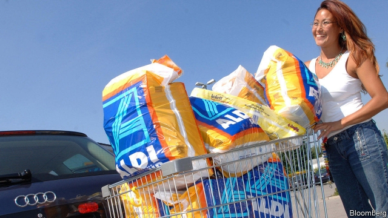

###### German retailers

# Aldi and Lidl are doing less well at home 

 

> print-edition iconPrint edition | Business | Jul 27th 2019 

ONE OF THE most successful advertising taglines coined in Germany in the past two decades was “Geiz ist geil”: stinginess is cool. Conceived in 2002 by Saturn, an electronics retailer, it captured the mood of the country’s cash-strapped shoppers two years after the dotcom crash, while playing to their penchant for parsimony. But after a decade of economic growth and low unemployment, Germans are feeling flush again and the local discount giants that they once loved, less so. 

Aldi (split into two legally distinct companies, Aldi Nord and Aldi Süd, in 1966), Lidl, Netto and Penny still have a market share at home of more than 40% between them. But traditional German grocers such as Rewe, whose sales grew by 9% last year, are outpacing the discounters. A recent study by Edge of Ascential, an advisory outfit, predicts that sales at discount chains will grow on average by 2% this year. Aldi Nord is suffering more. It lost money in 2018 for the first time in decades, and sales are forecast to fall in 2019. “German shoppers are rethinking priorities,” says Boris Planer of Ascential. They are less fussed about hunting for the lowest price, and now turn their noses up at cheap tinned food displayed under fluorescent light. When Saturn revived its old slogan last month with “Geiz is back”, it did so only for a fortnight. 

Might international business make up for anaemic growth at home? Aldi and Lidl are booming in Britain, where the Teutonic twosome already has more than 13% of the market and expects to do better still in a possible post-Brexit slump. Aldi is doing well in America and in June it entered China with two shops in Shanghai—for the first time as an upmarket grocer flogging wine from Bordeaux, milk from Australia and fresh organic produce. But foreign expansion is risky. A month earlier, Lidl gave up on China as unprofitable. It is struggling to run its large, costly stores in America. 

At home, the discounters hope to lure discerning shoppers by sprucing up their stores. Aldi now sells smoothies and vegan fare. Aldi Nord is spending part of a €5.2bn ($5.8bn) investment on a facelift for its 2,300-odd outlets in Germany. Booted out for upgrading its shabbier stores too slowly, the firm’s boss, Marc Heussinger, was replaced last year by Torsten Hufnagel, his deputy. But Mr Hufnagel’s revamping efforts may have come too late. Fears are growing of an end to Germany’s golden decade. Stinginess may soon be in vogue again.■ 

-- 

 单词注释:

1.retailer['ri:teilә]:n. 零售商人, 传播的人 [经] 零售商 

2.aldi[]:n. 阿尔迪（德国最大的连锁超市） 

3.Lidl[]:[网络] 利德尔；超市；连锁超市利德 

4.les[lei]:abbr. 发射脱离系统（Launch Escape System） 

5.Jul[]:七月 

6.advertising['ædvәtaiziŋ]:n. 广告业, 广告 a. 广告的 [计] 发广告 

7.tagline[]:n. 宣传词; 标签行; 作为一个口号或信条 

8.ist[]:abbr. 胰岛素休克疗法（insulin shock therapy）；星际航行（Interplanetary Space Travel）；独立悬挂减震系统（Independent Suspension Technology） 

9.stinginess[]:n. 吝啬 

10.conceive[kәn'si:v]:vt. 构思, 认为 vi. 怀孕 

11.Saturn['sætәn]:n. 土星 

12.shopper['ʃɒpә]:n. 购物者 [经] 顾客, 购物的人 

13.dotcom['dɒtkɒm]:n. 网站 

14.penchant['pә:ŋʃә:ŋ]:n. 爱好, 嗜好 

15.parsimony['pɑ:simәni]:n. 过度节俭, 吝啬, 惜墨如金 

16.legally['li:gәli]:adv. 法律上, 合法地 [法] 法律上, 合法地, 法定地 

17.nord[nɔ:d]:n. 北方, 北部 

18.netto[]:n. (Netto)人名；(意、西)内托；(葡)内图 a. 清爽的；清楚的；最低 

19.rewe[]:[网络] 食品；爱威；雷威 

20.outpace[.aut'peis]:vt. 超过...速度, 赶过 

21.discounter[]:[经] 折扣商店 

22.advisory[әd'vaizәri]:a. 顾问的, 咨询的, 劝告的 [法] 劝告的, 忠告的, 咨询的 

23.outfit['autfit]:n. 用具, 配备, 机构 vt. 配备, 供应 vi. 得到装备 

24.rethink[ri:'θiŋk]:v. 再想, 重想 

25.boris['bɔris]:n. 鲍里斯（男子名） 

26.planer['pleinә]:n. 平路机, 刨床, 刨工, 刨机 [机] 龙门刨床 

27.fuss[fʌs]:n. 大惊小怪, 小题大作, 忙乱 vi. 无事自扰, 焦急, 焦燥, 忙乱 vt. 使激动, 使烦燥 

28.fluorescent[.fluә'resәnt]:n. 荧光 a. 荧光的 

29.revive[ri'vaiv]:vt. 使苏醒, 使复兴, 使振奋, 回想起, 重播 vi. 苏醒, 复活, 复兴, 恢复精神 

30.anaemic[ә'ni:mik]:a. 贫血的, 患贫血症的, 无活力的 

31.Teutonic[tju:'tɒnik]:a. 条顿人的, 日耳曼人的 n. 日耳曼语 

32.twosome['tu:sәm]:n. 两人一组, 两个一组, 两人玩的游戏 

33.slump[slʌmp]:n. 暴跌, 垂头弯腰的姿态 vi. 猛然掉落, 陷入, 衰落(经济等) 

34.upmarket[ˌʌpˈmɑ:kɪt]:a. 高级的, 高档的, 高端的 

35.flog[flɒg]:vt. 鞭打, 鞭策, 严厉的批评, 迫使 

36.Bordeaux[bɒ:'dәu]:n. 波尔多葡萄酒 [机] 枣红, 酸性枣红 

37.risky['riski]:a. 危险的 

38.unprofitable[.ʌn'prɒfitәbl]:a. 无利益的, 不赚钱的, 不上算的 [法] 无利可图的, 无益的 

39.lure[luә]:n. 饵, 诱惑 vt. 引诱, 诱惑 

40.discern[di'zә:n]:v. 辨别, 看清楚, 了解 

41.spruce[spru:s]:n. 云杉 a. 颇为干净的, 俏的, 整洁的 v. (使)显干净, 打扮整齐 

42.smoothy['smu:ði]:n. 举止优雅的人, 善于奉承的人, 油嘴滑舌的人 

43.vegan['vegәn]:n. 严格的素食主义者 [医] 绝对素食者 

44.facelift[]:n. 除去面部皱纹的整容手术 

45.upgrade['ʌpgreid]:n. 上坡, 升级, 上升 adv. 往上 vt. 使升级, 提升, 改良品种 vi. 升级 [计] 升级 

46.marc[mɑ:k]:n. 榨渣 [计] 机器可读目录; 机读目录 

47.torsten[]:n. (Torsten)人名；(德、芬、瑞典)托尔斯滕 

48.hufnagel[]:n. (Hufnagel)人名；(德、塞)胡夫纳格尔 

49.revamp[ri:'væmp]:vt. 换新鞋面, 修理, 修补, 修改 [经] 整修, 补, 修改 

50.stinginess[]:n. 吝啬 

51.vogue[vәug]:n. 时尚, 时髦, 流行 a. 流行的, 时髦的 

