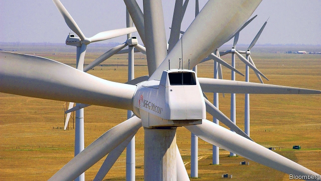
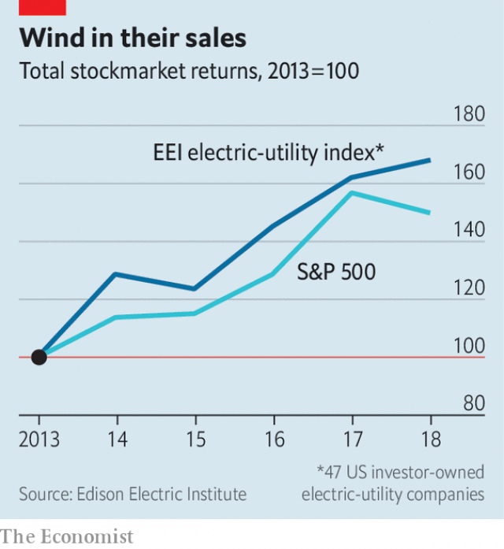

###### Windfall

# Can American utilities profit from the energy transition? 

 

> print-edition iconPrint edition | Business | Jul 27th 2019 

IT IS HARD to ignore the wind hurtling across the green expanse of southern Minnesota. On highways, gusts nudge cars. Corn stalks shimmy in the breeze. And towering overhead, white turbines twirl. Xcel Energy bought its first wind farm in the state in 2008. The utility’s turbines now stretch to the horizon—its ambitions, far beyond. This month Xcel, still dependent on coal to generate electricity, proposed big investments in solar and wind power in the upper Midwest, part of its bid to produce carbon-free electricity in the eight states it serves by 2050. It is one of many firms making multi-billion-dollar gambles on the shift to cleaner energy. 

The opportunity is vast. Last year America’s power sector generated 4.2bn kilowatt-hours of electricity and 1.8bn tonnes of carbon dioxide (a third of America’s total). Only 17% of power generation is currently from renewable sources, and another 19% from nuclear energy. If the $400bn industry were a country, it would be the world’s fourth-biggest emitter, ranking between India and Russia. Some see benefits in moving slowly to cleaner sources of power. Duke Energy, America’s biggest utility, this month proposed large investments in natural gas in Indiana and will keep a giant coal plant there open for another 20 years. Xcel is among those that sniff profits in the winds of change. 

For decades, to describe electric utilities as dull was not an insult but a summary of corporate purpose: keep lights on, rates low and returns steady. The somnolence of their corporate offices, a seasoned visitor quipped, was disturbed only by the periodic whirr of a printer. A push in the 1990s to break up the power monopolies that still dominate America’s electricity market lost steam after blackouts in California in 2000-01 curbed enthusiasm for deregulation. It suspended retail choice for consumers soon after. Today just 15 states have competitive retail electricity markets. 

The business model of utilities seems designed not to speed up innovation but to stifle it. Some firms corner the market for transmission. Vertically integrated monopolists generate power, too. To keep them in check, a utility commission reviews a regulated utility’s investments, then sets rates that cover costs, plus an annual return on invested capital of about 10%, net of depreciation. 

This soporific status quo has served utilities rather well. In recent years regulators have authorised big investments in transmission and distribution, and profits from these have helped to support utilities’ dividends and share prices (see chart). 

 

Now things are heating up. Some companies must contend with the impact of global warming. Pacific Gas and Electric, California’s largest power company, is battling regulators, politicians and investors over its alleged role in causing devastating wildfires during recent droughts (see article). Other companies are trying to make their infrastructure more resilient to floods along coasts, tornadoes in the Midwest and other climatic disruptions. 

The politics of green electricity, too, are evolving. Clean-power plans feature prominently in the Democratic presidential primaries. States led by Democrats, and even some led by Republicans, have set goals for clean electricity; in all, 29 have set targets for raising its share. Utilities face scrutiny from green-minded asset managers. In February institutional investors with $1.8trn under management urged them to adopt targets for carbon-free electricity. Credit Suisse, a bank, estimates that utilities need to spend over $100bn by 2030 to meet states’ renewables goals. 

Most important, the economics of power is being turned on its head by the falling costs of renewables. The “levelised” cost of electricity—which includes capital and operating spending to generate it over a plant’s lifetime—is now lower for wind or solar power than it is for coal. Coal’s share of power generation has sunk from about half in 2005 to 27% in 2018. It will fall further, despite President Donald Trump’s plan, announced in June, to loosen regulation of coal plants. 

The big question for utilities is how much of coal’s declining share to replace with natural gas, and how much with renewables. The answer depends partly on their location. The high cost of shipping natural gas and oil to Hawaii is one reason why that state has particularly bold goals for renewables. On July 10th Hawaiian Electric filed an ambitious proposal to solicit bids for new wind and solar power. Some of the states where Xcel serves customers are blue and others red, but all are among America’s gustiest. That made it easier for Ben Fowke, its chief executive, to espouse a renewables strategy. That it appeals to climate-friendly investors is “icing on the cake”, he says. 

Regulated utilities make money by investing capital; the variable costs of fuel are borne by consumers. But wind has the benefit of being free, no matter how hard it blows. So Xcel settled on a strategy to please both investors and customers: invest more in wind farms, on which it can earn a regulated return, and spend less on fossil fuels, on which it cannot. In the long term, consumers save money and utilities make more of it. 

Shareholders have welcomed this “steel for fuel” strategy, as Mr Fowke calls it. Last year Xcel’s earnings per share grew by almost 10%. Utilities such as CMS, in Michigan, are following its lead. 

For others, accelerating the move away from fossil fuels holds less allure, and not simply because they operate in places with less wind or sun. Securing land for wind farms in America’s densely populated north-east is costlier than in the Midwest. Retiring an ageing coal plant is one thing, points out Michael O’Boyle of Energy Innovation, a research group; scrapping a newer or newly refurbished one is another. Some states continue to prop up coal. Ohio’s senate passed a bill this month to subsidise coal plants in which Duke holds stakes. 

Natural gas complicates the picture further. Most investors reckon that some gas is necessary to balance the intermittent power of the wind and sun—at least until storage becomes cheaper and more efficient. The question is, how much? 

The availability of cheap gas has dissuaded many utilities in the region that sits atop the shale-rich Marcellus formation in America’s east from investing much in renewables, says Michael Weinstein of Credit Suisse. Renewables struggle to compete in Florida, too, where newish, efficient gas plants owned by a subsidiary of NextEra, a giant power company, offer cheap electricity. The Energy and Policy Institute, a pro-renewables think-tank, recently analysed America’s 22 dirtiest investor-owned utilities. It found that about half, including Duke, Dominion and American Electric Power, plan to decarbonise more slowly in the coming decades than they did from 2005 to 2017 mainly because of investments in gas plants. In proposals for new investments in Indiana and the Carolinas, Duke argues that natural gas is needed to keep prices low and power reliable. 

Despite Xcel’s clean-power plans, which include nuclear energy on top of renewables, even Mr Fowkes says that eschewing gas altogether would be “a little short-sighted”. His firm’s plan for the upper Midwest is for gas to generate a quarter of electricity by the mid-2030s. 

But big investments in gas—such as Duke’s plan for it to account for two-thirds of the Carolinas’ new generating capacity—carry risks. The first is that some gas plants, like coal ones before them, become uneconomic as renewables keep getting cheaper. In April, Indiana’s utility commission rejected a proposal for a gas plant by Vectren, another utility, for just that reason. If America one day sets a price on carbon emissions, customers could be left paying for utilities’ bad bets on fossil fuels. 

The second risk is that if utilities do not offer enough clean power, customers may get it elsewhere. Homeowners are installing solar panels on their roofs. Big corporate buyers of electricity, including Google and General Motors, this year launched a campaign to ensure an affordable supply of clean power. Such challenges make life for utilities less boring. Tackling them head on could make it more lucrative.■ 

-- 

 单词注释:

1.windfall['windfɒ:l]:n. 被风吹落的果子, 横财 [经] 意外损失 

2.Jul[]:七月 

3.hurtle['hә:tl]:vi. 猛冲, 碰撞, 突进 vt. 猛撞, 猛投 n. 投掷, 碰撞, 碰撞声 

4.expanse[ik'spæns]:n. 宽阔区域, 宽阔, 天空 

5.Minnesota[.mini'sәutә]:n. 明尼苏达州 

6.gust[gʌst]:n. 突然一阵, 趣味, 爱好 

7.nudge[nʌdʒ]:n. 用肘轻推, 推动, 讨厌家伙 

8.stalk[stɒ:k]:n. 茎, 追踪, 高视阔步 vi. 悄悄靠近, 蹑手蹑脚地走近, 蔓延, 高视阔步 vt. 追踪, 搜索 

9.shimmy['ʃimi]:n. (非正式)女式衬衣, (美)不正常振动 vi. (美)摇晃, 振动, 颤动 

10.twirl[twә:l]:vt. (使)快速转动, 捻弄 n. 转动, 万能钥匙, 旋转的东西 

11.xcel[]:[网络] 艾克赛尔；埃克西尔；能源公司 

12.Midwest[]:n. (美国的)中西部 [经] 中西部 

13.gamble['gæmbl]:n. 赌博, 冒险 v. 赌博, 孤注一掷 

14.sector['sektә]:n. 扇形, 部门, 部分, 函数尺, 象限仪, 段, 区段 vt. 把...分成扇形 [计] 扇面; 扇区; 段; 区段 

15.tonne[tʌn]:n. 吨, 公吨 [经] 吨 

16.currently['kʌrәntli]:adv. 现在, 当前, 一般, 普通 [计] 当前 

17.renewable[ri'nju(:)әbl]:a. 可更新的, 可恢复的, 可继续的, 可换新的, 可重复的, 可重说的 [计] 可更新, 可再生的 

18.emitter[i'mitә]:n. 发射体, 发射极 [计] 发射极; 发射器 

19.duke[dju:k]:n. 公爵 

20.Indiana[.indi'ænә]:n. 印地安那州 

21.corporate['kɒ:pәrit]:a. 社团的, 合伙的, 公司的 [经] 团体的, 法人的, 社团的 

22.somnolence['sɔmnәlәns]:n. 思睡, 困倦, 瞌睡, 嗜眠, 嗜眠症 [医] 瞌睡, 欲睡; 嗜眠 

23.quip[kwip]:n. 妙语, 遁辞, 讽刺 v. 说讽刺话, 嘲弄 

24.periodic[.piәri'ɒdik]:a. 周期的, 定期的, 间歇(性)的, 循环的, 用完整句的, 高碘的 [医] 周期性的 

25.whirr[hwә:]:vi. 发呼呼声, 作飕飕声, 作呼呼声 vi.vt. 呼呼地飞 n. 呼呼声, 嗡嗡声, 飕飕声, 匆忙, 熙攘, 纷乱 

26.monopoly[mә'nɒpәli]:n. 垄断, 专卖权, 独占事业 [经] 垄断, 专利品, 垄断(权)独占 

27.blackout['blækaut]:n. 灯火管制, 暂时的意识丧失, 灯火熄灭, 删除 [计] 电网掉电 

28.California[.kæli'fɒ:njә]:n. 加利福尼亚 

29.curb[kә:b]:n. 抑制, 勒马绳, 边石 vt. 抑制, 束缚, 勒住 

30.deregulation[di:.regju'leiʃәn]:n. 撤消(价格等的)管制规定, 解除控制 

31.innovation[.inәu'veiʃәn]:n. 改革, 创新 [法] 创新, 改革, 刷新 

32.stifle['staifl]:vt. 使窒息, 抑止, 扼杀 vi. 窒息, 被扼杀 

33.vertically['vetikli]:adv. 垂直地 

34.monopolist[mɒ'nɒpәlist]:n. 垄断者, 专卖者, 垄断论者 [经] 垄断者, 专利者 

35.depreciation[di.pri:ʃi'eiʃәn]:n. 价值减低, 减价, 跌落, 贬低, 折旧 [化] 折旧; 减值 

36.soporific[.sәupә'rifik]:a. 催眠的, 想睡的, 令人麻木不仁的 n. 催眠剂, 安眠药 

37.statu[]:[网络] 状态查看；雕像；特级雪花白 

38.quo[]:vt. [古]说 

39.regulator['regjuleitә]:n. 调整者, 校准者, 校准器, 调整器, 标准钟 [化] 调节剂; 调节器 

40.authorise['ɔ:θәraiz]:vt. 授权；批准；允许；委任（等于authorize） 

41.dividend['dividend]:n. 被除数, 股利 [计] 被除数 

42.contend[kәn'tend]:vi. 奋斗, 斗争, 竞争 vt. 为...斗争 

43.investor[in'vestә]:n. 投资者 [经] 投资者 

44.allege[ә'ledʒ]:vt. 宣称, 主张, 提出, 断言 [法] 断言, 指称, 指证 

45.devastate['devәsteit]:vt. 毁坏 [法] 使荒废, 毁灭, 掠夺 

46.wildfire['waildfaiә]:n. (古时战争时所用的)燃料剂, 磷火, 鬼火, 野火 

47.infrastructure['infrәstrʌktʃә]:n. 基础结构, 基础设施 [经] 基础设施 

48.resilient[ri'ziliәnt]:a. 弹回的, 有弹力的 [医] 回弹的, 回能的 

49.climatic[klai'mætik]:a. 气候的 

50.disruption[dis'rʌpʃәn]:n. 分裂, 崩溃, 瓦解 

51.politic['pɒlitik]:a. 精明的, 明智的, 策略的 

52.prominently['prɔminәntli]:adv. 显著地 

53.presidential[.prezi'denʃәl]:a. 总统制的, 总统的, 首长的, 统辖的 [法] 总统的, 议长的, 总经理的 

54.democrat['demәkræt]:n. 民主人士, 民主主义者, 民主党党员 [经] 民主党 

55.scrutiny['skru:tini]:n. 细看, 仔细检查, 监视, 选票检查 [经] 复查, 评核, 仔细检查 

56.asset['æset]:n. 资产, 有益的东西 

57.institutional[.insti'tju:ʃәnәl]:a. 制度的, 公共机构的, 学会的 [法] 组织机构的, 制度的, 公共机构的 

58.Suisse[swi:s]:<法> = Switzerland 

59.levelised[]:[网络] 扳平的 

60.Hawaii[hә'waii:]:n. 夏威夷州, 夏威夷岛 

61.Hawaiian[hә'waiiәn]:n. 夏威夷人, 夏威夷语 a. 夏威夷的, 夏威夷语的 

62.ambitious[æm'biʃәs]:a. 有野心的, 抱负不凡的, 雄心勃勃的 

63.solicit[sә'lisit]:v. 请求, 乞求, 招揽, 征求 

64.gustiest['ɡʌsti]:adj. 阵风的；多阵风的；迸发的 [网络] 突发的；起大风的；刮风的 

65.ben[ben]:n. 内室 [医] 贝昂(俗名,一般指辣木Moringa oleifera,有时也指一些不同属的植物) 

66.fowke[]: [人名] 福克 

67.espouse[i'spauz]:vt. 支持, 赞成, 嫁, 娶 [法] 娶, 出嫁, 信奉 

68.les[lei]:abbr. 发射脱离系统（Launch Escape System） 

69.fossil['fɒsәl]:n. 化石, 古物 a. 化石的, 陈腐的, 守旧的 

70.cannot['kænɒt]:aux. 无法, 不能 

71.shareholder['ʃєә.hәuldә]:n. 股东 [法] 股东, 股票持有人 

72.earning['ә:niŋ]:n. 收入（earn的现在分词） 

73.CM[]:[计] 厘米, 中央存储器, 通信多路转换器, 控制标志, 磁心存储器 [医] 锔(96号元素) 

74.Michigan['miʃigәn]:n. 密歇根州 

75.allure[ә'luә]:vt. 引诱, 吸引 n. 魅力, 诱惑力 

76.densely['densli]:adv. 浓密地, 浓厚地 

77.populate['pɔpjuleit]:vt. 使人口聚居在...中, 殖民于, 移民于, 居住于, 定居于 

78.michael['maikl]:n. 迈克尔（男子名） 

79.innovation[.inәu'veiʃәn]:n. 改革, 创新 [法] 创新, 改革, 刷新 

80.scrap[skræp]:n. 碎片, 残余物, 些微, 片断, 铁屑, 吵架 vt. 扔弃, 敲碎, 拆毁 vi. 互相殴打 a. 零碎拼凑成的, 废弃的 

81.refurbish[.ri:'fә:biʃ]:vt. 再磨光, 刷新 

82.prop[prɒp]:n. 支柱, 支持者, 倚靠人, 道具, 螺旋桨 vt. 支撑, 维持 

83.subsidise[]:vt. 给...补助金, 津贴, 资助 

84.reckon['rekәn]:vt. 计算, 总计, 估计, 认为, 猜想 vi. 数, 计算, 估计, 依赖, 料想 

85.intermittent[.intә'mitәnt]:a. 间歇的, 断断续续的 [化] 间歇的; 间断的 

86.availability[ә.veilә'biliti]:n. 有效性, 可利用性, 可利用的人 [计] 有效性; 可用性 

87.dissuade[di'sweid]:vt. 劝阻 [法] 劝阻, 劝止 

88.atop[ә'tɒp]:adv. 在顶上 prep. 在...的顶上 

89.Marcellus[mɑːˈseləs]:马塞勒斯（男子名） 

90.weinstein[]:温斯坦 

91.Florida['flɒridә]:n. 佛罗里达州 

92.newish['nju:iʃ]:a. 尚新的 

93.subsidiary[sәb'sidiәri]:n. 子公司, 附件, 辅助者 a. 辅助的, 次要的, 津贴的 

94.dominion[dә'minjәn]:n. 领土, 主权, 统治 [法] 统治权, 主权, 统治 

95.decarbonise[,di:'kɑ:bənaiz]:vt. [主英国英语] =decarbonize[亦作decarburise] 

96.Carolina[.kærә'lainә]:n. 北(或南)卡罗来纳州 

97.fowke[]: [人名] 福克 

98.eschew[is'tʃu:]:vt. 避开, 远避 

99.uneconomic[]:a. 不经济的, 浪费的 [经] 不经济的, 不实用的 

100.emission[i'miʃәn]:n. 发射, 射出, 发行 [医] 发射, 遗精 

101.homeowner['hәum.әunә]:n. 私房屋主；自己拥有住房者 

102.buyer['baiә]:n. 买主, 买方 [经] 买主, 买方, 买手 

103.google[]:谷歌；搜索引擎技术；谷歌公司 

104.affordable[]:[计] 普及型 

105.tackle['tækl]:n. 工具, 复滑车, 滑车, 装备, 扭倒 vt. 固定, 处理, 抓住 vi. 扭倒 

