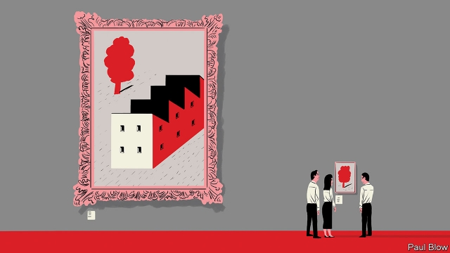

###### Bartleby

# Reflections of a business guru 

 

> print-edition iconPrint edition | Business | Jul 25th 2019 

CHARLES HANDY has been through a lot of challenges in a long career as a manager at Royal Dutch Shell, an oil giant, followed by a spell in academia and acclaim as a business writer championing more flexible, less hierarchical organisations. His latest battle is with his health. Earlier this year, the then 86-year-old Irishman suffered a stroke which meant that he had to learn to walk, talk and even swallow all over again. True to his reputation as a business guru, the experience taught him a valuable lesson, as he explained to Bartleby in a recent interview. 

As far as Mr Handy was concerned, the point of his hospital stay was to allow him to recover as fully as possible. That meant he needed to be up and about. In the view of the nurses, that was a potential problem; he might fall and hurt himself. Their priority was to keep him safe. In practice, that required him to stay in bed and keep out of trouble. 

The experience led him to reflect on the “curse of efficiency”. Organisations focus so much on efficiency that they fail to be effective. Instead of concentrating on their core goal, they pay attention to narrower measures like cutting costs, or reducing the inconvenience suffered by their staff. Examples of the problem can be found in many places. The purpose of education is to prepare children for later life, but all too often the focus is on getting the children to pass exams. 

The drive for efficiency can also seem callous. Mr Handy argues that managers tend to like things more than they like people. If all the staff were replaced by robots, he says, running a business would be a lot easier. As it is, there is a temptation to try to turn people into things by calling them “human resources”. Call someone a resource, and it is a small step to assuming that they can be treated like a thing, subject to being controlled and, ultimately, dispensed with when surplus to requirements. 

Perhaps Mr Handy’s philosophy is best summed up as “what do they know of business who only business know?” Before his stroke he wrote a book, “21 Letters On Life And Its Challenges”, which takes the form of advice passed on to his grandchildren. The focus is more on gentle wisdom than on management theory. Indeed, Mr Handy argues that most organisations whose principal assets are skilled people, such as universities or law firms, tend not to use the term “manager”. Those in charge of them are called deans, directors or partners. Their real job is best described as leadership rather than management. And one of the primary functions of leadership is setting the right purpose for an organisation. 

Leadership also involves letting subordinates learn for themselves. When he started work for Shell, he was running the firm’s oil business in Sarawak, Malaysia. He had studied Greek and Latin at university and knew nothing about business or energy. There was no telephone link to the regional office in Singapore, and letters took weeks to arrive. No senior manager felt inclined to visit. 

Mr Handy says this gave him the opportunity to learn from his mistakes in private. He argues that “education is an experience understood in tranquillity. You look back and see where you went wrong.” 

Because of this, he thinks that business schools need to change. What they tend to do at the moment is encapsulate the best practices of current businesses, codify them and pass them on. But the real challenge that business-school graduates will face is dealing with the unexpected. That cannot be taught in the classroom but needs to be experienced in the outside world. So students should spend time at small businesses or community projects, and then write a report on how they coped. 

Furthermore, if these students aspire to be leaders, they need the ability to tell stories and create a culture. That requires broader knowledge than studying only balance-sheets and sales projections. 

Appropriately enough, Mr Handy has hopes of writing yet another book, based on the Bible, which he says is an excellent case study of storytelling. Clearly, he refuses to let illness hold him back. Looking back over his career, he believes that teaching and writing is all about creating the “Aha!” moment. That occurs when people realise that an idea the teacher or writer has advanced is both useful and something they already knew but had not articulated. Bartleby hopes that Mr Handy’s readers will be saying “Aha!” for some time to come.■ 

-- 

 单词注释:

1.bartleby[]:[网络] 巴特比；巴特白；老板是空气 

2.guru['guru:]:n. 古鲁(印度教导师) [医] 柯拉子 

3.Jul[]:七月 

4.charle[]:n. 查理（男子名）；查理（姓氏） 

5.Dutch[dʌtʃ]:n. 荷兰人, 荷兰语 a. 荷兰的 

6.academia[.ækә'di:miә]:n. 学术界, 学术生涯 

7.acclaim[ә'kleim]:n. 喝彩, 欢呼, 赞同 v. 欢呼, 喝彩, 称赞 

8.les[lei]:abbr. 发射脱离系统（Launch Escape System） 

9.hierarchical[,haiә'rɑ:kikәl]:[计] 分级的, 分层的, 层次的 

10.organisation[,ɔ: ^әnaizeiʃən; - ni'z-]:n. 组织, 团体, 体制, 编制 

11.Irishman['airiʃmәn]:n. 爱尔兰人 

12.fully['fuli]:adv. 十分地, 完全地, 充分地 

13.inconvenience[.inkәn'vi:njәns]:n. 不便, 困难 vt. 使感不便, 使感困难 

14.callous['kælәs]:a. 麻木的, 无情的, 坚硬的, 硬皮的, 起老茧的 vt. 使生茧, 使变硬 

15.dispense[dis'pens]:vt. 分发, 分配 vi. 特许, 豁免 

16.asset['æset]:n. 资产, 有益的东西 

17.dean[di:n]:n. 院长, 主持牧师 [法] 外交团长, 学院院长, 教务长 

18.subordinate[sә'bɒ:dnit]:n. 属下, 附属物 a. 下级的, 次要的, 附属的 vt. 使居下位, 使服从 

19.Sarawak[sә'rɑ:wәk]:n. 沙捞越(马来西亚的一邦) 

20.Malaysia[mә'leiziә]:n. 马来西亚 [经] 马来西亚 

21.regional['ri:dʒәnәl]:a. 地方的, 地域性的 [医] 区的, 部位的 

22.Singapore[.siŋgә'pɒ:]:n. 新加坡 

23.tranquillity[træŋ'kwɪlətɪ]: 心神稳定 

24.encapsulate[in'kæpsәleit]:vt. 装入胶囊, 封进内部, 压缩 vi. 做成胶囊 

25.codify['kәudifai]:vt. 编成法典 [法] 使成文法化, 编成法典, 编纂 

26.unexpect[]:[网络] 意想不到；使意外 

27.cannot['kænɒt]:aux. 无法, 不能 

28.aspire[ә'spaiә]:vi. 渴望, 立志于 

29.projection[prә'dʒekʃәn]:n. 发射, 计划, 突出部分, 设计, 推测 [计] 投影 

30.appropriately[]:adv. 适当的, 恰如其分的, 恰当的, 合适的 

31.storytelling['stɒ:riteliŋ]:n. 说故事, 说谎话 

32.articulate[ɑ:'tikjulit]:a. 发音清晰的, 口才好的 vt. 明白地说, 以关节连接, 使成为系统的整体 

