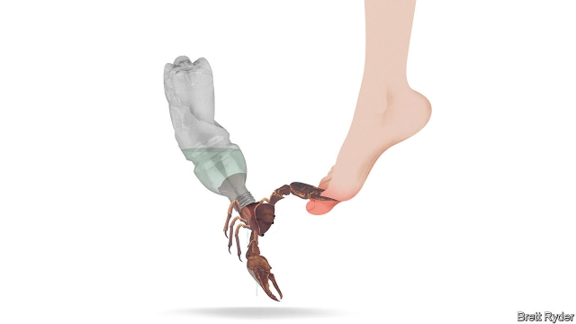

###### Schumpeter

# The inflexibility of plastic 

 

> print-edition iconPrint edition | Business | Jul 27th 2019 

AS WESTERN HOLIDAYMAKERS escape their daily grind and head to the beach this summer, a concern is likely to resurface—literally, if it washes up on the pristine sand in front of them. In the past two years plastic litter in the ocean seems to have eclipsed other environmental anxieties among rich-world consumers. Harrowing images of sea life ensnared in plastic bags, as depicted in “Blue Planet II”, a popular British television series from 2017 presented by Sir David Attenborough, would be enough to make anyone choke on the plastic straw in their piña colada—if, that is, you were offered one. Politicians everywhere are responding to voters’ demands by banning straws, stirrers and other single-use plastics. The UN says that last year 127 countries had restrictions on plastic bags. This month Panama became the first Central American country to outlaw them. Britain is considering a tax on plastic packaging made with less than 30% recycled content. In March 560 members of the European Parliament backed a law that would require 90% of plastic bottles to be recycled by 2029. Just 35 voted against. 

Given the environmental footprint of substitutes like cotton bags, aluminium cans or paper boxes—which often require more energy and water to make and transport than plastic equivalents—new regulations could in fact end up doing harm to the planet. Nonetheless the plastics industry can expect ever more curbs on its products, a trend that will force businesses involved to reshape. Bottles, boxes, films and the like consume nearly half of global output of the polymers on which they rely. Many companies in the $375bn plastic-packaging value chain—which comprises producers of oil and gas (the main feedstocks), petrochemicals giants, packaging firms and consumer brands—look ill-prepared. 

Companies at either end of the chain are the least vulnerable. Beverage-makers will happily switch from oil-derived plastic to recycled stuff for their bottles—or to aluminium cans—so long as the numbers add up (which they do when high oil prices push up the cost of virgin plastic). Even so, ExxonMobil or Coca-Cola cannot relax. Seema Suchak of Schroders, an asset manager, estimates that fizzy-drinks firms that fail to reduce their reliance on virgin plastics could see annual profits shrink by 5% over the next decade or so because of regulations and taxes spurred by the consumer backlash. According to Paul Bjacek of Accenture, a consultancy, recycling all plastic packaging, rather than the 15% that is reused today, could cut annual growth in demand for oil and gas from 1% to 0.5% by 2040, as recycled materials gain market share. 

Plastic-packaging firms could suffer more. Credit-raters at Moody’s have warned that Britain’s proposed tax on plastic bottles could hurt their makers by discouraging use by consumer-goods companies and driving up the cost of recycled plastic, a scarce raw material as recycling rates are low. Ms Suchak looked at five big makers of plastic packaging and found that the pre-tax profits of four of them could fall by 11-33% in the medium term if they stick with virgin plastics. Amcor, an Australian giant, lists environmental concerns as the number-one risk in its latest annual report. 

Then there is the petrochemicals industry. In a much-cited analysis from 2016, consultants at McKinsey calculated that the value of plastic disposed after a single use is $80bn-120bn a year. Reducing that number could benefit society but harm purveyors of the virgin materials. Last year Spencer Dale, chief economist of BP, a British oil giant, estimated that more plastics regulation could reduce demand for petrochemicals by a sixth in the next 20 years. Around a quarter of the revenues of Germany’s BASF or DowDuPont of America come from plastics. Both could suffer. So could big oil firms, hoping that their petrochemicals businesses can offset a looming decline in fossil-fuel sales from a shift to renewable energy and electric cars. ExxonMobil already derives 15-25% of profits from chemicals, twice the share a decade ago. Saudi Aramco, the world’s oil colossus, agreed in March to buy 70% of SABIC, the kingdom’s petrochemicals firm, for $69bn. It plans to plough a further $100bn into new plants over the next decade. A similar sum may be invested in Chinese facilities to convert coal to polymers. 

These investments would add to abundant capacity. Wood Mackenzie, a research firm, estimates that $200bn has been sunk into petrochemical businesses since 2010 in North America alone. Were the increase in supply to collide with a secular decline in demand, profits would suffer. The price of polyethylene, a popular polymer, has already fallen by a third since the start of 2018. 

Asked shortly after the premiere of “Blue Planet II” if looming regulations preoccupy plastics companies, a senior European lobbyist for the industry confessed to Schumpeter that they were not really a topic of conversation in boardrooms. They are now. Consumer brands are vowing to retrieve more of their packaging and to make more with recycled materials. BASF has launched packaging for mozzarella cheese made from polymers chemically recomposed from used plastics, perhaps spooked by upstarts that are working on something similar, such as Loop Industries of Canada. BP describes such “chemical recycling” as a “game changer”. 

Firms are cagey about the extent of such efforts. Industry analysts suspect it is not large. Perhaps plastics executives are counting on the force of reason to prevail, or for Asian consumers not to succumb to plastic panic. This may be wishful thinking. People are easily persuaded that an eyesore despoiling their holiday paradise is intolerable; making them care about invisible, odourless carbon dioxide is tougher. In a contest with the logic of trade-offs, the emotive power of Sir David’s cinematography is likely to win. Hard-nosed polymer bosses should remember that.■ 
<<<<<<< HEAD

-- 

 单词注释:

1.Schumpeter[]:n. 熊彼特（美籍奥匈帝国经济学家, 当代资产阶级经济学代表人物之一） 

2.inflexibility[in.fleksә'biliti]:n. 刚性, 顽固, 不变性 

3.Jul[]:七月 

4.holidaymaker['hɒlәdi.meikә]:n. 度假者 

5.pristine['pristi:n]:a. 太古的, 原来的, 古时的, 原始的 

6.eclipse[i'klips]:n. 日食, 月食, (地位名誉等的)消失 vt. 引起日食, 引起月食, 使黯然失色 

7.environmental[in.vaiәrәn'mentәl]:a. 周围的, 环境的 [经] 环境的, 环保的 

8.harrow['hærәu]:n. 哈罗公学, 耙 vt. 耙掘, 伤害, 使苦恼 vi. 被耙松 

9.ensnare[in'snєә]:vt. 以陷阱捕捉, 诱入圈套, 诱捕 

10.depict[di'pikt]:vt. 描述, 描写 

11.ii[]:abbr. 微光（Image Intensification） 

12.sery[]:n. (Sery)人名；(俄)谢雷；(科特)塞里 

13.david['deivid]:n. 大卫；戴维（男子名） 

14.Attenborough[]:n. (Attenborough)人名；(英)阿滕伯勒 

15.stirrer['stә:rә]:n. 搅拌者, 搅拌器 [化] 搅拌器 

16.UN[ʌn]:pron. 家伙, 东西 [经] 联合国 

17.Panama[.pænә'mɑ:]:n. 巴拿马, 巴拿马城 

18.outlaw['autlɒ:]:n. 被剥夺法律保护的人, 罪犯 vt. 使...失去法律保护, 将...逐出社会, 宣告非法, 取缔 

19.packaging['pækidʒiŋ]:n. 包装, 包装业, 包装术 [计] 组装; 封装 

20.les[lei]:abbr. 发射脱离系统（Launch Escape System） 

21.footprint['futprint]:n. 足迹 [计] 印迹 

22.nonetheless[,nʌnðә'les]:conj. 然而, 尽管, 不过 adv. 不过, 仍然, 尽管如此, 然而 

23.curb[kә:b]:n. 抑制, 勒马绳, 边石 vt. 抑制, 束缚, 勒住 

24.reshape[ri:'ʃeip]:vt. 改造, 使成新的形状, 打开新局面 vt. 整形 vi. 整形 [计] 整形 

25.polymer['pɒlimә]:n. 聚合物, 聚合体 [化] 多聚体; 高分子; 大分子; 聚合物 

26.producer[prә'dju:sә]:n. 生产者, 制作者, 制作人 [化] 发生器; (炉煤气)发生炉; 制气炉; 生产者 

27.feedstock['fi:dstɔk]:n. 原料 

28.petrochemical[.petrәu'kemikәl]:a. 石化的, 石化制品的, 岩石化学的 n. 石化产品 

29.vulnerable['vʌlnәrәbl]:a. 易受伤害的, 有弱点的, 易受影响的, 脆弱的, 成局的 [医] 易损的 

30.virgin['vә:dʒin]:n. 处女 a. 处女的, 贞洁的, 纯洁的, 初始的, 纯的 

31.exxonmobil[]:n. 埃克森美孚国际公司 

32.cannot['kænɒt]:aux. 无法, 不能 

33.seema[]:n. 【女名】女子名 [网络] 希玛；象征；象徵 

34.schroders[]:[网络] 施罗德；施罗德集团；宝源 

35.asset['æset]:n. 资产, 有益的东西 

36.backlash['bæklæʃ]:n. 后冲, 强烈反对 [电] 反撞, 逆栅流 

37.paul[pɔ:l]:n. 保罗（男子名） 

38.accenture['æksentʃəl]:n. 埃森哲咨询公司 

39.consultancy[]:n. 商量, 协商, 磋商, 会诊, 与...商量, 咨询, 请教, 找(医生)看病, 查阅, 考虑 [经] 咨询业务, 咨询服务 

40.recycling[]:[电] 再循环 

41.maker['meikә]:n. 制造者, 上帝 [经] 制造者, 出票人 

42.McKinsey[]:n. 麦肯锡（公司） 

43.purveyor[pә'veiә]:n. 承办伙食者, 承办商人, 征发官员 

44.spencer['spensә]:n. 针织短外衣, 斜桁纵帆 

45.dale[deil]:n. 小谷, 溪谷 

46.economist[i:'kɒnәmist]:n. 经济学者, 经济家 [经] 经济学家 

47.bp[]:[化] 碱基对 

48.BASF[]:n. 巴斯夫（德国化学公司名） 

49.offset['ɒ:fset]:n. 抵消, 把...并列, 旁系, 支管, 用胶印法印 vt. 弥补, 抵消, 胶印 vi. 装支管 n. 偏移量 [计] 偏移量 

50.loom[lu:m]:n. 织布机, 若隐若现的景象 vi. 朦胧地出现, 隐约可见, 可怕地出现 

51.renewable[ri'nju(:)әbl]:a. 可更新的, 可恢复的, 可继续的, 可换新的, 可重复的, 可重说的 [计] 可更新, 可再生的 

52.saudi['sajdi]:a. 沙乌地阿拉伯（人或语）的 

53.aramco[]:abbr. 沙特阿美石油公司（Arabian-American Oil Company） 

54.colossus[kә'lɒsәs]:n. 巨像, 巨人 

55.SABIC[]:[网络] 沙特基础工业公司(Saudi Basic Industries Corporation)；沙特基础工业(Saudi Basic Industries Corp)；沙特阿拉伯 

56.mackenzie[]:n. 麦肯齐河（又译“马更些河”, 加拿大西北部河流）；麦肯齐区（又译“马更些区”, 加拿大西北部的小区）；麦肯齐氏 

57.collide[kә'laid]:vi. 碰撞, 互撞, 抵触 

58.secular['sekjulә]:n. 修道院外的教士 a. 世俗的, 现世的, 长期的 

59.polyethylene[.pɒli'eθili:n]:n. 聚乙烯 [化] 聚乙烯 

60.premiere[pri'miә]:v. 初次公演, 首次露面 n. 初次的演出 a. 首次的, 首位的 

61.preoccupy[pri:'ɒkjupai]:vt. 抢先占领, 使全神贯注 

62.lobbyist['lɔbiist]:n. 说客 [法] 院外活动集团成员 

63.boardroom['bɒ:drum]:n. 会议室, 证券交换场所 

64.vow[vau]:n. 誓约, 誓言, 许愿 vi. 起誓, 发誓, 郑重宣言 vt. 立誓, 起誓要, 郑重地宣布 

65.mozzarella[.mɒtsә'relә]:n. 莫泽雷勒干酪(意大利产) 

66.chemically['kemikli]:adv. 用化学, 以化学方法 

67.recompose[.ri:kәm'pәuz]:vt. 重组, 修改, 使镇定 

68.spook[spu:k]:n. 幽灵, 鬼 vt. 惊吓, 鬼怪般地出没 vi. 惊吓而逃窜, 受惊 

69.upstart['ʌpstɑ:t]:n. 新贵, 暴发户, 自命不凡者 a. 暴富的 

70.changer['tʃeindʒә]:[计] 变换器, 转换器, 转接开关 [经] 兑换店 

71.cagey['keidʒi]:a. 狡猾的, 机警的, 有戒心的, 不敢表态的, 小心谨慎的, 不甚友善的 

72.analyst['ænәlist]:n. 分析者, 精神分析学家 [化] 分析员; 化验员 

73.succumb[sә'kʌm]:vi. 屈从, 屈服, 死 

74.wishful['wiʃful]:a. 愿望的, 渴望的, 一厢情愿的 

75.eyesore['aisɒ:]:n. 眼中钉 

76.despoil[di'spɒil]:vt. 夺取, 掠夺 

77.intolerable[in'tɒlәrәbl]:a. 无法忍受的, 难耐的 

78.odourless['әjdәlis]:[化] 无气味的 

79.emotive[i'mәutiv]:a. 使感动的, 动感情的, 感情的 [医] 情绪的, 动感情的 

80.cinematography[.sinәmә'tɒgrәfi]:n. 电影制片术 [医] [外科手术]电影照相术 
=======
>>>>>>> 50f1fbac684ef65c788c2c3b1cb359dd2a904378

