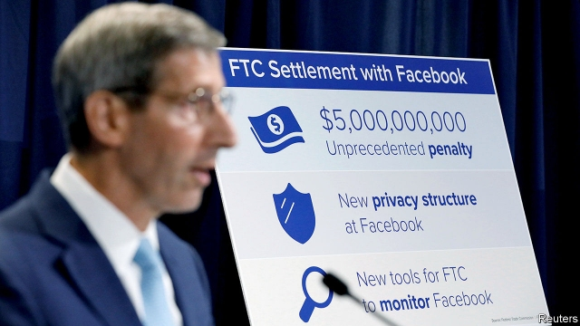

###### In the crosshairs

# The regulatory woes of Big Tech multiply 

 

> print-edition iconPrint edition | Business | Jul 25th 2019 

“HOW DID YOU go bankrupt?…Gradually and then suddenly.” Many technology entrepreneurs know this quote, from a novel by Ernest Hemingway—and often, from experience. The words have, of late, taken on new meaning. After years during which tech’s titans could do no wrong, they are now being pulled into a vortex of regulatory woes that make headlines almost daily. Big Tech is not about to implode. But will it come out intact? 

The latest burst of antitrust activity came on July 24th, when Facebook said that the Federal Trade Commission (FTC), an American regulatory agency, had launched an investigation into the company. The news came soon after the FTC released details of a much-anticipated privacy settlement with the firm. 

The social network will pay a $5bn fine for violating a previous privacy deal with the FTC. But Facebook also agreed to formalise its privacy processes, for instance by creating a special committee on its board and by designating compliance officers. Its boss, Mark Zuckerberg, will also have to certify the firm’s compliance—which could make him personally liable should Facebook fail to get its act together. 

A day earlier, America’s Department of Justice announced that it would look into how big online platforms have achieved market power and whether they abuse it. The DoJ did not say which firms it had in mind, but Google is likely to be one. The department’s lawyers are reportedly already preparing to investigate it. 

Trustbusters on the other side of the Atlantic—who have already fined Google more than €8.2bn ($9.3bn) in recent years—are not resting on their laurels. On July 17th Margrethe Vestager, the European Union’s competition regulator, announced that her department had opened an investigation into whether Amazon uses the data it collects from merchants’ sales on its sites to push its own products. Insiders expect the EU’s next target will be Apple, which stands accused of using its control of the app store on its iPhones to favour its own services, mainly Apple Music. 

All this suggests that the tech titans are in trouble both in Europe and America. Some Democrats hoping to run for the presidency have called for their break-up. William Barr, a lawyer for media and telecoms firms who became attorney-general in February, has spent years fighting them. At his confirmation hearings he agreed with a senator who said that “dominant Silicon Valley firms could use their market power...to discriminate against rival products, services or viewpoints.” 

This last point in particular worries Republicans. They view these giants as liberal bastions, which will discriminate against right-wing views in efforts to rid their platforms of extreme and hateful content. This month President Donald Trump held a “Social Media Summit” where right-wing bloggers aired their grievances. In a sign of how far critics will go, Peter Thiel, a successful tech investor and sometime defender of Mr Trump, recently speculated that Google had been “infiltrated” by Chinese intelligence services (despite a Trump tweet promising to “take a look”, his administration later dismissed the idea). 

Whether these are just acts of intimidation ahead of presidential elections next year remains to be seen. If Facebook’s settlement with the FTC is any guide, Big Tech could still emerge mostly unscathed. The large fine and its new privacy bureaucracy notwithstanding, Facebook does not have to change its data-collection practices and is off the hook for any more claims that it violated the previous FTC settlement. 

In a twist, Microsoft, the world’s most valuable listed firm, with a market capitalisation of over $1trn, has hardly been touched by the techlash. It has learned hard lessons from going through the regulatory wringer at the turn of the century: look beyond the cash cow (Windows); rapaciousness ultimately does not pay; and work with regulators. Another Hemingway quote is less well-known among geeks: “The world breaks everyone and afterward many are strong at the broken places.”■ 

-- 

 单词注释:

1.crosshair['krɔ:sheə]: 十字准线, 瞄准线 

2.regulatory['regjulәtәri]:a. 受控制的, 统制的, 调整的 [经] 规则的 

3.woe[wәu]:n. 悲哀, 悲痛, 苦痛 

4.tech[tek]:n. 技术学院或学校 

5.Jul[]:七月 

6.entrepreneur[.ɒntrәprә'nә:]:n. 企业家, 主办人 [经] 承包商, 企业家 

7.erne[ә:n]:n. 白尾海雕 

8.Titan['taitn]:n. 提坦, 太阳神, 巨人 

9.vortex['vɒ:teks]:n. 旋涡, 旋风, 涡流 [化] 涡旋 

10.implode[im'plәud]:vi. 内爆, 向内破裂, 爆裂 [电] 内裂 

11.antitrust[.ænti'trʌst]:a. 反托拉斯的 [法] 反托拉斯的 

12.facebook[]:n. 脸谱网 

13.ftc[]:abbr. （美）联邦贸易委员会（Federal Trade Commission）；（日）公平贸易委员会（Fair Trade Commission） 

14.privacy['praivәsi]:n. 隐私, 隐居, 秘密 [计] 个人保密权 

15.formalise['fɔ:məlaɪz]:vt. 使（协议、计划等）成书面文字形式; 使成为正式, 使具有一定形式 

16.designate['dezigneit]:vt. 指定, 指明, 称呼 a. 已选出而未上任的 

17.compliance[kәm'plaiәns]:n. 遵从, 顺从, 屈从 [化] 柔顺; 顺应 

18.zuckerberg[]:扎克伯格 

19.certify['sә:tifai]:v. 证明, 保证 

20.online[]:[计] 联机 

21.doj[]:abbr. Department of Justice <美国>司法部 

22.google[]:谷歌；搜索引擎技术；谷歌公司 

23.reportedly[ri'pɒ:tidli]:adv. 根据传说, 根据传闻, 据报道 

24.trustbuster['trʌstbʌstә]:n. 要求解散托拉斯的人 

25.laurel['lɒ:rәl]:n. 月桂树, 荣誉 vt. 使戴桂冠, 授予荣誉 

26.margrethe[]:[网络] 丹麦女王玛格丽特；丹麦玛格丽特；丹麦女王玛格丽特二世 

27.regulator['regjuleitә]:n. 调整者, 校准者, 校准器, 调整器, 标准钟 [化] 调节剂; 调节器 

28.amazon['æmәzɒn]:n. 亚马孙河 [医] 无乳腺者 

29.datum['deitәm]:n. 论据, 材料, 资料, 已知数 [医] 材料, 资料, 论据 

30.insider['in'saidә]:n. 内部的人, 权威人士, 知道内情的人 [经] 熟悉内情者 

31.APP[]:[计] 应用, 应用程序; 相联并行处理器 

32.iphone[]:n. 苹果手机 

33.tech[tek]:n. 技术学院或学校 

34.democrat['demәkræt]:n. 民主人士, 民主主义者, 民主党党员 [经] 民主党 

35.presidency['prezidәnsi]:n. 总统职权, 总裁职位 

36.william['wiljәm]:n. 威廉（男子名）；[常作W-][美俚]钞票, 纸币 

37.barr[]:abbr. 翻转形态（Bump and Run Reversal） 

38.telecom['telәkɔm]:telecommunication 电信 

39.confirmation[.kɒnfә'meiʃәn]:n. 证实, 证明, 批准, 确认 [计] 确认 

40.senator['senәtә]:n. 参议员, (某些大学的)理事 [法] 参议员, 上议员 

41.dominant['dɒminәnt]:a. 占优势的, 支配的 [医] 优性的, 显性的 

42.silicon['silikәn]:n. 硅 [化] 硅Si 

43.discriminate[dis'krimineit]:v. 区别, 差别待遇 

44.bastion['bæstʃәn]:n. 棱堡, 阵地工事 

45.blogger[]:n. 写博客的人；博客使用者 

46.grievance['gri:vәns]:n. 委屈, 冤情, 苦况 [经] 不满(对雇用条件的) 

47.peter['pi:tә]:vi. 逐渐消失, 逐渐减少 

48.thiel[]: [人名] 蒂尔 

49.investor[in'vestә]:n. 投资者 [经] 投资者 

50.defender[di'fendә]:n. 防卫者, 防护者, 辩护者 [法] 辩护人, 保护人 

51.speculate['spekjuleit]:vi. 深思, 推测, 投机 [经] 投机 

52.infiltrate[in'filtreit]:vt. 使浸润, 使潜入, 使渗入 vi. 渗入 n. 渗透物 

53.tweet[twi:t]:vi. 啁啾 n. 小鸟叫声 

54.intimidation[in,timi'deiʃәn]:n. 恐吓, 威胁 [法] 恐吓, 威胁 

55.presidential[.prezi'denʃәl]:a. 总统制的, 总统的, 首长的, 统辖的 [法] 总统的, 议长的, 总经理的 

56.unscathed[.ʌn'skeiðd]:a. 没有受伤的, 未受损伤的 

57.bureaucracy[bjuә'rɒkrәsi]:n. 官僚, 官吏 [法] 官僚主义, 官僚政治, 官僚机构 

58.notwithstanding[.nɒtwiθ'stændiŋ]:adv. 虽然, 尽管 prep. 尽管 conj. 虽然 

59.Microsoft[]:n. (美国)微软公司 [电] 微软公司 

60.capitalisation[,kæpitәlai'zeiʃən;-li'z-]:n. <主英>=capitalization 

61.wringer['riŋә]:n. 绞扭的人, 绞拧机, 勒索者 [法] 勒索者, 强夺者, 令人心力交困的事 

62.rapaciousness[rәˊpeiʃәsnis]:n. 强夺;贪婪 

63.Hemingway['hemiŋwei]:海明威(①姓氏 ②Ernest, 1899-1961, 美国小说家, 曾获1954年诺贝尔文学奖) 

64.les[lei]:abbr. 发射脱离系统（Launch Escape System） 

