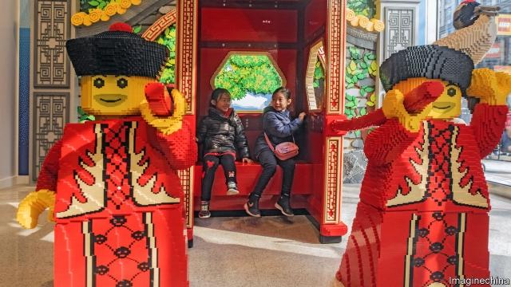

###### Brick by brick

# Why Chinese parents prefer Lego to Barbie 

 

> print-edition iconPrint edition | Business | Jul 27th 2019 

BUDDING ENGINEERS cluster around a table-sized model of the China Art Museum, a landmark of Shanghai, adding helipads, carrot patches and other improvements with colourful bricks. Prising a child from Lego’s vast shop near People’s Square can be like unsticking two stubborn bits of Lego. Li Yang, visiting for a few days from Shenzhen, has been waiting for her daughter for two hours. Zhu Yunfei, watching his son, marvels at the variety: “Coming here to play with him is making up for my childhood,” he says. They drop by every week. 

Lego’s rise in China has been vertiginous. In 2017 it overtook Alpha Group, a local giant, to become the country’s leading toy company (not including video games). In the past two years it has opened 89 stores. It wants 50 more by December, which will bring it to 30 cities. Its first Chinese factory started moulding bricks in 2016. The toy industry is growing by 9% annually in the country, but the Danish firm’s Chinese arm notches up “very strong double digits”, says Paul Huang, its boss. 

It has done so even as the brickmaker’s global business has looked shakier. In 2017 Lego cut 1,400 jobs and recorded its first drop in revenues and profits in over a decade. But last year both ticked up again, by 4% each. Lego has thus retained its status as the world’s biggest toymaker, snatched from Mattel in 2014—even as its American rival last year earned its highest revenues in five years from its Barbie dolls. 

Newly affluent parents in China have helped Lego recover. “We have not maxed out there, by far,” says Niels Christiansen, whom Lego brought in as chief executive two years ago. As in the West, the educational merits of bricks appeal to Chinese parents. Last year 98% of those surveyed by Lego said that play was essential for their child’s well-being, even more than Americans and Danes. 

Lego has also astutely catered to local tastes. This year the firm launched three sets specifically for China, the first time it has done so for any country. Fans were delighted at the attention to cultural detail. One was a Chinese New Year’s Eve dinner kit, with tiny red envelopes and chunlian, lucky couplets on banners pasted around doorways. A dragon boat race set included a sticky-rice dumpling, a popular festival snack. The high-quality kits are pricey, costing up to 700 yuan ($100) apiece. 

With Barbie, Mattel tried to localise in the wrong way. A former Chinese manager at the American company calls its promotion of a line of cheaper, flimsier dolls “arrogant”. Because no effort was put into making her locally relevant, Barbie held none of her usual aspirational appeal, even for spendthrift Chinese. In 2009 Mattel opened the world’s largest Barbie shop on a luxury shopping street in central Shanghai, stuffed with 800 dolls. The six-floor pink colossus confused Chinese parents by offering mothers a spa, designer fashion and “Barbietini” cocktails, and their daughters more age-appropriate attractions. It was a flop and shut two years later. 

It is hard to convince prudish parents of the creative merits of frivolous dolls, and grown-up Chinese collectors prefer short and chubby Molly, a popular local poppet. The Chinese market for construction toys is six times bigger than for dolls. In Mr Zhu’s words, “there is no art to a Barbie”. Tellingly, Mattel’s most successful brand in China is a maker of educational baby toys, Fisher-Price, with a market share of 1.1%, according to Euromonitor, a data provider. Barbie, with 0.3%, comes a lowly 31st. By contrast, Lego’s 4.5% share puts it firmly in first place: a fortification that will serve it well, as China’s market for toys and video games, worth $45bn, overtakes America’s in the next few years.■ 
<<<<<<< HEAD

-- 

 单词注释:

1.lego[]:n. 乐高积木（商标名） 

2.Barbie[]:n. 芭比（女子名）；芭比娃娃（商标名） 

3.Jul[]:七月 

4.cluster['klʌstә]:n. 串, 丛, 群, 簇 vi. 成串, 丛生 vt. 使聚集 [计] 簇 

5.landmark['lændmɑ:k]:n. 陆标, 划时代的事, 地界标 [医] 界标 

6.helipad['helipæd]:n. 直升机起飞及降落场,直升机停机坪 

7.colourful['kʌlәful]:a. 颜色丰富的, 鲜艳的, 艳丽的, 多色的, 丰富多彩的, 吸引人的, 引人入胜的 [计] 有色的 

8.prise[praiz]:vt. 撬, 撬开, 撬动 

9.unstick[.ʌn'stik]:vt. 扯开, 分开(粘着的东西) 

10.yang[jɑ:ŋ,jæŋ]:n. 杨（姓氏） 

11.shenzhen['ʃʌn'dʒʌŋ]:n. 深圳 

12.zhu[]:n. 朱（姓氏） 

13.marvel['mɑ:vl]:n. 奇异事物, 罕见例子 vt. 惊异于 vi. 惊异 

14.vertiginous[vә:'tidʒinәs]:a. 旋转的, 眩晕的 [医] 眩晕的 

15.alpha['ælfә]:n. 希腊字母表的第一个字母, 最初, 开端 [医] α(希腊文的第一个字母), 甲种 

16.annually['ænjuәli]:adv. 一年一次, 每年 [经] 年度的, 每年的 

17.Danish['deiniʃ]:n. 丹麦文 a. 丹麦的, 丹麦人的, 丹麦文的 

18.notch[nɒtʃ]:n. 刻痕, 等级, 峡谷 vt. 刻凹痕, 用刻痕计算, 赢得 

19.digit['didʒit]:n. 数字, 位数, 指头 [计] 数位; 位 

20.paul[pɔ:l]:n. 保罗（男子名） 

21.huang[]:n. 黄（姓氏） 

22.shaky['ʃeiki]:a. 震动的, 摇晃的, 动摇的 

23.statu[]:[网络] 状态查看；雕像；特级雪花白 

24.toymaker['tɔɪmeɪkə]: 玩具制造者 

25.mattel[]:n. 美泰（公司），总部设在美国加州，是全球最大的玩具公司。 

26.maxed[]:n. 马克斯；最大值；极大值 adj. 最高的；最大的 v. (使)绞尽脑汁；(使)竭尽全力 [网络] 星卡；幽暗刀光 

27.Niel[]:n. (Niel)人名；(英、荷)尼尔；(法)尼埃尔 

28.Christiansen[]:克里斯蒂安森（人名） 

29.educational[.edju'keiʃәnl]:a. 教育的, 教育性的 

30.Dane[dein]:n. 丹麦人 

31.astutely[əs'tju:tli]:adv. 敏捷地；伶俐地 

32.specifically[spi'sifikli]:adv. 特定地, 明确地, 按特性 

33.cultural['kʌltʃәrәl]:a. 文化的, 教养的, 修养的 [医] 培养的 

34.kit[kit]:n. 装备, 工具箱, 成套工具 [计] 成套部件; 成套零件 

35.couplet['kʌplit]:n. 对句, 对联 

36.doorway['dɒ:wei]:n. 门口, 途径 

37.pricey['praisi]:a. 昂贵的, 价格高的 

38.apiece[ә'pi:s]:adv. 就每个而论, 各 

39.localise['lәjkәlaiz]:vt.vi. 使地方化, 使具有地方性, 使限制于局部, 确定起源, 集中, 局限 

40.promotion[prәu'mәuʃәn]:n. 晋级, 创建, 增进 [经] 推广, 推销, 促进 

41.flimsy['flimzi]:a. 易坏的, 脆弱的, 浅薄的 n. 易损坏的东西(或材料), 薄纸, 描图用薄纸, 薄纸稿纸 

42.arrogant['ærәɡәnt]:a. 自大的, 傲慢的 

43.locally['lәukәli]:adv. 地方性地, 局部性地, 在当地 

44.aspirational[ˌæspəˈreɪʃənl]: 志同的, 有抱负的 

45.spendthrift['spendθrift]:n. 浪费的人 a. 浪费的, 挥霍无度的 

46.colossus[kә'lɒsәs]:n. 巨像, 巨人 

47.spa[spɑ:]:n. 矿泉, 温泉浴场, 矿泉治疗地 [计] 软件出版者协会 

48.designer[di'zainә]:n. 设计者, 谋划者, 制图者 [计] 设计员 

49.cocktail['kɒkteil]:n. 鸡尾酒, 开味品 a. 鸡尾酒会的 

50.flop[flɒp]:n. 砰然落下, 拍击声, 失败 vi. 笨重地摔, 猛落 vt. 笨拙地抛下 adv. 噗通 

51.prudish['pru:diʃ]:a. 拘守礼仪的, 过分规矩的, 表面正经的 

52.frivolous['frivәlәs]:a. 轻佻的, 妄动的, 琐碎的 [法] 轻薄的, 轻浮的, 无意义的 

53.collector[kә'lektә]:n. 收集家, 收取款项的人 [化] 集电极; 捕收剂 

54.chubby['tʃʌbi]:a. 圆胖的 

55.molly['mɔli]:n. [俚]懦夫；娘娘腔的男人 

56.poppet['pɒpit]:n. 宝贝, 有孔小珠, 随转尾座 

57.tellingly['teliŋli]:adv. 有效地；显著地 

58.maker['meikә]:n. 制造者, 上帝 [经] 制造者, 出票人 

59.Euromonitor['juərəu'mɔnitə]:n. (英国)欧洲商情市场调研公司 

60.datum['deitәm]:n. 论据, 材料, 资料, 已知数 [医] 材料, 资料, 论据 

61.provider[prә'vaidә]:n. 供应者, 供养人, 伙食承办人 [计] 提供器 

62.lowly['lәuli]:a. 地位低的, 卑下的, 谦卑的 adv. 位置低下的, 低声地, 谦逊地 

63.fortification[.fɒ:tifi'keiʃәn]:n. 筑城, 防御工事, 要塞 
=======
>>>>>>> 50f1fbac684ef65c788c2c3b1cb359dd2a904378

