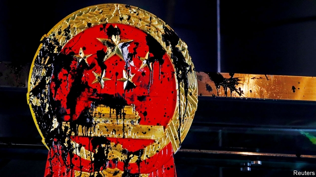

###### Hong Kong’s battle lines

# Hong Kong’s violent protests against Chinese rule 

 

> print-edition iconPrint edition | China | Jul 27th 2019 

NOT SINCE the 1960s, when Mao’s Cultural Revolution spilled over into Hong Kong, triggering riots and bombings, have political tensions in the city run so high. After weeks of protests, antagonism between critics and supporters of the Communist Party in Beijing has risen sharply. The local government seems paralysed. Relations with the police have deteriorated. And worries abound that turmoil will grow. 

July 21st brought a crucial change. During the day hundreds of thousands of demonstrators, many in black, the chosen colour of those who support democracy, marched through the city. They were calling for the formal withdrawal of an extradition bill (now shelved) allowing criminal suspects to be extradited to the mainland. The demonstration was orderly, but two incidents that came after it were not. 

One was an outbreak of thuggery in a suburb called Yuen Long, in which 100 men in white shirts, armed with canes and rods, attacked passengers at a railway station, many of them returning from the march downtown. Dozens were injured, one critically. The other was an unauthorised protest outside the central government’s headquarters in Hong Kong. This was the most direct challenge so far to the rulers in Beijing. The demonstrators spattered the country’s emblem with paint (see picture) and covered the walls with slogans. One said “Down with the Chinese Communist Party”. Another called for the “glorious restoration” of Hong Kong—a term used by supporters of the territory’s independence. 

Both sides reacted with horror. The bloodshed in Yuen Long was widely blamed on members of Hong Kong’s criminal underworld, known as triads. But anger has focused on the police and the party’s supporters. Despite numerous emergency calls by witnesses, it took riot police more than half an hour to respond. In a widely shared video Junius Ho, a legislator and Communist-party supporter, was seen walking through Yuen Long, where he lives, thanking men in white for their “hard work”. Allegations of collusion between communists and Hong Kong’s triad gangs have a long history in the territory. 

The response of Chinese officials was just as disturbing. They said the vandalism of their office building had “seriously challenged the central government’s authority” and tested the “bottom line” of the “one country, two systems” arrangement under which China has ruled the territory since 1997. This suggests the officials may regard the unrest as a challenge to the party itself, as well as to Hong Kong’s government. 

Some Hong Kongers even wonder whether the central authorities might deploy the Chinese army to restore order. That would be unprecedented, and create huge fear in the territory given the army’s crushing of the Tiananmen Square protests in 1989 (see article). The idea seems unlikely, because it would cause an international outcry. Still, at a press conference in Beijing on July 24th about a new white paper on China’s defence, a military spokesman was asked whether troops might be called in. He referred ominously to a clause in Hong Kong’s garrison law that allows the army to help the local government if asked. 

Few observers think the government will make big enough concessions to placate the demonstrators. They used to demand that the territory’s unpopular chief executive, Carrie Lam, step down. Now they are calling for wider democratic reform. Neither demand is likely to be heeded. The central government has expressed strong support for Mrs Lam and none whatever for real political change. Her administration cannot negotiate with the protesters. It seems paralysed in the face of them. 

Meanwhile, the demonstrators themselves are moving beyond the reach of outside influences. Older reformers such as Martin Lee, who once held considerable sway over the territory’s democratic movements, say they can do little. Even the younger activists who led the “Umbrella Movement” of 2014 say they have become peripheral. A group of local NGOs, called the Civil Human Rights Front, has been behind recent marches that have obtained police permission. But these are often followed by smaller protests by young radicals, such as those who gathered outside the central government’s office. 

These unauthorised protests appear leaderless. Participants keep their faces covered, hide behind umbrellas when making plans and use encrypted messaging-services. They come with changes of clothes to avoid detection after they disperse, and gas masks against tear gas (which the police used, along with rubber bullets, on July 21st). Such anonymity makes them hard to control—or to negotiate with. They quote Bruce Lee, a kung-fu actor: “Be formless, shapeless, like water.” 

Despite the occasional violence, the radicals appear to enjoy considerable sympathy among moderate protesters. Within the crowds, groups of Christian pastors lead hymn-singing and offer spiritual guidance. Social workers and legislators often insert themselves between protesters and police in an attempt to mediate. 

There is less unity on the other side. On July 20th the party’s sympathisers organised their own rally. But one prominent participant, Arthur Shek, a director of a group that controls a pro-party newspaper, resigned from the board of the group on July 23rd after calling for violent anti-government protesters to be caned. Members of his own staff said his remarks had incited the attackers in Yuen Long. 

The Hong Kong General Chamber of Commerce, which normally backs the authorities, condemned the violence both at the central government’s office and in Yuen Long. But it went further, in effect calling on the government to make concessions. Echoing one of the protesters’ demands, it said there should be an independent inquiry into the unrest. So far the government has been deaf to such ideas. It seems to want to wait, hoping the protesters will tire of their action. If anything, the opposite is happening. They have called a march in Yuen Long on July 27th to protest against the beatings there. The police banned the march but the organisers said it would go ahead anyway, raising fears of a further confrontation.■ 

