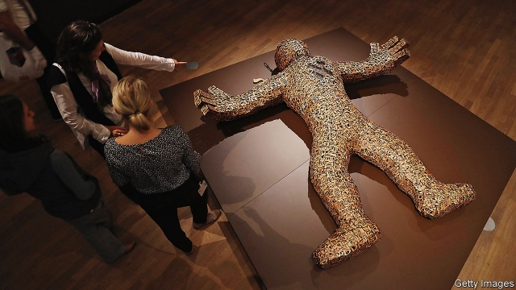

###### The role of Jewish museums

# How the Jewish Museum Berlin fell out with Jews 

 

> print-edition iconPrint edition | Europe | Jul 27th 2019 

RUNNING EUROPE’S largest Jewish museum in Germany, where the shadows of the past require a special sensitivity, is one of the most demanding jobs in the museum world. It requires outstanding scholarship, tact, managerial talent, fundraising savvy and the ability to deal with a wide range of interested parties, from the federal government (which provides most of the money), scholars of Judaism and the public at large to the German Jewish community and the Israeli government. Each group has its own strongly held idea about the role of the Jewish Museum Berlin (JMB). 

Peter Schäfer, an internationally renowned expert on ancient Jewish history, did remarkably on most of these fronts after taking over in 2014 as director of the JMB, but his leadership repeatedly came under fire from Binyamin Netanyahu’s government. At the end of June Mr Schäfer offered his resignation to Monika Grütters, Germany’s culture minister, “to prevent further damage” to the JMB. 

At the end of last year the Israeli prime minister asked Angela Merkel, the German chancellor, to cut the museum’s funding. He claimed its exhibition “Welcome to Jerusalem” (which was so popular that it was extended by a year) reflected “mainly the Muslim-Palestinian perspective” of the city. Mr Schäfer subsequently ruffled feathers when he met a cultural attaché from Iran at the museum. 

The final straw was a tweet promoted as a “must read” in early June from the museum’s Twitter account sharing an article from TAZ, a left-wing daily. The tweet appeared to criticise a resolution of the Bundestag, Germany’s lower house of parliament, which condemned the campaign for boycotts, divestments and sanctions (BDS) against Israel as anti-Semitic. In response, Charles Kaufman, president of B’nai B’rith International, a Jewish advocacy organisation, claimed the JMB ought to be “renamed the Insult to Injury Museum”. Josef Schuster, leader of the Central Council of Jews in Germany, wondered if the JMB could still call itself “Jewish”. 

Mr Schäfer was due to retire next May, just after opening the new permanent exhibition and the new children’s museum, which were conceived under his stewardship. By all accounts he took the museum’s mission statement literally and made it “a vibrant centre of reflection on Jewish history and culture as well as about migration and diversity in Germany”. Last year the museum had almost 700,000 visitors, who sometimes queued for hours to get in. The exhibition “Golem”, about the myth of artificial life, was his idea. Another of his original exhibitions was “Snip It!”, which explored circumcision and its controversy. 

Many of Mr Schäfer’s supporters believe that he should have weathered the storm. Fifty scholars of the Talmud signed a letter in his support. Another 322 international academics put their names to a statement demanding “a public apology to him from those who have spread lies about him”. (Mr Schäfer was falsely portrayed as a sympathiser of BDS). And 58 museum professionals from 14 countries penned a letter to express concerns about his treatment. 

Nearly everyone agrees that it would help for the next director to be a Jew. (Mr Schäfer is Catholic.) Candidates can apply until September 1st, explains Martin Michaelis, who is managing the museum until the new director is appointed. The appointment should happen by the spring. Whoever gets it will need all the talent Mr Schäfer had, with a little more diplomatic skill—and a much thicker skin. ■ 
<<<<<<< HEAD

-- 

 单词注释:

1.Berlin[bә:'lin]:n. 柏林, (软质)柏林毛线 

2.Jew[dʒu:]:n. 犹太人, 守财奴, 犹太教信徒 vt. 欺骗, 杀价 

3.Jul[]:七月 

4.sensitivity[.sensә'tiviti]:n. 敏感, 灵敏度 [计] 灵敏度 

5.tact[tækt]:n. 机智, 手法, 老练 [经] (自动加工线的)生产节拍 

6.managerial[.mænә'dʒiәriәl]:a. 管理的 [经] 管理上的, 经营上的 

7.fundraising['fʌndˌreɪzɪŋ]:n. 筹款, 募款 a. 筹款的 

8.savvy['sævi]:v. 理解, 领悟 n. 理解能力, 机智, 悟性 

9.Judaism['dʒu:diizm]:n. 犹太教, 犹太文明, 犹太教信仰 

10.Israeli[iz'reili]:a. 以色列的, 以色列人(语)的 n. 以色列人 

11.jmb[]:abbr. Joint Matriculation Board<英>（大学的）入学考试联合委员会 

12.peter['pi:tә]:vi. 逐渐消失, 逐渐减少 

13.internationally[.intә'næʃәnәli]:adv. 国际性地, 在国际间 

14.renowned[ri'naund]:a. 有名的, 有声誉的 

15.remarkably[ri'mɑ:kәbli]:adv. 显著地, 引人注目地, 非常地 

16.binyamin[]:本雅明 

17.Monika[]:n. 莫妮卡；莫尼卡（女子名） 

18.angela['ændʒilә]:n. 安吉拉（女子名） 

19.merkel[]: [人名] 默克尔; [地名] [美国] 默克尔 

20.chancellor['tʃɑ:nsәlә]:n. 大臣, 总理, 首相, 大使馆/领事馆的一等秘书, 司法官, 大学校长 

21.Jerusalem[dʒә'ru:sәlәm]:n. 耶路撒冷 

22.subsequently['sʌbsikwәntli]:adv. 后来, 随后 

23.ruffle['rʌfl]:n. 皱褶, 波纹, 生气, 混乱 vt. 弄皱, 触怒, 洗(牌), 连续轻擂(鼓) vi. 起皱, 发脾气, 连续轻擂 

24.cultural['kʌltʃәrәl]:a. 文化的, 教养的, 修养的 [医] 培养的 

25.Iran[i'rɑ:n]:n. 伊朗 

26.tweet[twi:t]:vi. 啁啾 n. 小鸟叫声 

27.twitter['twitә]:n. 啁啾, 唧唧喳喳声 vi. 啭, 啁啾, 颤抖 vt. 嘁嘁喳喳地讲, 抖动 

28.taz[tæz]:n. <口>小胡子 

29.criticise['kritisaiz]:v. 批评, 吹毛求疵, 非难 

30.Bundestag['bundәstɑ:k]:n. <德>(西德)国联邦议院 

31.divestment[dai'vestmәnt,di-]:n. (=divesfiture) 剥夺, 夺取 

32.sanction['sæŋkʃәn]:n. 核准, 制裁, 处罚, 约束力 vt. 制定制裁规则, 认可, 核准, 同意 

33.bds[]:abbr. 用硬纸板作封面（bound in boards） 

34.Israel['izreil]:n. 以色列, 以色列后裔, 犹太人 

35.charle[]:n. 查理（男子名）；查理（姓氏） 

36.Kaufman[]:n. 考夫曼（人名） 

37.advocacy['ædvәkәsi]:n. 拥护, 支持, 鼓吹, 辩护, 辩护术 [法] 辩护, 拥护, 提倡 

38.organisation[,ɔ: ^әnaizeiʃən; - ni'z-]:n. 组织, 团体, 体制, 编制 

39.rename[.ri:'neim]:vt. 重新命名, 再命名, 给...改名 [计] 重命名; DOS内部命令:更改文件名 

40.Josef[]:n. 约瑟夫（人名） 

41.Schuster[]:n. (Schuster)人名；(英、德、匈、捷、瑞典)舒斯特 舒斯特 

42.conceive[kәn'si:v]:vt. 构思, 认为 vi. 怀孕 

43.stewardship['stju:wәdʃip]:n. steward的职务, 管理工作 

44.literally['litәrәli]:adv. 逐字地, 按照字面上地, 不夸张地 

45.vibrant['vaibrәnt]:a. 振动的, 战栗的, 响亮的, 活跃的 

46.migration[mai'greiʃәn]:n. 移民, 移往, 移动 [计] 迁移 

47.diversity[dai'vә:siti]:n. 差异, 多样性 [化] 多样性 

48.golem['^әulem]:n. 机器人 

49.myth[miθ]:n. 神话, 虚构的事, 虚构的人 

50.snip[snip]:v. 剪, 剪断, 削减, 删节 n. 剪, (剪刀的)一剪, 不足道的人 

51.circumcision[,sә:kәm'siʒәn]:n. 包皮环割术, 环切术, 犹太教的割礼, 净心, 犹太人 [医] 包皮环切术 

52.controversy['kɒntrәvә:si]:n. 论争, 辩论, 论战, 争论 [法] 论战, 争论, 争吵 

53.supporter[sә'pɒ:tә]:n. 支持者, 后盾, 迫随者, 护身织物 [法] 支持者, 赡养者, 抚养者 

54.Talmud['tælmud]:n. <<塔木德经>>(犹太教法典) [法] 犹太教的法典 

55.falsely['fɒ:lsli]:adv. 虚伪地, 错误地, 不实地 

56.portray[pɒ:'trei]:vt. 描绘, 描写, 描绘...的肖像 

57.sympathiser['sɪmpəθaɪzə]:n. 同情者; 同意者; 支持者 

58.Jew[dʒu:]:n. 犹太人, 守财奴, 犹太教信徒 vt. 欺骗, 杀价 

59.Martin['mɑ:tin]:n. 马丁, 圣马丁鸟 

60.michaelis[]: [人名] 米凯利斯 

61.diplomatic[.diplә'mætik]:a. 外交的, 老练的 [法] 外交的, 外交上的, 文献上的 
=======
>>>>>>> 50f1fbac684ef65c788c2c3b1cb359dd2a904378

