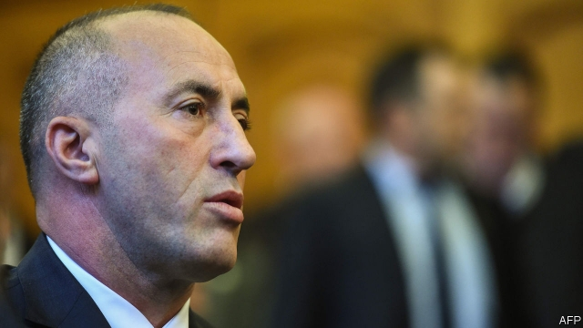

###### Lazarus redux

# Kosovo’s prime minister faces war-crimes allegations 

 

> print-edition iconPrint edition | Europe | Jul 27th 2019 

WOUNDED AND under fire in 1998, Ramush Haradinaj grabbed the only thing that came to hand with which to staunch the bleeding. It was a piece of cheese. The previous year his brother was killed by Serbian soldiers a couple of hundred meters away from him as they smuggled arms together over the mountains from Albania. Since that war Mr Haradinaj has translated his consummate skill at staying alive physically to staying alive politically. His latest such manoeuvre came on July 19th, when Mr Haradinaj resigned as prime minister of Kosovo, saying he is now a suspect in a war-crimes case. 

Bouncer, carpenter, guerrilla and politician, Mr Haradinaj has had a more colourful career than most. In a memoir he talked of his experiences as a Kosovo Albanian guerrilla fighting Serbia with relish. In one incident, when trapped Serbian policemen were calling for help, he said he “took care of them in a precise way, from a close distance.” Mr Haradinaj has been dogged by accusations that he and his men committed war crimes, murdering Serbs and Albanians regarded as collaborators or rivals. He has always denied any wrongdoing. 

Mr Haradinaj’s resignation brings a sense of déjà-vu. In 2005 he resigned 100 days into his first term as prime minister after being indicted by the United Nations war-crimes tribunal in The Hague, where he was incarcerated during his trial. He was acquitted but the prosecution alleged witness intimidation, which he denied. The prosecutors appealed and he stood trial again, only to be acquitted once more. In 2017 he was arrested in France on a Serbian warrant and held there for almost four months. The French then released him; his arrest boosted his popularity at home. 

On July 24th Mr Haradinaj was questioned in a special Kosovo court, which was set up with international staff in The Hague after a report for the Council of Europe in 2010 accused several former Kosovar guerrillas of having committed war crimes. In the report Mr Haradinaj is mentioned only in a footnote but Hashim Thaci, Kosovo’s president, is prominent. 

The two have long been rivals. Over the past year Mr Thaci has discussed a potential deal with Aleksandar Vucic, Serbia’s president, which could involve giving up the Serb-inhabited northern part of Kosovo in exchange for an Albanian-inhabited part of south Serbia. Mr Haradinaj argues this would destabilise the whole region. Last November Serbia successfully prevented Kosovo, which it does not recognise, from joining Interpol for a third time. Mr Haradinaj took revenge by imposing a 100% tariff on Serbian imports, and Serbia suspended talks. With Serbian elections due next year they are unlikely to restart until after. 

Just because he has been called to answer questions in The Hague does not necessarily mean Mr Haradinaj will be indicted, says Jeta Xharra, a leading Kosovar journalist. Many speculate that the prosecutors are calling up lots of former senior guerrillas, hoping to break one. But, says Ms Xharra, given the UN tribunal tried Mr Haradinaj twice and failed to convict him, it is unlikely that this court will succeed. 

For now Mr Haradinaj stays as acting prime minister. It is doubtful a new government can be cobbled together, so elections will probably take place in the autumn. Mr Haradinaj is a past master at snatching victory from the jaws of defeat. Despite his promises Kosovars still cannot travel to the Schengen zone without visas (although Kosovo has fulfilled European demands). He has doubled his salary even as the country remains isolated and poor. But with his decision to go to The Hague he has turned the electoral spotlight back to the war. Ardian Gjini, a close ally, says that, not for the first time, a challenge has given him “political wings”. ■ 

-- 

 单词注释:

1.lazarus['læzәrәs]:n. 乞丐, 穷人 

2.redux[ri:'dʌks]:a. 回来的, 回家的 

3.allegation[.æli'geiʃәn]:n. 断言, 主张, 申辩 [法] 声明, 事实陈述, 断言 

4.Jul[]:七月 

5.grab[græb]:n. 抓握, 掠夺, 强占, 东方沿岸帆船 vi. 抓取, 抢去 vt. 攫取, 捕获, 霸占 

6.staunch[stɒ:ntʃ]:vt. 止住, 止血 a. 坚固的, 坚强的, 忠实的, 忠诚的, 不透水的 

7.bleeding['bli:diŋ]:n. 出血, 流血 [化] 渗色 

8.serbian['sә:bjәn]:a. 塞尔维亚人（语）的；塞尔维亚的 

9.meter['mi:tә]:n. 米, 公尺, 仪表, 计量器 vt. 以仪表计量 

10.smuggle['smʌgl]:vt. 偷运, 走私, 私运 vi. 走私 

11.Albania[æl'beiniә]:n. 阿尔巴尼亚 

12.consummate['kɒnsәmeit]:vt. 完成, 使完美 a. 无上的, 至上的, 完美的 

13.physically['fizikli]:adv. 按自然规律, 完全地, 实际上, 真正地, 身体上地 

14.politically[]:adv. 政治上 

15.manoeuvre[mә'nu:vә]:n. 调遣, 演习, 策略 vi. 调动, 演习, 用策略 vt. 调动, 操纵 

16.Kosovo['kɔ:sәvәj]:科索沃[南斯拉夫自治省名] 

17.bouncer['baunsә]:n. 巨大的东西, 巨人, 跳跃的人, 同类中最大者 

18.guerrilla[gә'rilә]:n. 游击队 

19.colourful['kʌlәful]:a. 颜色丰富的, 鲜艳的, 艳丽的, 多色的, 丰富多彩的, 吸引人的, 引人入胜的 [计] 有色的 

20.memoir['memwɑ:]:n. 传记, 实录, 追思录, 回忆录, 自传 [化] 研究报告 

21.albanian[æl'beinjәn]:n. 阿尔巴尼亚人 

22.serbia['sә:bjә]:n. 塞尔维亚（南斯拉夫成员共和国名） 

23.relish['reliʃ]:n. 滋味, 风味, 美味, 爱好, 食欲, 调味品 vt. 调味, 喜欢, 玩味 vi. 有味道 

24.accusation[ækju:'zeiʃәn]:n. 控告, 指控, 指责 [法] 控告, 起诉, 告发 

25.Serb[sә:b]:n. 塞尔维亚人[语] a. 塞尔维亚的, 塞尔维亚人[语]的 

26.albanian[æl'beinjәn]:n. 阿尔巴尼亚人 

27.collaborator[kә'læbәreitә]:n. 合干者, 合作者, 通敌者 [法] 合作者, 协助者, 勾结者 

28.alway['ɔ:lwei]:adv. 永远；总是（等于always） 

29.wrongdoing['rɒŋ'du:iŋ]:n. 干坏事, 坏事 

30.indict[in'dait]:vt. 起诉, 控告, 指控 [法] 控告, 揭发, 对...起诉 

31.tribunal[trai'bju:nl]:n. 法庭, 法官席, 裁决 [法] 法庭, 裁判所, 裁判 

32.Hague[hei^]:[法] 海牙 

33.incarcerate[in'kɑ:sәreit]:vt. 下狱, 监禁, 禁闭 [法] 监禁, 使下狱, 禁闭 

34.acquit[ә'kwit]:vt. 无罪释放, 表现, 使履行 [法] 开释, 释放, 免 

35.prosecution[.prɒsi'kju:ʃәn]:n. 执行, 经营, 起诉 

36.allege[ә'ledʒ]:vt. 宣称, 主张, 提出, 断言 [法] 断言, 指称, 指证 

37.intimidation[in,timi'deiʃәn]:n. 恐吓, 威胁 [法] 恐吓, 威胁 

38.prosecutor['prɒsikju:tә]:n. 实行者, 告发者, 公诉人 [法] 原告, 起诉人, 检举人 

39.warrant['wɒ:rәnt]:n. 授权, 正当理由, 根据, 证明, 批准, 凭证, 令状, 委任状 vt. 授权给, 保证, 担保, 批准, 使有正当理由 

40.popularity[.pɒpju'læriti]:n. 名声, 受大众欢迎, 流行 

41.Kosovar[]:[网络] 科索沃；科索沃人 

42.footnote['futnәut]:n. 脚注 [计] 脚注 

43.hashim[]:[网络] 哈希姆；哈西姆；哈闪 

44.thaci[]:[网络] 总理塔奇；特哈契 

45.aleksandar[]:n. (Aleksandar)人名；(塞)亚历山大 

46.Vucic[]:[网络] 塞尔维亚副总理武契奇 

47.destabilise[di:'steɪbɪlaɪz]:vt. 破坏政府的稳定 

48.Interpol['intә(:)pәul]:n. 国际刑警组织 [法] 国际刑警 

49.tariff['tærif]:n. 关税, 关税表, 价格表, 收费表 vt. 课以关税 [计] 价目表 

50.restart[.ri:'stɑ:t]:v. 重新开始, 重新启动 [计] 重新启动 

51.speculate['spekjuleit]:vi. 深思, 推测, 投机 [经] 投机 

52.UN[ʌn]:pron. 家伙, 东西 [经] 联合国 

53.convict[kәn'vikt]:n. 囚犯, 罪犯 vt. 宣告有罪, 使知罪 

54.cobble['kɒbl]:n. 圆石, 鹅卵石 vt. 铺鹅卵石, 修, 粗粗地修补 

55.Kosovar[]:[网络] 科索沃；科索沃人 

56.cannot['kænɒt]:aux. 无法, 不能 

57.schengen['ʃɛŋən]: [地名] [卢森堡] 申根 

58.electoral[i'lektәrәl]:a. 选举人的, 选举的, (有关)选举的 [法] 选举的, 选举人的, 由选举人组成的 

59.spotlight['spɒtlait]:n. 照明灯, 反光灯, 聚光灯 

60.ardian[]:[网络] 阿迪安 

61.ally['ælai. ә'lai]:n. 同盟者, 同盟国, 助手 vt. 使联盟, 使联合, 使有关系 vi. 结盟 

