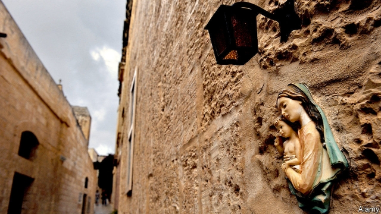

###### The last taboo

# Malta is the last EU country to have a full ban on abortion 

 

> print-edition iconPrint edition | Europe | Jul 27th 2019 

POPE PIUS XI, who died in 1939, described Malta as “Malta Cattolicissima”. Today, that is not quite as true as it once was. The first schism with Catholic doctrine came in 2011, when divorce was legalised after a bitterly fought referendum. For the past four years, Malta has retained its top spot in ILGA-Europe’s Rainbow Index, a ranking of policy towards LGBT people in 49 European countries. Same-sex couples now have equal marriage and adoption rights. 

Yet Malta remains the only European Union member state which bans abortion in all circumstances. Under a law dating to 1724, women who procure an abortion in Malta risk being imprisoned for up to three years. The second-most-stringent EU country, Poland, allows abortion in very limited circumstances (as does Northern Ireland, which is even stricter, though a law passed in Westminster earlier this month could change that). 

A fledgling grassroots movement is now positioning itself to break the taboo. “We want to normalise saying the word ‘abortion’,” says Lara Dimitrijevic, the founder of the Women’s Rights Foundation, an NGO. In 2016 the foundation filed a judicial protest, signed by 100 Maltese women, claiming that the nationwide ban of the morning-after pill (which is not abortifacient) was a violation of their human rights. The pill was legalised soon after. In March last year her group began campaigning for the public provision of abortion to Maltese women, at least when a woman’s health is at risk, and in cases of rape, incest or fatal fetal impairment. 

Dr Andrea Dibben of the University of Malta says that such is the stigma around abortion that she knows of no Maltese woman to have spoken publicly about getting one. The activists estimate that 370 women, in a country with a population of 460,000, travel to terminate a pregnancy each year. According to the British government, 58 Maltese women sought an abortion in Britain in 2016. Many more travel to nearby Sicily, but even there they encounter long hospital waiting lists. That sometimes pushes women to seek out backstreet clinicians, with all of the risk that brings. Increasingly, Maltese women are also illegally importing abortion pills bought online. A 30-year-old woman was given a two-year suspended prison sentence for using a pill in 2014. 

Even trying to organise is difficult. When the Republic of Ireland overwhelmingly voted to repeal its abortion ban in May last year, Maltese activists began copying tactics from their Irish counterparts, replicating their strategy of setting up an association of pro-choice medical doctors. But in Malta most of its 51 members chose to remain anonymous. 

Those who have revealed their identity were reported to the national Medical Council, which regulates doctors, by an anti-abortion doctor who—unsuccessfully—requested that they be struck off the medical register. When an openly pro-choice doctor stood in the election to the board of the council this month, a recently formed counter-organisation, Doctors for Life, emailed eligible voters urging them to vote for a list of five anti-abortion candidates, four of whom were indeed elected; the pro-choice doctor was not. 

Last year Malta’s prime minister, Joseph Muscat, told the Council of Europe that his government “neither has the political mandate to open a debate on access to abortion, nor the support of public opinion”. Polls suggest around nine-tenths of the population continue to oppose abortion in the first 12 weeks of pregnancy. Although Malta’s pro-choice activists have sparked a conversation, victory seems a long way off. ■ 

