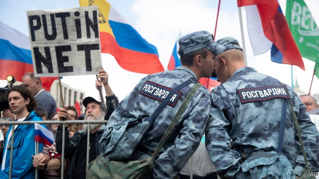

###### Moscow nights

# Moscow’s protests are inspired by the thuggery of the Kremlin 

 

> print-edition iconPrint edition | Europe | Jul 25th 2019 

WEEKENDS IN THE middle of summer are usually a quiet time in Moscow. Those who are not already on holiday flock to their dachas in the countryside. So it was not surprising that Russian authorities chose this time to disqualify opposition politicians from the Moscow city council elections to be held in September. What was surprising was that on July 20th some 20,000 Muscovites came out in the city centre to protest against this blatant manipulation, demand the registration of their candidates and threaten an even bigger protest on July 27th if their demands are ignored. The spectre of large street protests that shook Moscow and other cities in 2011-12 filled the air. Just as happened seven years ago, Alexei Navalny, the leading opposition politician, electrified the crowd, who chanted: “This is our city.” 

The scale of protest might have taken the Kremlin by surprise. After all it had disqualified candidates on spurious grounds before. It had barred Mr Navalny from running in the presidential election in 2018 and refused to register his party for the parliamentary one. (Mr Navalny was not even running in this election.) Moreover, the Moscow City Duma is a largely decorative organ. It does not control Moscow’s vast budget nor have any say in the appointment of its key officials. Until recently most Muscovites were barely aware of it. 

The protest was entirely of the government’s own making and its significance goes far beyond the Moscow parliament. It is a bellwether for rising social discontent (often masked by the Kremlin’s seemingly monolithic grip on power) and the radicalisation of Russian politics. 

In the aftermath of the protests of 2011-12, the Kremlin tried to placate Moscow’s urban middle class by pouring money into building a model modern city, complete with bicycle lanes and food halls. At the same it engineered obstacles to their political representation, including a requirement for any independent candidate to collect the signatures of 3% of voters even to get registered for the Moscow City Duma elections. This means collecting between 4,200 and 5,500 signatures per district. In 2014, the barrier worked in keeping opposition out. 

But two things have changed in the five years since the threshold was put in place. The ruling United Russia party has become so toxic than none of the pro-government candidates dared to run on its ticket, opting instead to run as “independents”. And the opposition has not only survived but built an extensive network of activists. 

The results became evident in Moscow over the past month. Whereas the pre-approved candidates barely bothered to campaign, certain to be ushered through by a subservient electoral commission, the opposition ones managed to collect the necessary signatures despite the authorities’ best efforts to thwart them (such as sending in thugs who intimidated volunteers and threw excrement at candidates). 

But then, just as the opposition candidates reached the required number of backers, the electoral commission simply disqualified them. When verifying the signatures, it deliberately misspelled the names of voters and declared the lists void. As Kirill Rogov, a political analyst, wrote, “We are dealing with one of the biggest shams in Russia’s electoral history.” 

The sham backfired. Instead of dampening interest, the Kremlin in effect mobilised those 3% of the electorate who signed their names in support of opposition candidates. “I used to be unique—they would not even acknowledge my existence,” Mr Navalny boomed from the stage. “And now they tell us that 150,000 people, who gave their signature for independent candidates, don’t exist. At last we are together.” On July 24th the authorities acknowledged his existence by detaining him (again), for 30 days, and raiding the homes of independent candidates. Faced with the problem of his own succession in 2024, Vladimir Putin has decided to nip any protest in the bud. But this escalated aggression suggests that room for a peaceful transition of power in Russia is shrinking fast. ■ 
<<<<<<< HEAD

-- 

 单词注释:

1.thuggery['θʌ^әri]:n. 谋财害命 

2.Kremlin['kremlin]:n. 克里姆林宫 [经] 克里姆林宫 

3.Jul[]:七月 

4.dacha['dætʃә]:n. <俄>俄国郊外的别墅 

5.disqualify[dis'kwɒlifai]:vt. 使不适合, 取消...资格 

6.opposition[.ɒpә'ziʃәn]:n. 反对, 敌对, 相反, 在野党 [医] 对生, 对向, 反抗, 反对症 

7.Muscovite['mʌskәvait]:n. 莫斯科人 [化] 白云母 

8.blatant['bleitәnt]:a. 喧嚣的, 吵闹的, 俗丽的, 炫耀的 

9.manipulation[mә.nipju'leiʃәn]:n. 操作, 处理 [化] (用手)操作; 使用 

10.registration[.redʒi'streiʃәn]:n. 登记, 挂号, 注册 [计] 登记; 定位; 对齐; 记录 

11.spectre['spektә]:n. 幽灵, 妖怪, 凶兆 

12.Alexei[]:n. (Alexei)人名；(捷、罗、俄)阿列克谢 

13.Navalny[]:[网络] 纳瓦尔内；瓦尔尼 

14.electrify[i'lektrifai]:vt. 通电, 上电, 使带电, 使电气化 [医] 起电, 带电 

15.spurious['spjuriәs]:a. 假造的, 伪造的, 欺骗的 [医] 假的, 伪的 

16.presidential[.prezi'denʃәl]:a. 总统制的, 总统的, 首长的, 统辖的 [法] 总统的, 议长的, 总经理的 

17.parliamentary[.pɑ:lә'mentәri]:a. 国会的, 议会的, 议会制度的 

18.Duma['du:mɒ]:n. 杜马(俄国会) 

19.decorative['dekәreitiv]:a. 装饰性的 

20.entirely[in'taiәli]:adv. 完全, 全然, 一概 

21.bellwether['bel.weðә]:n. 系铃带头羊, 前导, 领导者 

22.discontent[.diskәn'tent]:n. 不满 

23.seemingly['si:miŋli]:adv. 看来似乎, 表面上看来 

24.monolithic[.mɒnәu'liθik]:a. 独石的, 完全统一的, 整体的 [化] 整体(铸,烧结)的; 龟甲网衬里; 单片; 单块 

25.radicalisation[]:[网络] 激进化 

26.politic['pɒlitik]:a. 精明的, 明智的, 策略的 

27.aftermath['ɑ:ftәmæθ]:n. 结果, 后果 [法] 后果, 结果 

28.placate[plә'keit]:vt. 抚慰, 平息, 使和解, 怀柔 

29.representation[.reprizen'teiʃәn]:n. 表示法, 表现, 陈述, 代表 [计] 表示法指定 

30.voter['vәutә]:n. 选民, 投票人 [法] 选民, 选举人, 投票人 

31.threshold['θreʃәuld]:n. 门槛, 入口, 开端, 阈 [计] 阈; 阈值 

32.toxic['tɒksik]:a. 有毒的, 中毒的 [医] 中毒的, 毒物的 

33.opt[ɒpt]:vi. 选择 

34.activist['æktivist]:n. 激进主义分子 

35.bother['bɒðә]:vt. 烦扰, 迷惑 vi. 烦恼, 操心 n. 麻烦, 纠纷, 讨厌的人 

36.usher['ʌʃә]:n. 引座员, 招待员 vt. 引导, 招待 vi. 作招待员 

37.subservient[sәb'sә:viәnt]:a. 有帮助的, 有用的, 奉承的 

38.electoral[i'lektәrәl]:a. 选举人的, 选举的, (有关)选举的 [法] 选举的, 选举人的, 由选举人组成的 

39.thwart[θwɒ:t]:a. 横放的 vt. 反对, 阻挠, 横过 prep. 横过 adv. 横过 

40.thug[θʌg]:n. 恶棍, 刺客, 凶手 [法] 凶手, 刺客, 暴徒 

41.excrement['ekskrimәnt]:n. 排泄, 大便 [医] 粪便 

42.backer['bækә]:n. 援助者, 支持者 [经] 背书人, 支持人 

43.void[vɒid]:n. 空虚, 空间, 空白, 空隙, 空虚感 a. 空的, 无效的, 无人的, 没有的, 无用的 [计] 脱墨; 空白点 

44.kirill[]:n. (Kirill)人名；(俄)基里尔 

45.rogov[]:[网络] 罗格夫；罗戈夫 

46.analyst['ænәlist]:n. 分析者, 精神分析学家 [化] 分析员; 化验员 

47.sham[ʃæm]:n. 假, 赝品, 骗子, 哄骗 a. 假的, 伪造的 vt. 假装, 冒充 vi. 装假 

48.backfire[.bæk'faiә]:n. 逆火, 回火, 放火 vi. 放逆火, 预先放火, 发生意外 

49.dampen['dæmpәn]:vt. 弄湿, 使沮丧 vi. 变湿, 丧气 

50.mobilise['mәjbilɑiz]:vi.vt. 动员, 松动, 使活动, 调动, 发动 

51.electorate[i'lektәrit]:n. 选民, 有选举权者, 选区 [法] 选民, 选举团, 选区 

52.detain[di'tein]:vt. 扣留, 扣押, 耽搁 [法] 拘留, 扣押, 留住 

53.Vladimir[vlɑ'dimɪr]:n. 弗拉基米尔（古罗斯弗拉基米尔-苏兹达里公国的古都） 

54.putin['putin]:n. 普京（人名） 

55.nip[nip]:n. 捏, 夹, 寒冷, 尖刻话 vt. 捏, 夹, 钳, 剪断, 损伤, 冻伤, 一小口 vi. 夹, 捏, 刺骨, 快走, 一小口一小口地抿(酒) [计] 核心程序的初始程序 

56.escalate['eskәleit]:vi. 逐步扩大, 逐步升高, 逐步增强 vt. 使逐步上升 

57.transition[træn'ziʃәn]:n. 转变, 转换, 变迁, 过渡时期, 临时转调 [化] 跃迁 
=======
>>>>>>> 50f1fbac684ef65c788c2c3b1cb359dd2a904378

