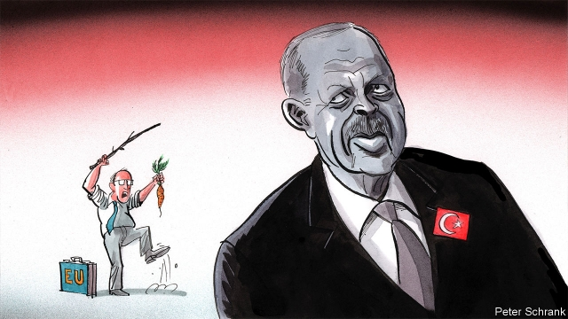

###### Charlemagne

# The EU’s relationship with Turkey is failing 

 

> print-edition iconPrint edition | Europe | Jul 27th 2019 

MUSTAFA KEMAL ATATURK anchored Turkey in Europe and the wider West after the collapse of the Ottoman empire. About a century on Recep Tayyip Erdogan is reversing that process. The Turkish president’s successive power grabs have edged the country closer to its eastern neighbours and rendered its application for EU membership a joke. Two recent incidents have made matters worse. On July 12th the Turkish air force acquired a Russian S-400 surface-to-air missile system, prompting its exclusion from NATO’s F-35 stealth-fighter-jet programme. Then on July 15th the EU imposed sanctions over Turkey’s drilling for gas in waters around Cyprus, a member of the union whose northern third remains controlled by Turkey. 

That the EU has been unable to halt its close neighbour’s drift is a sorry embarrassment. At times the union has been conciliatory, particularly during the migration crisis when Turkey agreed to act as its border guard in return for money and visas. EU leaders have often bitten their tongues rather than criticise the country’s slide into autocracy. But at other moments the EU has frozen Turkey out—sneering about “Asia Minor”, dismissing its accession prospects and now imposing penalties for Mr Erdogan’s transgressions. The result has been the worst of all worlds: not enough carrot to lure Turkey back into the fold but not enough stick to force it to comply. 

The drilling dispute is a case in point. Turkey’s government claims that the gas recently discovered under the seabed belongs partly to Cyprus’s north. The EU does not recognise Turkish Cyprus so deems the three Turkish ships that have drilled in nearby waters since June illegal. Its sanctions are, however, puny: cuts to financial assistance, the suspension of an aviation agreement and a pause to high-level talks. Turkey has brushed them off as of “no importance” and has vowed to send a fourth ship to the area. Once again the EU looks contradictory and ineffective. 

European officials offer two main excuses. The first is that Europe needs Turkey’s co-operation on migration and terrorism, so must handle the country delicately. Mr Erdogan might be a difficult partner but he is better than chaos; a Turkish meltdown would send economic shockwaves or new surges of migrants onto the European mainland. Mr Erdogan has encouraged such fears, on July 22nd threatening the suspension of the migration deal over the EU’s sanctions. The second, more frank excuse is that the EU lacks the culture and tools required to pull Turkey back. Europe, it is said, is too divided, complacent and weak to wield power decisively. America and the UN, not the EU, have led the now-stalled efforts to end Cyprus’s partition: “we still do not have a real and credible European plan on the table,” despairs Asli Aydintasbas of the European Council on Foreign Relations. 

Neither of the excuses is convincing. Keeping Turkey at arm’s length while looking forward to the end of the Erdogan era does not serve Europe’s interests. The country’s economy is once more on the verge of a currency crisis (not helped by government meddling in interest rates); the Cypriot government, fearing hostilities, is pushing for new talks; and the Russian missile deal undermines Western security. “Erdogan has been used by Putin against NATO,” says Marc Pierini, a former EU ambassador to Ankara. A chaotic, alienated Turkey will hardly make a reliable partner for Europe—on migration, terrorism or any other matter. 

Moreover, the old observation that the EU is incapable of concerted international action no longer holds. The EU has grown up in the past decade as economic, migration and security crises have forced it to contend with major world events. It imposed sanctions on Russia over its incursions into Ukraine, has taken on the anti-competitive practices of American technology giants, has maintained a disciplined front in the Brexit negotiations and is even creeping towards military integration. The best example of Europe’s new taste for realpolitik was the deal on migration with Mr Erdogan. He agreed to take back migrants who cross into the EU not out of goodwill but because the union had leverage over him—in the form of hard currency and visas benefiting his voters. 

Mr Erdogan is weaker than he looks. His approval ratings are dropping and in regional elections in the spring his Justice and Development Party (AKP) lost control of the country’s three largest cities, including Istanbul. Ali Babacan, his former deputy prime minister, has quit the AKP to form a new party and Ahmet Davutoglu, his former prime minister, could follow suit. Soon Turkey may also require outside economic assistance. At a time of such political and economic vulnerability the EU’s economic weight alone—its GDP is 24 times larger than Turkey’s—gives it huge leverage. It has not just the motive to do more to reel the country back, but the means too. 

That might mean threatening greatly increased sanctions, perhaps modelled on those levied against Russia and targeting Mr Erdogan’s allies, as proof of European seriousness. Sanctions relief could then be added to a raft of goodies to bring Mr Erdogan to the table. Economic support, an upgraded customs union, new visa freedoms for Turks and a power-sharing settlement between the Greek and Turkish parts of Cyprus, including sharing the gas, could all be touted. In return the EU might demand an end to the illegal drilling and the Turkish military presence on the island (the main block on a deal between the two sides) as well as, in Turkey, central-bank independence, economic reforms and perhaps even steps to reverse the concentration of power in the presidency. 

Europe aspires to a greater role in the world. But if despite all the carrots and sticks it has at its disposal it lastingly loses a direct neighbour and would-be accession state that is controlling territory claimed by an existing member of the EU, it might as well give up. Turkey is a natural priority for the EU. It is also a test.■ 

