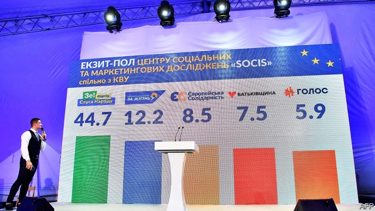

###### Total victory

# Volodymyr Zelensky clears the old elite out of parliament 

 

> print-edition iconPrint edition | Europe | Jul 27th 2019 

IN THE HIT Ukranian television show “Servant of the People”, the schoolteacher-turned-president, Vasyl Holoborodko, responds to resistance against his reform efforts by shooting up parliament. After being sworn in as the real-life president of Ukraine in May, Volodymyr Zelensky, the comedian behind Holoborodko’s character, carried out a verbal massacre in the Rada, declaring his intention to dissolve it. “Our citizens are tired of the experienced, pompous, systemic politicians,” he roared. 

Voters rewarded his assault. In snap elections on July 21st, Mr Zelensky’s personal new party, Servant of the People (SP), won the first single-party majority in modern Ukrainian history. SP took 43% of the party-list vote; its candidates also won 130 of 199 first-past-the-post single-mandate districts, giving the party 254 of the 424 MPs overall. Opposition Platform—For Life, a pro-Russian force strong in the east, took second with 13%. Parties led by a former president, Petro Poroshenko, and a former prime minister, Yulia Tymoshenko, picked up just 8% each. Golos, a new reform-oriented party founded by a rock-star, Svyatoslav Vakarchuk, squeezed in with 6%. Some 80% of MPs are new. 

Like Mr Zelensky’s victory with 73% of the vote in the presidential contest in April, the sweep of the Rada reflects Ukrainians’ disgust with their ruling elite. The oligarchs who have exercised outsize influence on Ukraine’s politics for decades feel unsettled. “Their glory days are over,” says Balazs Jarabik of the Carnegie Endowment, a think-tank. This became especially apparent in the single-mandate districts, where money used to provide an easy path to victory. In one emblematic case, the millionaire owner of a large factory in the Zaporizhia region, who had previously been elected to parliament four times, lost to a 29-year-old wedding photographer. 

Together, the two elections this year amount to a new Ukrainian revolution, this one at the ballot box. Mr Zelensky promised oodles: to end the war with Russia in the east, revive the economy and uproot Ukraine’s rampant corruption. Over 40% of the population believes the country is heading in the right direction, up from just 15% at the start of the year. With the Rada now on board, he will have to begin honouring those promises. Mr Zelensky’s first big post-election task will be the selection of a prime minister. 

There are reasons to be bullish. The former actor “wants to go down in history as the one who changed everything completely,” says one senior official. Mr Zelensky does not himself appear motivated by money, unlike many of his predecessors. He says he wants a technocrat as prime minister; he has floated a respected reformer, Ruslan Ryaboshapka, as a possible prosecutor-general, a key figure in the fight against corruption. “We’re cautious optimists,” says Vitaliy Shabunin, a prominent anti-corruption activist. 

Cautious is the operative word. Mr Zelensky’s tenure has been as contradictory as it is unconventional. Calls to bar Poroshenko-era officials from serving in government have set off alarm bells among Ukraine’s Western backers and civil-society activists, who fear that could exclude some competent reformers. So too have some of Mr Zelensky’s associated. His chief of staff, Andrei Bogdan, is a lawyer who most recently represented Ihor Kolomoisky, a controversial oligarch, in his efforts to retake control of PrivatBank, which was nationalised in the wake of fraud allegations. 

The battle for PrivatBank will be a litmus test. Mr Kolomoisky, whose TV channel airs Mr Zelensky’s shows, raised a glass of vodka to celebrate Mr Zelensky’s win; he returned to Ukraine following almost two years of self-imposed exile shortly thereafter. Ukraine’s courts, widely seen as crooked, may help him take back the bank: one Kiev judge recently ruled the nationalisation illegal. That would jeopardise the country’s IMF loans. Mr Zelensky has said that he will defend the interests of the state. Both men have played down their ties. Yet Mr Kolomoisky now tells The Economist that he has discussed PrivatBank by telephone with Mr Zelensky; the president’s team declined to comment. 

How much Mr Zelensky can challenge the old system, entrenched in the bureaucracy, the courts and the security services, depends on the team he can assemble. The president has yet to choose a defence minister, a big gap given the war with Russia simmering in the east. Although some appointees boast impressive reform backgrounds, others came over from Mr Zelensky’s production studio, Kvartal 95. Little binds the incoming SP MPs beyond the banner they ran under; Mr Zelensky may struggle to control his party. Oligarchs, including Mr Kolomoisky, are said to have their own factions inside it. As Mikhail Minakov, a political philosopher, cautions, “This elite won’t necessarily be better than the previous one.” ■ 
<<<<<<< HEAD

-- 

 单词注释:

1.volodymyr[]:[网络] 昊宇 

2.zelensky[]:[网络] 泽伦斯基 

3.elite[ei'li:t]:n. 精华, 精锐, 中坚分子 

4.Jul[]:七月 

5.Ukranian[]:[网络] 乌克兰语 

6.vasyl[]:n. (Vasyl)人名；(乌克)瓦西里 

7.ukraine[ju(:)'krein]:n. 乌克兰（原苏联一加盟共和国, 现已独立） 

8.comedian[kә'mi:djәn]:n. 喜剧演员 

9.verbal['vә:bl]:a. 用言辞的, 言语的, 口头的, 逐字的, 动词的 [医] 言语的, 口述的 

10.massacre['mæsәkә]:n. 大屠杀 vt. 大屠杀, 残杀 

11.rada[]:abbr. （英国）皇家戏剧艺术学院（Royal Academy of Dramatic Art）；随机存取离散地址（Random Access Discrete Address） 

12.pompous['pɒmpәs]:a. 爱炫耀的, 虚夸的, 盛大的 

13.systemic[si'stemik]:a. 系统的, 体系的, 全身的 [医] 系统的, 全身的 

14.voter['vәutә]:n. 选民, 投票人 [法] 选民, 选举人, 投票人 

15.assault[ә'sɒ:t]:n. 攻击, 袭击 vt. 袭击, 攻击 vi. 发动攻击 

16.SP[]:岸上宪兵, 基地宪兵 [计] 结构程序设计, 用户过程处理 

17.ukrainian[ju(:)'kreinjәn]:a. 乌克兰的；乌克兰人的 

18.MP[]:国会议员, 下院议员 [计] 宏处理程序, 维护程序, 线性规划, 微程序, 多处理器 

19.opposition[.ɒpә'ziʃәn]:n. 反对, 敌对, 相反, 在野党 [医] 对生, 对向, 反抗, 反对症 

20.petro[]:n. 佩特罗（女子名）；[宗]（希）彼得（男子名, 涵义为石头） 

21.Poroshenko[]:[网络] 波罗申科 

22.yulia[]:[网络] 尤利娅；尤莉娅；尤利亚 

23.tymoshenko[]:[网络] 季莫申科；总理季莫申科；乌克兰前总理季莫申科 

24.svyatoslav[]:[网络] 斯维亚托斯拉夫 

25.presidential[.prezi'denʃәl]:a. 总统制的, 总统的, 首长的, 统辖的 [法] 总统的, 议长的, 总经理的 

26.oligarch['ɒligɑ:k]:n. 寡头政治执政者 

27.outsize['autsaiz]:a. 特大的 n. 特大号 

28.politic['pɒlitik]:a. 精明的, 明智的, 策略的 

29.unsettle[.ʌn'setl]:vt. 使移动, 搅乱, 使动摇, 使不安宁 vi. 动荡不定, 离开固定位置 

30.balaz[]:[网络] 八十八颗芭乐籽；八十八颗番石榴籽；巴尔滋 

31.carnegie[kɑ:'ne^i]:n. 卡内基（姓氏） 

32.endowment[in'daumәnt]:n. 捐助, 天赋, 才能 [经] 捐赠, 捐款, 养老金 

33.emblematic[,embli'mætik]:a. 象征的, 典型的 

34.Zaporizhia[]:[网络] 扎波罗热；扎波罗热州；札波罗结 

35.ballot['bælәt]:n. 投票, 投票用纸, 抽签 vi. 投票, 抽签 vt. 投票选出, 拉选票 

36.revive[ri'vaiv]:vt. 使苏醒, 使复兴, 使振奋, 回想起, 重播 vi. 苏醒, 复活, 复兴, 恢复精神 

37.uproot[ʌp'ru:t]:vt. 连根拔起, 根除 

38.rampant['ræmpәnt]:a. 猖獗的, 蔓生的, 猛烈的, 跃立作扑击状的 

39.corruption[kә'rʌpʃәn]:n. 腐败, 堕落, 贪污 [计] 论误 

40.bullish['buliʃ]:a. 似公牛的, 看涨的, 上扬的 [经] 行情看涨的 

41.predecessor[.predi'sesә]:n. 前任, 先辈, 前身 [医] 初牙, 前辈, 祖先 

42.technocrat['teknәukræt]:n. 技术专家治国论者, 技术专家统治论者 

43.reformer[ri'fɒ:mә]:n. 改革家, 改革运动者 [化] 转化炉; 转化器; 重整器; 重整炉 

44.ruslan[]:n. (Ruslan)人名；(俄、印尼、阿塞、乌兹)鲁斯兰 

45.optimist['ɔptimist]:n. 乐观者, 乐观主义者 

46.vitaliy[]:[网络] 活力十足 

47.activist['æktivist]:n. 激进主义分子 

48.operative['ɒpәrәtiv]:a. 动作的, 运转的, 有效的, 关键的, 手术的 n. 技工, 侦探 

49.tenure['tenjuә]:n. 享有, 保有期 [经] (财产,职位等的)占有, 占有权 

50.unconventional[.ʌnkәn'venʃәnl]:a. 不依惯例的, 非传统的, 非常规的 

51.backer['bækә]:n. 援助者, 支持者 [经] 背书人, 支持人 

52.Andrei[]:安德烈（人名） 

53.bogdan[]:n. (Bogdan)人名；(俄、波、罗、塞、捷、匈、英)波格丹 

54.ihor[]:[网络] 至尊铭 

55.retake[ri:'teik]:vt. 再取, 取回, 重摄 n. 重拍, 取回 

56.PrivatBank[]:[网络] 短信服务是免费的 

57.nationalise['næʃәnәlaiz]:vt. 把...收归国有, 使具有某国国籍, 使国有化 

58.fraud[frɒ:d]:n. 欺骗, 欺诈, 诡计, 骗子 [经] 欺诈, 舞弊, 骗子 

59.allegation[.æli'geiʃәn]:n. 断言, 主张, 申辩 [法] 声明, 事实陈述, 断言 

60.litmus['litmәs]:n. 石蕊 [化] 石蕊 

61.vodka['vɒdkә]:n. 伏特加酒 [化] 伏特加酒 

62.exile['eksail]:n. 放逐, 流放, 被放逐者 vt. 放逐, 流放, 使背井离乡 

63.thereafter[.ðєәr'æftә]:adv. 其后, 从那时以后 

64.crook[kruk]:n. 钩, 弯曲部分, 坏蛋 vt. 使弯曲, 诈骗 vi. 弯曲 

65.kiev['ki:ev]:n. 基辅（乌克兰共和国首都） 

66.nationalisation[,næʃәnәlai'zeiʃәn; -li'z-]:n. 国有化, 国营 

67.jeopardise[]:vt. 使受危险, 危及, 危害 [法] 使受危害, 使陷入危险, 危及 

68.IMF[]:国际货币基金组织 [经] 国际货币基金 

69.economist[i:'kɒnәmist]:n. 经济学者, 经济家 [经] 经济学家 

70.entrench[in'trentʃ]:vt. 围以壕沟, 防护, 保卫, 使处于牢固地位 vi. 掘壕, 侵犯 

71.bureaucracy[bjuә'rɒkrәsi]:n. 官僚, 官吏 [法] 官僚主义, 官僚政治, 官僚机构 

72.simmer['simә]:vt. 煨 vi. 炖, 内心充满 n. 即将沸腾的状态, 即将发作 

73.appointee[ә.pɒin'ti:]:n. 被任命者 [法] 被指定的人, 被任命者 

74.incoming['inkʌmiŋ]:a. 进来的, 刚开始的, 新来的 n. 进来 

75.faction['fækʃәn]:n. 小派系, 内讧 [法] 宗派, 派别, 小集团 

76.Mikhail[]:米哈伊尔（人名） 

77.Minakov[]:米纳科夫 
=======
>>>>>>> 50f1fbac684ef65c788c2c3b1cb359dd2a904378

