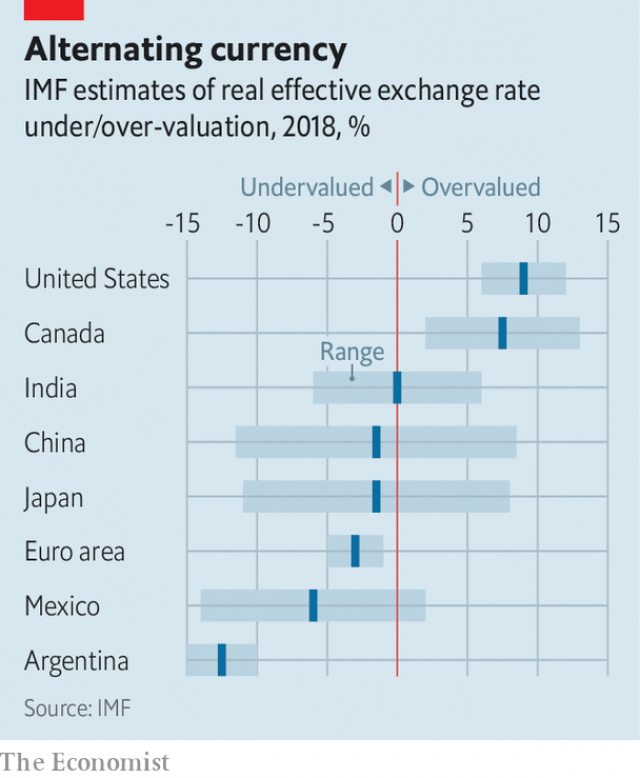

###### Exchange rates and trade

# America considers retaliating against currency manipulation 

 

> print-edition iconPrint edition | Finance and economics | Jul 27th 2019 

THE SOUTHERN SHRIMP ALLIANCE, an industry association based in Florida, is angling for tariffs. It has tried repeatedly to have foreign competitors harpooned with duties. Now some new opportunities have surfaced. The Department of Commerce is proposing a rule enabling tariffs on imports from currency manipulators. Crustacean-catchers are keen. 

American businesses disgruntled by what they see as distorted exchange rates may soon have more weapons at hand. After weeks of fulmination by President Donald Trump on Twitter about countries that keep their currencies artificially weak to America’s detriment, financial analysts are speculating that the Treasury might use its Exchange Stabilisation Fund (ESF) to weaken the dollar. Elizabeth Warren, a Democratic presidential hopeful, has also called for the dollar to be managed to promote exports, referring to proposals by Fred Bergsten and Joseph Gagnon of the Peterson Institute for International Economics, a think-tank. 

The chatter is odd in one respect: other countries’ currency manipulation does not seem to be the reason for the dollar’s strength. Although an IMF report published on July 17th said that the dollar was overvalued by 6-12%, it also said that foreign-exchange intervention had been playing “a much more muted role in recent years”. America’s loose fiscal policy—and the tighter stance of countries like Germany and the Netherlands—are more obvious culprits. 

However misdirected the current ire, the multilateral system for restraining currency manipulation is indeed toothless. In 2007 the IMF refrained from declaring China a currency cheat, although it was running a current-account surplus of 10% of GDP and buying around $2bn in dollar-denominated assets each business day. Preparing for a future bout of competitive devaluation might not be a bad idea. 

 

But the proposals floating around Washington would be ripe for abuse. The Commerce Department’s would allow its officials to declare a country a manipulator even if the Treasury had not. Companies seeking an unfair edge over foreign competitors would no doubt lobby hard. 

The measures suggested by Mr Bergsten and Mr Gagnon would grant Mr Trump huge financial firepower—dangerous, given his penchant for using whatever weapon is to hand to fight his trade wars. They think the Treasury should be allowed to use the ESF to neutralise currency intervention by other countries with equal and opposite purchases, thus deterring the intervention in the first place. But to be credible it would need hundreds of billions of dollars at its disposal. Its current portfolio is around $95bn, of which $23bn is in dollars. 

Moreover, unilateral action might lead other central banks to retaliate. Mark Sobel, a former Treasury official who managed the ESF, worries that a currency conflict might even push the dollar up, if investors scurried for safety into dollar-denominated assets. Stephen Englander of Standard Chartered, a bank, warns American policymakers to “think about how you’re going to feel the morning after”. Intervention means buying unpopular currencies. Mr Bergsten and Mr Gagnon argue that their scheme could make the Treasury money as undervalued currencies rise. But negative yields on European and Japanese debt make losses at least as plausible. 

One more reason for caution is the potential for further harming an already-fragile multilateral system. Previous American administrations considered tariffs on imports from countries manipulating their currencies, arguing that an artificially weak exchange rate amounted to an export subsidy. But they held back, understanding that such action would break the World Trade Organisation’s rules. A reversal would invite legal challenge, and perhaps retaliatory tariffs. The bellicose Mr Trump, however, would be unlikely to mind. ■ 

-- 

 单词注释:

1.retaliate[ri'tælieit]:vt. 报复, 回敬 vi. 报复, 以牙还牙 

2.manipulation[mә.nipju'leiʃәn]:n. 操作, 处理 [化] (用手)操作; 使用 

3.Jul[]:七月 

4.shrimp[ʃrimp]:n. 虾, 小虾, 矮子 vi. 捕小虾 

5.alliance[ә'laiәns]:n. 联盟, 联合 [法] 同盟, 联盟, 联姻 

6.Florida['flɒridә]:n. 佛罗里达州 

7.tariff['tærif]:n. 关税, 关税表, 价格表, 收费表 vt. 课以关税 [计] 价目表 

8.harpoon[hɑ:'pu:n]:n. 鱼叉 vt. 用鱼叉叉, 用鱼叉捕获 

9.manipulator[mә'nipjuleitә]:n. 操作者, 机械手 [化] 机械手 

10.disgruntle[dis'grʌntl]:vt. 使不高兴 

11.distort[dis'tɒ:t]:vt. 扭曲, 歪曲 [法] 歪区, 曲解, 纂改 

12.fulmination[.fʌlmi'neiʃәn]:n. 闪电, 爆鸣, 爆发 [化] 雷爆; 爆燃 

13.twitter['twitә]:n. 啁啾, 唧唧喳喳声 vi. 啭, 啁啾, 颤抖 vt. 嘁嘁喳喳地讲, 抖动 

14.artificially[.ɑ:ti'fiʃәli]:adv. 人工地, 人为地, 不自然地 

15.detriment['detrimәnt]:n. 损害, 损害物 [法] 损害, 伤害, 危害 

16.analyst['ænәlist]:n. 分析者, 精神分析学家 [化] 分析员; 化验员 

17.speculate['spekjuleit]:vi. 深思, 推测, 投机 [经] 投机 

18.treasury['treʒәri]:n. 国库, 宝库, 财政部, 国库券 [经] 库存, 国库, 金库 

19.stabilisation[ˌsteɪbɪlaɪ'zeɪʃən]: 稳定 

20.esf[]:abbr. 欧洲社会基金（European Social Fund）；欧洲科学基金会（European Science Foundation）；电爆炸成形（Electro Spark Forming） 

21.elizabeth[i'lizәbәθ]:n. 伊丽莎白（女子名） 

22.warren['wɒrәn]:n. 养兔场, 拥挤的地区 

23.presidential[.prezi'denʃәl]:a. 总统制的, 总统的, 首长的, 统辖的 [法] 总统的, 议长的, 总经理的 

24.fred[fred]:n. 佛瑞德（男子名） 

25.bergsten[]: [人名] 伯格斯滕 

26.Joseph['dʒәuzif]:n. 约瑟夫（男子名）；约瑟（圣经中雅各的第十一子） 

27.gagnon[]:n. (Gagnon)人名；(法、英)加尼翁 

28.Peterson[]:n. 彼得森（男子名） 

29.chatter['tʃætә]:n. 饶舌, 啁啾, 喋喋不休 vi. 喋喋不休地谈, (鸟)啭鸣 

30.IMF[]:国际货币基金组织 [经] 国际货币基金 

31.overvalue[.әuvә'vælju:]:vt. 估价过高, 过分尊重, 估计过高 

32.intervention[.intә'venʃәn]:n. 插入, 介入, 调停 [经] 干预 

33.fiscal['fiskәl]:a. 财政的, 国库的 [经] 财政上的, 会计的, 国库的 

34.stance[stæns]:n. 准备击球姿势, 站立的姿势, 位置, 姿态 [经] 地位, 形势 

35.culprit['kʌlprit]:n. 犯人, 罪犯, 刑事被告 [法] 犯罪者, 犯人, 罪犯 

36.misdirect['misdi'rekt]:vt. 误导, 写错地址 [法] 对...作错误指示 

37.ire[aiә]:n. 忿怒 [电] 美国无线电工程师学会 

38.multilateral[.mʌlti'lætәrәl]:a. 多边的, 多国的 [经] 多边的, 涉及多方的 

39.toothless['tu:θlis]:a. 无齿的 [医] 无牙的 

40.refrain[ri'frein]:n. 重复的话, 叠句, 副歌 vi. 节制, 避免, 克制 

41.asset['æset]:n. 资产, 有益的东西 

42.bout[baut]:n. 一回, 回合, 较量 [医] 发作 

43.devaluation[,di:vælju'eiʃәn]:n. 降低价值, 贬值 [经] 贬值 

44.Washington['wɒʃiŋtn]:n. 华盛顿 

45.lobby['lɒbi]:n. 大厅, 休息室, 游说议员者 vi. 游说议员, 游说 vt. 游说 

46.penchant['pә:ŋʃә:ŋ]:n. 爱好, 嗜好 

47.neutralise['nju:trәlaiz]:vt. 使中立化, 使成为无效 vt.vi. 抵销, (使)中和 

48.deter[di'tә:]:vt. 制止, 吓住, 威慑 

49.credible['kredәbl]:a. 可信的, 可靠的 [法] 可信的, 可靠的 

50.portfolio[pɒ:t'fәuliәu]:n. 皮包, 公文包, 部长职务, 有价证券财产目录, 艺术代表作选辑 [法] 公文包, 文件夹, 阁员职务 

51.unilateral[.ju:ni'lætәrәl]:a. 单方面的, 单边的, 片面的 [医] 单侧的, 一侧的 

52.sobel[]:n. 索贝尔（品牌名, 一种边缘检测滤波器） 

53.investor[in'vestә]:n. 投资者 [经] 投资者 

54.scurry['skʌri]:vi. 急赶, 急跑, 急转 n. 急赶, 急跑, 急转, 阵雪, 阵雨 

55.stephen['sti:vn]:n. 斯蒂芬（男子名） 

56.englander['iŋ^lәndә(r)]:n. 英国人；英格兰人 

57.charter['tʃɑ:tә]:n. 特许状, 执照, 宪章 vt. 特许, 发给特许执照 

58.policymaker['pɔlisi.meikә]:n. 政策制定者；决策人 

59.intervention[.intә'venʃәn]:n. 插入, 介入, 调停 [经] 干预 

60.unpopular['ʌn'pɔpjulә]:a. 不得人心的, 不受欢迎的, 不流行的 

61.undervalue[.ʌndә'vælju:]:vt. 低估...之价值, 低估, 看轻 [经] 低估, 降低...价值 

62.plausible['plɒ:zibl]:a. 貌似真实的, 貌似合理的, 说得煞有其事的 [法] 花言巧语的, 似乎有理的 

63.manipulate[mә'nipjuleit]:vt. 操纵, 利用, 操作, 巧妙地处理, 假造 

64.reversal[ri'vә:sl]:n. 翻转, 颠倒, 反转 [医] 逆转, 颠倒 

65.retaliatory[ri'tæliәtәri]:a. 报复的 [经] 报复性的 

66.bellicose['belikәus]:a. 好战的, 好斗的 [法] 好战的 

