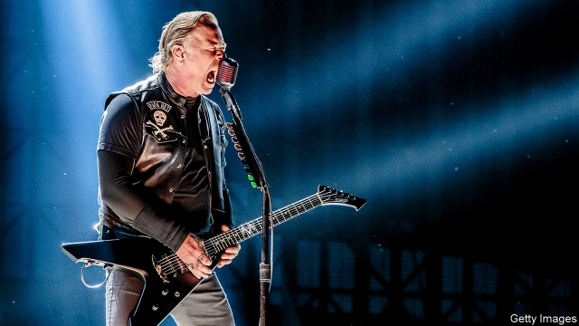
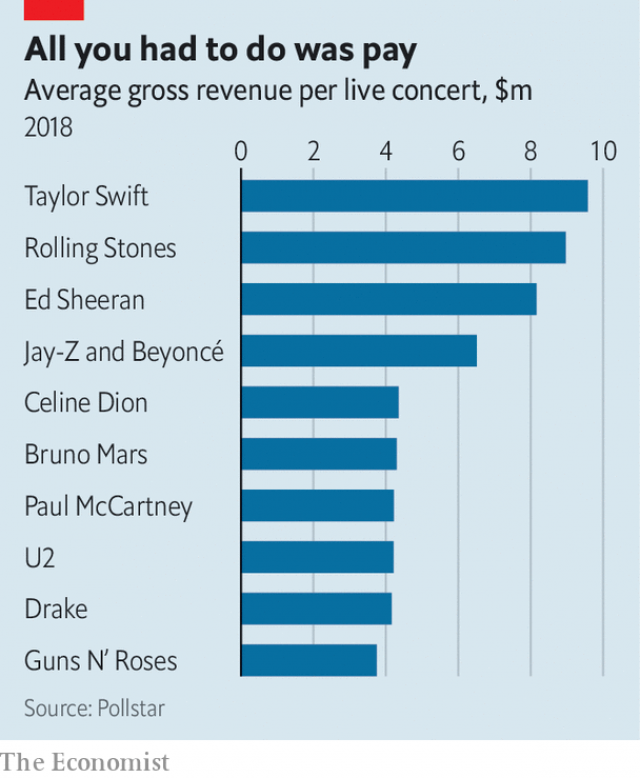

###### Touting for business

# How big stars maximise their take from tours 

 

> print-edition iconPrint edition | Finance and economics | Jul 27th 2019 

BUYING TICKETS to a marquee music show can be a miserable experience. You go online as soon tickets are released only to find they are sold out and available only on resale sites at a hefty markup. Touts often use bots to buy up tickets. But it has long been a dirty secret in the music industry that some end up on the secondary market at the behest of performers themselves. 

A secret, that is, until July 19th, when Billboard, an industry magazine, reported on a phone conversation in 2017 between an executive at Live Nation, a concert promoter, and someone claiming to represent Metallica, a heavy-metal band. The representative asked Live Nation to place 88,000 tickets for an upcoming tour on ticket-resale sites, bypassing outlets where they could be bought at face value. Live Nation admitted that it had previously placed concert tickets on resale sites for other artists. 

“None of the bands who had tickets on the secondary market would ever take responsibility,” says Paul Hutton of Crosstown Concerts, a British music promoter. “It was always blamed on an unscrupulous manager or agent.” Live Nation’s admission has destroyed that defence. 

The reason for the ruse is that performers want to be rich, but not to make fans think them greedy. In an article in 2016 for The Ringer, a sport and pop-culture website, Nathan Hubbard, the former boss of Ticketmaster, a large primary-ticketing agency, wrote that “the biggest artists sign contracts that guarantee them money every time they step on the stage, and that guaranteed amount is usually more than 100% of the revenue if every ticket is sold at face value.” Sending marked-up tickets straight to resellers closes the gap. 

 

Some artists are exploring more creative ways to maximise revenues without arousing fans’ ire. For Taylor Swift’s “Reputation” tour last year, fans who shopped in her online store had more chance of getting tickets. These were released in batches, becoming progressively pricier, like airline seats. Garth Brooks extends his tours until demand is sated, adding extra dates until shows stop selling out. Bruce Springsteen and Madonna have played in theatres, where high prices are more palatable—the average ticket for “Springsteen on Broadway” last year cost more than $500. 

Historically, tours were loss-leaders used to promote albums. As revenues from recorded music have collapsed and productions have become increasingly elaborate to draw the crowds, ticket prices have risen steeply. The cost of a concert ticket in America increased by 190% between 1996 and 2018, compared with 59% for overall consumer prices. But as the continued success of scalpers demonstrates, they are still far below the market-clearing price. ■ 

