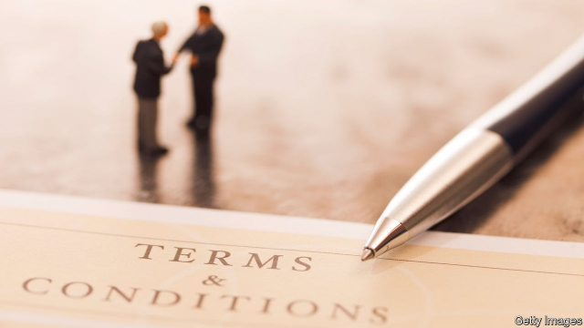

###### Critical conditions

# Many consumers neither read nor understand the contracts they sign 

 

> print-edition iconPrint edition | Finance and economics | Jul 27th 2019 

“TERMS AND conditions apply” vies for being the most morale-sapping four-word phrase of modern times, along with “The plane is delayed” and “You’re trending on Twitter”. Consumers read about a juicy offer, but fear a catch is hidden in the small print. The obvious solution—to read that small print—is not always feasible. Facebook’s online terms and conditions run to more than 3,200 words. Not too daunting? One section lists another 11 “other terms and policies that may apply to you”, including “community standards” on the content that users may post. A lot of further reading will be required. 

Even when users do read, they may not understand. Last year Which?, a British consumer-advice group, asked 24 volunteers to read the fine print on a selection of 40 insurance documents and answer a series of questions. They gave the wrong answers to between a quarter and a third; only four got top marks. Language analysis showed that the documents were harder to understand than the late Stephen Hawking’s “A Brief History of Time”. 

All this matters because “freedom of contract” is fundamental to the economic system. If two parties freely contract to make an exchange or enter a long-term relationship, both must perceive that it is to their advantage. But there is an asymmetry of information between an ordinary consumer and a corporation with lawyers paid handsomely to craft terms in its favour. 

Some economists have argued that consumers’ rights will be protected, even if only a few read the small print. By complaining about unfair terms, those few will keep sellers up to the mark. But one paper* found that only one or two of every 1,000 retail shoppers buying software read the licence agreement, and of those most examined only a small part of the text. This does not suggest there is a hard core of consumers who will keep companies in line. 

The issue clearly bothers the Competition and Markets Authority (CMA), a British regulator, which launched a campaign in April under the banner “Small Print, Big Difference” to encourage travel and tourism operators to treat customers fairly. 

As things stand, markets may be working less efficiently than they should. Consumers may fail to buy the best product on offer. This is easy to imagine with services such as mobile phones or energy, where there may be several points of comparison, such as a flat rental rate plus fees for usage. But another new paper** suggests it may be the case even with relatively simple products. The authors conducted a randomised trial with 124,000 British savers with savings accounts at five institutions. These are simple products and the main salient feature is the interest rate. 

Savers were given information about rival accounts that offered higher rates. On average switching would have taken around 15 minutes and made them £123 ($153) in the first year. But only around 3% were prepared to switch. The academics experimented with ways of displaying the information to make the benefits clearer. Enhanced disclosure made switching a bit more common, but not much. 

The most successful approach increased the share of customers switching to just 12%. Neither a saver’s age nor the balance in the account made a difference. The authors concluded that savers doubted the benefits of shopping around and were put off by the perceived inconvenience. “Caveat emptor”, it seems, may apply in principle but not in practice. ■ 

* Does Anyone Read the Fine Print: Consumer Attention to Standard-Form Contracts? by Yannis Bakos, Florencia Marotta-Wurgler and David Trossen, Journal of Legal Studies, vol 43 

** Testing the Effectiveness of Consumer Financial Disclosure: Experimental Evidence from Savings Accounts by Paul Adams, Stefan Hunt, Christopher Palmer and Redis Zaliauskas 
<<<<<<< HEAD

-- 

 单词注释:

1.Jul[]:七月 

2.vie[vai]:vi. 争, 竞争, 争胜 vt. 提出...来竞争, 以...作较量 

3.twitter['twitә]:n. 啁啾, 唧唧喳喳声 vi. 啭, 啁啾, 颤抖 vt. 嘁嘁喳喳地讲, 抖动 

4.alway['ɔ:lwei]:adv. 永远；总是（等于always） 

5.online[]:[计] 联机 

6.sery[]:n. (Sery)人名；(俄)谢雷；(科特)塞里 

7.stephen['sti:vn]:n. 斯蒂芬（男子名） 

8.asymmetry[æ'simitri]:n. 不匀称, 不对称 [医] 不对称, 偏位 

9.handsomely['hænsәmli]:adv. 漂亮地, 整齐地, 当心地, 慢慢地, 优厚地, 慷慨地, 美观地 

10.economist[i:'kɒnәmist]:n. 经济学者, 经济家 [经] 经济学家 

11.shopper['ʃɒpә]:n. 购物者 [经] 顾客, 购物的人 

12.bother['bɒðә]:vt. 烦扰, 迷惑 vi. 烦恼, 操心 n. 麻烦, 纠纷, 讨厌的人 

13.cma[]:abbr. 军事委员会（Committee of Military Affairs）；特许医学助理医师（Certified Medical Assistant）；中华医学会（China Medical Association）；基督教传教联盟（Christian and Missionary Alliance） 

14.regulator['regjuleitә]:n. 调整者, 校准者, 校准器, 调整器, 标准钟 [化] 调节剂; 调节器 

15.les[lei]:abbr. 发射脱离系统（Launch Escape System） 

16.efficiently[i'fiʃәntli]:adv. 生效, 能胜任, 有能力, 效率高, 有效 

17.rental['rentl]:n. 租费, 租金收入 a. 租赁的, 收取租金的 

18.randomise['rændəmaiz]:vt. [主英国英语]＝randomize 

19.saver['seivә]:n. 节省...的器具, 节约装置, 省俭的人 [化] 回收器; 收集器 

20.salient['seiliәnt]:a. 显著的, 突出的, 跳跃的 n. 凸角, 突出部分 

21.disclosure[dis'klәuʒә]:n. 揭发, 泄露, 揭发(或暴露)的事实 [经] 揭示, 披露 

22.inconvenience[.inkәn'vi:njәns]:n. 不便, 困难 vt. 使感不便, 使感困难 

23.caveat['keiviæt]:n. 中止诉讼程序的申请, 警告 [经] 停止支付的广告, 货物出门概不退换 

24.emptor[]:[经] 买者 

25.yannis[]:[网络] 亚尼斯；雅尼斯；扬尼斯 

26.bakos[]:[网络] 鲍科什；竞争优势因果关系模式 

27.florencia[]: [地名] [阿根廷、哥伦比亚、哥斯达黎加、古巴] 弗洛伦西亚 

28.david['deivid]:n. 大卫；戴维（男子名） 

29.VOL[]:[计] DOS外部命令:显示卷标及其序号 

30.effectiveness[i'fektivnis]:n. 效力 [经] 有效性, 能行性 

31.paul[pɔ:l]:n. 保罗（男子名） 

32.Adam['ædәm]:n. 亚当 [计] 自动直接存取管理 

33.stefan[]:n. 斯蒂芬（男子名） 

34.christopher['kristәfә]:n. 克里斯多夫（男子名） 

35.palmer['pɑ:mә]:n. 朝圣者；变戏法的人；毛虫（尤指北美的小舌麦蛾幼虫） 

36.Redis[]:重划学区系统（redistricting system） 
=======
>>>>>>> 50f1fbac684ef65c788c2c3b1cb359dd2a904378

