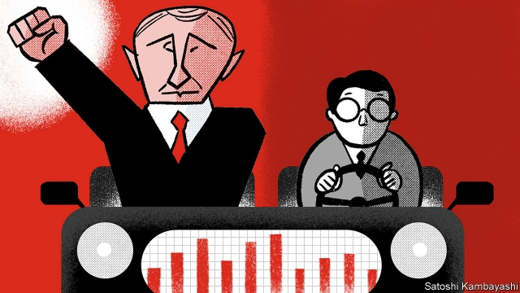
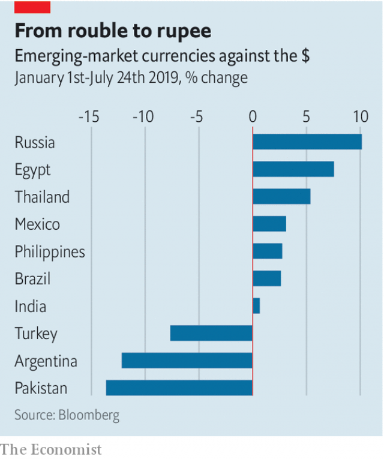

###### Buttonwood

# Why investors favour economically orthodox political strongmen 

 

> print-edition iconPrint edition | Finance and economics | Jul 27th 2019 

A  GOOD WAY to start an argument that never ends is to try to define populism. Dictionaries say it is politics directed at ordinary people who feel neglected by elites. That leaves a lot out, not least economics. In 1990 Sebastian Edwards and the late Rudiger Dornbusch sketched what is meant by “economic populism”. It is an approach, they wrote, that denies that budget deficits or inflation are constraints on economic growth. The Latin American populists they studied printed money to pay for public-spending binges. It ended in tears. 

There is no shortage of leaders in middle-income countries who fit the dictionary definition of a populist. But economic populism in its purest form is now quite rare (though its results are sadly evident in Venezuela). These days a lot of would-be champions of the people prefer their macroeconomic policies on the orthodox side: inflation targets, fiscal restraints, free-floating currencies, that sort of thing. They are happy to let technocrats get on with it. 

This poses a mild dilemma for rich-world investors—which is soon resolved. They may be appalled by the social and foreign policies of such strongmen. Yet as professionals they are also unthrilled by inflation, default, devaluation and adverse shifts in politics, which are hazardous to a bond portfolio. They tend to favour autocrats who like technocrats. You might call it the Putin Principle. 

Russia’s president, Vladimir Putin, is not much loved in the West. Buttressed by suppression at home and military adventures abroad, he is the archetypal strongman. He combines this with an affinity for well-qualified economists. His finance ministry frames the budget by a conservative fiscal rule. Inflation is under control, helped by fairly high interest rates. The central bank’s governor, Elvira Nabiullina, is widely admired. 

What pulls investors in or puts them off is hard to pin down. It is never a single factor; the world is more complex than that. But a currency’s value is a clue to general sentiment, because it is a shadow price of a country’s assets relative to everybody else’s. The rouble is one of the best-performing currencies this year (see chart). Just as telling is that countries led by strongmen hostile to orthodox policies have seen their currencies suffer—the inverse of the Putin Principle. Recep Tayyip Erdogan, president of Turkey, is the exemplar. For years he has bullied the central bank. Earlier this month he sacked its governor for keeping interest rates high. The lira has suffered badly. 

 

Other countries can be paired on the Putin-Erdogan scale. Take Egypt and Pakistan. The army looms over both. Under the IMF’s auspices, Egypt has followed orthodox policies. The Egyptian pound has risen. Pakistan lost its policy discipline as soon as its most recent IMF programme ended (though it has just signed up to another one). The rupee is down. 

The populist label also fits both Jair Bolsonaro of Brazil and Andrés Manuel López Obrador of Mexico. But when Mr Bolsonaro was elected, investors sensed that he might defer to technocratic advisers such as Paulo Guedes, now his economy minister, who has a doctorate in economics from the University of Chicago. Sure enough, Mr Bolsonaro recently shepherded through Brazil’s lower house a pension reform that is vital to the country’s fiscal stability. The real rallied. Meanwhile, Mr López Obrador’s finance minister abruptly resigned. He complained bitterly that technocrats had been sidelined in favour of unqualified types. The peso wobbled. 

The leader who is hardest to place on the scale is Narendra Modi of India. He has all the elements of a strongman: strident nationalism, personality cult, enfeebled opposition. He appears to value technocrats. As prime minister and, before that, as chief minister of Gujarat, he has relied on a small band of trusted civil servants. And though he is no fiscal hawk, he seems to grasp that the budget has limits. But there are marks against him. He lost two well-regarded central-bank governors in his first term as prime minister. His madcap idea to withdraw banknotes from circulation in 2016 was anything but orthodox. 

The autocrat-plus-technocrat model is not rock-solid. A frailty is that stability is less valuable if it is not married to policies to promote economic growth. Such reforms often, or usually, founder on vested interests on which the autocrat depends. But if living standards are not growing, there will be demand from voters for old-style economic populism. And that always ends badly. 

