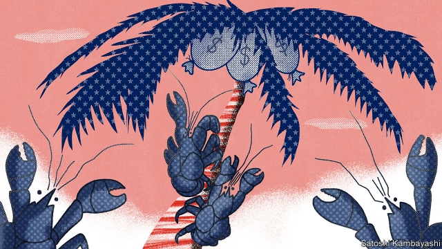

###### Land of the tax-free

# Will America go from hunter to hunted in cross-border tax evasion? 

 

> print-edition iconPrint edition | Finance and economics | Jul 25th 2019 

AMERICA HAS launched brutal assaults over the past decade on countries, such as Switzerland and Liechtenstein, where banks have helped American citizens hide money and thereby evade tax. Forced to clean up, these erstwhile havens have seen much tainted capital flow elsewhere—not least to America itself. Now it is the former aggressor’s turn to be on the defensive. Other countries are using similar tools to those America once employed to reveal untaxed money stashed by their own citizens in the world’s largest economy. 

As well as fining and prosecuting the enablers of tax-dodging—Swiss banks alone coughed up at least $5.5bn—America passed a law in 2010 known as FATCA that required foreign financial firms to spill the beans on American clients. Stung into action, more than 100 other countries signed up to the “Common Reporting Standard” (CRS), and now swap tax-relevant financial information with each other. 

America, however, did not join the CRS. Instead it shares information on the foreign clients of American banks under FATCA’s reciprocal provisions. But sharing is patchy; a lot of countries get nothing. Combine that with the high level of anonymity offered by American shell companies, and it is hardly surprising that America has become the destination of choice for many tax evaders. One tax expert reckons that “over 90% of assets avoiding the CRS have been herded into the USA”. 

America does not have to worry about the sort of bludgeoning that it doled out to Switzerland—no other country has anything like the same extra-territorial financial power. But other countries are finding that there are legal tools at their disposal, all the same. One is the so-called John Doe summons. This American provision assists tax authorities going after “a particular person or ascertainable group or class of persons” whom they suspect of financial wrongdoing, but whose identities are unknown. If approved by a court, the summons forces banks to hand over names. 

Until now the biggest user of such summonses in tax cases has been America, which, for instance, used the procedure in 2008 to prise open Swiss bank secrecy. That resulted in UBS handing over the names of around 4,500 account-holders. In April the tables were turned when a request from Finland prompted America’s Internal Revenue Service to petition a federal court in North Carolina for leave to serve John Doe summonses on three banks in America. Heavy use at Finnish ATMs of payment cards issued by the banks, and linked to American accounts, had led the Finnish tax authority to conclude that they were being used by Finnish taxpayers who had hidden untaxed income across the Atlantic. The court has since granted approval. 

Other countries suffering tax leakage will be looking more closely at this procedure. Any of the 90 with a ratified bilateral tax treaty with America can use it, though some seem unaware of the option. (By contrast, America has agreed to exchange information with only 47 countries under FATCA.) Experts say it could help to break open not only dodgy bank accounts but also trusts and insurance policies, which are also commonly used to hide capital. 

There could still be obstacles, for instance if an account is owned by an entity rather than an individual. But banks issued with a summons are required to investigate who stands behind account-holding shell companies. Due-diligence rules designed to curb money-laundering and the financing of terrorism, issued by FinCEN, a federal agency, already require banks to know the identity of such “beneficial” owners (though not all seem to do so). A shell-cracking bill picking up momentum as it passes through Congress would also help improve corporate transparency. 

If more countries take the John Doe route, it would help balance the unequal relationship America enjoys in matters of financial transparency. For too long it has got away with demanding much while offering little in return. Tax dodgers stashing cash in America, says Mark Morris, an international tax consultant, should “prepare to be smacked open like a piñata”.■ 
<<<<<<< HEAD

-- 

 单词注释:

1.Jul[]:七月 

2.brutal['bru:tәl]:a. 残忍的, 野蛮的, 不讲理的 

3.assault[ә'sɒ:t]:n. 攻击, 袭击 vt. 袭击, 攻击 vi. 发动攻击 

4.Liechtenstein['liktәn,stain]:a. (中欧国家)列支敦士登的 

5.evade[i'veid]:v. (巧妙地)逃脱, 规避, 逃避 

6.erstwhile['ә:stwail]:adv. 以前, 往昔地 a. 以前的, 往昔的 

7.haven['heivn]:n. 港, 避难所, 安息所 vt. 安置...于港中, 庇护, 入港 

8.taint[teint]:n. 污点, 耻辱, 感染 vt. 污染, 使腐败, 沾染, 腐蚀 

9.defensive[di'fensiv]:a. 防卫的, 防备用的, 自卫的 n. 守势, 防卫姿势, 防卫物 

10.untaxed['ʌn'tækst]:a. 免税的, 未完税的, 不负担过重的 

11.stash[stæʃ]:vt. 藏起来 n. 隐藏处, 隐藏物 

12.prosecute['prɒsikju:t]:vt. 告发, 起诉, 彻底进行, 执行, 从事 vi. 告发, 起诉, 作检察官 

13.enabler[]:n. 使能器, 使能者；促成者, 赋能者 

14.FATCA[]:[网络] 海外账户纳税法案(Foreign Account Tax Compliance Act)；外国帐户税收遵从法；肥咖条款 

15.client['klaiәnt]:n. 客户, 顾客, 委托人 [计] 客户, 客户机, 客户机程序 

16.CR[]:[计] 回车, 调用请求 [医] 铬(24号元素)蟹; 山查子 

17.reciprocal[ri'siprәkl]:a. 互惠的, 相互的, 相等的, 倒数的, 彼此相反的 n. 倒数, 互相起作用的事物 

18.patchy['pætʃi]:a. 补缀的, 凑合的, 不调和的, 散落的, 斑驳的, 不完全的 

19.anonymity[.ænә'nimiti]:n. 匿名, 姓氏不明 [计] 匿名信件 

20.evader[i'veidә(r)]:n. 逃避者,逃避物 

21.reckon['rekәn]:vt. 计算, 总计, 估计, 认为, 猜想 vi. 数, 计算, 估计, 依赖, 料想 

22.asset['æset]:n. 资产, 有益的东西 

23.USA[ju: es 'ei]:美国, 美利坚合众国, 美国陆军 

24.bludgeon['blʌdʒәn]:n. 大头棒 [法] 棍, 棍打 

25.dole[dәul]:n. 救济品, 失业救济金 vt. 发放救济 

26.john[dʒɔn]:n. 盥洗室, 厕所, 嫖客 

27.doe[dәu]:n. 母鹿, 雌兔 

28.summon['sʌmәn]:vt. 召唤, 召集, 号召, 振奋, 唤起, 鼓起 [经] 传唤, 传讯 

29.ascertainable[]:a. 可查明的, 可弄清的 

30.wrongdoing['rɒŋ'du:iŋ]:n. 干坏事, 坏事 

31.summons['sʌmәnz]:n. 召唤, 传唤, 召集, 传票 vt. 传唤, 唤出, 传到 

32.prise[praiz]:vt. 撬, 撬开, 撬动 

33.secrecy['si:krisi]:n. 秘密, 保密 [法] 秘密, 秘密状态, 保密 

34.UB[]:[计] 上限 

35.Finland['finlәnd]:n. 芬兰 

36.petition[pi'tiʃәn]:n. 请愿, 诉状, 陈情书, 申请, 祈求, 祷文 v. 正式请求, 恳求, 请愿 

37.Carolina[.kærә'lainә]:n. 北(或南)卡罗来纳州 

38.Finnish['finiʃ]:n. 芬兰语 a. 芬兰的, 芬兰人的, 芬兰语的 

39.ATM[]:[计] 自动出纳机; 异步传输方式 

40.taxpayer['tækspeiә]:n. 纳税人 [法] 纳税人, 纳税义务人 

41.leakage['li:kidʒ]:n. 漏, 漏出物, 泄漏 [化] 漏电; 漏水; 漏气; 渗漏; 漏失量; 漏出量 

42.ratify['rætifai]:vt. 批准, 认可 [经] 证实, 肯定, 确认 

43.bilateral[bai'lætәrәl]:a. 有两边的, 双边的, 双方的 [医] 两侧的 

44.unaware[.ʌnә'wєә]:a. 未认识到的, 不知道的 [法] 不知道的, 不察觉的, 无意的 

45.dodgy['dɒdʒi]:a. 狡猾的, 逃避的, 难弄的 

46.entity['entiti]:n. 实体, 实存物, 存在 [计] 实体 

47.curb[kә:b]:n. 抑制, 勒马绳, 边石 vt. 抑制, 束缚, 勒住 

48.terrorism['terәrizm]:n. 恐怖主义, 恐怖统治, 恐怖状态 [法] 胁迫, 暴政, 恐怖政治 

49.fincen[]:[网络] 金融犯罪执法网络(Financial Crimes Enforcement Network)；金融犯罪执行网络；金融犯罪执法网路 

50.momentum[mәu'mentәm]:n. 动力, 动量 [化] 动量 

51.corporate['kɒ:pәrit]:a. 社团的, 合伙的, 公司的 [经] 团体的, 法人的, 社团的 

52.transparency[træns'pærәnsi]:n. 透明, 透明度, 透过性, 透明物, 清晰 [计] 透明性; 透明 

53.unequal[.ʌn'i:kwәl]:a. 不相等的, 不规则的, 不能胜任的 [经] 不平均的, 不等的 

54.dodger['dɔdʒә]:n. 躲闪者, 用诡计逃脱者, 蒙骗者, 推托者 [法] 推托者, 规避者, 用诡计蒙骗者 

55.morris['mɒ:ris]:n. 莫里斯舞 

56.smack[smæk]:n. 风味, 滋味, 少量, 拍击声, 咂嘴声, 小渔船, 海洛因 vi. 有味道, 咂嘴, 发出拍击声 vt. 拍, 打, 掴, 咂, 出声地吻 adv. 啪地一声, 猛然 
=======
>>>>>>> 50f1fbac684ef65c788c2c3b1cb359dd2a904378

