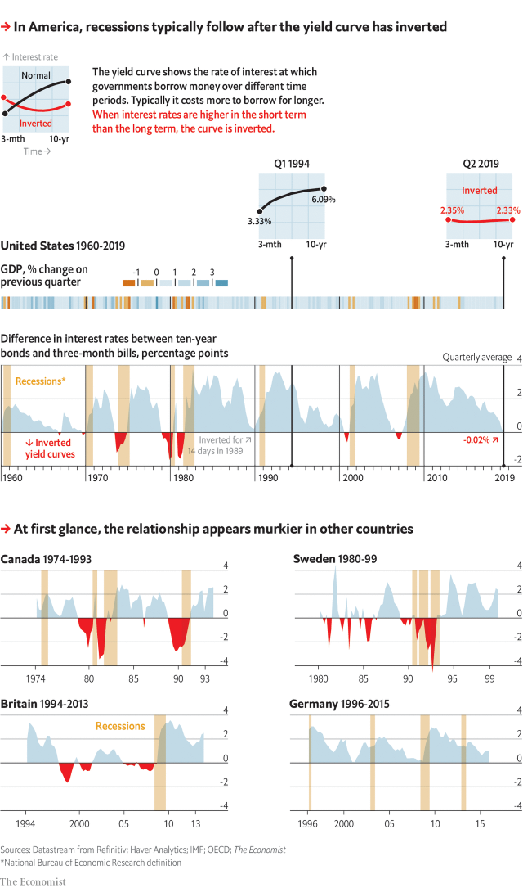

###### Economic forecasting

# Yield curves help predict economic growth across the rich world 

 

> print-edition iconPrint edition | Graphic detail | Jul 27th 2019 

MANY ECONOMISTS see the link between GDP growth and yield curves as a curious case of American exceptionalism. In general, interest rates rise as borrowing periods get longer, because the risks of default and rising inflation grow over time. But occasionally this pattern reverses, and short-term rates exceed long-term ones.  

 In America, such “inversions” have foreshadowed economic turmoil. For all eight recessions since 1960, three-month interest rates exceeded ten-year ones on at least one day during the previous year. The signal has sounded just one false alarm.  

 There are good reasons why yield-curve inversions tend to precede recessions. At the short end, when central banks raise rates, the curve flattens and the economy slows. On the long side, when a recession looms, investors expect that central banks will cut rates to soften the blow. That lowers long-term yields, flattening the curve.  

 This logic should apply everywhere. Yet only in America has the curve been a soothsayer. In a dataset of 16 other rich countries, reaching as far back as 1960, 51 of the 95 recessions were not preceded by an inversion during the previous two years. Moreover, the curve seems prone to crying wolf. On 63 occasions, these non-American economies kept growing despite inverted yield curves.  

 The yield curve’s failure to foresee recessions outside the United States has led some scholars to dismiss its predictive power as a fluke. With so few recessions in America, there is insufficient evidence to determine the strength of the relationship.  

 However, squashing yield curves and growth figures into a pair of binaries—inverted or not, and recession or not—leaves precious data on the cutting-room floor. A better test would check whether flattening curves foreshadow slowdowns, and steepening ones presage economic acceleration.  

 Seen through this lens, America is not an outlier. In 15 of 17 countries, changes in spreads correlated with changes in growth the next year. Overall, a one-percentage-point move in spreads predicted a 0.55-point change in growth in the same direction. The effect was strongest in Switzerland, at 1.1 points; America ranked third.  

 Economists do not appear to make full use of this well-known indicator. If they did, blending their predictions with yield-curve data would be no more accurate than using consensus projections alone. However, we found that consensus forecasts made a year in advance accounted for 57% of variance in GDP. In contrast, the blend explained 64%—a large improvement.  

 Changes in monetary-policy tools mean that the curve may lose some of its predictive power in future. Because central banks have bought long-dated bonds in quantitative-easing schemes, they now affect both sides of the yield curve directly. That makes long-term interest rates a less reliable proxy for market expectations.  

 But if history is any guide, America should expect a deceleration. Its curve has flattened by 1.1 points in the past year, implying growth will slow from 3% to 2%. ■ 

 Sources: Datastream from Refinitiv; Haver Analytics; IMF; OECD; The Economist 

 *National Bureau of Economic Research definition 

-- 

 单词注释:

1.graphic['græfik]:a. 生动的, 轮廓分明的, 绘画似的, 图解的 [计] 图形的 

2.Jul[]:七月 

3.economist[i:'kɒnәmist]:n. 经济学者, 经济家 [经] 经济学家 

4.exceptionalism[]:n. 例外论 

5.default[di'fɒ:lt]:n. 违约, 不履行责任, 缺席, 默认值 v. 疏怠职责, 缺席, 拖欠, 默认 [计] 默认; 默认值; 缺省值 

6.inflation[in'fleiʃәn]:n. 胀大, 夸张, 通货膨胀 [化] 充气吹胀; 膨胀 

7.inversion[in'vә:ʃәn]:n. 倒转, 倒置, 倒装 [化] 反转; 倒反; 反演; 转化 

8.foreshadow[fɒ:'ʃædәu]:vt. 成为前兆, 预示 

9.turmoil['tә:mɒil]:n. 骚动, 混乱 

10.recession[ri'seʃәn]:n. 后退, 凹处, 衰退, 归还 [医] 退缩 

11.precede[.pri:'si:d]:vt. 在...之前, 优于, 较...优先 vi. 在前面 

12.flatten['flætn]:vi. 使...不活跃, 变平 vt. 弄平, 打倒, 使失去光泽 

13.loom[lu:m]:n. 织布机, 若隐若现的景象 vi. 朦胧地出现, 隐约可见, 可怕地出现 

14.investor[in'vestә]:n. 投资者 [经] 投资者 

15.soften['sɒftn]:v. (使)变柔软, (使)变柔和 

16.soothsayer['su:θseiә]:n. 预言者, 占卜者, 预测未来者, 螳螂 

17.dataset[]:[电] 资料组 

18.prone[prәun]:a. 俯伏的, 面向下的, 有...倾向的 [医] 旋前的, 伏的, 俯的 

19.invert[in'vә:t]:a. 转化的 vt. 使反转, 使颠倒, 使转化 n. 颠倒的事物 [计] 倒置; 反转 

20.predictive[pri'diktiv]:a. 预言性的, 成为前兆的 

21.fluke[flu:k]:v. 侥幸成功 n. 锚爪, 侥幸, 偶然事故 

22.squash[skwɒʃ]:n. 挤压, 压碎的东西, 南瓜属植物, 拥挤的人群 vt. 压扁, 镇压, 压制 vi. 被压扁, 发溅泼声, 挤入 

23.datum['deitәm]:n. 论据, 材料, 资料, 已知数 [医] 材料, 资料, 论据 

24.slowdown['slәudaun]:n. 降低速度, 减速 

25.steepen['sti:pәn]:vt. 使陡峭 vi. 变陡峭 

26.presage['presidʒ]:n. 预感, 预兆, 预知 vt. 预示, 预言 vi. 预感, 预言 

27.len[]:n. 伦恩（男子名） 

28.outly[]:[网络] 欧特利 

29.correlate['kɒrәleit]:n. 有相互关系的东西, 相关物 vt. 使有相互关系 vi. 相关 

30.indicator['indikeitә]:n. 指示器, 指示剂, 指标 [计] 指示器 

31.prediction[pri'dikʃәn]:n. 预言, 预报 [化] 预测 

32.projection[prә'dʒekʃәn]:n. 发射, 计划, 突出部分, 设计, 推测 [计] 投影 

33.variance['vєәriәns]:n. 不一致, 变化, 变异, 分歧, 不和 [化] 方差; 变种 

34.les[lei]:abbr. 发射脱离系统（Launch Escape System） 

35.proxy['prɒksi]:n. 代理, 代理人, 委托书 [经] 代理人, 代表权, 授权书 

36.deceleration[.di:selә'reiʃәn]:n. 减速 [医] 减速[度] 

37.datastream[]:n. 数据流 [网络] 资料库；资料数据流；数据流或流数据 

38.haver['heivә]:vi. 瞎唠叨 n. 多嘴, 废话 n. 同志 

39.analytic[.ænә'litik]:a. 分析的, 善于分析的, 解析的 [医] 分析的 

40.IMF[]:国际货币基金组织 [经] 国际货币基金 

41.Oecd[]:[经] 已开发国家组织 

42.economist[i:'kɒnәmist]:n. 经济学者, 经济家 [经] 经济学家 

