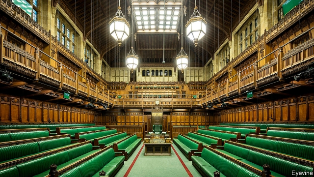
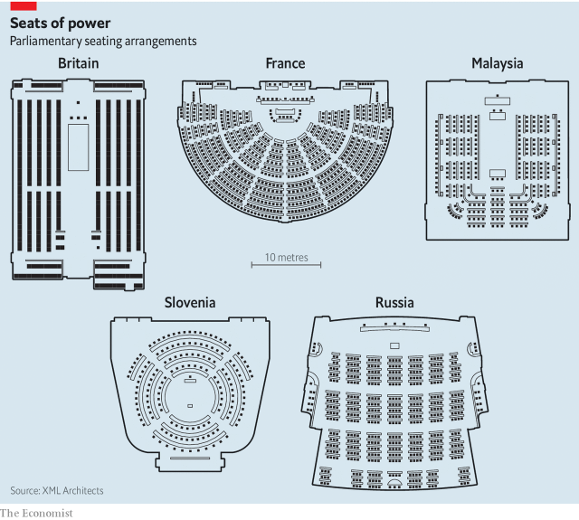

###### Where you sit and where you stand

# Parliaments get facelifts; but it is politics that really needs one 

 

> print-edition iconPrint edition | International | Jul 27th 2019 

BRITAIN’S MPs were debating tax reform in April when water from a broken pipe started pouring into the House of Commons. This was unsurprising. The Palace of Westminster, a mostly neo-Gothic building that was completed in 1870, had for years endured rusty plumbing, crumbling stonework and sparking electrics. MPs gamely continued the debate. But Justin Madders, a Labour MP, saw in the deluge a symbol, suggesting how “many people view Parliament as broken”. 

In a few years’ time MPs will have to relocate as the building is patched up, joining a long list of politicians in temporary digs. Earlier this year Canadian legislators moved out of the central parliamentary block for about ten years. Austrian MPs are meeting in the Hofburg Palace in Vienna while their building is renovated. Dutch politicians are preparing to vacate the 13th-century Binnenhof complex in the Hague. Parliamentarians in Egypt, Jamaica, Thailand and Uganda are all getting new homes. 

That should take care of the plumbing. And the new parliaments will be superior in other ways. Austria’s will have much more space available for public use. Jamaica’s new circular complex evokes an athletics stadium—a note of prestige in a sport-mad country. Members of Thailand’s House of Representatives will sit in a vaulted chamber named after the Buddhist Sun god. The “celestial ambience” will aid “vision, imagination and relaxation”, explains the government, hopefully. 

But the changes are much less striking than the similarities. With the possible exception of Jamaica, the new debating chambers will be arranged almost exactly like the old ones. Even the temporary homes are reassuringly familiar. Canada’s MPs are still sitting on their old benches; Britain’s temporary chamber will be in a different building, but as similar to the old one as possible. Andy Williamson of the Inter-Parliamentary Union, an organisation of parliaments, believes British politicians would create exactly the same chamber if they had to start again from scratch—“down to the colour of the panelling”. 

These countries are missing an opportunity to change how politics is done. Comparing parliamentary buildings around the world suggests that, though form does not determine function, it does influence it. Build a particular sort of debating chamber, seat people in a certain way, and you will encourage a political style. 

 

Two architects, Max Cohen de Lara and David Mulder van der Vegt, have divided the world’s parliamentary chambers into five types (see illustration). The House of Commons has opposing benches, as do former British colonies such as Jamaica and Uganda. American and most European politicians sit in a fan shape, known as a hemicycle. A third shape, which the architects call a horseshoe but which often looks more like the letter U, blends the first two shapes; Ireland and Kenya use it. A fourth type, the circle, is rarer, but used in the German state of North Rhine-Westphalia and the Welsh Senedd. China and Russia use a fifth layout, which looks like a theatre or a giant old-fashioned classroom (and can feel like both). 

Neither of the first two shapes was originally created for politics. The House of Commons is, in essence, a chapel. In the mid-16th century MPs started sitting in St Stephen’s Chapel. The nave became the parliamentary lobby and the choir stalls the benches; the Speaker sat where the altar had been. They kept the layout when they got a proper building in the 19th century. The most influential hemicycle is the French National Assembly, which began sitting in the Palais Bourbon in 1798. It was inspired by the School of Surgery in Paris. To stand at the lectern in a hemicycle is to take the place of a dissected cadaver. 

In 1941 the House of Commons was destroyed by bombs. Two years later the prime minister, Winston Churchill, argued for it to be rebuilt precisely as it had been. Political theorists like hemicycles, he explained. But they encourage politicians to slide sideways, from one political grouping to another. To keep parties strong and distinct, you need opposing benches. And the Commons must be small, Churchill argued—too small to fit all the MPs in. This heightens the drama and encourages quick exchanges. “Scenes and rows”, he said, “are better conducted at close quarters.” 

Britons carried this conviction overseas. William Ivor Shipley, the architect invited to design a parliament for newly independent Malaysia in 1963, objected to the horseshoe shape in which members of the Dewan Rakyat (the lower house) were then sitting. In a two-party system you need opposing benches, he maintained. 

Churchill overstated his case. Political parties are weak in some countries where politicians sit in hemicycles, such as Italy, but strong in others, such as Germany. As for disputes and rows, fan-shaped seating has not prevented Taiwan from developing a famously pugilistic parliament. And architecture alone cannot transform politics. Despite Shipley’s efforts, Malaysia did not develop two-party politics. Until an election last year, it was a single-coalition system. A decade ago the Dewan Rakyat quietly turned back into a horseshoe. 

The Scottish Parliament, which moved to its purpose-built home in Holyrood in 2004, was supposed to be a consensual sort of place. One way its architects tried to achieve that was by putting the politicians in a hemicycle. It has not worked. Holyrood has become just as tribal as Westminster, though the dividing line is different (the Scottish nationalists versus everyone else). 

But there is one big contrast, says Lord Foulkes, who has been both an MP and a member of the Scottish Parliament. In Holyrood, politicians tend to prepare and read speeches and even questions during First Minister’s Questions—a far cry from the knockabout of Prime Minister’s Questions in Westminster. Debates are stilted affairs. “There isn’t as much cut-and-thrust as in the House of Commons,” he says. 

Seating politicians in a hemicycle seems to encourage them to talk in a careful, ponderous way. Speeches are often delivered from a central lectern, which encourages people to drone on—so strict time limits are needed. The German Bundestag introduced a thrice-yearly Chancellor’s Questions in 2018. It wanted Prime Minister’s Questions but got something like a polite press conference, with questions and answers limited to 60 seconds. The Bundestag is enormous, which probably keeps things cool. When Australian MPs moved to a larger chamber in Canberra in 1988, one complained that members could no longer see the whites of their opponents’ eyes. 

With politics televised, seating also affects how parties are seen by the public. In hemicycles it is natural to think of politics in terms of wings and blocs. Arguments over seating are usually about who sits next to whom, and who is pushed to the edges. This year the Swedish People’s Party occupied the middle of Finland’s fan-shaped parliament, stranding the Finns Party on the far right, to its fury. In the German Bundestag, nobody wants to sit next to Alternative for Germany, a far-right party. In the House of Commons the battle is over prominence. In 2015 it saw a “seat war”, with Labour and the Scottish National Party fighting over sitting rights in a stretch of the opposition front bench. 

When political parties can decide who sits where, seating becomes a tool for enforcing discipline. In Malaysia’s now-U-shaped Dewan Rakyat, MPs sit in party blocs. Some seats are seen as worse than others. New MPs start far from the Speaker and are promoted to better seats if they behave themselves. 

The best proof that seating arrangements matter comes from a country that has tried to make it not matter at all. In Iceland’s small parliament, all seats not occupied by ministers are allocated through the drawing of lots. A member could end up sitting with allies or enemies, or both. So it is possible to test whether having neighbours from other parties makes a politician less beholden to his or her own tribe. 

Alessandro Saia, an economist at the University of Lausanne, finds that it does. Between 1991 and 2017 a politician who sat among others who did not hew to the party line was 30 percentage points more likely to rebel. Over time, Mr Saia finds, parliamentary neighbours even began to use similar words in speeches. Who sits next to you seems to matter more than who is in front or behind, perhaps because gossip is easier if you do not have to turn round. 

Hints of the same effect can be seen elsewhere. A paper by Nikolaj Harmon of the University of Copenhagen and others finds that members of party blocks in the European Parliament tend to vote like their neighbours, especially if both are women. That is not because like-minded people choose to sit together: most are seated alphabetically. It is probably not a coincidence that two Republicans who sit next to each other in the US Senate, Susan Collins and Lisa Murkowski, often vote together—and against the party line. 

So seating arrangements matter. What is less clear is whether any arrangement at all could endear politicians to voters. Even before the Brexit vote in 2016 paralysed Westminster, Britons believed there was a lot of room for improvement. They particularly dislike Prime Minister’s Questions, where the Commons is most shouty and adversarial. But nowhere is politics working splendidly. The Pew Research Centre’s latest survey of 27 democracies—some more perfect than others—finds that 51% of people think democracy is not working well; in 19 of those countries, pessimism grew between 2017 and 2018. Americans’ opinions of Washington have been on the slide since 2001. Arrange people differently, and you might merely give people something different to complain about.■ 

