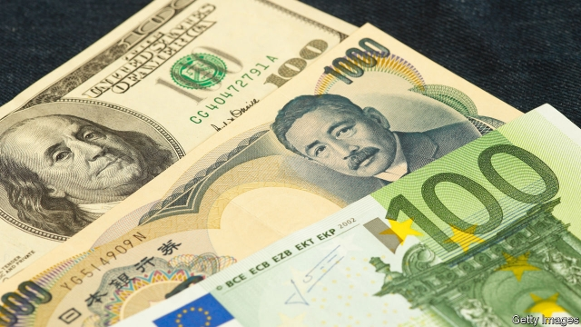

###### Currency wars

# America should resist the temptation to weaken the dollar 

 

> print-edition iconPrint edition | Leaders | Jul 27th 2019 

USUALLY THE pre-eminence of the dollar is a source of pride for whoever occupies the White House. But for weeks President Donald Trump has been grumbling about the consequences of its status and its current strength. He sees other countries’ trade surpluses with America as evidence of a “big currency manipulation game” (see article). He has dropped hints that it is a game that America ought to play, too. If that hurts foreign holders of dollars, so be it. 

So far this is mostly a war of words, but it could easily escalate into something worse. If America concludes that its trade partners are using unfair tricks to weaken their currencies, it may claim the right to do the same. There is even speculation that direct intervention to weaken the dollar might be countenanced. A cold-eyed assessment says this would involve lots of trouble for at best a transient benefit. It would also undermine one of America’s key assets—its open capital markets. 

Many of the conditions for a currency war are in place. The world economy is sluggish. The IMF this week revised down further its forecasts for GDP growth in 2019. Interest rates in the rich world are low and cannot fall much lower. There are real or imagined constraints on the use of fiscal stimulus. As a result, a cheap currency is one of the few ways left to gin up the economy. 

The shock of intervention would probably take the dollar lower—for a while, at least. But interventions have a better chance of working in the longer term if the currency is way out of whack. That is not obviously the case. Currencies roughly reflect economies’ relative strengths. America’s has proved the most reliably resilient. Yields on Treasuries are still the highest in the rich world. Global investors look to America’s capital markets as the place to find the digital firms of the future, rather than to Europe, whose bourses are heavy with banks and carmakers. 

Without a surge in GDP growth outside America, it would probably take a hefty intervention to keep the dollar down. Standard Chartered, a bank, puts the required commitment at $200bn-400bn. Printing dollars to sell would complicate monetary policy, but that is a trivial objection. The Federal Reserve is set to cut interest rates in any event (which might itself weaken the dollar a bit). A bigger headache is which currencies to buy. It is hard to put a lot of money to work quickly in non-dollar assets. The most liquid markets are in euros and yen, where the safest bonds have negative yields. Of those, the one large market with positive yields is Italy. If America bought Italy’s bonds, it would help cut its borrowing costs—an odd kind of punishment. 

An advantage that America has over China, its strategic rival, is its open capital markets. A one-sided intervention to weaken the dollar would undermine that. Foreign investors would think twice about betting on dollar assets if Washington reserved the right to bet against them when it sees fit. Though Mr Trump is an unlikely history student, it may be wise for America to recall Britain’s dilemma in 1967. It had dawned on Britain that having one of the world’s main currencies was at best a mixed blessing. Allowing the pound to weaken would be a salve to an economy that had trailed the rest of Europe, but it would also hurt the many foreign allies who kept their reserves in sterling. When devaluation came, there were feelings of relief but also of regret. These days sterling is a shadow of its former self. 

The best remedy for the dollar’s strength is stronger economic growth outside America. Fiscal stimulus across the euro zone would help, of course. But one policy is in the gift of the White House. An end to the trade wars would lift the fog over the world economy. Sue for trade peace, Mr Trump—and watch the yuan and the euro rally against the dollar.■ 
<<<<<<< HEAD

-- 

 单词注释:

1.Jul[]:七月 

2.grumble['grʌmbl]:n. 怨言, 满腹牢骚 vi. 抱怨, 发牢骚, 发隆隆声 vt. 抱怨 

3.statu[]:[网络] 状态查看；雕像；特级雪花白 

4.surpluse[]:[网络] 尚余 

5.manipulation[mә.nipju'leiʃәn]:n. 操作, 处理 [化] (用手)操作; 使用 

6.holder['hәuldә]:n. 持有人, 所有人, 支持物 [化] 夹持器; 夹具; 贮罐 

7.escalate['eskәleit]:vi. 逐步扩大, 逐步升高, 逐步增强 vt. 使逐步上升 

8.speculation[.spekju'leiʃәn]:n. 沉思, 推测, 投机 [经] 投机交易, 买空卖空 

9.intervention[.intә'venʃәn]:n. 插入, 介入, 调停 [经] 干预 

10.countenance['kauntәnәns]:n. 面容, 面部表情, 支持, 镇定 

11.transient['trænziәnt]:n. 瞬, 短期居留者, 过境鸟, 瞬变现象 a. 短暂的, 易变的, 瞬变的, 路过的 [计] 瞬变过程; 过渡过程; 过渡的; 瞬变的; 瞬时峰值电压 

12.undermine[.ʌndә'main]:vt. 在...下面挖, 渐渐破坏, 暗地里破坏 [法] 暗中破坏, 以阴谋中伤伤害 

13.sluggish['slʌgiʃ]:a. 偷懒的, 懒惰的, 迟钝的 [经] 萧条的, 呆滞的 

14.IMF[]:国际货币基金组织 [经] 国际货币基金 

15.cannot['kænɒt]:aux. 无法, 不能 

16.constraint[kәn'streint]:n. 强制, 约束 [计] 约束 

17.fiscal['fiskәl]:a. 财政的, 国库的 [经] 财政上的, 会计的, 国库的 

18.stimulus['stimjulәs]:n. 刺激, 激励, 刺激品 [医] 刺激特, 刺激 

19.gin[dʒin]:n. 杜松子酒, 轧棉机, 陷阱 vt. 轧棉, 用陷阱捕 

20.whack[hwæk]:vt. 猛击, 重打, 削减 vi. 重击 n. 重击, 重打 

21.reliably[ri'laiәbli]:adv. 可靠地, 可信赖地 

22.resilient[ri'ziliәnt]:a. 弹回的, 有弹力的 [医] 回弹的, 回能的 

23.treasury['treʒәri]:n. 国库, 宝库, 财政部, 国库券 [经] 库存, 国库, 金库 

24.investor[in'vestә]:n. 投资者 [经] 投资者 

25.bourse[buәs]:n. 交易所 [医] 囊状组织 

26.carmaker['kɑ:,meikә(r)]:n. 汽车制造商 

27.surge[sә:dʒ]:n. 巨涌, 汹涌, 澎湃 vi. 汹涌, 澎湃, 颠簸, 猛冲, 突然放松 vt. 使汹涌奔腾, 急放 [计] 电压尖峰 

28.hefty['hefti]:a. 重的, 肌肉发达的 

29.charter['tʃɑ:tә]:n. 特许状, 执照, 宪章 vt. 特许, 发给特许执照 

30.monetary['mʌnitәri]:a. 货币的, 金钱的 [经] 货币的, 金融的 

31.trivial['tiviәl]:a. 琐碎的, 不重要的, 轻微的, 平常的 

32.quickly['kwikli]:adv. 很快地 

33.asset['æset]:n. 资产, 有益的东西 

34.euro['juәrәu]:n. 欧元（欧盟的统一货币单位） 

35.yen[jen]:n. 日元(日本货币单位), 渴望, 嗜好 vi. 渴望 

36.Washington['wɒʃiŋtn]:n. 华盛顿 

37.salve[sælv]:n. 油膏, 药膏, 安慰, 奉承话 vt. 涂油膏于, 安慰, 缓和, 抢救, 打捞 

38.ally['ælai. ә'lai]:n. 同盟者, 同盟国, 助手 vt. 使联盟, 使联合, 使有关系 vi. 结盟 

39.sterling['stә:liŋ]:n. 英国货币, 标准纯银 a. 英国货币的, 标准纯银的, 含标准成分的 

40.devaluation[,di:vælju'eiʃәn]:n. 降低价值, 贬值 [经] 贬值 

41.fiscal['fiskәl]:a. 财政的, 国库的 [经] 财政上的, 会计的, 国库的 

42.sue[su:]:vt. 控告, 起诉, 请求 vi. 提出诉讼, 提出请求 

43.rally['ræli]:n. 重振旗鼓, 集合, 群众集会, 跌停回升 v. 重整旗鼓, 集合, 恢复精神, 团结, 挖苦, 嘲笑 
=======
>>>>>>> 50f1fbac684ef65c788c2c3b1cb359dd2a904378

