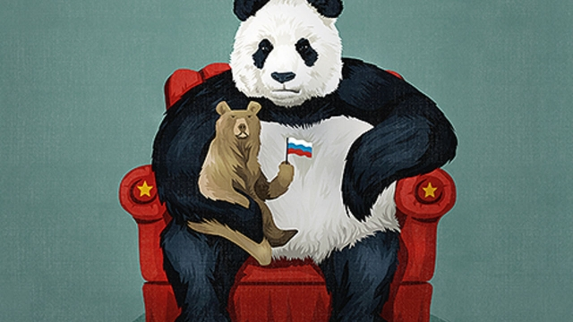

###### Russia and China

# Partnership is much better for China than it is for Russia 

 

> print-edition iconPrint edition | Leaders | Jul 27th 2019 

IT IS THE love triangle of global politics. Since the second world war, China, Russia and the United States have repeatedly swapped partners. The collapse of the Sino-Soviet pact after the death of Josef Stalin was followed by Richard Nixon’s visit to China in 1972 and Mikhail Gorbachev’s detente with China 30 years ago. Today’s pairing, between Vladimir Putin and Xi Jinping, was cemented in 2014 after Russia annexed Crimea. In each case the country that was left on its own has always seemed to pay a price, by being stretched militarily and diplomatically. 

This time is different. Though America is out in the cold, the price is falling chiefly on Russia. China dominates every aspect of the two countries’ partnership. Its economy is six times larger (at purchasing-power parity) and its power is growing, even as Russia’s fades. What seemed a brilliant way for Mr Putin to turn his back on the West and magnify Russia’s influence is looking like a trap that his country will find hard to escape. Far from being an equal partner, Russia is evolving into a Chinese tributary. 

That may seem a harsh judgment. Russia is still a nuclear-weapons state with a permanent seat on the UN Security Council. It has modernised its armed forces and, as in Syria, is not afraid to use them. This week Russian and Chinese warplanes conducted what appeared to be a joint air patrol for the first time, causing alarm when South Korea said a Russian plane had intruded into its airspace (see article). 

But the real news is how rapidly Russia is becoming dependent on its giant neighbour (see article). China is a vital market for Russian raw materials: Rosneft, Russia’s national oil company, depends on Chinese financing and is increasingly diverting its oil to China. As Russia seeks to evade the hegemony of the dollar, the yuan is becoming a bigger part of its foreign-currency reserves (the share of dollars fell by half to 23% during 2018, while the yuan’s share grew from 3% to 14%). China supplies vital components for Russia’s advanced weapons systems. And China is the source of the networking and security gear that Mr Putin needs to control his people. Last month Russia struck a deal with Huawei, a Chinese telecoms firm distrusted by America, to develop 5G equipment—thus rooting Russia firmly in China’s half of the splinternet. 

This suits China just fine. It wants a lasting friendship with Russia, if only to secure its northern border, the scene of clashes in 1969, and a source of worry in the 1990s when Russia looked as if it might drift into the West’s orbit. Russia also serves as an enthusiastic vanguard in China’s campaign to puncture Western ideas of universal human rights and democracy, which both countries see as an incitement to “colour revolutions”. 

Mr Putin can point to several arguments for his partnership with China, in addition to their joint hostility to the liberal project. One is expediency. Western sanctions, imposed after his annexation of Crimea, the meddling in American elections in 2016 and the lethal use of a nerve agent in Britain two years later, have left Russia without many alternatives. Mr Xi has also given Russia cover for its military action in Syria and, to some extent, Crimea. And, in contrast to the end of the 17th century, when Peter the Great looked to Europe as the wellspring of progress, Mr Putin can plausibly argue that the future now belongs to China and its system of state capitalism. 

However, Mr Putin is mistaken. For a start, the Russian version of state capitalism is a rent-seeking, productivity-sapping licence for the clique that surrounds him to steal freely from the national coffers—which is one reason why Chinese investment in Russia is rather limited. There is also a contradiction between Mr Putin’s claim to be restoring Russian greatness and the increasingly obvious reality of its subordinate role to China. This creates tension in Central Asia. Because stability in the region is important for China’s domestic security—it wants Central Asia to keep Islamic extremism at bay—the People’s Liberation Army is stationing troops in Tajikistan and staging exercises there, without consulting Russia. 

And, at some level, the aims of Russia and China diverge. There is a limit to how much ordinary Russians will forgo Western freedoms (see article). If the regime holds on to power by means of Chinese technology, it will feed popular anger towards China and its Russian clients. 

Who can say when the strains will show? Imagine that Mr Putin chooses to step down in 2024, when the constitution says he must, and that his successor tries to mark the change by distancing Russia from China and turning towards Europe. Only then will it become clear how deep China’s influence runs and how much pressure it is prepared to exert to retain its sway. Russia’s next president may find that the country has lost its room for manoeuvre. 

Does this mean that the rest of the world—especially the West—should seek to prise Russia from China’s embrace, before it is too late? That idea will tempt those diplomats and analysts who think Russia is too important to alienate. But it seems unlikely. America does not suffer from the Xi-Putin alignment today as it would have done in the cold war. Although Russia and China do indeed undermine the West’s notion of universal values, with President Donald Trump in the White House that doctrine is, alas, hardly being applied universally in any case. 

What is more, China’s influence over Russia has compensations. An angry declining power like Russia is dangerous; it may feel tempted to lash out to show it is still a force to be reckoned with, by bullying Belarus, say, or by stoking the old fears of Chinese expansion into Siberia. But China has no appetite for international crises, unless they are of its own devising. As Russia’s partner, China can serve as a source of reassurance along their joint border, and temper Russia’s excesses around the world. 

Rather than railing against Russia or trying to woo it back, the West should point out its subordination and wait. Sooner or later, a President Alexei Navalny or someone like him will look westwards once again. That is when Russia will most need Western help. And that is when the man or woman in the Oval Office should emulate Nixon—and go to Moscow. ■ 

-- 

 单词注释:

1.partnership['pɑ:tnәʃip]:n. 合伙, 合股, 合作关系 [经] 合伙(合作)关系, 全体合伙人 

2.Jul[]:七月 

3.politic['pɒlitik]:a. 精明的, 明智的, 策略的 

4.pact[pækt]:n. 契约, 协定, 条约 [化] 合同 

5.Josef[]:n. 约瑟夫（人名） 

6.stalin['stɑ:lin]:n. 斯大林（前苏联领导人） 

7.richard['ritʃәd]:n. 理查德（男子名） 

8.Mikhail[]:米哈伊尔（人名） 

9.detente[]:n. (国际关系)缓和 [法] 缓和, 和好 

10.Vladimir[vlɑ'dimɪr]:n. 弗拉基米尔（古罗斯弗拉基米尔-苏兹达里公国的古都） 

11.putin['putin]:n. 普京（人名） 

12.annex[ә'neks]:n. 附加物, 附属建筑物 vt. 附加, 盖(印), 并吞 

13.Crimea[krai'miә]:n. 克里米亚, 克里米亚半岛 

14.alway['ɔ:lwei]:adv. 永远；总是（等于always） 

15.militarily['militərili; ,mili'teәrili]:adv. 在军事上 

16.diplomatically[,diplә'mætikәli]:adv. 在外交上, 靠外交途径, 凭外交手腕 

17.chiefly['tʃi:fli]:adv. 主要地 

18.partnership['pɑ:tnәʃip]:n. 合伙, 合股, 合作关系 [经] 合伙(合作)关系, 全体合伙人 

19.parity['pærәti]:n. 同等, 同位, 平价, 奇偶性 [计] 奇偶性 

20.magnify['mægnifai]:vt. 放大, 扩大, 赞美, 夸大 vi. 有放大能力 

21.tributary['tribjutәri]:a. 支流的, 纳贡的, 从属的, 辅助的 n. 支流, 纳贡者, 属国 

22.judgment['dʒʌdʒmәnt]:n. 裁判, 宣告, 判决书 [医] 判断 

23.UN[ʌn]:pron. 家伙, 东西 [经] 联合国 

24.modernise['mɔdәnaiz]:vt.vi. (使)现代化, (使)适应现代需要 vi. 用现代方法 

25.Syria['siriә]:n. 叙利亚 [经] 叙利亚 

26.warplane['wɒ:plein]:n. 军用飞机 

27.patrol[pә'trәul]:n. 巡逻, 巡逻员, 侦察队 v. 巡逻, 巡视 

28.Korea[kә'riә]:n. 朝鲜, 韩国 

29.intrude[in'tru:d]:vi. 闯入, 侵入 vt. 强加于 

30.rosneft[]:[网络] 俄罗斯石油公司；俄罗斯国家石油公司；俄罗斯石油工业公司 

31.divert[dai'vә:t]:vt. 转移, 使欢娱 vi. 转移 

32.evade[i'veid]:v. (巧妙地)逃脱, 规避, 逃避 

33.hegemony[hi:'dʒemәni]:n. 霸权, 领导权, 支配权, 拥有支配权的政府 [法] 霸权, 盟主权 

34.huawei[]: 华为 

35.telecom['telәkɔm]:telecommunication 电信 

36.distrust[dis'trʌst]:n. 不信任 vt. 不信任 

37.splinternet[]:[网络] 分割网；联络网 

38.clash[klæʃ]:n. 冲突, 撞击声, 抵触 vi. 冲突, 抵触 vt. 使发出撞击声 [计] 对撞 

39.vanguard['vængɑ:d]:n. 前锋, 先锋, 先驱 

40.puncture['pʌŋktʃә]:n. 刺痕, 穿刺 vt. 刺穿, 刺, 揭穿 vi. 被刺穿 

41.incitement[in'saitmәnt]:[法] 煽动, 刺激, 怂恿犯罪 

42.hostility[hɒs'tiliti]:n. 敌意, 敌对, 反对 

43.expediency[ik'spi:djәnsi]:n. 权宜, 方便, 私利 

44.sanction['sæŋkʃәn]:n. 核准, 制裁, 处罚, 约束力 vt. 制定制裁规则, 认可, 核准, 同意 

45.annexation[ænek'seiʃәn]:n. 合并, 附加, 附加物 [法] 兼并, 侵吞, 附加物 

46.meddle['medl]:vi. 干涉, 干预, 擅自摸弄 [法] 干预, 插手, 弄乱 

47.lethal['li:θәl]:a. 致命的 n. 致死因子 

48.peter['pi:tә]:vi. 逐渐消失, 逐渐减少 

49.wellspring['welspriŋ]:n. 水源, 泉源 

50.plausibly[ˌplɔ:zəblɪ]:adv. 似真地 

51.capitalism['kæpitәlizәm]:n. 资本主义 [经] 资本主义 

52.clique[kli:k]:n. 派系, 集团 vi. 结党 [计] 集团型 

53.greatness['greitnis]:n. 大, 巨大, 广大 

54.subordinate[sә'bɒ:dnit]:n. 属下, 附属物 a. 下级的, 次要的, 附属的 vt. 使居下位, 使服从 

55.Islamic[iz'læmik]:a. 伊斯兰教的, 穆斯林的 

56.extremism[ik'stri:mizm]:n. 极端倾向, 极端论, 过激主义 

57.Tajikistan[tɑ:dʒiki'stɑ:n]:n. 塔吉克斯坦 

58.diverge[dai'vә:dʒ]:vi. 分歧, 岔开 vt. 使岔开 

59.forgo[fɒ:'gәu]:vt. 摒绝, 放弃 

60.regime[rei'ʒi:m]:n. 政权, 当权期间, 政体, 社会制度, 体制, 情态 [医] 制度, 生活制度 

61.client['klaiәnt]:n. 客户, 顾客, 委托人 [计] 客户, 客户机, 客户机程序 

62.successor[sәk'sesә]:n. 继承者, 接任者 [计] 后继 

63.manoeuvre[mә'nu:vә]:n. 调遣, 演习, 策略 vi. 调动, 演习, 用策略 vt. 调动, 操纵 

64.prise[praiz]:vt. 撬, 撬开, 撬动 

65.diplomat['diplәmæt]:n. 外交官, 有外交手腕的人 [法] 外交家, 外交官, 有权谋的人 

66.analyst['ænәlist]:n. 分析者, 精神分析学家 [化] 分析员; 化验员 

67.alienate['eiljәneit]:vt. 使疏远, 离间, 转让 [法] 转让, 让与, 疏远 

68.alignment[ә'lainmәnt]:n. 队列, 结盟, 校正 [计] 校准; 对齐; 对准 

69.undermine[.ʌndә'main]:vt. 在...下面挖, 渐渐破坏, 暗地里破坏 [法] 暗中破坏, 以阴谋中伤伤害 

70.doctrine['dɒktrin]:n. 教条, 学说 [医] 学说 

71.ala['eilә]:n. 翼, 翅 [化] 丙氨酸 

72.universally[ju:ni'v\\:sәli]:adv. 宇宙, 全世界, 普遍, 一般, 普通, 全体, 一致, 通用, 万能, 广用, 广泛 

73.compensation[.kɒmpen'seiʃәn]:n. 补偿, 赔偿金, 工资 [医] 代偿(机能), 补偿 

74.lash[læʃ]:n. 鞭子, 鞭打, 睫毛, 责骂, 讽刺 vt. 鞭打, 摆动, 扎捆, 冲击, 讽刺, 煽动 vi. 冲洗, 鞭打, 责骂 

75.reckon['rekәn]:vt. 计算, 总计, 估计, 认为, 猜想 vi. 数, 计算, 估计, 依赖, 料想 

76.bully['buli]:n. 欺凌弱小者, 土霸 vt. 威胁, 恐吓, 欺负 vi. 欺负 a. 特好的, 第一流的 adv. 十分 

77.Belarus['belərəs]:n. 白俄罗斯, 白俄罗斯共和国 

78.stoke[stәuk]:v. 司炉, (使)大吃 

79.siberia[sai'biәriә]:n. 西伯利亚 

80.reassurance[.ri:ә'ʃurәns]:n. 安心, 放心, 再保证 

81.railing['reiliŋ]:n. 扶手, 栏杆, 抱怨 [电] 高重回率的雷达脉冲排挤 

82.subordination[sә.bɒ:di'neiʃәn]:n. 下级地位, 隶属, 第二位 [医] 附属, 从属 

83.Alexei[]:n. (Alexei)人名；(捷、罗、俄)阿列克谢 

84.Navalny[]:[网络] 纳瓦尔内；瓦尔尼 

85.emulate['emjuleit]:vt. 效法, 尽力赶上, 同...竞争 [计] 仿真 

