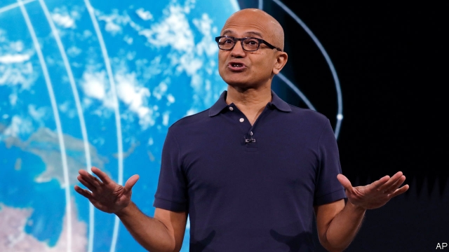
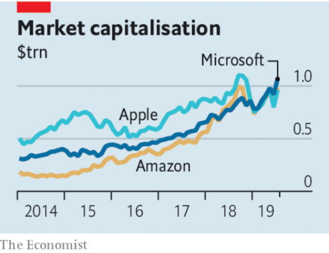

###### Rebooted

# What Microsoft’s revival can teach other tech companies 

 

> print-edition iconPrint edition | Leaders | Jul 27th 2019 

IT MUST FEEL good to be back on top—and this time, almost liked. Twenty years ago Microsoft was considered an evil empire, scheming for domination and embroiled in a bruising antitrust battle with America’s Justice Department. Five years ago, having dozed through the rise of social media and smartphones, it was derided as a doddery has-been. Now, after several stellar quarters—this month it reported revenue of $33.7bn, up by 12% year on year—Microsoft is once again the world’s most valuable listed company, worth over $1trn. How did Satya Nadella, the boss since 2014, pull off this comeback? And with American trustbusters starting on a new review (see article) of “search, social media, and some retail services online”—ie, Google, Facebook and Amazon—what can the other tech giants learn from Microsoft’s experience? 

First, be prepared to look beyond the golden goose. Microsoft missed social networks and smartphones because of its obsession with Windows, the operating system that was its main moneyspinner. One of Mr Nadella’s most important acts after taking the helm was to deprioritise Windows. More important, he also bet big on the “cloud”—just as firms started getting comfortable with renting computing power. In the past quarter revenues at Azure, Microsoft’s cloud division, grew by 68% year on year, and it now has nearly half the market share of Amazon Web Services, the industry leader. 

Second, rapaciousness may not pay. Mr Nadella has changed Microsoft’s culture as well as its technological focus. The cult of Windows ordained that customers and partners be squeezed and rivals dispatched, often by questionable means, which led to the antitrust showdown. Mr Nadella’s predecessor called Linux and other open-source software a “cancer”. But today that rival operating system is more widely used on Azure than Windows. And many companies see Microsoft as a much less threatening technology partner than Amazon, which is always looking for new industries to enter and disrupt. 

 

Third, work with regulators rather than try to outwit or overwhelm them. From the start Microsoft designed Azure in such a way that it could accommodate local data-protection laws. Its president and chief legal officer, Brad Smith, has been the source of many policy proposals, such as a “Digital Geneva Convention” to protect people from cyber-attacks by nation-states. He is also behind Microsoft’s comparatively cautious use of artificial intelligence, and calls for oversight of facial recognition. The firm has been relatively untouched by the current backlash against tech firms, and is less vulnerable to new regulation. 

True, missing the boat on social media means thorny matters such as content moderation pose greater difficulties for Facebook and Google. Still, others would do well to follow Microsoft’s lead. Apple has championed its customers’ privacy, but its treatment of competitors’ services in its app store may soon land it in antitrust trouble. Facebook and Google have started to recognise that with great power comes great responsibility, but each has yet to find its equivalent of Azure, a new business model beyond its original golden goose. Amazon, in its ambition and culture, most resembles the old Microsoft. 

Even a reformed monopolist demands scrutiny. It should not be forgotten that Microsoft got where it is today in part through rapacity. Critics argue that in its battle with Slack, a corporate-messaging service which competes with a Microsoft product, it is up to some of its old tricks. A growing number of women at the firm are complaining about sexual harassment and discrimination. The new Microsoft is far from perfect. But it has learned some lessons that other tech giants should heed. ■ 
<<<<<<< HEAD

-- 

 单词注释:

1.reboot[ri:'bu:t]:[计] 重新启动 

2.revival[ri'vaivl]:n. 复兴, 复活, 恢复精神, 苏醒 [医] 复苏, 回生, 精神重振 

3.tech[tek]:n. 技术学院或学校 

4.Jul[]:七月 

5.Microsoft[]:n. (美国)微软公司 [电] 微软公司 

6.domination[.dɒmi'neiʃәn]:n. 支配, 控制, 管辖 

7.embroil[im'brɒil]:vt. 使卷入, 牵连 

8.antitrust[.ænti'trʌst]:a. 反托拉斯的 [法] 反托拉斯的 

9.doze[dәuz]:vi. 打瞌睡, 假寐 vt. 打瞌睡度过 n. 瞌睡 

10.smartphones[]: 智能手机（smartphone的复数） 

11.deride[di'raid]:vt. 嘲弄, 嘲笑 

12.doddery['dɔdәri]:a. 衰老的, 蹒跚的, 老迈的, 老态龙钟的, 衰迈的 

13.stellar['stelә]:a. 星的, 似星的, 星球的, 主要的 

14.satya[]:(人名）萨蒂亚 

15.Nadella[]:[网络] 纳德拉；法国；精密轴承 

16.trustbuster['trʌstbʌstә]:n. 要求解散托拉斯的人 

17.google[]:谷歌；搜索引擎技术；谷歌公司 

18.facebook[]:n. 脸谱网 

19.obsession[әb'seʃәn]:n. 困扰, 困扰人的情绪 [医] 强迫观念 

20.moneyspinner[]:un. (传说爬到身上就会使人走运的)财喜小蜘蛛；投机[放债]发财的人 [网络] 赚钱机器 

21.helm[helm]:n. 舵, 驾驶盘, 枢机, 头盔 vt. 给...掌舵, 指挥, 给...戴头盔 

22.deprioritise[]:[网络] 取消优先权 

23.computing[kәm'pju:tiŋ]:[计] 计算 

24.azure['æʒә]:n. 天蓝色, 碧空 a. 蔚蓝的 

25.amazon['æmәzɒn]:n. 亚马孙河 [医] 无乳腺者 

26.rapaciousness[rәˊpeiʃәsnis]:n. 强夺;贪婪 

27.technological[.teknә'lɒdʒikl]:a. 技术的 [经] 工艺的, 技术的 

28.cult[kʌlt]:n. 膜拜, 礼拜式, 祭仪, 一群信徒 [医] 迷信, 巫术 

29.ordain[ɒ:'dein]:vt. 注定, 规定, 任命 vi. 颁布命令 

30.dispatch[dis'pætʃ]:vt. 派遣 n. 派遣, 急件 [计] 调度 

31.questionable['kwestʃәnәbl]:a. 可疑的 [法] 可疑的, 有问题的, 不可靠的 

32.showdown['ʃәudaun]:n. 摊牌, 暴露, 紧要关头 

33.predecessor[.predi'sesә]:n. 前任, 先辈, 前身 [医] 初牙, 前辈, 祖先 

34.linux[]:n. 一种计算机操作系统 [网络] 一种可以免费使用和自由传播的类 UNIX 操作系统，最初由 Linus Torvalds 开发 

35.les[lei]:abbr. 发射脱离系统（Launch Escape System） 

36.alway['ɔ:lwei]:adv. 永远；总是（等于always） 

37.disrupt[dis'rʌpt]:a. 分裂的, 中断的 vt. 使分裂, 使瓦解 

38.regulator['regjuleitә]:n. 调整者, 校准者, 校准器, 调整器, 标准钟 [化] 调节剂; 调节器 

39.outwit[.aut'wit]:vt. 瞒骗, 以智取胜 

40.overwhelm[.әuvә'hwelm]:vt. 淹没, 受打击, 制服, 压倒, 使不知所措 [法] 打翻, 倾覆, 覆盖 

41.brad[bræd]:n. 角钉, 曲头钉 

42.smith[smiθ]:n. 铁匠, 金属品工匠 [机] 锻造工, 上手 

43.Geneva[dʒi'ni:vә]:n. 日内瓦, (荷兰)杜松子酒 

44.oversight['әuvәsait]:n. 勘漏, 失察, 失败, 照料 [经] 监督权 

45.untouched[.ʌn'tʌtʃt]:a. 未触摸过的, 未改变的, 未受影响的 

46.backlash['bæklæʃ]:n. 后冲, 强烈反对 [电] 反撞, 逆栅流 

47.vulnerable['vʌlnәrәbl]:a. 易受伤害的, 有弱点的, 易受影响的, 脆弱的, 成局的 [医] 易损的 

48.thorny['θɒ:ni]:a. 多刺的, 令人苦恼的 

49.moderation[.mɒdә'reiʃәn]:n. 缓和, 适度, 温和 [化] 慢化 

50.privacy['praivәsi]:n. 隐私, 隐居, 秘密 [计] 个人保密权 

51.APP[]:[计] 应用, 应用程序; 相联并行处理器 

52.monopolist[mɒ'nɒpәlist]:n. 垄断者, 专卖者, 垄断论者 [经] 垄断者, 专利者 

53.scrutiny['skru:tini]:n. 细看, 仔细检查, 监视, 选票检查 [经] 复查, 评核, 仔细检查 

54.rapacity[rә'pæsiti]:n. 抢夺, 贪欲, 贪婪 [法] 强取, 掠夺, 掠夺性 

55.slack[slæk]:n. 松弛, 松懈, 淡季, 闲散, 家常裤 a. 松弛的, 不流畅的, 疏忽的, 无力的, 呆滞的, 软弱的, 漏水的 adv. 马虎地, 缓慢地 vt. 放松, 使缓慢 vi. 松懈, 减弱, 松弛 

56.harassment['hærәsmәnt]:n. 困扰, 烦扰, 烦恼 [法] 折磨, 骚扰, 侵扰 

57.heed[hi:d]:n. 注意, 留心 v. 注意, 留心 
=======
>>>>>>> 50f1fbac684ef65c788c2c3b1cb359dd2a904378

