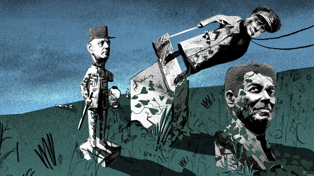
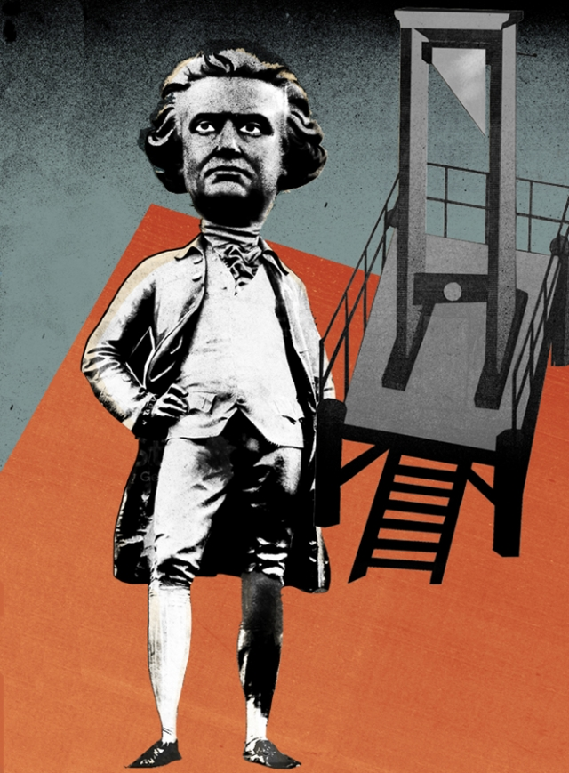

###### On conservatism, taxing assets, Uzbekistan, Nazi operations, work

# Letters to the editor 

> Jul 27th 2019 

 

If, as you say, conservatism is in crisis, it is a crisis of its own making (“The self-preservation society”, July 6th). For the past 50 years at least, conservatives in America and Britain have engaged in a deliberate policy of dog-whistling, pandering, and often actively reaching out to nativists, racists, misogynists, anti-Semites, xenophobes and homophobes, echoing their words, adopting their ideas and furthering their influence. They didn’t merely tolerate these people; they encouraged them and recruited them. 

From Enoch Powell’s Rivers of Blood speech to Richard Nixon’s Southern Strategy, from Ronald Reagan’s courting of the “moral majority” to Margaret Thatcher speaking of Britain being “swamped by people with a different culture”, conservative politicians tacitly supported odious ideas, bringing those ideas ever more into the political mainstream. A philosophy once merely suspicious of change became one that resented and resisted change. Parties once known for their tolerance became identified with ethnic nationalism. This was no accident; it was the result of decades of deliberate policy. The ascent of such figures as Donald Trump and Nigel Farage is the natural consequence. 

Because of a desire to retain power, conservatives pandered to the worst elements in our societies. Now they pretend to be shocked that those elements have taken over their parties. It is hard to have any sympathy for them. 

DAVID HOWARDMilwaukee, Wisconsin 

The abandonment of exchange controls after Thatcher’s election victory in 1979, the dramatic deindustrialisation and tidal wave of unemployment that followed and the subsequent mass privatisation of public utilities were components of an economic revolution that was neoliberal in theory, not conservative. It was Thatcher, initially a Europhile (but edging towards Euroscepticism in her later years) who helped to launch this neoliberal revolution. Its architects then set about Europe, inspiring the Single European Act, the single currency and free movement. In Britain there has since been a seamless procession of neoliberal leaders in the main parties, all high priests of the new faith. 

This was all opposite to the tenets of Michael Oakeshott’s conservatism, which you cited: “family, church, tradition, local association to control change and slow it down” and, most significantly, the perils of sweeping away institutions. 

KELVIN HOPKINS, MPHouse of CommonsLondon 

 

Given Oakeshott’s definition of conservatism, isn’t it possible that the current populist spasm is an understandable response to extreme circumstances rather than, as you claim, a repudiation of its history? Globalisation, though inevitable and beneficial, brings the unfamiliar and the distant rather closer than many feel comfortable with. On its own this would not be enough to cause the ructions we are experiencing, but combine it with wage stagnation, austerity and a blinkered repudiation of the progressive-liberal tools needed to improve things, then the necessary conditions for a great disruption are in place. 

PHIL BADGERBarnsley, South Yorkshire 

I have never met a conservative. The people I meet have very little idea what they think or why they think it. They attach themselves to some collective identity and wish destruction on those who attach themselves somewhere else. What remains is the urge to purge something for its foreignness or impureness. Walter Benjamin wrote about “the destructive character” in 1931, which demolishes established practice without concern for what will replace it. 

MARCUS BULLOCMadison, Wisconsin 

The article on “Rich people’s problems” in The World If supplement (July 6th) asserted that the “trickier parts of investment portfolios to value include…art and antiques, and…privately held businesses”. No, it’s easy. 

For any asset that does not have a value in an arm’s length market, the owner should be free to declare any value and pay tax based on that valuation. However, such a valuation should be deemed to imply willingness to sell the asset at that price to anyone, including the state Treasury. Any asset that is concealed from the tax authorities, if and when it comes to light, should be deemed to be valued at zero and available for purchase at that value by the Treasury. 

AVINASH DIXITEmeritus professor of economicsPrinceton UniversityPrinceton, New Jersey 

 

Many of Uzbekistan’s farmers would no doubt love to grow fruit and veg in place of cotton (“Ready, steady, reform”, July 6th). They are unable to do so because of the system of mandatory state orders, inherited from Soviet times. If you fail to deliver the mandated cotton quota to the state you lose your leasehold. Revenues from the cotton harvest are reputed to be funnelled through semi-private government-linked trading companies; abolishing the quotas would hurt these powerful entities. 

Émigré groups such as the Uzbek-German Forum for Human Rights document how forced labour, sometimes consisting of doctors, teachers and other state employees, continues in the harvest, despite the government’s claim to have eradicated it. On a separate point, hundreds of families across the country have lost their homes in the past two years without compensation or effective recourse, to make way for shady developments. Real reform begins with enforceable property rights for the many, not just for the few. 

CASSANDRA CAVANAUGHNew York 

The landing of a German U-boat on the coast of Labrador in 1943 was not “the only known Nazi military operation on North American soil” (“Eye of the storm”, July 6th). In June 1942 the Nazi’s Operation Pastorius landed eight saboteurs on a beach near Amagansett, Long Island, and at a beach in north Florida. The men were arrested some two weeks later after one of the saboteurs, George Dasch, had second thoughts and telephoned the FBI. 

Six were executed in August. Dasch and another saboteur received life sentences but were later granted clemency by Harry Truman and deported. The Nazis also landed two intelligence agents on the coast of Maine in late 1944. 

JASON GARTDirector of litigation researchHistory AssociatesRockville, Maryland 

 

Regarding workaholism (Bartleby, June 29th), working hard is not just about money. People in all walks of life want to feel a sense of purpose, which is derived largely from the work that we do. We work less when we dislike our jobs. When we find something truly meaningful, working hard comes naturally. John Maynard Keynes was barking up the wrong tree with his hopes for a 15-hour work week. Perhaps he would have felt differently if he had been a stonemason or an artist, rather than a practitioner of the dismal science. 

RYAN NOTZLondon 

