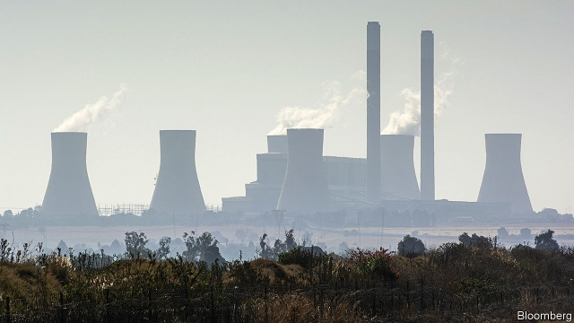
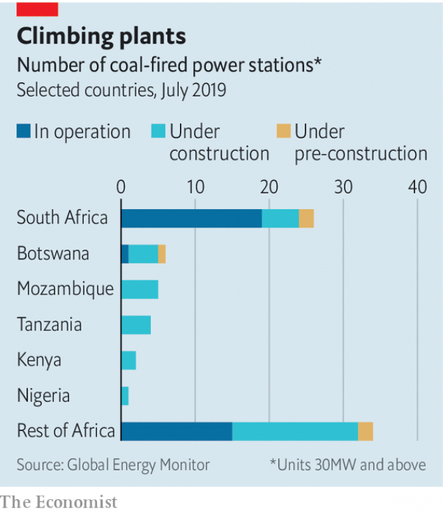

###### Dirty and dumb

# African countries plan to build dozens of coal-fired power stations 

 

> print-edition iconPrint edition | Middle East and Africa | Jul 27th 2019 

FORGET ZANZIBAR, seasoned Africa hands will tell you. Lamu is the loveliest island on the Swahili coast. Donkeys ply alleyways between ancient buildings clad in coral. Wooden dhows lie at anchor in its fishing ports. Private cars are banned. 

So plans to build a 1GW coal-fired power station, Kenya’s first coal plant, 20km (12 miles) away on the mainland caused dismay when they were unveiled in 2013. Islanders worried that pollution would damage architecture, despoil the marine environment and deter tourists. Environmentalists griped that the plant would greatly increase Kenya’s greenhouse-gas emissions. They were relieved in June when an environmental tribunal suspended the project’s licence pending a more comprehensive impact assessment. 

The government, though, appears not to have given up. Kenya wants to industrialise. Officials maintain that coal power is cheap and more reliable than renewables. Some grumble when environmental objections are raised, given that two-thirds of Kenya’s electricity already comes from renewable energy. “Europe industrialised on the back of coal,” says a civil servant. “Isn’t it a bit rich to be talking to us about our carbon footprint?” 

As things stand, sub-Saharan Africa gets little of its power from coal. Outside South Africa (which generates 93% of its electricity from coal) the region boasts just 12 functioning coal-fired power stations. Most are small. Things are changing, though. Sub-Saharan governments plan to build dozens of new coal-fired power stations, according to Global Energy Monitor, a watchdog (see chart). Many are underpinned by Chinese investment. 

 

Crooked officials like the big contracts, but there are powerful arguments for Africa to shun coal. One is global. Africa may not be to blame for climate change, but it has agreed to help mitigate it. In order to limit global warming to 1.5ºC above pre-industrial levels, analysts reckon that rich countries should stop operating coal plants by 2030, with the rest of the world following by 2050. A splurge on coal will make it harder for African countries to uphold their end of the bargain. 

The prices of wind and solar power in Africa are competitive with (and in some places less than) that of coal. Moreover, claims by countries such as Kenya that coal is needed for baseload power are unconvincing. No coal plant stays up all the time (just ask South Africa). Having so much power coming from the plant in Lamu would raise concerns about dependability in Kenya. With over half of its installed capacity coming from hydropower and geothermal energy, it is already in a good position to deal with intermittency problems. 

Assuming that electricity demand will grow by 15% a year, Kenya wants to boost its peak capacity to 22GW by 2030. That would be a costly mistake, says Hindpal Jabbal, the former chairman of Kenya’s Energy Regulatory Commission. Supply of 2.7GW already runs well ahead of demand, which at its daily peak stands at just 1.9GW. Overcapacity is a growing problem in Africa. “In the next four years Ethiopia, Kenya, Tanzania, Uganda and Rwanda could find themselves in the severe financial predicament of having too much electricity,” warns Power Africa, an American government initiative. Adding coal-fired plants, as both Tanzania and Kenya are doing, would increase costs for consumers while generating useless electricity. 

Botswana is building coal-fired plants with the intention of selling electricity to South Africa. But critics note that Eskom, South Africa’s state-owned power utility, is in effect insolvent. Other countries are banking on importing coal to fire their new plants. “If you do not have indigenous coal resources, that has huge implications for your balance of payments,” says Eric Wanless of the Rocky Mountain Institute, a clean-energy research outfit in America. 

African states should instead be improving transmission and distribution, says Mr Wanless. Power cuts are often due to inadequate maintenance of infrastructure rather than insufficient supply. Some countries propose hooking poor rural customers up to the grid, but this is expensive. Given how little power they consume, it might be more sensible to come up with off-grid solutions. Solar panels, for example, help the poor meet most of their needs. Rather than bring power from faraway power plants, distributed generation systems would provide remote villages with cheap, flexible and renewable power. 

Some African states are reconsidering coal. Fifty of the 82 planned coal-fired power stations outside South Africa have been shelved, says Global Energy Monitor. The reasons vary. Kenya is facing calls to make more use of its geothermal resources, only a fraction of which have been tapped. Geothermal energy is cheaper than coal and as dependable. Coal allowed the West to industrialise, but Africa would be better off embracing 21st-century technology. ■ 

-- 

 单词注释:

1.Jul[]:七月 

2.Zanzibar[,zænzi'bɑ:]:n. 桑给巴尔 

3.lamu[]: [地名] [肯尼亚] 拉穆 

4.swahili[swɑ:'hi:li]:n. 斯瓦希里人；斯瓦希里语 

5.ply[plai]:n. 厚度, 板层 vt. 使用, 使劲挥舞, 从事, 折, 弯 vi. 辛勤工作, 定期航行 

6.alleyway['æliwei]:n. 小巷, 窄街, 走廊 

7.clad[klæd]:vt. 在金属外包上另一种金属 a. 包层金属的 clothe的过去式和过去分词 

8.dhow['dau]:n. 独桅三角帆船 

9.dismay[dis'mei]:n. 沮丧 vt. 使惊愕, 使气馁 

10.unveil[.ʌn'veil]:vt. 揭开, 揭幕, 除去...的面纱 vi. 显露, 除去面纱 

11.islander['ailәndә]:n. 岛民 

12.despoil[di'spɒil]:vt. 夺取, 掠夺 

13.deter[di'tә:]:vt. 制止, 吓住, 威慑 

14.environmentalist[in,vaiәrәn'mentlist]:n. 环保人士 

15.gripe[graip]:n. 紧握, 柄, 把手, 控制 vt. 抓紧, 抱住, 使肠痛, 激怒 vi. 肠绞痛, 抱怨 

16.emission[i'miʃәn]:n. 发射, 射出, 发行 [医] 发射, 遗精 

17.environmental[in.vaiәrәn'mentәl]:a. 周围的, 环境的 [经] 环境的, 环保的 

18.tribunal[trai'bju:nl]:n. 法庭, 法官席, 裁决 [法] 法庭, 裁判所, 裁判 

19.pending['pendiŋ]:a. 未决定的, 待决的, 行将发生的, 向外伸出的 prep. 在等待...之际, 直到...时为止, 在...期间, 在...过程中 

20.Kenya['kenjә]:n. 肯尼亚 

21.industrialise[in'dʌstriәlaiz]:vi.vt. (使)工业化 

22.renewable[ri'nju(:)әbl]:a. 可更新的, 可恢复的, 可继续的, 可换新的, 可重复的, 可重说的 [计] 可更新, 可再生的 

23.grumble['grʌmbl]:n. 怨言, 满腹牢骚 vi. 抱怨, 发牢骚, 发隆隆声 vt. 抱怨 

24.watchdog['wɒtʃdɒg]:n. 看门狗, 监察人 [化] 监控设备; 监视器 

25.underpin[.ʌndә'pin]:vt. 从下面支承, 支撑, 支持 [经] 支撑 

26.crook[kruk]:n. 钩, 弯曲部分, 坏蛋 vt. 使弯曲, 诈骗 vi. 弯曲 

27.shun[ʃʌn]:vt. 避开, 规避, 避免 

28.mitigate['mitigeit]:vt. 温和, 缓和, 减轻 [医] 缓和, 减轻 

29.analyst['ænәlist]:n. 分析者, 精神分析学家 [化] 分析员; 化验员 

30.reckon['rekәn]:vt. 计算, 总计, 估计, 认为, 猜想 vi. 数, 计算, 估计, 依赖, 料想 

31.splurge[splә:dʒ]:n. 炫耀, 夸示 vi. 炫耀, 卖弄, 挥霍 vt. 挥霍 

32.uphold[ʌp'hәuld]:vt. 支撑, 赞成, 鼓励, 举起, 坚持 [法] 确认, 赞成, 支持 

33.les[lei]:abbr. 发射脱离系统（Launch Escape System） 

34.baseload['beisləud]:n. 基本负载，基本荷载 

35.unconvincing[ʌnkәn'vinsiŋ]:a. 不足以令人相信的 

36.dependability[di.pendә'biliti]:n. 可信任性, 可靠性 

37.hydropower['haidrәupauә]:n. 水力发出的电力 

38.geothermal[,dʒi(:)әu'θәmәl]:a. 地温的, 地热的 

39.intermittency[ɪntə'mɪtənsɪ]: 间歇现象, 间歇性 

40.regulatory['regjulәtәri]:a. 受控制的, 统制的, 调整的 [经] 规则的 

41.overcapacity[.әuvәkә'pæsәti]:n. 生产能力过剩 [经] 生产能力过利, 设备过利 

42.Ethiopia[.i:θi'әupiә]:n. 埃塞俄比亚 

43.Tanzania[.tænzә'ni:ә]:n. 坦桑尼亚 

44.Uganda[ju(:)'^ændә, u:'^ændә]:n. 乌干达 

45.rwanda[rj'ændә]:n. 卢旺达（东非国家）；卢旺达语 

46.predicament[pri'dikәmәnt]:n. 处境, 穷境, 困局 

47.botswana[bɔt'swɑ:nә]:n. 博茨瓦纳（非洲中南部国家） 

48.eskom[]:[网络] 南非电力公司；南非国家电力公司；斯康 

49.insolvent[in'sɒlvәnt]:a. 无力偿还的, 破产的 n. 无力偿还者, 破产者 

50.indigenous[in'didʒinәs]:a. 本土的, 国产的, 固有的 [医] 原产的, 本土的 

51.eric['erik]:abbr. 科教资源信息中心（Educational Resources Information Center）；电子遥控与独立控制（Electronic Remote and Independent Control） 

52.Wanless[]:n. (Wanless)人名；(英)万利斯 

53.rocky['rɒki]:a. 岩石的, 多石的, 像岩石的, 无情的, 摇动的, 摇晃的 

54.outfit['autfit]:n. 用具, 配备, 机构 vt. 配备, 供应 vi. 得到装备 

55.inadequate[in'ædikwәt]:a. 不充分的, 不适当的 [法] 不充分的, 不适当的 

56.infrastructure['infrәstrʌktʃә]:n. 基础结构, 基础设施 [经] 基础设施 

57.grid[grid]:n. 格子, 栅格 [计] 网格 

58.faraway['fɑ:rәwei]:a. 遥远的, 恍惚的, 出神的 

59.reconsider[.ri:kәn'sidә]:v. 再考虑, 重新考虑 

60.shelve[ʃelv]:vt. 放置架子上, 搁置 vi. 渐渐倾斜 

61.geothermal[,dʒi(:)әu'θәmәl]:a. 地温的, 地热的 

62.dependable[di'pendәbl]:a. 可信任的, 可靠的, 可信赖的 

