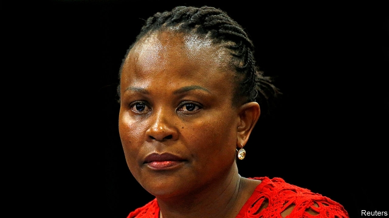

###### South African politics

# Another bad week for Cyril Ramaphosa 

 

> print-edition iconPrint edition | Middle East and Africa | Jul 27th 2019 

CYRIL RAMAPHOSA is an avid cattle breeder. He once bought a herd of Ankole longhorns from Uganda’s leader, Yoweri Museveni. But South Africa’s president must feel that he has rarely dealt with so much bull as he has in recent weeks. 

On July 19th the public protector, an ombudsman, accused Mr Ramaphosa of violating the constitution by deliberately misleading parliament. This is a grave allegation. If true it would obliterate the president’s claim to have ushered in a “new dawn” following the kleptocratic rule of his predecessor, Jacob Zuma, in 2009-18. 

There is both less and more to the case than first appears. Less in that the public protector’s arguments are flimsy. More in that they can be seen as part of a broad assault by Mr Ramaphosa’s enemies. 

The case dates back to November. In parliament Mmusi Maimane, the leader of the opposition Democratic Alliance, brandished what he said was proof of a payment of 500,000 rand ($36,000) from the boss of Africa Global Operations (AGO, previously known as Bosasa), a company accused of graft, to Andile Ramaphosa, the president’s eldest son. Mr Maimane asked the president to “set the record straight”. 

The president could have gone away and checked the facts. But he did not. Mr Ramaphosa said that he knew about the matter: he had spoken to his son, who runs a consultancy, and who had insisted that the money was for legitimate work. If it proved otherwise, the president went on, he would take Andile to the police himself. 

Both Mr Maimane’s question and Mr Ramaphosa’s answer were based on a flawed premise. Andile had done work for AGO but this payment was to CR17, the president’s campaign to replace Mr Zuma as head of the ruling African National Congress (ANC). According to a sworn affidavit Mr Ramaphosa did not learn of the donation until an aide told him after he had left the chamber; the president had asked to be kept in the dark about donors, so as to avoid potential conflicts of interest. Mr Ramaphosa then wrote to parliament correcting what he sees as an honest mistake. 

South African campaign-finance laws are opaque. It reflects badly on the president that his team took money from AGO. And it would be naive to think that Andile’s surname did not help him get jobs. 

But the report from Busisiwe Mkhwebane, the public protector (pictured), contains no concrete evidence that the president “deliberately” misled parliament, as she claims. Indeed, Ms Mkhwebane paradoxically states that the president acted in “good faith”. Pierre de Vos, a law professor, calls the report “a legal and factual mess”. Mr Ramaphosa is seeking a judicial review. 

It is not the first display of the public protector’s incompetence. Courts have taken issue with Ms Mkhwebane since she assumed office in 2016. Most recently, on July 22nd, South Africa’s highest court found that she had lied under oath and acted in bad faith in a case involving the central bank. Ms Mkhwebane also has a record of (ineptly) going after Mr Ramaphosa’s allies while being soft on his enemies. 

The public protector is not the only source of woe for Mr Ramaphosa. Mr Zuma and his henchman, Ace Magashule, the ANC’s secretary-general, who is also accused of corruption, want to see the back of a president who is trying to clean up the government. Mr Zuma, in particular, may be hoping that having an ally as president might shield him from prosecution on charges relating to 783 counts of fraud, money-laundering and racketeering. 

South Africa’s GDP contracted by 3.2% in the first quarter of the year. The more the president is distracted by internal opponents, the less time he has to try to fix the country’s pressing problems. His record continues to be one of overpromising and underdelivering—which is, of course, exactly what his enemies want. ■ 
<<<<<<< HEAD

-- 

 单词注释:

1.politic['pɒlitik]:a. 精明的, 明智的, 策略的 

2.cyril['siril]:n. 西里尔（男子名） 

3.ramaphosa[]:[网络] 拉马福萨；拉马弗萨 

4.Jul[]:七月 

5.cyril['siril]:n. 西里尔（男子名） 

6.ramaphosa[]:[网络] 拉马福萨；拉马弗萨 

7.avid['ævid]:a. 渴望的, 急切的, 劲头十足的 

8.breeder['bri:dә]:n. 饲养员, 养育员, 起因, 起源者 

9.Ankole[]:[地名] 安科莱 ( 乌干 ) 

10.longhorn['lɒŋhɒ:n]:n. 长角牛 

11.yoweri[]:n. (Yoweri)人名；(乌干)约韦里 

12.museveni[]:un. 穆塞韦尼(Yoweri,1945—乌干达共和国总统,1986年1月任职) [网络] 乌干达总统穆塞韦尼；穆赛韦尼；总统慕塞维尼 

13.protector[prә'tektә]:n. 保护者, 保护物, 保护装置 [医] [催化]保护质, 保护器 

14.ombudsman['ɒmbudzmæn]:n. (专查官员舞弊的)调查官 [法] 调查专员, 监察专员, 司法专员 

15.misleading[mis'li:diŋ]:a. 引入歧途的, 使人误解的, 骗人的 [法] 误写姓名的, 误称的, 令人误解的 

16.allegation[.æli'geiʃәn]:n. 断言, 主张, 申辩 [法] 声明, 事实陈述, 断言 

17.obliterate[ә'blitәreit]:vt. 擦去, 冲刷(掉), 消灭, 忘掉, 盖销(邮票等) [法] 灭迹, 消灭, 涂抹 

18.usher['ʌʃә]:n. 引座员, 招待员 vt. 引导, 招待 vi. 作招待员 

19.kleptocratic[,kleptə'krætik]:a. kleptocracy的变形 

20.predecessor[.predi'sesә]:n. 前任, 先辈, 前身 [医] 初牙, 前辈, 祖先 

21.jacob['dʒeikәb]:n. [圣经]雅各（以色列人的祖先）；雅各布（男子名） 

22.zuma[]: 祖玛 

23.les[lei]:abbr. 发射脱离系统（Launch Escape System） 

24.flimsy['flimzi]:a. 易坏的, 脆弱的, 浅薄的 n. 易损坏的东西(或材料), 薄纸, 描图用薄纸, 薄纸稿纸 

25.assault[ә'sɒ:t]:n. 攻击, 袭击 vt. 袭击, 攻击 vi. 发动攻击 

26.Mmusi[]:穆西 

27.Maimane[]:马伊马内 

28.opposition[.ɒpә'ziʃәn]:n. 反对, 敌对, 相反, 在野党 [医] 对生, 对向, 反抗, 反对症 

29.alliance[ә'laiәns]:n. 联盟, 联合 [法] 同盟, 联盟, 联姻 

30.brandish['brændiŋ]:vt. 挥, 挥舞 n. 挥舞 

31.rand[rænd]:n. 兰特, (非正式)边, 田埂, 缘 [经] 兰特 

32.graft[grɑ:ft]:n. 嫁接, 贪污 v. 嫁接, 移植, 贪污 

33.eldest['eldist]:a. 最年长的, 排行中第一的 n. 最年长者, 排行中第一者 

34.consultancy[]:n. 商量, 协商, 磋商, 会诊, 与...商量, 咨询, 请教, 找(医生)看病, 查阅, 考虑 [经] 咨询业务, 咨询服务 

35.legitimate[li'dʒitimәt]:a. 合法的, 正当的, 婚生的 vt. 认为正当, 立为嫡嗣, 使合法 

36.flaw[flɒ:]:n. 缺点, 裂纹, 瑕疵, 一阵狂风 [化] 划痕; 裂缝; 裂纹 

37.premise['premis]:n. 前提, 房屋连地基, 上述各项 vt. 预先提出, 引出, 作为...的前提 vi. 作出前提 

38.anc[]:abbr. 非洲民族会议（African National Council）；美国新闻社（American News Company）；（美国）大气氮公司（Atmospheric Nitrogen Corporation）；自动噪声消除器（Automatic Noise Canceller） 

39.affidavit[.æfi'deivit]:n. 宣誓书, 书面陈述 [经] 宣誓, 声明 

40.donation[dәu'neiʃәn]:n. 捐赠物, 捐款, 捐赠 [经] 赠品, 捐款, 捐赠 

41.aide[eid]:n. 助手, 副官 [计] 数据输入的可说明性 

42.donor['dәunә]:n. 捐赠人 [化] 给体; 供体 

43.opaque[әu'peik]:n. 不透明物 a. 不透明的, 不传热的, 不传导的, 阴暗的 [计] 白底 

44.naive[nɑ:'i:v]:a. 天真的, 纯真的, 幼稚的 

45.paradoxically[]:adv. 反论, 荒谬, 自相矛盾, 似非而可能是 

46.pierre[pi(:)'eә, peә]:n. 皮埃尔（男子名） 

47.de[di:]:[化] 非对映体过量 [医] 铥(69号元素铥的别名,1916年Eder离得的假想元素) 

48.vo[]:abbr. 口头命令（Verbal Order） 

49.factual['fæktʃuәl]:a. 事实的, 实际的 [法] 事实的, 与事实有关的, 实际的 

50.judicial[dʒu:'diʃәl]:a. 法庭的, 公正的, 审判上的, 司法的 [法] 司法的, 审判上的, 法官的 

51.incompetence[in'kɔmpitәns]:n. 不胜任, 不够格, 不合格, 不适合, 无能力, 不熟练, 无资格 [医] 机能不全, 闭锁不全, 关闭不全 

52.oath[әuθ]:n. 誓约, 誓言, 咒骂 [法] 誓言, 誓约, 宣誓 

53.ineptly[]:adv. 不适当, 不符合要求, 不恰当, 不合场面, 笨拙, 愚蠢, 无能, 不称职 

54.ally['ælai. ә'lai]:n. 同盟者, 同盟国, 助手 vt. 使联盟, 使联合, 使有关系 vi. 结盟 

55.woe[wәu]:n. 悲哀, 悲痛, 苦痛 

56.henchman['hentʃmәn]:n. 忠实追随者, 党羽, 跟踪者 [法] 亲信, 心腹, 顺从者 

57.ace[eis]:n. 幺点, 好手, 少许, 发球得分 a. 一流的, 杰出的 [计] 应答允许, 自适应计算机试验, 自动呼叫设备, 自动执行控制 

58.corruption[kә'rʌpʃәn]:n. 腐败, 堕落, 贪污 [计] 论误 

59.prosecution[.prɒsi'kju:ʃәn]:n. 执行, 经营, 起诉 

60.fraud[frɒ:d]:n. 欺骗, 欺诈, 诡计, 骗子 [经] 欺诈, 舞弊, 骗子 

61.racketeer[.ræki'tiә]:n. 敲诈者, 骗子 v. 诈骗钱财 

62.distract[dis'trækt]:vt. 转移, 分心, 使发狂 

63.overpromising[]:[网络] 过高 
=======
>>>>>>> 50f1fbac684ef65c788c2c3b1cb359dd2a904378

