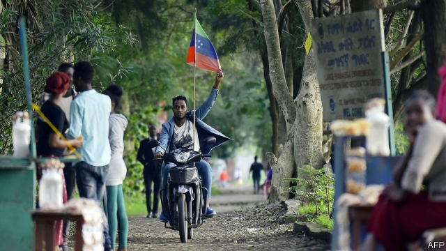
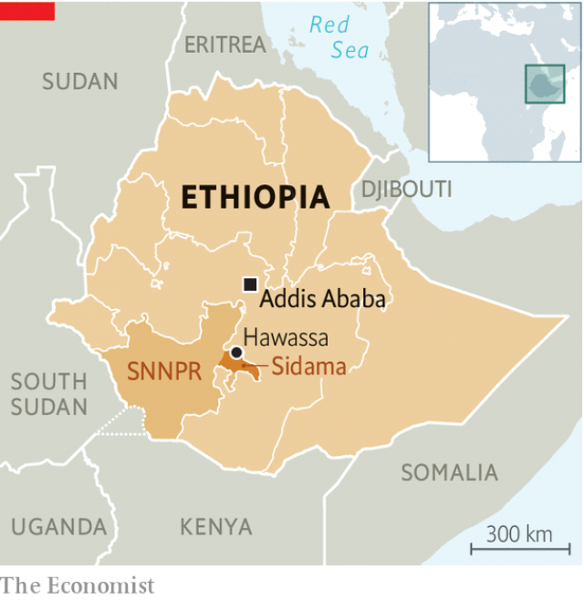

###### The southern problem

# Ethnic separatists are challenging Ethiopia’s unity 

 

> print-edition iconPrint edition | Middle East and Africa | Jul 27th 2019 

JULY 18TH was supposed to be a day of celebration for the Sidama. Ethiopia’s fifth-biggest ethnic group was to vote on statehood in a referendum. Some members anticipated the moment by hoisting Sidama flags over local-government buildings in the territory that would make up their semi-autonomous state. In Hawassa they began erecting billboards welcoming visitors to their new capital. “Our officials told us, you can celebrate,” says Gosaye, a Sidama activist. 

In the end there were no festivities. Rather than hold the promised referendum, the central government said it would take place within five months. Sidama officials agreed to the delay and told their supporters to be patient. But protesters burned vehicles, looted businesses and attacked government buildings. Angry mobs set upon members of other ethnic groups. The army was deployed and the internet switched off. At least 25 people were killed in clashes, most by the security forces (activists claim the true figure is higher). More than 150 people were arrested. 

The roots of the crisis lie in Ethiopia’s constitution, which created nine ethnically based, semi-autonomous states, but gave each of Ethiopia’s more than 80 ethnic groups the right to form its own state or secede. For decades the ruling Ethiopian Peoples’ Revolutionary Democratic Front prevented any group from actually exercising that right. But Abiy Ahmed, the prime minister, came to power last year promising greater freedoms. Under the new dispensation ethnic elites have revived their demands for more autonomy. 

 

First came the Sidama, who number around 5m and are the biggest group in the state called the Southern Nations, Nationalities and Peoples’ Region (SNNPR). They have longed chafed at their inclusion in the SNNPR, a messy hotch-potch of more than 45 different ethnic groups. Others are also unhappy with the set-up. Groups that live far from Hawassa, the state capital, have less say than those, such as the Sidama, that dominate the centre. The state government is weak and fractious; parliament failed to pass a budget this year. Since the Sidama requested a referendum last July at least ten other groups have demanded their own states. 

Balkanisation along ethnic lines is dangerous. Last year intercommunal fighting forced almost 3m people from their homes. Much of the violence occurred in the country’s densely populated south. A proliferation of new states equipped with their own security forces may be a recipe for further bloodshed if, as seems likely, there are territorial disputes. Minority groups fear being persecuted. States, which can write their own constitutions, have often failed to protect them. Some Sidama leaders say their constitution will be more inclusive than most and they promise quotas for minorities in government. But other leaders are less keen on such measures. 

Abiy has done little to calm nerves. For months his government dithered instead of organising the referendum for the Sidama. Then he threatened to use force if the group declared independence unilaterally. Activists say they do not trust the government to keep its new promise of a referendum. “It’s playing tricks,” says Gosaye. Meanwhile the Welayta, the second-largest ethnic group in the SNNPR, have taken to the streets demanding their own vote on statehood. Ethiopia’s southern problem may get worse before it gets better. ■ 

-- 

 单词注释:

1.ethnic['eθnik]:a. 人种的, 种族的 [医] 人种的 

2.separatist['sepәreitist]:n. 分离主义者, 独立派 

3.Jul[]:七月 

4.ethnic['eθnik]:a. 人种的, 种族的 [医] 人种的 

5.statehood['steithud]:n. 州的状态(或地位) [法] 国家地位, 州的地位 

6.referendum[.refә'rendәm]:n. （就重大政治或社会问题进行的）全民公决，全民投票 

7.hoist[hɒist]:n. 升高, 起重机, 推动 v. 升起, 升高, 举起 

8.billboard['bilbɒ:d]:n. 广告牌, 布告板 vt. 宣传 

9.activist['æktivist]:n. 激进主义分子 

10.festivity[fes'tiviti]:n. 节日, 喜庆日, 欢宴, 欢庆 

11.supporter[sә'pɒ:tә]:n. 支持者, 后盾, 迫随者, 护身织物 [法] 支持者, 赡养者, 抚养者 

12.protester[]:n. 抗议者, 持异议者, 拒付者 [经] 反对者 

13.loot[lu:t]:n. 赃物, 洗劫, 抢夺 v. 洗劫, 抢夺 

14.mob[mɒb]:n. 暴民, 民众, 暴徒 vt. 大举包围, 蜂拥进入, 围攻 vi. 聚众生事 

15.deploy[di'plɒi]:v. 展开, 配置 

16.clash[klæʃ]:n. 冲突, 撞击声, 抵触 vi. 冲突, 抵触 vt. 使发出撞击声 [计] 对撞 

17.ethnically['eθnikli]:adv. 人种上, 民族上 

18.secede[si'si:d]:vi. 正式脱离(或退出), 分离 [法] 退出, 脱离 

19.Ethiopian[.i:θi'әupiәn]:a. 埃塞俄比亚的 n. 埃塞俄比亚人 

20.ahmed[]:n. 艾哈迈德（男子名） 

21.dispensation[.dispen'seiʃәn]:n. 分配, 施与, (义务的)免除 [法] 特免权, 豁免, 执行 

22.elite[ei'li:t]:n. 精华, 精锐, 中坚分子 

23.revive[ri'vaiv]:vt. 使苏醒, 使复兴, 使振奋, 回想起, 重播 vi. 苏醒, 复活, 复兴, 恢复精神 

24.autonomy[ɒ:'tɒnәmi]:n. 自治, 自治权 [医] 自主性 

25.chafe[tʃeif]:n. 擦伤, 气恼 v. 摩擦, 擦痛, 激怒 

26.inclusion[in'kluʒәn]:n. 包含, 内含物 [计] 蕴含 

27.les[lei]:abbr. 发射脱离系统（Launch Escape System） 

28.fractious['frækʃәs]:a. 易怒的, 倔强的, 脾气不好的 

29.Balkanisation[]:[网络] 巴尔干化；巴尔干式地肢解；巴尔乾化 

30.intercommunal[,intә'kɔmjunl]:a. 社区之间的 

31.densely['densli]:adv. 浓密地, 浓厚地 

32.populate['pɔpjuleit]:vt. 使人口聚居在...中, 殖民于, 移民于, 居住于, 定居于 

33.proliferation[.prәulifә'reiʃәn]:n. 增殖, 激增 [医] 增生, 增殖 

34.bloodshed['blʌdʃed]:n. 流血 

35.territorial[.teri'tɒ:riәl]:a. 领土的, 土地的, 地方的, 区域性的 n. 本土自卫队队员 

36.persecute['pә:sikju:t]:vt. 迫害, 虐待, 困扰, 同...捣乱 [法] 迫害, 虐待, 烦扰 

37.inclusive[in'klu:siv]:a. 包含的, 包括的 

38.quota['kwәutә]:n. 配额, 限额 [化] 定额 

39.dither['diðә]:n. 发抖, 兴奋 vi. 发抖 

40.unilaterally[]:[计] 单侧地 

