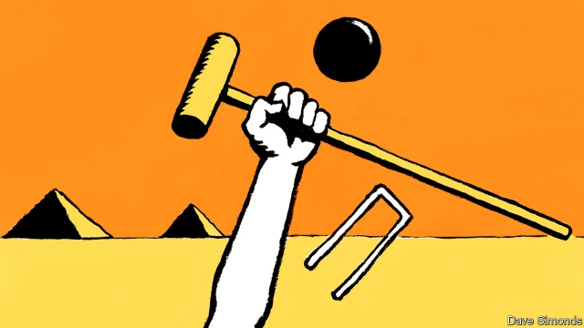

###### Masters of the mallet

# How Egypt conquered croquet 

 

> print-edition iconPrint edition | Middle East and Africa | Jul 27th 2019 

AS EGYPT WAS buffeted by revolution and political unrest early this decade, members of the sporting club in Heliopolis, a neighbourhood in Cairo, faced a mild form of hardship. The club is located across the street from a presidential palace that was occasionally besieged by protesters. Members wanting to play croquet first had to pick tear-gas canisters off the grass. 

Yet neither upheaval nor Egypt’s hot desert climate deters local croquet players. When the game’s world championship is held on July 27th in Sussex, a county in south-east England, it will have more Egyptian than English competitors. The former dominate the version of the game called golf croquet. Egyptian men have won nine of the past 12 world championships; Egyptian women have won three of the past six. 

Croquet was introduced to Egypt by its British occupiers in the early 20th century. (So was squash, at which Egyptians also excel.) After the British left in 1956 many assumed the game had withered. But in 1985 a British Airways pilot called Geoff Roy, who was also a tournament croquet player, discovered the packed courts of the Gezira club in central Cairo. “He spent the rest of the day being thrashed by the locals,” says Stephen Mulliner, the secretary-general of the World Croquet Federation. Mr Roy returned to England with his story, bringing Egypt to the attention of the wider croquet-playing world. 

Golf croquet is simpler than the more traditional form, called association croquet. Old-timers scoff that it is like comparing checkers with chess. But the Egyptians made their version faster and more exciting to watch. Boundary barriers are needed to keep all of the action on the court. (The airborne Egyptian jump shot is particularly audacious.) Egyptian rules have been adopted by croquet’s bigwigs. Today golf croquet is the most popular form of the game. 

Mostafa Eissa, winner of the Egyptian Open in 2015, attributes Egypt’s success at golf croquet to an aggressive style, weather that allows for year-round play and exuberant fans. But the competition has caught up. Reg Bamford, a South African, has won two of the past three world championships. This month Mr Eissa will try to bring the trophy back to Egypt. For inspiration he can look to Soha Mostafa, an Egyptian who won the women’s world championship in New Zealand earlier this year.■ 
<<<<<<< HEAD

-- 

 单词注释:

1.mallet['mælit]:n. 木槌, 球棍, 棒 [化] 大锤; 手锤 

2.Egypt['i:dʒipt]:n. 埃及 

3.croquet['krәukei]:n. 槌球游戏 vi. 贴击对方的球 

4.Jul[]:七月 

5.Egypt['i:dʒipt]:n. 埃及 

6.Heliopolis[,hi:li'ɔpəlis]:n. 黑里欧波里斯（尼罗河三角洲的古埃及城市） 

7.Cairo['kaiәrәu]:n. 开罗 

8.presidential[.prezi'denʃәl]:a. 总统制的, 总统的, 首长的, 统辖的 [法] 总统的, 议长的, 总经理的 

9.besiege[bi'si:dʒ]:vt. 围攻, 包围 

10.protester[]:n. 抗议者, 持异议者, 拒付者 [经] 反对者 

11.canister['kænistә]:n. 罐, 筒, 霰弹 [机] 罐, 滤毒罐 

12.upheaval[ʌp'hi:vl]:n. 举起, 隆起, 大变动, 剧变 

13.deter[di'tә:]:vt. 制止, 吓住, 威慑 

14.championship['tʃæmpiәnʃip]:n. 冠军身份, 冠军称号, 捍卫 

15.sussex['sʌsiks]:n. 苏塞克斯（英国郡名） 

16.croquet['krәukei]:n. 槌球游戏 vi. 贴击对方的球 

17.occupier['ɔkjjpaiә(r)]:n. 占用者, 居住者, 军事占领者 [法] 占用者, 居住者, 军事占领者 

18.squash[skwɒʃ]:n. 挤压, 压碎的东西, 南瓜属植物, 拥挤的人群 vt. 压扁, 镇压, 压制 vi. 被压扁, 发溅泼声, 挤入 

19.excel[ik'sel]:vt. 胜过, 优于, 擅长 vi. 胜过其他 

20.wither['wiðә]:vt. 使凋谢, 使消亡, 使畏缩 vi. 枯萎, 衰退 

21.airway['єәwei]:n. 空中航线, 风道 [医] 导气管 

22.geoff[]:n. 杰夫（男子名） 

23.roy[rɔi]:n. 罗伊（男子名） 

24.Gezira[dʒe'zi:rə]:n. 杰济拉（苏丹中部地区） 

25.thrash[θræʃ]:vt. 打, 使逆行, 胜过, 推敲, 鞭打 vi. 打谷, 痛打, 剧烈扭动, 逆行 n. 打谷, (划水)鞭状动作 

26.stephen['sti:vn]:n. 斯蒂芬（男子名） 

27.mulliner[]: [人名] [英格兰人姓氏] 马林纳 Mullen的变体 

28.federation[fedә'reiʃәn]:n. 联邦, 联合, 联盟 [法] 联邦, 联盟, 联邦政府 

29.scoff[skɒf]:n. 嘲笑, 愚弄, 笑柄, 食品 v. 嘲笑, 嘲弄, 贪吃, 狼吞虎咽地吃 

30.checker['tʃekә]:n. 制止者, 查对者, 阻止者 [计] 检查程序, 检验程序, 检验器, 西洋跳棋 

31.airborne['єәbɒ:n]:a. 升空的, 空运的, 空中传播的, 空降的 

32.audacious[ɒ:'deiʃәs]:a. 大胆的, 鲁莽的, 胆大妄为的 

33.bigwig['bigwig]:n. 要人, 大亨 

34.mostafa[]:n. (Mostafa)人名；(伊朗)穆斯塔法；(阿拉伯)穆斯塔法 

35.eissa[]:[网络] 伊萨；尔撒 

36.exuberant[ig'zju:bәrәnt]:a. 繁茂的, 丰富的, 生气勃勃的 [医] 生成过多的, 高度增生的 

37.REG[redʒ]:abbr. [计]注册表文件；寄存器（register ） 

38.Bamford[]:n. (Bamford)人名；(英、德、芬)班福德 

39.trophy['trәufi]:n. 战利品, 奖品 vt. 用战利品装饰 

40.inspiration[.inspә'reiʃәn]:n. 灵感, 鼓舞人心的人或物, 妙计, 吸气 [医] 吸[气] 

41.soha[]:abbr. soft hard 软硬 

42.zealand['zi:lәnd]:n. 西兰岛（丹麦最大的岛） 
=======
>>>>>>> 50f1fbac684ef65c788c2c3b1cb359dd2a904378

