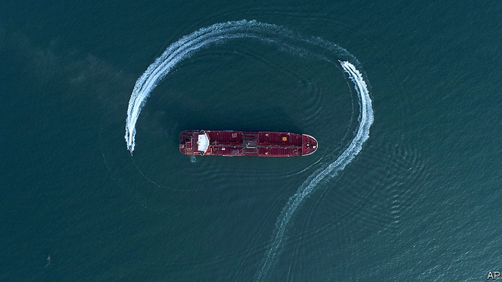
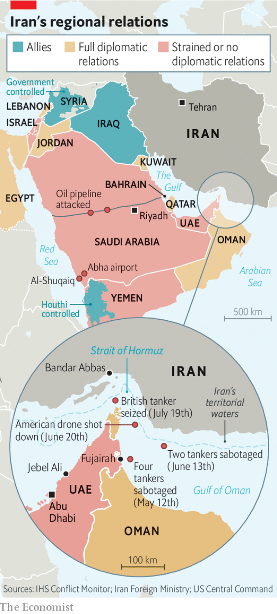

###### Spiralling

# Tensions between Iran and the West have the Gulf states on edge 

 

> print-edition iconPrint edition | Middle East and Africa | Jul 27th 2019 

COMPARED WITH Jebel Ali in Dubai, it feels like a sleepy Mediterranean harbour. The port at Fujairah, on the eastern coast of the United Arab Emirates (UAE), serves mostly as a refuelling depot for ships plying the Strait of Hormuz. It lacks the cargo capacity and the high-tech wizardry of Jebel Ali, the largest port in the Gulf and the ninth-busiest in the world. But Fujairah is the UAE’s only link to the high seas that bypasses the troubled strait, and so it has become a focal point amid worsening tension between Iran and the West. 

That tension rose on July 19th when Iran’s navy seized the Stena Impero, a British tanker (pictured), as it sailed west through the strait. The 30,000-tonne ship is now anchored near Bandar Abbas, hostage to a dispute that began on July 4th, when Britain impounded an Iranian tanker (allegedly bound for Syria) as it passed Gibraltar. In one of his final acts as foreign secretary, Jeremy Hunt proposed setting up a European task force to protect commercial vessels in the Gulf. 

Britain and its allies worry about the threat to business and energy supplies. For the Gulf Co-operation Council (GCC), though, tensions with Iran border on an existential issue. Despite some hawkish rhetoric, Gulf states are nervous about President Donald Trump’s policy of imposing “maximum pressure” on Iran. Conflict threatens their infrastructure and could hamper the oil and gas shipments that fill their treasuries. “Who’s going to pay the price? It’s us,” says a Qatari diplomat. 

For all its threats, Iran cannot close the Strait of Hormuz, the conduit for one-fifth of the world’s traded oil and a quarter of its liquefied natural gas. But it has already raised the cost of commercial shipping. Fujairah became a target in May, when four oil tankers anchored offshore had holes blown in their hulls. Iran is the prime suspect, though investigators have not formally assigned blame. The bunkering business in Fujairah has suffered as a result. 

Insurance premiums for the strait have climbed by an average of 10%. For the largest oil tankers, they have doubled, with a transit now costing as much as $500,000 to insure. Some shippers may decide not to take the risk (and bear the cost) of sailing through the strait. That is a concern for the Gulf states, which rely on the waterway to import everything from wheat to cars. Three of them—Bahrain, Kuwait and Qatar—have no other outlet to the sea. 

Infrastructure on land is vulnerable too. The Houthis, a Yemeni Shia militia backed by Iran (and which sometimes acts as its proxy), are fighting a Saudi-led coalition at home. But they have also hit soft targets in the region. In May the Houthis took credit for striking an oil pipeline in Saudi Arabia (American officials blamed Shia militias in Iraq). The Houthis claim to have used long-range drones, which could also hit oilfields in the UAE. At least three times since May the group has fired missiles at the international airport in Abha, in southern Saudi Arabia. One person has been killed. 

 

In June the militia lobbed a rocket at a major Saudi desalination plant in Al-Shuqaiq. It caused little damage but highlighted another vulnerability: the kingdom gets about one-third of its drinking water, more than 1bn cubic meters a year, from such facilities, which are expensive to build and easy to target. The Qataris even worry about their national air carrier, which has been forced, since its Arab neighbours imposed an embargo in 2017, to route hundreds of daily flights over Iran. At least two drones (one American, one Iranian) have recently been shot down in the area. 

Gulf states struggle to counter these threats. Though they have spent tens of billions of dollars on military kit from America and Europe, it is not always the right kit. Tanks and fighter jets have limited value in an asymmetric conflict. Their navies are small and lack combat experience; they train with the Americans and are investing in new ships, but play only a supporting role in regional security. Years of talk about an integrated GCC missile-defence command has led nowhere, and individual defences are spotty. If drones hit Saudi Arabia’s oil pipeline they would have spent hours flying undetected over the kingdom. 

Saudi Arabia has long viewed Iran as its chief enemy. It still broadly supports American policy. Officials in the smaller Gulf emirates are unhappy, though, and those in the UAE feel particularly stuck. In public they cannot break with Mr Trump or their Saudi allies. But they are subtly distancing themselves. They are withdrawing troops from Yemen partly to lower tensions with the Houthis—and thus avoid being attacked. They have also taken a cautious line on Iran, even suggesting it may not have been responsible for the sabotage in Fujairah. “They could shut this place down with a few missiles,” says an official in Dubai. “We need to protect our own interests.” ■ 

