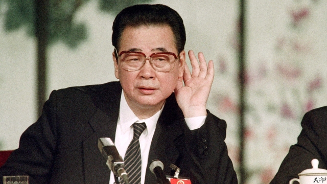

###### The butcher of Beijing

# Obituary: Li Peng died on July 22nd 

 

> print-edition iconPrint edition | Obituary | Jul 27th 2019 

HIS DIARY entry for April 27th 1989 recorded the moment when the trouble touched Li Peng directly. On his way home from his prime ministerial office in Beijing, his car was blocked by student protesters. His driver and bodyguards—and he was glad to have both at that moment—had to find another way round. 

After days of pro-democracy protests by students in Tiananmen Square, nothing had been done about them. Nobody had come to beat up and drag away the protesters, as had happened during the only previous outbreak of large-scale unrest on that vast plaza during Communist rule. That was in 1976, when people were mourning the death of Prime Minister Zhou Enlai. Li had mourned too, perhaps more than many, because Zhou had cared for him as a child after his father had been killed, a martyr in the revolutionary struggle. Zhou’s morals and principles had deeply influenced him then. But the public grieving in 1976 had turned into political protest against Zhou’s hardline enemies, and that had been sharply put down. Now, 13 years later, many Chinese were allowing themselves to believe that the party might at last be about to take off in a new political direction, one more open to dissent. This Li could not allow. He would rather die, he wrote in his diary, than let the protests get out of hand. 

From the beginning of the unrest he had feared the worst: that these troublemakers would repeat the chaos and violence that China had suffered during the Cultural Revolution. He had sat out those tragic years as an unthreatening apparatchik in charge of Communist Party affairs at the capital’s electric-power bureau. (Power-generation, especially hydroelectric engineering, was his great love, and had been his study at the Power Engineering Institute in Moscow.) Now, in the era of Deng Xiaoping with reform the catchword, politics seemed muddled and mixed up in a new way, and Li was acquiring a name as a conservative. Where Deng was open-minded, he would make his mark by being just the opposite. 

In fact, Chinese politics during the Deng era was often contradictory: both benign and hardline. In 1989 the paramount leader had two lieutenants, and Li was only one of them. The other, totally different, was the party chief, Zhao Ziyang, a seeming liberal through and through, a suave, charismatic man who wore Western suits. Li had long been at loggerheads with Zhao over the pace and direction of change, on questions ranging from price reform to ideological controls. As a strong believer in the role of the state and the party, he viewed any change as potentially dangerous to both. 

Zhao was also, in those nervy spring days of 1989, sympathetic to the students. He thought them patriotic. Li saw their leaders as counter-revolutionaries, bent on overthrowing the party. They had to be repressed. At meetings of the Politburo Standing Committee he and Zhao sparred furiously with each other. But Li knew he had Deng on his side, in favour of military force. On May 17th he left a Politburo meeting at Deng’s house, alongside the “crestfallen” Zhao, exultant that he had got his way. The crackdown had been ordered. On the 18th he held a tense meeting with some of the student leaders in the Great Hall of the People overlooking Tiananmen Square, telling them cryptically: “The situation will not develop as you wish and expect.” On the contrary, it was about to develop as he himself wished and expected. 

The night of May 20th seared his face on China’s memory. That was when he appeared on state television, wearing a Mao suit and with his hair slicked back, to justify the imminent imposition of martial law in Beijing. “The anarchic state is going from bad to worse,” he read from a script in a voice that was tense and jerky with anger. “The fate and future of the People’s Republic of China, built by many revolutionary martyrs with their blood [his father among them], are facing a serious threat.” From a packed hall, hundreds of officials applauded him. 

He had won his battle, and Zhao had lost. But he had not won hearts and minds. Though the students directed their anger against a number of people, including Deng himself, Li became their main face of evil. As troops gathered on the edge of Beijing, preparing to clear the square, students and other citizens staged a massive demonstration, shouting “Down with Li Peng!”. At his brief meeting with them on the 18th, seething with contempt, he had told them straight: “We have to defend socialism. I don’t care whether you are happy to listen to this or not.” On the night of June 3rd this point was repeated—with bullets. Hundreds, maybe thousands, were killed. Several people, especially Deng, deserved the tag “Butcher of Beijing” that many foreigners applied after that to Chinese leaders. But it was most commonly given to Li. 

Not that he would have minded. The post-Tiananmen world was his. Zhao-style liberalism never recovered. Economic reform eventually took off again, faster than conservatives like him cared for. But the party stayed firmly in charge, and that was what mattered most of all. He remained prime minister for nearly a decade, making sure his family was comfortably ensconced in the power-generation business: his two sons and his daughter all worked in the Ministry for Water Resources and Electrical Power, and one son became governor of coal-rich Shanxi province. Anti-corruption campaigners were outraged by his “power-industry family”. That did not bother him. 

The project he was proudest of, though it made him even less popular, was the building of a massive dam on the scenic Three Gorges of the Yangzi river. It cost tens of billions of dollars, displaced 1.3m people and was denounced by environmentalists in China and abroad, but he cherished it and hymned it in a poem: “The huge wheel whirls/its power boundless. The achievement is now,/the benefits for a hundred years.” He wrote a book about the project, based on the diary he had kept then, and he continued to keep a diary every day even in old age. He also tried to publish selections from the one he had kept in April, May and June 1989, defending his role in Tiananmen. He may not have cared whether readers were happy or not.■ 
<<<<<<< HEAD

-- 

 单词注释:

1.peng[]:n. 执业工程师 

2.obituary[ә'bitjuәri]:a. 关于死亡的, 讣告的 n. 讣告 

3.Jul[]:七月 

4.ministerial[.mini'stiәriәl]:a. 部长的, 内阁的, 执政的 [法] 部长的, 部的, 公使的 

5.protester[]:n. 抗议者, 持异议者, 拒付者 [经] 反对者 

6.outbreak['autbreik]:n. 爆发, 暴动 [医] 暴发 

7.plaza['plɑ:zә]:n. 广场, 市场, 购物区 

8.zhou[dʒәj]:n. 周（中国姓氏）；周朝（中国古代王朝） 

9.enlai[]:[网络] 放出 

10.martyr['mɑ:tә]:n. 烈士, 受苦者, 受难者 vt. 使成为烈士, 使受苦 

11.hardline[]:n. 强硬路线 [电] 硬线 

12.dissent[di'sent]:n. 异议 vi. 持异议, 不同意 

13.troublemaker['trʌbl.meikә]:n. 惹麻烦的人 

14.chao[]:n. 钞（货币） 

15.cultural['kʌltʃәrәl]:a. 文化的, 教养的, 修养的 [医] 培养的 

16.tragic['trædʒik]:a. 悲惨的, 悲剧的 

17.apparatchik[,æpə'rætʃɪk]:n. 共产党官员；职业政党工作人员 

18.hydroelectric[.haidrәui'lektrik]:a. 水力电气的 [医] 水电的, 水电治疗的 

19.catchword['kætʃwә:d]:n. 口号, 标语, 口头禅 

20.politic['pɒlitik]:a. 精明的, 明智的, 策略的 

21.muddle['mʌdl]:vt. 混合, 使微醉, 使咬字不清晰 vi. 胡乱对付 n. 困惑, 混浊状态 

22.benign[bi'nain]:a. 善良的, 良性的 [医] 良性的 

23.paramount['pærәmaunt]:n. 首长, 最高当局 a. 最重要的, 最高的, 至上的 

24.Ziyang[]:资阳（地名） 

25.suave[swɑ:v]:a. 柔和的, 温和的, 文雅的 

26.charismatic[,kæriz'mætik]:a. 魅力, 能吸引大众的非凡能力, 神授的能力, 领袖人物感人的超凡魅力 

27.loggerhead['lɔ^әhed]:n. 傻瓜, 笨蛋 

28.ideological[.aidiә'lɒdʒikәl]:a. 意识形态的, 空想的 [法] 思想的, 思想上的, 意识形态的 

29.believer[bi'li:vә]:n. 信徒 

30.potentially[pә'tenʃәli]:adv. 可能地, 潜在地 

31.nervy['nә:vi]:a. 有勇气的, 易激动的 

32.patriotic[.peitri'ɒtik]:a. 爱国的, 有爱国心的 [法] 爱国的, 有爱国心的 

33.overthrow[.әuvә'θrәu]:n. 推翻, 瓦解, 倾覆 vt. 打倒, 推翻, 倾覆 

34.repress[ri'pres]:vt. 镇压, 抑制, 压制 vi. 压制 

35.politburo[pә'litbjuәrәu]:[经] 政治局 

36.spar[spɑ:]:n. 晶石, 圆材, 拳斗, 争论 vt. 装圆材于 vi. 拳斗, 争论 

37.furiously[]:adv. 狂暴地；猛烈地 

38.crestfallen['krest.fɒ:lәn]:a. 垂头丧气的, 意气沮丧的, 气馁的 

39.exultant[ig'zʌltәnt]:a. 非常高兴的, 欢欣的 

40.crackdown['krækdaun]:n. 制裁, 镇压, 痛击 

41.sear[siә]:a. 枯萎的, 凋谢的 vt. 烤焦, 使枯萎 vi. 凋谢, 干枯 

42.slick[slik]:a. 光滑的, 熟练的, 聪明的, 华而不实的, 老套的, 陈腐的 adv. 灵活地, 聪明地 vt. 使光滑, 使漂亮 vi. 打扮整洁 n. 光滑平面, 平滑器, 修光工具 

43.imminent['iminәnt]:a. 即将来临的, 逼近的 

44.imposition[.impә'ziʃәn]:n. 征收, 课税, 强加, 欺骗 [经] 征税, 税, 税款 

45.martial['mɑ:ʃәl]:a. 战争的, 军事的, 尚武的, 威武的 [医] 含铁的 

46.anarchic[æ'nɑ:kik]:a. 无政府的, 无政府主义的, 无规律的 [医] 反常的 

47.script[skript]:n. 手迹, 手稿, 正本, 手写体 vt. 改编为演出本 [计] 手写体, 小型程序 

48.jerky['dʒә:ki]:a. 急动的, 抽筋的, 不平稳的 n. 牛肉干 

49.demonstration[.demәn'streiʃәn]:n. 示范, 实证 [医] 示教, 实物教授 

50.sethe[]:n. (Sethe)人名；(德)泽特 

51.liberalism['libәrәlizm]:n. 自由主义 

52.comfortably['kʌmfәtәbli]:adv. 安乐地, 舒服地, 宽裕地 

53.ensconce[in'skɒns]:vt. 安顿下来, 安置, 使隐藏 

54.shanxi[]:山西省 

55.campaigner[kæm'peinә]:n. 从军者, 老兵, 竞选者 

56.outrage['autreidʒ]:n. 暴行, 侮辱, 愤怒 vt. 凌辱, 虐待, 触犯 

57.bother['bɒðә]:vt. 烦扰, 迷惑 vi. 烦恼, 操心 n. 麻烦, 纠纷, 讨厌的人 

58.les[lei]:abbr. 发射脱离系统（Launch Escape System） 

59.scenic['si:nik]:a. 风景好的, 戏剧性的, 舞台的, 布景的 n. 风光影片, 风景照片 

60.gorge[gɒ:dʒ]:n. 峡谷, 凹槽, 塞饱, 咽喉 vi. 狼吞虎咽 vt. 塞饱, 狼吞虎咽地吃 

61.tens[]:十位 

62.displace[dis'pleis]:vt. 移置, 替换, 转移 

63.denounce[di'nauns]:vt. 告发, 抨击, 谴责 [法] 谴责, 斥责, 告发 

64.environmentalist[in,vaiәrәn'mentlist]:n. 环保人士 

65.cherish['tʃeriʃ]:vt. 珍爱, 怀有, 爱护 

66.hymn[him]:n. 赞美诗, 圣歌 v. 唱赞美歌 

67.boundless['baundlis]:a. 无限的, 无边无际的 [经] 无限的 
=======
>>>>>>> 50f1fbac684ef65c788c2c3b1cb359dd2a904378

