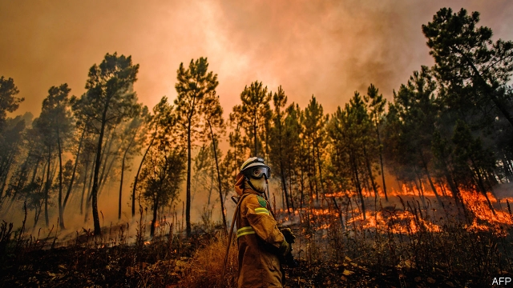

###### Extreme weather

# Greenhouse-gas emissions are increasing the frequency of heatwaves 

 

> print-edition iconPrint edition | Science and technology | Jul 25th 2019 

EXTREME HEAT is ruinous to productivity, particularly if you are a criminal. Several American police forces posted messages to their social-media accounts last weekend declaring a moratorium on crime. “It is just too hot to be outside committing crimes,” wrote the Park Forest Police Department in Illinois, on its Facebook page. In some cases, it seems to have worked. “We have had zero customers stay the night at our ‘hotel’, so we appreciate all of the criminals adhering to the heat advisory,” tweeted the Malden Police in Massachusetts on Sunday. 

The messages came as scorching temperatures swept across America, placing more than 100m people under excessive-heat warnings. Temperatures hovered either side of 40°C on the east coast. On July 18th Mitch Petrus, a well-known retired player of American football, died of heatstroke after working outdoors all day. At least five other deaths have been reported. 

Europeans have also been sweating, for the second time this summer. A month ago, warm air from the Sahara contributed to making it the continent’s hottest June on record. At the top of Mont Blanc, western Europe’s highest mountain, instruments recorded 7°C (the normal June temperature would be below freezing). At Gallargues-le-Montueux near Nîmes, in France, temperatures peaked at 45.9°C. The previous record anywhere in that country was 1.8°C lower. Linked to these temperatures, in Alaska (see article) and Portugal (pictured), forest fires are raging. 

If your hunch is that this kind of extreme weather is more common today than it was once-upon-a-time, you are correct. When, in 2003, tens of thousands of people in Europe died prematurely as a result of a two-week heatwave, it was deemed to be a once-in-1,000-years event. Twelve years later, a study led by Nikolaos Christidis of the Hadley Centre, the climate-research division of Britain’s Met Office, found that heatwaves of this severity had become once-in-100-years events, and would be commonplace by the 2040s. 

The question on many people’s minds is whether these changes, and specific events like this week’s temperatures in America and Europe, are caused by greenhouse gases accumulating in the atmosphere. For years, the semi-official line was that no single weather event could be blamed on climate change, only trends. That began to change in 2004, with the publication of the first “attribution” study. This focused on the European heatwave of 2003, when average summer temperatures broke through a threshold until then unbreached in 150 years of records. By comparing simulations of a world with and without greenhouse-gas emissions, Peter Stott at the Met Office and his colleagues found that climate change had made the record-breaking heatwave at least twice as likely as it would otherwise have been. 

Since then, research of this sort, intended to study how climate change is already promoting extreme weather, has grown rapidly. A recent, extended drought in California has been linked to greenhouse-gas emissions, as was the extreme heat southern Europe experienced during the summer of 2017. That event was made at least ten times more likely by climate change according to work published later that year by World Weather Attribution, a collaboration between experts in these sorts of analyses. 

Attribution work does not concern itself only with heat. Floods, storms and cold spells also carry a climatic fingerprint. When Hurricane Harvey hit America in August 2017, it stalled over Texas, delivering huge quantities of rain, which caused heavy flooding and more than 80 deaths. On that occasion, World Weather Attribution found that climate change was responsible for intensifying precipitation levels by between 8% and 19%. Since 2012, the Bulletin of the American Meteorological Society has published an annual compendium of attribution studies. Roughly 70% of events scrutinised show some influence from climate change. 

One challenge has been to do the analyses faster. Findings connected with the heatwave of 2003 took a year to appear, by which time public interest had mostly moved on. The goal today is to offer a verdict on the influence of climate change on particular meteorological events more or less as they are happening. Here, the Met Office has been leading the way, with its Dutch, French and German counterparts close behind. But many other places do not have the capacity to carry out the onerous computer-modelling required. As a result, a European Union project planned to start before November will seek to provide contemporaneous weather-attribution analyses for the continent. 

An inadvertent early test of how this could work took place last month, when many of Europe’s attribution scientists gathered at a statistical-climatology meeting in Toulouse, just as the June heatwave hit. Within days they published their conclusions. Accumulating greenhouse gases in the atmosphere had made the event at least five times more likely than would otherwise have been the case. 

Such statements help show that the danger posed by climate change is clear and present, not just something for future generations to worry about. Heatwaves, for example, sometimes kill by the thousand—and can cause more casualties than other meteorological extremes, such as floods and hurricanes. But attribution also provides useful guidance to policymakers. 

For instance, information about how much more likely an event is today than it was 50 or 100 years ago can assist decisions about building and adapting infrastructure. If what were thought of as once-in-a-millennium heatwaves now come once a century and will soon become so frequent as to be normal, then public-health systems need to be designed to cope with an influx of people suffering from heat stress. Likewise, if big floods are more frequent, water-handling systems need to be expanded and flood defences raised. Insurance and reinsurance companies are paying particular attention, because these calculations help them reassess risk levels. 

Conversely, some people blamed climate change for a drought in south-eastern Brazil in 2014 and 2015, in which water levels in reservoirs around São Paulo and Rio de Janeiro fell to between 3% and 5% of capacity. But a study published in 2015 by Friederike Otto of the Environmental Change Institute at Oxford University found no sign that greenhouse-gas emissions had raised the risk of drought. Dr Otto concluded instead that a quadrupling of São Paulo’s population since 1960 had put pressure on scarce water supplies. 

Attribution science is also playing a role in courtrooms and human-rights hearings. A study published in 2015 showed that climate change contributed to the high wind speeds of supertyphoon Haiyan, which blew through the Philippines in 2013, killing more than 6,000 people. Those stronger winds created a much bigger storm surge. The matter was raised during hearings held by the Philippine Commission on Human Rights last year, which sought to explore the question of whether fossil-fuel companies could be held responsible. 

Others have sought to pin companies down more specifically. In one widely reported lawsuit, Saúl Luciano Lliuya, a Peruvian farmer, is suing RWE, a German energy firm, for contributing to the melting of a mountain glacier that threatens to sweep away his village. Mr Luciano Lliuya’s counsel, Roda Verheyen, has said that the case “was mostly made possible by the advancement of...attribution science”. Lindene Patton, a lawyer with the Earth and Water Law Group, a firm specialising in environmental law, has written that “the science of event attribution may become a driver of litigation, as it shifts understanding of what weather is expected and, relevantly for law, foreseeable.” 

To a layman, however good attribution science has become, trying to use it to link an event in the Peruvian Andes to a particular firm in Germany looks a bit of a stretch. But whether or not Mr Luciano Lliuya wins his case, the fact it is even being heard is a straw in the wind—and a sign that global warming can change metaphorical weather patterns as well as real ones. ■ 
<<<<<<< HEAD

-- 

 单词注释:

1.emission[i'miʃәn]:n. 发射, 射出, 发行 [医] 发射, 遗精 

2.heatwave[ˈhi:tweɪv]:n. 热浪[波], 酷暑期 

3.Jul[]:七月 

4.ruinous['ruinәs]:a. 破坏性的, 招致毁灭的 

5.productivity[.prәudʌk'tiviti]:n. 生产力 [经] 生产率, 生产能力 

6.moratorium[.mɒrә'tɒ:riәm]:n. 延期偿付, 暂停 [法] 延期偿付, 延缓履行, 延期偿还期 

7.Illinois[.ili'nɒis]:n. 伊利诺州 

8.facebook[]:n. 脸谱网 

9.advisory[әd'vaizәri]:a. 顾问的, 咨询的, 劝告的 [法] 劝告的, 忠告的, 咨询的 

10.tweet[twi:t]:vi. 啁啾 n. 小鸟叫声 

11.Malden['mɔ:ldən]:n. 莫尔登（姓氏, 岛屿名） 

12.Massachusetts[.mæsә'tʃu:sits]:n. 麻萨诸塞州 

13.scorch[skɒ:tʃ]:n. 烧焦, 枯萎 v. 烧焦, 拷焦, (使)枯萎, 讽刺 

14.hover['hʌvә]:vi. 盘旋, 翱翔, 徘徊 vt. 孵 n. 翱翔 

15.mitch[mitʃ]:vi. [方言]逃学 

16.petrus[]: [人名] 彼得勒斯 

17.heatstroke['hi:tstrәuk]:n. 中暑 

18.Sahara[sә'hɑ:rә]:n. 撒哈拉沙漠 

19.mont[]:n. 蒙特, 蒙脱石 

20.blanc[blæŋk]:n. 白 

21.Alaska[ә'læskә]:n. 阿拉斯加州 

22.Portugal['pɒ:tʃugl]:n. 葡萄牙 

23.hunch[hʌntʃ]:n. 肉峰, 预感, 大块 vt. 弯腰驼背, 预感到, 耸肩 vi. 向前移动, 隆起 

24.tens[]:十位 

25.prematurely['premətʃə(r)lɪ]:adv. 过早地, 贸然地 

26.deem[di:m]:v. 认为, 相信 

27.hadley['hædli]:n. 哈德利（姓氏） 

28.severity[si'veriti]:n. 严格, 朴素, 激烈 

29.commonplace['kɒmәnpleis]:n. 寻常事, 老生常谈, 普通的东西 a. 平凡的, 普通的 

30.attribution[әtri'bju:ʃәn]:n. 归因 [法] 归因, 归属, 属性 

31.threshold['θreʃәuld]:n. 门槛, 入口, 开端, 阈 [计] 阈; 阈值 

32.unbreached[]:[网络] 未破裂 

33.simulation[.simju'leiʃәn]:n. 模拟, 假冒物, 模仿 [计] 模拟 

34.peter['pi:tә]:vi. 逐渐消失, 逐渐减少 

35.Stott[stɔt]:n. 斯托得（姓氏） 

36.California[.kæli'fɒ:njә]:n. 加利福尼亚 

37.attribution[әtri'bju:ʃәn]:n. 归因 [法] 归因, 归属, 属性 

38.collaboration[kә.læbә'ræʃәn]:n. 合作, 勾结 [法] 通敌卖国者, 奸细 

39.climatic[klai'mætik]:a. 气候的 

40.fingerprint['fiŋgәprint]:n. 指纹 vt. 采指纹 

41.harvey['hɑ:vi]:n. 哈维（男子名） 

42.stall[stɒ:l]:n. 厩, 停车处, 牧师职位, 货摊, 托辞, 拖延 vt. 关入厩, 停顿, 推托, 支吾, 使陷于泥中 vi. 被关在厩内, 陷于泥中, 停止, 支吾 

43.Texas['teksәs]:n. 德克萨斯 

44.intensify[in'tensifai]:vt. 加强 vi. 强化 

45.precipitation[pri.sipi'teiʃәn]:n. 坠落, 沉淀, 降水, 轻率, 急速, 猛冲, 突如其来 [化] 析出 

46.bulletin['bulitin]:n. 公告, 布告, 公报 [电] 电子布告栏 

47.meteorological[]:a. 气象的, 气象学的 

48.compendium[kәm'pendiәm]:n. 纲要, 概略 [电] 简述 

49.scrutinise[]:vt.vi. 细看, 仔细检查, 审查, 细阅 [经] 详细检查, 细细地看 

50.verdict['vә:dikt]:n. 裁决, 判决, 判断性意见, 定论, 结论 [法] 定论, 判断, 意见 

51.meteorological[]:a. 气象的, 气象学的 

52.les[lei]:abbr. 发射脱离系统（Launch Escape System） 

53.Dutch[dʌtʃ]:n. 荷兰人, 荷兰语 a. 荷兰的 

54.counterpart['kauntәpɑ:t]:n. 副本, 复本, 配对物, 相应物 [经] 副本, 正副二份中之一 

55.onerous['ɒnәrәs]:a. 繁重的, 负有法律责任的 [法] 负有义务的, 艰巨的, 繁重的 

56.contemporaneous[kәn.tempә'reinjәs]:a. 同时期的, 同时代的 

57.inadvertent[.inәd'vә:tәnt]:a. 漫不经心的, 非故意的 

58.toulouse[tu:'lu:z]:n. 图卢兹（法国南部城市） 

59.casualty['kæʒjuәlti]:n. 意外事故, 伤亡, 受害者 [化] 事故 

60.policymaker['pɔlisi.meikә]:n. 政策制定者；决策人 

61.infrastructure['infrәstrʌktʃә]:n. 基础结构, 基础设施 [经] 基础设施 

62.influx['inflʌks]:n. 流入, 河口, 汇集 [医] 注入, 流入 

63.reinsurance[.ri:in'ʃurәns]:n. 再保险, 再保险金额 [医] 再保险 

64.reassess[.ri:ә'ses]:vt. 再评价, 再摊派, 再课税 

65.Brazil[brә'zil]:n. 巴西 

66.reservoir['rezәvwɑ:]:n. 贮水池, 贮藏处, 贮备, 水库 vt. 储藏 

67.paulo[]:n. 保罗（男子名） 

68.rio[]:n. 里约（巴西共和国的旧首都） 

69.de[di:]:[化] 非对映体过量 [医] 铥(69号元素铥的别名,1916年Eder离得的假想元素) 

70.Janeiro[]:n. （葡）一月 

71.friederike[]:[网络] 弗里德里克；弗雷德里克；弗莉缔里克 

72.otto['ɒtәu]:n. 玫瑰油 

73.environmental[in.vaiәrәn'mentәl]:a. 周围的, 环境的 [经] 环境的, 环保的 

74.Oxford['ɒksfәd]:n. 牛津, 牛津大学 

75.quadruple['kwɒdrupl]:a. 四倍的, 四重的, 四部分组成的 n. 四倍 vt. 使成四倍 vi. 成为四倍 

76.courtroom['kɒ:trum]:n. 法庭, 审判室 [法] 法庭, 审判室 

77.supertyphoon[]:[网络] 超质子 

78.haiyan[]:[网络] 海盐县；嘉兴；阎海 

79.Philippine['filipi:n]:a. 菲律宾(群岛)的, 菲律宾人的 

80.surge[sә:dʒ]:n. 巨涌, 汹涌, 澎湃 vi. 汹涌, 澎湃, 颠簸, 猛冲, 突然放松 vt. 使汹涌奔腾, 急放 [计] 电压尖峰 

81.Philippine['filipi:n]:a. 菲律宾(群岛)的, 菲律宾人的 

82.specifically[spi'sifikli]:adv. 特定地, 明确地, 按特性 

83.lawsuit['lɒ:sju:t]:n. 诉讼 [法] 诉讼, 诉讼案件 

84.Luciano[]:卢西亚诺 

85.Peruvian[pә'ru:viәn]:a. 秘鲁的, 秘鲁人的, 秘鲁文化的 n. 秘鲁人 

86.sue[su:]:vt. 控告, 起诉, 请求 vi. 提出诉讼, 提出请求 

87.RWE[]:[网络] 莱茵集团；德国莱茵集团；莱茵能源集团 

88.glacier['gleiʃә]:n. 冰川 

89.counsel['kaunsәl]:n. 商议, 忠告, 法律顾问 v. 商议, 劝告 

90.roda[]: [地名] [巴基斯坦、德国] 罗达; [地名] [德国] 罗达河 

91.verheyen[]:n. (Verheyen)人名；(德)费尔海恩 

92.advancement[әd'vɑ:nsmәnt]:n. 前进, 进步, 提升 [医] 徙前术 

93.Patton[]:n. 巴顿将军（美国二战名将） 

94.specialise['speʃә,laiz]:vt. 特加指明, 列举, 使专门化, 限定...的范围 vt.vi. (使)特化, (使)专化 vi. 成为专家, 专务, 专攻, 专门研究, 逐条详述 

95.environmental[in.vaiәrәn'mentәl]:a. 周围的, 环境的 [经] 环境的, 环保的 

96.litigation[.liti'geiʃәn]:n. 诉讼, 起诉 [经] 诉讼, 纠葛 

97.relevantly[]:adv. 有关, 切题, 恰当, 中肯, 贴切, 成比例, 相关, 相应 

98.foreseeable['fɒ:'si:әbl]:a. 可预知的, 能预测的 [法] 可预见的, 可预料的 

99.layman['leimәn]:n. 俗人, 门外汉, 凡人 [医] 外行, 业外人 

100.Andes['ændi:z]:n. 安第斯山脉 

101.metaphorical[metә'fɒ:rikl]:a. 隐喻性的, 比喻性的 
=======
>>>>>>> 50f1fbac684ef65c788c2c3b1cb359dd2a904378

