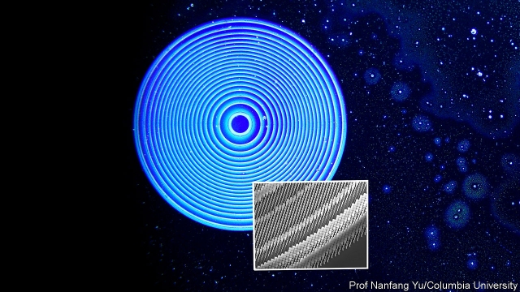

###### The seed of light

# How to make a flat lens 

 

> print-edition iconPrint edition | Science and technology | Jul 27th 2019 

“LENS” IS THE Latin word for lentil. And it is indeed true that the shape of bi-convex lenses—the familiar sort used as magnifying glasses—resembles those leguminous seeds. But that resemblance may soon be a thing of the past. For a group of engineers at Columbia University, in New York, led by Nanfang Yu, has worked out how to make magnifying lenses that are flat, and thinner than a hair. 

A lens works by slowing down a light wave as it traverses one of the lens’s faces (the speed of light in glass is about two-thirds of that in air). Slowing a wave changes its direction, a process called refraction. The angle through which it is refracted depends on its angle of incidence to the refracting surface—an angle that, on a curved surface, varies continuously. When the light leaves the lens it picks up speed again, and thus goes through a second refraction. The trick of the lensmaker’s art is to grind the two surfaces into such shapes that the sum of all this refraction brings the light passing through the lens to a focus. 

Dr Yu’s flat lens achieves a similar result in a different way. Instead of holding the change of speed constant while varying the angle of incidence, the new lens holds the angle of incidence constant while varying the amount that the speed changes on different parts of the lens. 

It can do this because its surface is covered with millions of tiny antennae. These antennae are of different designs, each with a cross section smaller than the average wavelength of the light it is interacting with, and are arranged in concentric circles (see picture). The antennae scatter the light falling on them in such a way that, when the individual changes are added up, the combined effect is the same as if different parts of the beam had passed through the lens at different speeds. 

Dr Yu is not the first person to make a lens in this way, but previous efforts worked only with single colours, and also required the light to be polarised. Dr Yu’s lens works with all colours and in natural light, which is unpolarised. 

In practice, few optical systems other than eyeglasses rely on single lenses. Usually, different lenses with different properties are stacked on top of each other to remove aberrations and achieve full-colour wide-angle images. Dr Yu’s lenses can be stacked in this way, too. By sandwiching three of them together, he has created a triplet that achieves almost all the control of light waves that would be expected of bigger and heavier glass-lens systems. 

Besides saving weight and volume, Dr Yu’s flat lenses also promise to be cheaper to mass produce than the conventional sort. Grinding and polishing a glass lens is complex and time-consuming. Flat lenses are made using nanolithographic techniques, which are also employed for making computer chips. Given these advantages, flat lenses could replace their bulkier counterparts anywhere that cost or weight is an issue—meaning pretty-well everywhere from microscopes and cameras, to pairs of spectacles. 

Flat lenses still need development before they can truly replace their glass counterparts. In current designs, only around half of the light falling on a flat lens triplet makes it through to the other side. The rest is reflected or absorbed by the material. In a typical glass lens, by contrast, at least 90% of the light passes through. However, the researchers hope that, by tweaking the shapes and positions of the antennae, they will be able to improve on this. 

In theory, there is no limit to the size of a lens that could be made using Dr Yu’s techniques. But there are practical challenges in making ever-larger lenses that would work well in full colour. In particular, the bigger the lens, the more challenging it becomes to design the correct shape and distribution of antennae. 

These technical obstacles will no doubt be overcome—and probably quite quickly, given the interest the project has attracted from America’s armed forces. Meanwhile, flat lenses for smaller applications are already on course to become the biggest innovation for manipulating rays of light since someone, thousands of years ago, first ground a piece of transparent crystal into the shape of a leguminous seed.■ 

