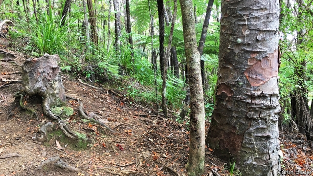

###### Superorganisms

# Tree stumps can live on indefinitely... 

 

> print-edition iconPrint edition | Science and technology | Jul 27th 2019 

A LIVING STUMP sounds like something out of a horror movie. In fact, it is not unusual for a tree, deprived of its trunk and foliage by lightning, disease or a lumberjack, but still possessed of roots and an above-ground stump, to continue a zombie-like existence for years—even decades. Such arboreal undead have been recognised since 1833. But surprisingly, until now, no living stump has been subjected to detailed scientific scrutiny. 

The scrutinised stump, pictured above, is the remains of a Kauri tree in Waitakere Ranges Regional Park, New Zealand. It and two neighbouring, intact, Kauris were investigated by Martin Bader and Sebastian Leuzinger of Auckland University of Technology, who have just published their results in iScience. 

Dr Bader and Dr Leuzinger started with the suspicion that living stumps are sustained through their roots by nearby, intact trees of the same species. Above ground, trees look like distinct entities, but below the surface things get more complicated. More than 150 tree species, Kauris among them, are known to have roots that sometimes fuse with those of other members of the same species. Such subterranean junctions permit exchange between individual trees of food, water, minerals and even micro-organisms, to create what some regard as a superorganism. 

The question the researchers asked was: if a tree in such a network were reduced to a stump, would that remnant quickly be cut loose as useless and left to fend for itself? Their study, carried out over the course of nine days, proved that the stump under scrutiny was still a participating member of the local superorganism. 

Sensors fitted to the two intact trees and the stump showed that the stump’s flow of sap and water ran inversely to that of the trees. On sunny days, when the intact trees were photosynthesising extensively and drawing a great deal of water up their trunks, there was almost no water movement in the stump. At night, when the trees were no longer transpiring in this way, water flooded into the stump and sap flow reached a maximum, indicating that it was receiving a burst of resources. 

Exactly why a stump’s neighbours dole out their hard-won nutrients in this manner remains a mystery, but Dr Bader and Dr Leuzinger have ideas. Biologists know of two ways co-operation between organisms can evolve. One is kin selection, which requires the collaborators to be related (as neighbouring trees of the same species are likely to be) and works if sacrifices by one bring disproportionate reproductive benefits to others. The effect of this is to propagate a collaborator’s genes collaterally, in a way that sociologists might refer to as nepotism, instead of directly from parent to offspring. This may be why root connections happen in the first place, but cannot explain their perpetuation, for trying to help a trunkless stump reproduce would be a fool’s errand. 

The other route to co-operation is reciprocal altruism of the “you scratch my back and I’ll scratch yours” variety. This requires a stump’s neighbours, which are feeding it, to benefit directly from the arrangement. The suggestion Dr Bader and Dr Leuzinger make is that they do—the stump’s role being to extend, at minimal cost, the root networks of its intact neighbours. From their point of view, that makes keeping the stump alive worthwhile. 

If this is what is going on, however, it is a good illustration of the dangers of anthropomorphic terminology. The arrangement might look reciprocal to human eyes, because it is keeping the stump alive. But since the stump cannot reproduce it might as well, in Darwinian terms, be dead anyway, for it garners no evolutionary benefit from its survival. Unless, of course, to go back to the idea of kin selection, the neighbours it is sustaining are its kin and it is rendering nepotistic assistance to them from beyond the grave.■ 

