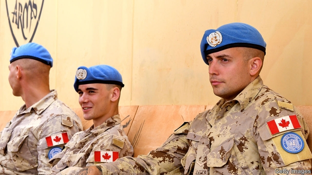

###### Foreign policy

# Canada is feeling lonely, but its place internationally is still strong 

 

> print-edition iconPrint edition | Special report | Jul 27th 2019 

ON DECEMBER 1ST last year the Royal Canadian Mounted Police arrested Meng Wanzhou, the chief financial officer of Huawei, a Chinese telecoms firm, as she prepared to change planes at Vancouver’s international airport. Ms Meng is wanted in America on charges stemming from allegations that Huawei had tried to evade sanctions on Iran. She is under house arrest in Vancouver while Canada works out whether to honour America’s extradition request. China is furious. It has detained two Canadians, a former diplomat and a businessman, in retaliation; Chinese courts have sentenced two others to death on drugs charges. China, which buys C$2.7bn-worth of canola seed from Canada, blocked imports from two of Canada’s biggest producers and has stopped buying Canadian pork and beef. 

This clash with the world’s second-biggest economy, on top of tensions with the biggest, has made Canada feel even more isolated. For decades its umbilical attachment to America has given it security and economic sustenance while allowing it to express its distinct diplomatic personality. The embodiment of that idea was Lester Pearson, a prime minister who won the Nobel peace prize for organising a UN force to help end the Suez crisis in 1956, the first such peacekeeping operation. Where the stars and stripes were feared or hated, the maple leaf was often welcome. 

Now Canada’s touchy relations with the two superpowers are echoed in a strained relationship with India, where a visit by Justin Trudeau last year was marred by diplomatic gaffes. Chrystia Freeland, a vocal critic of Vladimir Putin before she became Canadian foreign-affairs minister, is banned from Russia. “For the first time we don’t have good relations with four major world powers,” laments Jocelyn Coulon, a former adviser to Mr Trudeau. In addition, Saudi Arabia expelled Canada’s ambassador last August after Ms Freeland criticised it for jailing human-rights activists. 

Even more dismaying for Canada is the weakening of America’s commitment to the institutions that have sustained global peace and commerce, such as the UN and the World Trade Organisation (WTO). Some of the “foundational principles of the post-war order are being questioned and threatened more seriously than at any other time”, says Ms Freeland. Canada’s mission, she says, is to defend liberal democracy and the rules-based international order. 

Canada feels embattled, but it is not alone. Although politics is making the country’s relations with the world more difficult, geography and economic logic work in its favour. Trade deals, including new agreements with the EU and with ten Pacific countries, give it preferential access to economies that account for nearly half of world GDP. Relations with America and China are more resilient than the headlines imply. Conflict is brewing in the melting Arctic, but so is opportunity. In its defence of the international order, Canada still has friends in Europe, Australasia and beyond. 

Its trade in goods with China increased from C$78bn in 2014 to C$103bn in 2018. The potential seems vast. China will remain hungry for Canadian minerals, grains and fuels and eager to sell its manufactures. PetroChina owns a 15% stake in a huge new project to ship liquefied natural gas from British Columbia to China and other Asian countries, starting in 2023. Some 74,000 Chinese students attended Canadian universities in 2017. 

Mr Trudeau had hoped to start talks on a free-trade agreement with China. That was before the detention of Ms Meng, after which there can be no such prospect. But commerce is still in better shape than diplomacy. A survey earlier this year of 250 Canadian and Chinese companies by the Canada China Business Council found that, although 20% had been hurt by the dispute, 65% had not. The government thinks a trade deal will eventually be done. “I can’t imagine a world in the medium term that does not have enhanced trade in Canada and China,” says Jim Carr, the trade minister. 

The Arctic may soon figure in Canada’s trading relationships. Because of climate change, Canada’s third coast could become a viable outlet for exporting resources. Rail service to Churchill, the country’s only deepwater port in the Arctic, recently reopened after an 18-month interruption caused by flooding. “The northern passage will become a reality one day,” says Murad Al-Katib, the boss of AGT, a food-processing company involved in a venture that bought the railway and is upgrading the port. 

But Canada is being directly menaced in the region for the first time since the cold war. Russia threatens to become “a local hegemon”, says Rob Huebert of the Arctic Institute of North America at the University of Calgary. It is conducting bomber and submarine patrols in the region and has reopened at least ten military bases, which were closed after the cold war. 

China has declared itself a “near-Arctic state” and aims to create a “polar silk road” to Europe through the Arctic Ocean. It is a question of time before Chinese submarines appear in the region, Mr Huebert believes. An unexpected challenge comes from Mike Pompeo’s swipe at Canada’s claim on the Northwest Passage. If that is followed by a “freedom-of-navigation operation”, that is, a navy or coastguard trip that Canada does not authorise, a new crisis in relations with America could erupt. 

Canada reckons that the best way to deal with novel threats is to do better what it has done well in the past: defend international norms, cultivate alliances and work with like-minded “middle powers” to encourage good behaviour by big ones. The new challenge “doesn’t require Canada doing something entirely different, but doing more and better,” says Roland Paris of the University of Ottawa, a former adviser to Mr Trudeau. 

In Pearson’s multilateral spirit, Canada leads the “Ottawa group” of 12 countries and the European Union, which is trying to solve a crisis caused by America’s refusal to allow judges to be appointed to the WTO’s appeals panel. It is an active member of the “Lima group” of mainly Latin American countries, which is trying to restore democracy to Venezuela. To meet the Arctic threat, Mr Trudeau announced in May that the coastguard would get two new ships to join the navy in patrolling the region. 

Relations with America and China are more resilient than the headlines imply 

But Mr Trudeau’s critics say he is a poor man’s Pearson. Canada waited two years to heed a plea by the UN to send transport helicopters to help keep peace in Mali, says Richard Fadden, a former head of the Canadian Security Intelligence Service. The legalisation of cannabis falls foul of international drug conventions, also part of the rules-based order. A test will be whether Canada wins one of five seats on the UN Security Council due to become vacant in 2021. “It’s not a trophy,” says Mr Trudeau. “It’s a way of having an impact and affecting global debate in a positive and meaningful way.” 

If Mr Scheer defeats him, the tone, if not the substance, of foreign policy is likely to change. He claims to be harder-nosed about China than Mr Trudeau is. And he would move Canada’s embassy in Israel to Jerusalem, one way that world leaders show they want to be friends with President Trump. 

To the relief of most Canadians, Mr Trudeau has improved the relationship with America. Mr Trump’s threat to scrap NAFTA, which governs most trade between America, Canada and Mexico, caused Canada to mobilise as if for a national emergency. The prime minister’s office set up a dedicated war room. Ms Freeland became, in effect, minister for relations with America. Canadians from across the political spectrum lobbied mayors, governors and Mr Trump’s inner circle, brandishing reports on how many of the 9m American jobs that depend on Canadian trade each state would lose. 

Eventually, with similar effort from Mexico, the three sides hammered out the USMCA, which resembles NAFTA and will replace it, assuming Congress ratifies the new agreement. In May Mr Trump lifted tariffs on Canadian and Mexican steel and aluminium. Mr Trudeau says that relations are now “normal”. Even so, Canada cannot relax. “The new normal for us is we have to have this elevated level of outreach” to America, says Mr Paris. 

Had Mr Trump paid a visit to Windsor, Ontario, where the skyscrapers of Detroit loom almost within touching distance across the Detroit River, he could have seen for himself how intertwined the two economies are, how determined those on both sides are to intensify their relationships and how hostility and indifference from Washington can gradually undermine them. About 7,000 lorries, many laden with components or finished cars, cross the Ambassador bridge daily, the “largest single crossing in the second-largest bilateral trade relationship in the world”, says Bill Anderson, director of the Cross-Border Institute in Windsor. 

Some 1,500 health workers commute across the river from Windsor to Michigan every day. Out west, British Columbians head to Washington state to load up on cheap electronics and petrol. In border towns of Washington state, Canadians rent post-office boxes to take delivery of shipments from Seattle-based Amazon. Yet interchange is not as easy as it used to be. “When bars closed at 12.30 in Windsor you headed to Detroit. You didn’t know there was a border,” recalls Bryce Phillips, head of the Windsor-Detroit Bridge Authority, who grew up in the Canadian city. 

Security tightened after the terrorist attacks on America on September 11th 2001. American border officials scrutinised all travel documents and required drivers to open their car boots, creating long queues. The two countries worked to restore the former ease of crossing, for example by introducing NEXUS cards, which let pre-screened border-hoppers use a special lane. 

The Trump administration reintroduced friction. In 2017 the number of cars entering America from Canada dipped, even though the Canadian dollar strengthened, a sign that Mr Trump’s glower was putting off some. In the same year a border official in Michigan misinterpreted a government statement to mean that health workers could no longer commute from Windsor. It took 48 worrying hours to clear up the confusion, says Laurie Tannous, an immigration lawyer. Canadian officials have been stricter during the Trump presidency, she says. “It’s almost like retaliatory.” 

Co-operation between national-level agencies on both sides is not as good as it was, says Laurie Trautman of the Border Policy Research Institute at Western Washington University. “If there are four more years of Trump they will be strained even more.” 

Yet interaction and integration are hard to stop. Oregon, Washington state and British Columbia are studying the feasibility of a high-speed rail link between Portland and Vancouver. The nerd bird, a sea plane, has been ferrying techies between Vancouver and Seattle since last year. In Windsor construction has begun on a new bridge across the Detroit river, costing C$5.7bn, to take the load off the clogged Ambassador bridge. It will be financed by Canada and is due to open in 2024. If Mr Trump menaces Canada again, he will get pushback on the border. ■ 
<<<<<<< HEAD

-- 

 单词注释:

1.internationally[.intә'næʃәnәli]:adv. 国际性地, 在国际间 

2.Jul[]:七月 

3.meng[]:abbr. 工程硕士（Master of Engineering） 

4.Wanzhou[]:万州 

5.huawei[]: 华为 

6.telecom['telәkɔm]:telecommunication 电信 

7.allegation[.æli'geiʃәn]:n. 断言, 主张, 申辩 [法] 声明, 事实陈述, 断言 

8.evade[i'veid]:v. (巧妙地)逃脱, 规避, 逃避 

9.sanction['sæŋkʃәn]:n. 核准, 制裁, 处罚, 约束力 vt. 制定制裁规则, 认可, 核准, 同意 

10.Iran[i'rɑ:n]:n. 伊朗 

11.vancouver[væn'ku:vә]:n. 温哥华（加拿大主要港市） 

12.extradition[.ekstrә'diʃәn]:n. 引渡逃犯, 亡命者送还本国 [法] 引渡 

13.detain[di'tein]:vt. 扣留, 扣押, 耽搁 [法] 拘留, 扣押, 留住 

14.diplomat['diplәmæt]:n. 外交官, 有外交手腕的人 [法] 外交家, 外交官, 有权谋的人 

15.retaliation[ri.tæli'eiʃәn]:n. 报复 [法] 报仇, 报复, 回敬 

16.canola[kə'nəʊlə]:n. 加拿大油菜 

17.producer[prә'dju:sә]:n. 生产者, 制作者, 制作人 [化] 发生器; (炉煤气)发生炉; 制气炉; 生产者 

18.clash[klæʃ]:n. 冲突, 撞击声, 抵触 vi. 冲突, 抵触 vt. 使发出撞击声 [计] 对撞 

19.umbilical[ʌm'bilikl]:a. 脐带的, 脐的, 近脐的, 关系密切的 [医] 脐的 

20.attachment[ә'tʃætʃmәnt]:n. 连接, 附属物, 连接物, 爱慕 [计] 附加, 附件 

21.sustenance['sʌstinәns]:n. 生活资料, 生计, 食物, 支持 [法] 营养物, 维持, 支持 

22.diplomatic[.diplә'mætik]:a. 外交的, 老练的 [法] 外交的, 外交上的, 文献上的 

23.embodiment[im'bɒdimәnt]:n. 具体化, 化身 

24.lester['lestә]:n. 莱斯特（男子名）；喻指显赫的人 

25.pearson['piәsn]:n. 皮尔森（人名） 

26.Nobel['nәubel]:n. 诺贝尔 

27.UN[ʌn]:pron. 家伙, 东西 [经] 联合国 

28.Suez['sju(:)iz]:n. 苏伊士 

29.touchy['tʌtʃi]:a. 易怒的, 难以取悦的, 过于敏感的 

30.superpower[.sju:pә'pauә]:n. 超级强权, 超级大国 [经] 超级大国 

31.justin['dʒʌstin]:n. 贾斯廷（男子名） 

32.trudeau[]:n. (Trudeau)人名；(英、法)特鲁多 特鲁多 

33.mar[mɑ:]:vt. 损毁, 损伤, 糟蹋 n. 三月 

34.gaffe[gæf]:n. 过失, 失态, 出丑 

35.freeland[]: [人名] [英格兰人姓氏] 弗里兰身份名称，拥有土地而无须提供租役者，来源于古英语，含义是“免税的+土地”(free+land); [地名] [美国] 弗里兰 

36.vocal['vәukl]:a. 嗓音的, 声音的, 有声的, 歌唱的 n. 元音, 声乐作品 

37.Vladimir[vlɑ'dimɪr]:n. 弗拉基米尔（古罗斯弗拉基米尔-苏兹达里公国的古都） 

38.putin['putin]:n. 普京（人名） 

39.lament[lә'ment]:n. 悲叹, 悔恨, 恸哭, 挽歌, 悼词 vt. 哀悼 vi. 悔恨, 悲叹 

40.Jocelyn['dʒɔsəlin]:n. 乔斯林（女子名） 

41.coulon[]: [地名] [法国] 库隆; [地名] [法国] 库隆河 

42.adviser[әd'vaizә]:n. 顾问, 劝告者, 指导教师 [法] 顾问, 劝告者 

43.saudi['sajdi]:a. 沙乌地阿拉伯（人或语）的 

44.Arabia[ә'reibiә]:n. 阿拉伯半岛 

45.criticise['kritisaiz]:v. 批评, 吹毛求疵, 非难 

46.activist['æktivist]:n. 激进主义分子 

47.dismay[dis'mei]:n. 沮丧 vt. 使惊愕, 使气馁 

48.organisation[,ɔ: ^әnaizeiʃən; - ni'z-]:n. 组织, 团体, 体制, 编制 

49.WTO[]:[计] 给操作员送信息 

50.foundational[]:a. 基础的, 基本的 

51.embattle[im'bætl]:vt. 列阵, 布阵, 整军备战, 严阵以待 

52.politic['pɒlitik]:a. 精明的, 明智的, 策略的 

53.EU[]:[化] 富集铀; 浓缩铀 [医] 铕(63号元素) 

54.preferential[.prefә'renʃәl]:a. 优先的, (关税等)优惠的 [经] 特惠的; 特惠关税率, 优先权 

55.resilient[ri'ziliәnt]:a. 弹回的, 有弹力的 [医] 回弹的, 回能的 

56.brew[bru:]:n. 酿造酒, 酝酿 v. 酿造, 酝酿 

57.Australasia[.ɒstrә'leiʒjә]:n. 澳大拉西亚 

58.petrochina[]: 中国石油 

59.liquefy['likwifai]:v. (使)溶解, (使)液化 

60.Columbia[kә'lʌmbiә]:n. 哥伦比亚 

61.detention[di'tenʃәn]:n. 阻止, 监禁, 拘留 [医] 隔离, 拘留, 滞留, 停滞 

62.diplomacy[di'plәumәsi]:n. 外交, 外交手腕, 交际手段 [法] 外交, 外交手腕, 权谋 

63.jim[dʒim]:n. 吉姆（人名） 

64.Carr[]:n. 凯尔（挪威, 住在沼泽的人） 

65.viable['vaiәbl]:a. 能养活的, 能生长发育的 [医] 有活力的, 有生机的 

66.Churchill['tʃә:tʃil]:n. 邱吉尔 

67.deepwater['di:p,wɔ:tә(r)]:a. 深海的,海洋上的,靠近海洋的 

68.reopen[.ri:'әupәn]:v. 重开, 再开始, 再开 

69.Murad[]:穆拉德（人名） 

70.agt['æɡt]: [医][=abnormal glucose tolerance]异常葡萄糖耐量 

71.upgrade['ʌpgreid]:n. 上坡, 升级, 上升 adv. 往上 vt. 使升级, 提升, 改良品种 vi. 升级 [计] 升级 

72.menace['menis]:n. 威胁, 胁迫 v. 威吓, 胁迫 

73.hegemon['hedʒəmɒn]:n. 有至高无上权力的霸权主义者(或国家等) 

74.calgary['kæl^әri]:n. 卡尔加里（加拿大西南部城市） 

75.bomber['bɒmә]:n. 轰炸机, 投弹手 

76.patrol[pә'trәul]:n. 巡逻, 巡逻员, 侦察队 v. 巡逻, 巡视 

77.polar['pәulә]:a. 两极的, 极地的, 正好相反的, 极性的 n. 极线, 极面 

78.unexpect[]:[网络] 意想不到；使意外 

79.mike[maik]:vi. 偷懒, 游手好闲 n. 休息, 游手好闲, 扩音器, 话筒 

80.swipe[swaip]:n. 强打, 用力挥击, 尖刻的话, 碰擦, 起重杆 vt. 强打, 用力挥击, 偷 

81.coastguard['kәustgɑ:d]:n. 海岸警备队, 海岸警备队队员 

82.authorise['ɔ:θәraiz]:vt. 授权；批准；允许；委任（等于authorize） 

83.reckon['rekәn]:vt. 计算, 总计, 估计, 认为, 猜想 vi. 数, 计算, 估计, 依赖, 料想 

84.norm[nɒ:m]:n. 基准, 模范, 标准, 准则, 平均数 [化] 定额 

85.alliance[ә'laiәns]:n. 联盟, 联合 [法] 同盟, 联盟, 联姻 

86.entirely[in'taiәli]:adv. 完全, 全然, 一概 

87.roland['rәulәnd]:n. 罗兰（男子名） 

88.multilateral[.mʌlti'lætәrәl]:a. 多边的, 多国的 [经] 多边的, 涉及多方的 

89.lima['li:mә]:n. 利马（秘鲁首都） 

90.Venezuela[,vene'zweilә]:n. 委内瑞拉 

91.heed[hi:d]:n. 注意, 留心 v. 注意, 留心 

92.plea[pli:]:n. 恳求, 辩解, 抗辩, 诉讼, 请愿, 托词 [法] 抗辩, 申诉案件, 答辩 

93.Mali['mɑ:li]:n. 马里 

94.richard['ritʃәd]:n. 理查德（男子名） 

95.fadden[]: [人名] 法登 

96.legalisation[ˌli:gəlaɪ'zeɪʃən]:n. 合法化, 法律上认可 

97.cannabis['kænәbis]:n. 大麻 [化] 大麻 

98.foul[faul]:a. 污秽的, 邪恶的, 恶臭的, 肮脏的, 恶劣的, 淤塞的 vt. 弄脏, 妨害, 污蔑, 犯规, 淤塞 vi. 腐烂, 犯规, 缠结 adv. 违反规则地, 不正当地 n. 犯规, 缠绕 

99.trophy['trәufi]:n. 战利品, 奖品 vt. 用战利品装饰 

100.meaningful['mi:niŋful]:a. 意味深长的 

101.scheer[]: [人名] 希尔; [地名] [德国] 谢尔 

102.Israel['izreil]:n. 以色列, 以色列后裔, 犹太人 

103.Jerusalem[dʒә'ru:sәlәm]:n. 耶路撒冷 

104.scrap[skræp]:n. 碎片, 残余物, 些微, 片断, 铁屑, 吵架 vt. 扔弃, 敲碎, 拆毁 vi. 互相殴打 a. 零碎拼凑成的, 废弃的 

105.NAFTA['næftə]:abbr. 北美自由贸易协定（North American Free Trade Agreement） 

106.mobilise['mәjbilɑiz]:vi.vt. 动员, 松动, 使活动, 调动, 发动 

107.dedicate['dedikeit]:vt. 献出, 贡献 

108.spectrum['spektrәm]:n. 光谱, 范围, 系列 [化] 光谱 

109.lobby['lɒbi]:n. 大厅, 休息室, 游说议员者 vi. 游说议员, 游说 vt. 游说 

110.brandish['brændiŋ]:vt. 挥, 挥舞 n. 挥舞 

111.ratify['rætifai]:vt. 批准, 认可 [经] 证实, 肯定, 确认 

112.tariff['tærif]:n. 关税, 关税表, 价格表, 收费表 vt. 课以关税 [计] 价目表 

113.cannot['kænɒt]:aux. 无法, 不能 

114.elevate['eliveit]:vt. 举起, 提拔, 鼓舞 

115.outreach[aut'ri:tʃ]:vt. 超出...的范围, 作超出能力所及的事而害及自己, 占...的上风, 胜过 vi. 走得太远, 伸出, 展开 

116.windsor['winzә]:n. 温莎（地名, 伦敦西方的城市） 

117.ontario[ɔn'teәriәu]:n. 安大略湖（北美五大湖之一） 

118.Detroit[di'trɒit]:n. 底特律(美国城市) 

119.loom[lu:m]:n. 织布机, 若隐若现的景象 vi. 朦胧地出现, 隐约可见, 可怕地出现 

120.intertwine[.intә'twain]:v. (使)纠缠, (使)缠绕 

121.intensify[in'tensifai]:vt. 加强 vi. 强化 

122.hostility[hɒs'tiliti]:n. 敌意, 敌对, 反对 

123.indifference[in'difәrәns]:n. 不重视, 无兴趣, 漠不关心 [法] 中立, 不偏袒, 不重视 

124.Washington['wɒʃiŋtn]:n. 华盛顿 

125.undermine[.ʌndә'main]:vt. 在...下面挖, 渐渐破坏, 暗地里破坏 [法] 暗中破坏, 以阴谋中伤伤害 

126.bilateral[bai'lætәrәl]:a. 有两边的, 双边的, 双方的 [医] 两侧的 

127.anderson['ændәsn]:n. 安德森市（美国印第安纳州）；安德森（男子名） 

128.commute[kә'mju:t]:vt. 交换, 折偿, 减轻 vi. 代偿, 经常乘车来往 

129.Michigan['miʃigәn]:n. 密歇根州 

130.Columbian[kә'lʌmbiәn]:a. 哥伦比亚的, 哥伦布的, 美国的 

131.shipment['ʃipmәnt]:n. 装船, 出货 [经] 运送, 运送(寄出)货物, 装载 

132.amazon['æmәzɒn]:n. 亚马孙河 [医] 无乳腺者 

133.interchange[.intә'tʃeindʒ]:n. 立体交叉道, 互换 vt. 交换, 互换 vi. 交替发生 

134.Bryce[brais]:Canyon National Park (美国)布赖斯峡谷国家公园(在犹他州南部) 

135.phillips[]:n. 飞利浦（电子产业集团）；菲利普斯（姓氏） 

136.tighten['taitn]:vt. 勒紧, 使变紧 vi. 变紧, 绷紧 

137.terrorist['terәrist]:n. 恐怖分子 [法] 恐怖份子, 恐怖主义 

138.scrutinise[]:vt.vi. 细看, 仔细检查, 审查, 细阅 [经] 详细检查, 细细地看 

139.nexus['neksәs]:n. 连结, 关系 [化] 融合膜 

140.reintroduce[ri:intrә'dju:s]:vt. 再引进, 再介绍 

141.glower['glәuә]:vi. 瞪眼, 怒目而视, 凝视 n. 怒视, 热切的注视, 灯丝 

142.misinterpret[.misin'tә:prit]:vt. 曲解 

143.laurie['lɔ(:)ri]:n. 劳里（女子名, 等于Laura）；劳里（男子名, 等于Lawrence） 

144.tannous[]:[网络] 唐诺思；玛丽黛佳携手法国艺术家；塔努斯 

145.presidency['prezidәnsi]:n. 总统职权, 总裁职位 

146.retaliatory[ri'tæliәtәri]:a. 报复的 [经] 报复性的 

147.trautman[]: [人名] 特劳特曼 

148.integration[.inti'greiʃәn]:n. 综合, 与环境协调的行为, 集成 [化] 集成; 整合 

149.Oregon['ɒ:rigɒn]:n. 俄勒冈 

150.feasibility[.fi:zә'biliti]:n. 可行性, 可能性 [化] 可行性 

151.Portland['pɒ:tlәnd]:n. 波特兰(美港口) 

152.nerd[nә:d]:n. 讨厌的人；呆子 

153.techy['tetʃi]:a. 易怒的,暴躁的 

154.Seattle[si'ætl]:n. 西雅图 

155.clog[klɒg]:n. 障碍, 脚坠 v. 障碍, 阻塞 

156.pushback['pʊʃbæk]:n. 飞机推迟起飞 
=======
>>>>>>> 50f1fbac684ef65c788c2c3b1cb359dd2a904378

