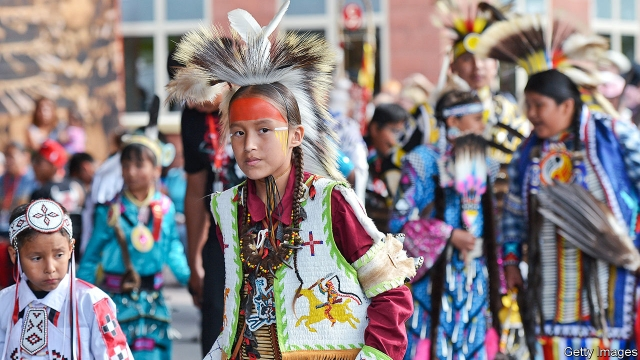

###### Indigenous peoples

# Canada’s indigenous peoples are claiming new rights and resources 

 

> print-edition iconPrint edition | Special report | Jul 27th 2019 

“EDUCATION IS THE New Buffalo”, a sculpture formed from words in indigenous languages, is a focal point of Calgary’s new public library. Its message is that, just as bison once sustained indigenous people in North America, so education will secure their cultural survival. Such messages of support for Canada’s “First Nations” are everywhere. Public events often begin with an acknowledgment of the people on whose “traditional territory” it is taking place. Under a revision of the citizenship oath proposed by the government in May, new Canadians would recognise “the aboriginal and treaty rights of First Nations, Inuit and Métis peoples”. 

Indigenous groups have become more assertive, courts more sympathetic and the government more responsive. This has benefited many. Used to thinking of the country as based on English-and French-speaking nations, Canadians are starting to say it has a “triangular foundation”, says John Ralston Saul, an author. But progress is patchy. 

In the census of 2016, 1.7m Canadians, or nearly 5%, described themselves as indigenous. Their number is growing faster than that of Canada’s population as a whole. Their living conditions are, on average, worse. Nearly 30% of First Nations people are poor, meaning their after-tax income is less than 50% of the median income, adjusted for family size. In 2016, 31% of First Nations people and 46% of Inuit did not have secondary-school qualifications, compared with 8% of the non-indigenous. The 52% of native people who now live in cities are mostly better off than those on reserves. 

The gaps come from centuries-long discrimination. A pass system, in force from 1885 to the 1930s, required members of First Nations to get a permit to leave their reserves. Residential schools removed children from parents and discouraged them from speaking their language. Perhaps 150,000 children went through the schools, and many were mistreated. The last one closed only in 1996. 

As a candidate, Mr Trudeau said it would be a “sacred responsibility” to improve relations with indigenous groups. Their position was already improving. In 1973 the Supreme Court acknowledged that they had valid land claims that pre-dated European settlement. This led to the first “modern treaties”, which give them ownership of an area nearly the size of Manitoba, and a say over land use in 40% of Canada’s territory. Much of the rest is covered by earlier treaties, still in force. These may not override property rights but do give indigenous people influence. This has led to what Ken Coates of the University of Saskatchewan calls “a full culture of consultation” across the country. 

Many have used it to improve their fortunes. In Vancouver three groups joined forces with a developer to purchase 14m square feet (1.3m square metres) of public land at a discount to the market price. They plan to put up housing and commercial buildings. 

Although indigenous groups make headlines when they oppose projects like the Trans Mountain pipeline, many are keen on the revenue and jobs such projects can bring. One group wants to buy a majority stake in that pipeline and put the profits into a sovereign-wealth fund. 

Plenty miss out. At the Rapid Lake reserve, a settlement of Algonquins in Quebec 270km north of Ottawa, almost the only source of income for the 300-400 people who live there is social assistance. 

Mr Harper apologised for the horrors of the residential-school system. A truth and reconciliation commission heard testimony from thousands of witnesses. The Trudeau government is striving to raise living standards. The number of indigenous reserves where drinking water was deemed unsafe dropped from 105 in November 2015 to 58 by July of this year. 

Indigenous leaders think progress has been too slow. “You can’t talk about reconciliation where basic human rights and equity are not achieved,” says Tanya Talaga, an indigenous journalist. The first Canadians are still too often the last. 

