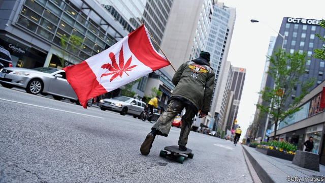
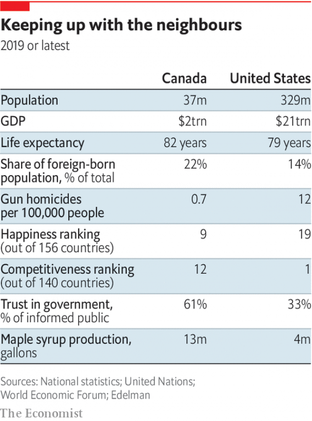
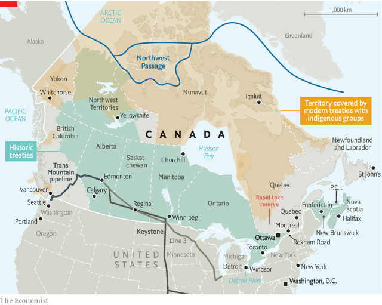

###### Canada

# Canadians must decide if they want to remain a liberal beacon 

 

> print-edition iconPrint edition | Special report | Jul 27th 2019 

THE PEACE ARCH at the border between the Canadian province of British Columbia and America’s Washington state bears two inscriptions. Drivers heading south read that Canadians and Americans are “brethren dwelling together in unity”. On the way back the message is that they are “children of a common mother”. Built in 1921, the reinforced-concrete monument is said to be among the first earthquake-resistant structures in North America. It commemorates a century-old peace treaty between the United States and Britain, one of Canada’s former colonial powers. But those feelings of brotherhood have long been evident between America and Canada itself—as neighbours, friends and allies who share the world’s longest undefended border. 

The current question facing Canadians is whether they can withstand the political earthquakes originating south of the border. Donald Trump, America’s president since 2017, imposed tariffs on Canadian steel and aluminium, supposedly to protect national security. He called the North American Free Trade Agreement (NAFTA) “perhaps the worst trade deal ever made” and forced Canada and Mexico to renegotiate it. After a G7 summit in Quebec last year Mr Trump blasted Justin Trudeau, Canada’s prime minister, as “very dishonest and weak”. In May America’s secretary of state, Mike Pompeo, called Canada’s claim to the Northwest Passage, which links the Arctic and Pacific oceans, “illegitimate”, questioning the two governments’ agreement to disagree on it. 

Mr Trump has lashed out at many countries, but none is more stunned to be on the receiving end than Canada. The neighbours are, indeed, fraternal twins. Ninety per cent of Canadians live within 100 miles of the border. America buys 74% of Canada’s exports of goods and provides 64% of its imports. It holds nearly half the stock of foreign investment in Canada. Canadians winter in Florida. The country’s sports teams compete in American leagues. This year the Toronto Raptors became the first Canadian team to win the National Basketball Association finals. In English-speaking Canada most of the top 30 television shows are American. 

Yet, despite their shared roots and culture, the two countries have always been distinctive, and never more so than today. Just as the first rumbles of the Trump earthquake were being felt in America, in 2015 Canada, after ten years of rule by the Conservative Party, elected the Liberal Party, led by Mr Trudeau, a telegenic former snowboard instructor, who has set about implementing one of the most liberal social, economic and environmental agendas in the Western world. He promised to restore Canadian values that he said his Conservative predecessor, Stephen Harper, had abandoned. To Canadians who had feared that the country had “lost its compassionate and constructive voice in the world”, the victorious Mr Trudeau proclaimed, “We’re back.” 

As Canada turned leftwards, much of the rest of the rich world was turning the other way. America elected Mr Trump. Britons voted for Brexit. European countries such as Poland and Hungary have moved to the populist right. Centrists have been punished: Angela Merkel for inviting in too many refugees, Emmanuel Macron for his climate-friendly policies. Vladimir Putin boasts that the liberal idea has “outlived its purpose”. In December 2016, after Mr Trump’s victory, Joe Biden, the outgoing American vice-president, told Mr Trudeau that the “world is going to spend a lot of time looking to you, Mr Prime Minister”. 

 

Mr Trudeau has tried to live up to that prophecy. His parliament legalised assisted suicide, and cannabis for recreational use. His government has let people identify themselves as neither male nor female on their passports. It has moved efforts to fight global warming from the periphery of policy to the centre, compelling provinces to put a price on carbon emissions or submit to a federal scheme. It has continued Mr Harper’s policy of liberalising trade, but tilted leftwards by redistributing income and tolerating budget deficits. In a general election in October, Canadians will decide whether they want four more years of Mr Trudeau’s liberal policies. 

The prime minister has been a prominent figure internationally, too. Like his father, Pierre, who held the job in the 1960s, 1970s and 1980s, befriending Fidel Castro and recognising communist China before America did, he has been willing to stand apart from American foreign policy. While Mr Trump seeks to undermine international institutions and alliances, Canadian diplomats are striving to shore them up. As its neighbour to the south retreats into a more insular mindset, less willing to take on responsibilities in the world, Canada continues to push its liberal international agenda. It has taken a lead in defending the World Trade Organisation and co-chaired the Equal Rights Coalition that defends gay rights. 

While Mr Trump has repelled refugees, Mr Trudeau has welcomed them, notably Syrians and gay people from Chechnya. The world has seen him defy political fashion for four years. With the election approaching, it will be watching “in order to determine whether doing the right thing ends up with the right results”, says Bill Morneau, the finance minister. 

At home, Mr Trudeau is not getting an easy ride. A conservative backlash has gathered. On the environment, the recently elected premiers of Ontario and Alberta reject his carbon tax. In June Quebec, the French-speaking province which often goes its own way, passed a law banning some public servants, including teachers and police, from wearing religious symbols. This Francophone challenge to Mr Trudeau’s cuddly multiculturalism may be echoed in the national election campaign. 

 

Many liberal Canadians are concerned that the angry politics which put Mr Trump in office could come to Canada. Michael Adams, a pollster, published a book in 2017 called “Could It Happen Here?”. The title appears on a red “Make America Great Again” baseball cap. Last year Ontario elected as its premier Doug Ford, an elite-bashing, tax-slashing conservative who is the closest Canada has to Mr Trump. The country is not exempt from “the backlash among white men about cultural and economic changes that are diminishing their power”, says David Herle, who managed the losing campaign of Mr Ford’s Liberal Party opponent, Kathleen Wynne. Mr Trump’s trade tantrums have also added to a sense of economic insecurity, even though unemployment in Canada is near its lowest level since the 1970s. 

Some Canadians object to Mr Trudeau’s relentless political correctness, and worry that his liberalism has an illiberal side (see article). The prime minister has not been helped by a couple of scandals, notably one in which his office has been accused of trying to press the attorney-general to drop a corruption investigation against a large engineering firm. 

All of this has helped the federal Conservative Party, led by Andrew Scheer, to match the Liberals in opinion polls. Mr Scheer is not Mr Trump. Yet the views of his political base on issues such as climate change, immigration, gun control and foreign policy can seem closer to those of the American president than to those of Mr Trudeau. Under Mr Scheer, Canada would certainly present a different face to the world. 

Mr Trump has given Canada a wake-up call, which reverberates beyond trade. Different parts of the country are responding differently. Among business people it has stirred ambitions to match America beyond the basketball court. Policymakers have scrambled to counter America-first economic policies. Many Canadians have renewed appreciation for what makes their country distinctive. The challenge facing Canada is “how do we preserve what’s essential about our country in the face of an unpredictable and hostile environment?”, says Robert Bothwell, a historian. 

Faced with a Trumpian reality to the south, Canada is asking questions about its own identity. Has Mr Trudeau succeeded in selling his liberal vision of the nation? And can it continue to be a liberal beacon to the world? The answer will partly depend on whether, economically, the model works for its people. ■ 

