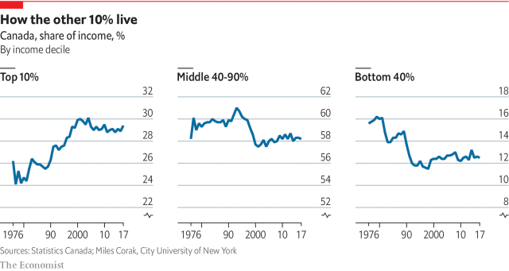
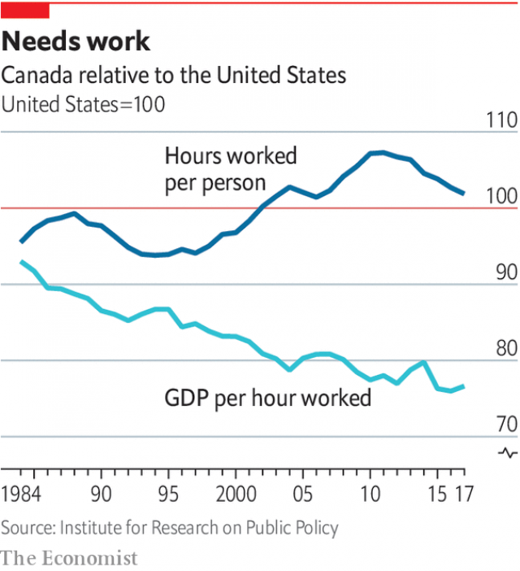

###### Economy

# Redistribution and innovation drive Canada’s changing economy 

 

> print-edition iconPrint edition | Special report | Jul 27th 2019 

EVEN BEFORE Donald Trump and before Brexit, Justin Trudeau was aware that voter disenchantment and populism were on the rise. He saw one of the important answers to this as economic, and his remedy has been to give the middle class a pay rise. “Western democracies around the world had a struggling middle class…that felt that it wasn’t part of the growth that was going on around them,” he told The Economist. “And we said, ‘Well, how do we put people back at [the heart of] the success of our economy instead of hoping that trickle-down will work for them?’ ” 

Middle-class alienation north of the 49th parallel seems surprising. The global recession that began in 2007, kindling populist fires elsewhere, was shorter and less severe in Canada than in other rich countries. Taxpayers did not bail out fat-cat bankers, health care is universal, the quality of public education is high and it does not vary wildly by postcode. The intergenerational rate of social mobility for people born in the 1960s in Canada is double that of America, says Miles Corak, an economist at the City University of New York. Income inequality, as measured by the Gini coefficient, has been stable since 1995, and median household income has risen sharply over the past 25 years. 

On closer inspection, however, the numbers are more troubling. The recent rise in income was preceded by a sharp decline from the mid-1970s to about 1995. People responded by delaying marriage, reducing the number of children they had and working longer hours. This boosted incomes, which are now well above what they were 40 years ago. But this is a sign of stress, caused by technological change and the volatility of an economy largely linked to commodity prices, argues Mr Corak. Incomes soared in commodity-rich Alberta and Saskatchewan from 1992 to 2014 but barely grew in people-rich Ontario. From 2007 to 2011 some 10,000 manufacturing firms stopped exporting. A third of workers have insecure jobs in the “gig economy”, according to a report by the Bank of Canada. 

Although inequality has been steady recently, it has risen since the 1970s. The 40% of the population with the lowest incomes now have a much smaller share of the total, while that of the top 10% has risen sharply (see chart above). “The Astonishing Rise of Canada’s 1%” was the subtitle of a book by Lars Osberg published last year. 

To sustain growth Canada’s business culture will have to become more American 

Mr Trudeau has also had to worry about whether there will be growth to distribute. The recession in the oil industry began the year before he took office. Mr Trump challenged the economy not just by threatening NAFTA but by cutting taxes and regulation for business, which yanked investment south. Even outside natural-resource industries, the capital stock is “hardly growing at all”, says Pedro Antunes, chief economist of the Conference Board, a think-tank. Canada has avoided recession thanks to spending by consumers, who have accumulated a lot of debt, and by government. Mr Trump wants Congress to ratify USMCA, NAFTA’s successor, but his trade war on China threatens global growth. “Anything that puts the global trade system at risk is a significant risk to us,” says Stephen Poloz, the central bank’s governor. 

Mr Trudeau has dealt with these discontents with a dose of old-fashioned redistributive liberalism. To stimulate growth he let a near-balanced budget move into deficit (of about 0.9% of GDP this year). He also promised to spend C$180bn ($138bn)—about 8% of this year’s GDP—on infrastructure over 12 years. Most important, he has put money into the pockets of people on middle and low incomes. A means-tested child-benefit programme gives families on the lowest incomes C$5,600-6,600 a year per child. 

More moolah came from cutting the tax rate on the bottom income bracket and raising it for the richest 1%. The government expanded a tax credit for workers on low incomes. Its critics claim that middle-class families are worse off because it took away some tax credits. In fact, says Mr Morneau, the finance minister, a family of four at the median-income level is C$2,000 better off than it was in 2015. From 2015 to 2017 the number of people living below the official poverty line dropped by 825,000, the government says. Polling by EKOS, a firm in Ottawa, shows that the number of Canadians who say they are middle class has risen since 2017. 

Over the long run, however, to sustain growth (and therefore higher social spending) Canada’s economy and business culture will have to become more American. Its enterprises rarely dazzle the world. A survey of 900 executives in 2011 found that Canadians are more risk-averse than their cousins south of the border. At a time of strain in Canada’s partnership with America, it no longer seems acceptable that six of the ten biggest companies by revenue on Fortune’s list of the world’s largest are American or Chinese, while the top Canadian firm, Manulife, an insurer, is 241st. Canadians have had it with the old gibe that they are content to “go for bronze”. 

Until now, Canada has been keener to develop local champions than global ones. The country’s six biggest banks hold nearly three-quarters of loans. Lending to small businesses as a share of GDP is lower than in other rich countries. Canada restricts foreign ownership of airlines and telecoms firms. In 2017 the average cost of flying per kilometre in Canada was more than double what it was in America. Dairy, poultry and egg farmers are protected by a system of quotas and price floors called “supply management”. Provinces erect their own barriers to trade within Canada. For example, to satisfy their varying rules, businesses may need to buy ten different kinds of first-aid kits. 

Canada’s economic quirks are in part a reaction to American influence. Competition law, written to protect Canadian firms from hulking American rivals, allows anti-competitive mergers if they are expected to lead to gains in efficiency that outweigh the cost to competition. American corporations set up operations in Canada initially to circumvent tariffs, but headquarters and intellectual property stayed south. Today, just 11% of enterprises in Canada that use sophisticated technology (not counting telecoms firms) are Canadian, according to a study by the Brookings Institution. Buzzy startups fall into the hands of foreign acquirers, often American ones. That is partly because small companies which float shares on the stockmarket lose tax benefits. Even in mining, domestic firms are being gobbled up by foreign giants such as Rio Tinto and Newmont. “We’re not the dominant country we were 15 years ago,” laments Pierre Gratton of the Mining Association of Canada. 

All of this has made the economy less productive and innovative than America’s. Labour productivity is about 75-80% of American levels, says Andrew Sharpe of the Centre for the Study of Living Standards in Ottawa. It was growing more slowly than in America until 2010 but then sped up. Canadians are also poorer on average. Income per person in 2018, adjusted for purchasing-power parity, was $49,900, nearly $13,000 lower than in America. 

This gap has not so far been a big problem. Mr Sharpe points out that Canadians at the bottom half of the income scale are better off than Americans in their position, thanks to lower levels of inequality. Growth in income per person has kept pace with America’s for 150 years despite all the upheavals of that period. 

But Canada will find it harder to keep up from now on. Since 1995 it has avoided falling further behind America because its employment as a share of the population has grown faster, writes Peter Nicholson in a paper for the Institute for Research on Public Policy in Montreal (see chart). Canada’s labour force is now ageing and its employment ratio is unlikely to continue rising. That leaves productivity growth, which comes mainly from innovation, as the only source of economic growth. 

 

Canada seems to be getting better at this. Outfits like the MaRS Discovery District, an “innovation hub” in Toronto, are helping it shed its technological inferiority complex. The hub promotes collaboration among 1,300 firms and other institutions, such as regulators and banks. It was founded in 2000 to commercialise medical technologies but has branched into other fields. 

One long-standing problem has been that Canadian enterprises are slow to use the inventions of such companies. Vern Brownell, the boss of D-Wave, which calls itself the world’s leading quantum-computing firm, says that just 0.25% of its revenue comes from Canadian customers. Vancouver’s digital-technology “supercluster”, one of five set up by the Trudeau government, tries to confront that problem. “Large organisations don’t know where the innovators are,” says Sue Paish, the supercluster’s boss. Rather than just make matches, it helps firms design projects in which it invests. The government has given the supercluster C$153m to invest over five years and it must raise at least that much privately. 

Something seems to be working. In 2017 Toronto created nearly 29,000 technology jobs, more than Silicon Valley, Seattle, New York and Washington, DC, combined, according to CBRE, a property-services and investment firm. Canada’s lower costs and relatively liberal immigration regime help. A “global talent stream” programme allows firms to bring in a foreign worker and family within two weeks. Yung Wu, the MaRS’s director, calls it a “game-changer”. American tech giants such as Uber and Microsoft have boosted their research and development activities in Canada. 

While the country’s economy has been growing at around 2%, information-technology services have been expanding at triple that rate since 2016. Growth is occurring “in areas where we are almost certain to see much more productivity”, says Mr Poloz. 

Canada remains less keen to use competition as a way of boosting that productivity. Unlike authorities in other rich countries, its Competition Bureau cannot compel firms to provide information, says its chief, Matthew Boswell. Its budget per citizen is less than a quarter that of its counterpart in Australia. Mr Boswell thinks the principle of allowing anti-competitive mergers should, “at the very least”, be restricted to exporting companies. “Canada could see a 4-5% boost in productivity through pro-competitive regulatory reform and reduced barriers to entry,” he says. 

Many may balk at that. Canada came through the global financial crisis better than America did, in part because its banks are prudent, well-regulated and untroubled by excessive competition. It hopes to match American smarts and scale while remaining Canadian in character. Its technology culture is more patient than Silicon Valley’s. “The vibe in the Valley might have been defined by ‘Move fast and break things’,” says Mr Wu. “It’s different here.” ■ 

