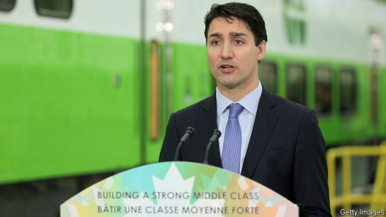

###### Looking ahead

# The election in October will be a test of Canada’s liberal values 

 

> print-edition iconPrint edition | Special report | Jul 27th 2019 

NAHEED NENSHI, Calgary’s ebullient mayor, says that when he was elected in 2010—becoming the first Muslim to lead a large North American city—only the foreign media brought up his religion. The local press never mentioned it. That changed when he ran for re-election for a third term in 2017. People “suddenly started talking about race and religion”, sometimes abusively, online. Although his rivals avoided bigotry, it encouraged formerly non-voting racists to turn up at the polls. He still won. Four years ago, when Justin Trudeau was elected, “Canada was bucking the trend,” says Mr Nenshi. Now it is learning that “we’re not immune at all” to the political maladies of the age. 

The point of Mr Trudeau’s premiership has largely been to boost Canada’s immunity with a liberal tonic that combines social justice and environmentalism with advocacy of globalisation and a dash of redistribution. The test of whether he has succeeded will not be whether he wins the election in October. Rather, it will come if he loses. Would a Conservative government sustain the broader themes of Canadian liberalism even as it discarded Mr Trudeau’s particular brand of it? 

Geography, history, political culture, the electoral system, the structure of the economy and the welfare state all argue for optimism. They keep the political climate temperate. American slugfests over judicial appointments are foreign to Canada. The head of the panel to advise Mr Trudeau on picking the next Supreme Court justice is a former Progressive Conservative prime minister. 

Canada’s comfort with diversity goes back to British colonists’ “incomplete conquests” of indigenous groups and French-speaking settlers, Peter Russell, a historian, has argued. Surrounded by three oceans and the United States, Canada can largely decide what diversity will look like. It was a Progressive Conservative prime minister, John Diefenbaker, who in 1962 ended Canada’s policy of favouring white immigrants. This year Canada intends to accept 330,000 newcomers, nearly 1% of its population. The number is set to rise. Around 90% of immigrants eventually become citizens. 

They are a diverse bunch. In 2017 the top four countries of origin of new permanent residents were India, the Philippines, China and Syria, who made up 47% of the total between them. Asked in 2016 what makes their country unique, 43% of Canadians, without prompting, said multiculturalism and diversity, according to a poll conducted by the Environics Institute. That was far ahead of land and geography, at number two. Constituencies that swing elections, such as the eastern and southern suburbs of Vancouver and the 905 area code around Toronto, have large numbers of voters from immigrant backgrounds. No aspiring prime minister dares provoke them. 

Yet Mr Nenshi’s experience is a warning. Polling finds little increase in hostility towards “visible minorities”: 40% say too many are coming, compared with 38% in 2013, according to EKOS, an Ottawa firm. What has changed is how those attitudes are divided by party. Among supporters of the Conservatives the share that is suspicious of non-white immigrants has jumped from 47% to 69%. Among Liberal backers it has dropped from 34% to 15%. On this and issues such as climate change, “polarisation in Canada is pretty damn close to what it is in the US,” says Frank Graves of EKOS. 

That may be overstating it. But recent events at Roxham Road suggest he has a point. A few miles west of an official border post between New York state and Quebec, Roxham Road is an entry point for “irregular” migrants to Canada. Before President Trump, just a few crept across. Since 2017 some 45,000, mostly non-American, migrants have sought asylum in Canada. 

The irregular uptick sparked uproar and strained Canada’s pro-immigration consensus. This may be “the first time in history that immigration is an election issue nationally”, says Christian Bourque of Leger Marketing, a market-research firm in Montreal. In response, the government slipped in a measure to stop “asylum shopping”, preventing refugees from filing claims if they have already done so in a safe country such as America. 

Andrew Scheer’s Conservatives—the party lost the “Progressive” qualifier in a merger with Stephen Harper’s Canadian Alliance in 2003—have a trickier problem. Their voters are more alarmed by Roxham Road than are the Liberals’. Conservatives face a challenge from Maxime Bernier, a former federal minister from Quebec who calls himself a “smart populist” and wants to reduce the annual immigration target to 250,000—roughly what it was under Mr Harper. His People’s Party is low in the polls, but the Conservatives cannot dismiss him. Nor can they veer from the centre by pandering to nativism. 

Canadian liberalism is so deep-rooted that it does not depend on a Liberal victory 

While defending immigration, Mr Scheer hinted that Canada could become a bit less welcoming. As prime minister he would “set immigration levels consistent with what is in Canada’s best interests”. If anyone detects a dogwhistle, a Conservative will set them straight. The Conservatives are “one of few right-of-centre parties that is strongly pro-immigration”, says Michelle Rempel, an MP from Alberta. 

In effect, Conservatives are betting on the robustness of Canada’s liberal antibodies and their own. Mr Scheer’s election pitch, which includes undoing gun controls brought in by the Liberals, cutting tax and ending national carbon pricing, may seem to have a whiff of Trumpism. Yet Canadian populism “is not the kind of divisive demagogic variety we’ve seen in Europe”, says Jason Kenney, who was Mr Harper’s minister for immigration and for multiculturalism and citizenship before becoming Alberta’s premier. The day after uttering those words he spoke in what sounded like creditable Punjabi to thousands of Sikhs at a parade in Calgary—not something Mr Trump or Marine Le Pen could be imagined doing. 

Both sides are bracing for a bitter election. The clash between Mr Trudeau’s new-age liberalism and Mr Scheer’s conservatism may test Canada’s defences against immoderation, but they should hold. Canadian liberalism is so deep-rooted that it does not depend on a Liberal Party victory. If Mr Trudeau loses, the world will no longer be looking to him, as Mr Biden prophesied back in 2016. But liberals will still look to Canada. ■ 
<<<<<<< HEAD

-- 

 单词注释:

1.Jul[]:七月 

2.ebullient[i'bʌljәnt]:a. 沸腾的, 热情的, 热情洋溢的 

3.Muslim['mjzlim; (?@) 'mʌzlem]:n. 伊斯兰教, 伊斯兰教教徒 

4.abusively[]:adv. 辱骂性, 陋习性, 被滥用, 滥用, 骂人 

5.online[]:[计] 联机 

6.bigotry['bigәtri]:n. 盲从, 偏见, 偏执的行为(或态度) 

7.formerly['fɒ:mәli]:adv. 从前, 以前 

8.racist['reisist]:n. 种族主义者 [法] 种族主义的, 种族歧视 

9.justin['dʒʌstin]:n. 贾斯廷（男子名） 

10.trudeau[]:n. (Trudeau)人名；(英、法)特鲁多 特鲁多 

11.buck[bʌk]:n. 元, 雄鹿, 纨绔子弟, 鞍马, 培克(赌博时的庄家标志), 碱水, 自夸, 谈话 vi. 马背突然拱起, 反对, 吹牛, 闲聊 vt. 马背突然拱起将骑手摔下, 反对, 用碱水洗 a. 雄的 

12.immune[i'mju:n]:a. 免疫的, 免除的, 不受影响的 n. 免疫者 

13.malady['mælәdi]:n. 病, 疾病, 弊病 [医] 病 

14.premiership['premjәʃip;pri'miә-,'pri:m-]:n. 总理职位, 首相职权, 首相职位, 总理职权 [法] 总理职位 

15.immunity[i'mju:niti]:n. 免疫, 免疫性, 免除 [化] 免疫性 

16.tonic['tɒnik]:n. 补药, (音乐)主调音或基音 a. 滋补的, 声调的, 使精神振作的 

17.environmentalism[in,vaiәrәn'mentlizm]:n. 环境保护论, 环境论 

18.advocacy['ædvәkәsi]:n. 拥护, 支持, 鼓吹, 辩护, 辩护术 [法] 辩护, 拥护, 提倡 

19.globalisation[,gləubəlai'zeiʃən]:n. 全球化, =globalization 

20.redistribution['ri:distri'bju:ʃәn]:n. 重新分配, 再分发 [计] 重新分配 

21.liberalism['libәrәlizm]:n. 自由主义 

22.electoral[i'lektәrәl]:a. 选举人的, 选举的, (有关)选举的 [法] 选举的, 选举人的, 由选举人组成的 

23.optimism['ɒptimizm]:n. 乐观主义, 乐观, 乐天 [医] 乐观主义, 乐观 

24.temperate['tempәrәt]:a. 温和的, 适度的, 有节制的, 温带的 

25.slugfest['slʌgfest]:n. 激烈殴斗 

26.judicial[dʒu:'diʃәl]:a. 法庭的, 公正的, 审判上的, 司法的 [法] 司法的, 审判上的, 法官的 

27.diversity[dai'vә:siti]:n. 差异, 多样性 [化] 多样性 

28.incomplete[.inkәm'pli:t]:a. 不完全的, 未完成的, 不完善的 [机] 不完全的 

29.indigenous[in'didʒinәs]:a. 本土的, 国产的, 固有的 [医] 原产的, 本土的 

30.peter['pi:tә]:vi. 逐渐消失, 逐渐减少 

31.russell['rʌsәl]:n. 拉塞尔（英国工程师, 整流器发明人） 

32.historian[hi'stɒ:riәn]:n. 历史学家, 记事者 

33.john[dʒɔn]:n. 盥洗室, 厕所, 嫖客 

34.Diefenbaker[]:n. (Diefenbaker)人名；(英)迪芬贝克；(德)迪芬巴克 

35.newcomer[nju:'kʌmә]:n. 新来者 

36.Philippine['filipi:n]:a. 菲律宾(群岛)的, 菲律宾人的 

37.Syria['siriә]:n. 叙利亚 [经] 叙利亚 

38.multiculturalism[ˌmʌltiˈkʌltʃərəlɪzəm]:n. 多元文化 

39.environics[in'vairɔniks]:环境学(人与环境相互关系的研究) 

40.constituency[kәn'stitjuәnsi]:n. 选民, 顾客, 读者 [法] 选区, 全体选民, 选区内的选民 

41.vancouver[væn'ku:vә]:n. 温哥华（加拿大主要港市） 

42.toronto[tә'rɔntәu]:n. 多伦多（加拿大城市） 

43.voter['vәutә]:n. 选民, 投票人 [法] 选民, 选举人, 投票人 

44.aspire[ә'spaiә]:vi. 渴望, 立志于 

45.provoke[prә'vәuk]:vt. 激怒, 惹起, 诱导 [法] 刺激, 煽动, 激怒 

46.hostility[hɒs'tiliti]:n. 敌意, 敌对, 反对 

47.eko[]:n. (Eko)人名；(喀、瑞典)埃科；(日)江湖 (姓) 

48.supporter[sә'pɒ:tә]:n. 支持者, 后盾, 迫随者, 护身织物 [法] 支持者, 赡养者, 抚养者 

49.backer['bækә]:n. 援助者, 支持者 [经] 背书人, 支持人 

50.polarisation[,pәjlәrai'zeiʃәn; -ri'z-]:n. [物]偏振(现象),极化(作用),两极化,分化 

51.damn[dæm]:n. 一点, 诅咒, 丝毫 interj. 该死, 该死的 vt. 诅咒, 罚...下地狱 vi. 指责, 谴责, 骂...该死, 证明...有罪 

52.overstate[.әuvә'steit]:vt. 夸大的叙述, 夸张, 过分强调 [经] 多计, 高估 

53.york[jɔ:k]:n. 约克郡；约克王朝 

54.quebec[kwi'bek]:n. 魁北克（加拿大港市省名） 

55.migrant['maigrәnt]:n. 候鸟, 移居者 [法] 移居者 

56.asylum[ә'sailәm]:n. 庇护, 收容所 [医] 养育院 

57.uptick['ʌptik]:[商](股票)报升(成交价格比上一个交易高的成交或价格) 

58.uproar['ʌprɒ:]:n. 骚动, 喧嚣 

59.nationally['næʃәnәli]:adv. 作为整个民族, 举国一致地, 全国性地 

60.bourque[]: [人名] 布尔克 

61.leger['ledʒә(r)]:n. 底饵；分类帐（等于ledger） 

62.marketing['mɑ:kitiŋ]:n. 行销, 买卖 [经] 推销, 在市场买卖, 销售 

63.montreal[,mɔntri'ɔ:l]:n. 蒙特利尔（加拿大东南部港市） 

64.refugee[.refju'dʒi:]:n. 难民, 流亡者 [法] 避难者, 流亡者, 难民 

65.andrew['ændru:]:n. 安德鲁（男子名） 

66.qualifier['kwɒlifaiә]:n. 取得资格的人, 限定语 [计] 限定词 

67.merger['mә:dʒә]:n. 合并, 归并 [经] 购并 

68.stephen['sti:vn]:n. 斯蒂芬（男子名） 

69.alliance[ә'laiәns]:n. 联盟, 联合 [法] 同盟, 联盟, 联姻 

70.tricky['triki]:a. 狡猾的, 机敏的 

71.maxime[]:n. (Maxime)人名；(法)马克西姆 

72.berny[]:n. (Berny)人名；(法、瑞典)贝尔尼 

73.Populist['pɔpjulist]:n. 民粹派的成员 

74.Harper['hɑ:pә]:n. 哈珀（英语姓氏） 

75.cannot['kænɒt]:aux. 无法, 不能 

76.veer[viә]:vi. 转向 vt. 使转向 n. 转向 

77.pander['pændә]:vi. 勾引, 怂恿, 卑劣地迎合 n. 拉皮条者, 怂恿者, 助恶者 

78.nativism['neitivizm]:n. 先天论, 乡土主义, 本土主义 

79.scheer[]: [人名] 希尔; [地名] [德国] 谢尔 

80.les[lei]:abbr. 发射脱离系统（Launch Escape System） 

81.Michelle[mɪ'ʃɛl]:n. 米歇尔（女子名） 

82.rempel[]: [人名] 伦佩尔 

83.MP[]:国会议员, 下院议员 [计] 宏处理程序, 维护程序, 线性规划, 微程序, 多处理器 

84.alberta[]:n. 亚伯达（加拿大西部的一个省） 

85.robustness[]:[计] 健壮性 [化] 鲁棒性; 稳健性 

86.antibody['æntibɒdi]:n. 抗体 [化] 抗体 

87.whiff[hwif]:n. 一吹, 一吸, 一阵, 一点点, 一口烟 vi. 轻轻地吹, 喷气, 三击不中出局, 垂钓 vt. 吹送, 喷出, 吸, 使三击不中出局 

88.Trumpism[]:n. 特朗普主义 

89.Populism['pɒpjulizm]:n. 平民主义, 民粹主义 

90.divisive[di'vaisiv]:a. 区分的, 制造分裂的, 造成不和的 

91.demagogic[,demә'^ɔ^ik]:a. 煽动的, 蛊惑的 

92.jason[]:n. 詹森（男子名） 

93.kenney[]: [人名] [苏格兰人、爱尔兰人姓氏] 肯尼 Kenny的变体; [地名] [美国] 肯尼 

94.citizenship['sitizәnʃip]:n. 国籍, 市民权, 市民的身份 [法] 公民权, 公民资格, 公民身分 

95.creditable['kreditәbl]:a. 可称誉的, 声誉好的, 可信的 

96.Punjabi[.pʌn'dʒɑ:bi]:n. 旁遮普人, 旁遮普语 a. 旁遮普的, 旁遮普人的, 旁遮普语的 

97.sikh[si:k]:n. 锡克教教徒 

98.LE[]:[计] 小于或等于 

99.brace[breis]:n. 支柱, 曲柄, 支撑, 一对 vt. 紧缚, 支撑, 激励 vi. 打起精神 [计] 花括号 

100.clash[klæʃ]:n. 冲突, 撞击声, 抵触 vi. 冲突, 抵触 vt. 使发出撞击声 [计] 对撞 

101.conservatism[kәn'sә:vәtizәm]:n. 保守, 守旧性, 保守主义, [the]保守党的主张和政策, 保守党 [医] 保守性 

102.immoderation[i.mɒdә'reiʃәn]:n. 无节制, 过度 

103.biden[baidən]: [人名] 拜登 

104.prophesy['prɒfәsai]:v. 预言, 预报 
=======
>>>>>>> 50f1fbac684ef65c788c2c3b1cb359dd2a904378

