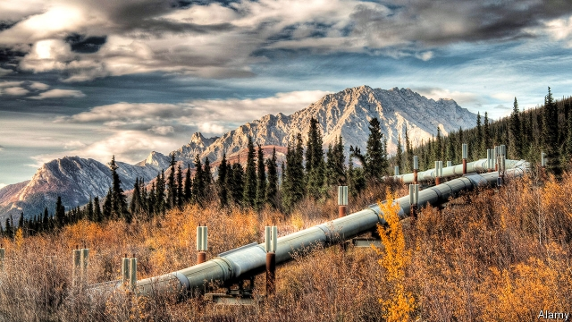

###### The environment

# The environment is Canada’s biggest wedge issue 

 

> print-edition iconPrint edition | Special report | Jul 27th 2019 

BURNABY MOUNTAIN in a suburb of Vancouver, British Columbia’s biggest city, is a tranquil spot which affords a spectacular view of the North Shore mountains. Yet the area around it is the site of Canada’s fiercest political battle, which pits environmentalists against the oil industry. The Liberal prime minister has been caught in the middle. At the foot of the mountain is one terminus of the Trans Mountain pipeline, which carries 300,000 barrels of oil a day from Alberta, the province to the east of British Columbia. Tankers deliver the oil to America’s west coast and to Asia. 

The conflict comes because the pipeline is at capacity, forcing Alberta’s producers to ship oil by rail to the United States. The bottleneck cost them C$20bn in revenue in 2013-17. So the province wants to treble capacity by adding another pipe alongside the existing one. But the project has provoked opposition from British Columbia, environmentalists and some of the indigenous groups along the pipeline’s 1,147km (713-mile) route. They have fought it with protests and court challenges. If the planet is to avoid catastrophic climate change, “why are we expanding oil production [by building a pipeline] with a lifetime of 50 years?” asks Sophie Harrison, formerly an activist with Dogwood, a Vancouver NGO. 

Justin Trudeau has overruled the objectors. When Trans Mountain’s Texan owner decided last year to give up fighting to expand it, the federal government bought the pipeline for C$4.5bn. On June 18th it gave the go-ahead for expansion to begin. 

The pipeline row is part of a larger battle over energy and climate change that is one of Mr Trudeau’s biggest headaches. A large part of his pitch to voters is that he can reconcile protection of the environment with the need for economic growth. Partisans from both sides are making it hard for him. One of the main issues in October’s election will be whether he has got the balance right. 

Canada’s oil reserves are the world’s third-largest. Oil and gas extraction, and industries related to it, account for about 7% of GDP and a fifth of exports. Mr Trudeau cannot disregard that industry, but he also wants, by 2030, to meet Canada’s commitment, made by Stephen Harper and reaffirmed under the Paris climate agreement, to cut emissions of greenhouse gases by 30% from the levels of 2005. Canadians are currently among the world’s biggest emitters per person, each of them belching out nearly three times more greenhouse gases than the average person in G20 countries. To square green goals with economic ones, Mr Trudeau has set a national standard for pricing carbon emissions, which seeks to cut pollution by raising its price. 

Dogwood called the pipeline approval “flawed and unlawful”. Alberta’s new Conservative premier, Jason Kenney, said it was “just another step in a process that has…taken too long”. Meanwhile, he has scrapped Alberta’s consumer carbon tax (though he has kept a carbon-pricing scheme for large emitters). Alberta has joined Ontario, New Brunswick, Saskatchewan and Manitoba in challenging the national carbon price in court. Andrew Scheer, the opposition leader, says if he becomes prime minister he will scrap the tax and replace it with his own climate plan. 

Mr Trudeau’s “typical, liberal, centrist compromise approach…hasn’t pleased anybody”, observes Duane Bratt, a political scientist at Mount Royal University in Calgary. In a country largely free of the polarisation that blights America’s politics, the rights and wrongs of oil extraction are the main wedge issue. 

Nowhere is wedgier than Alberta, which, thanks to oil, is Canada’s richest province. Ralph Klein, its premier from 1992 to 2006, handed out C$400 cheques, known as “Ralph bucks”, to every Albertan, a dividend from the oil sands. It is the only province without a sales tax. It has also been an economic shock-absorber. Fishermen beached by the collapse of Newfoundland’s cod industry in the 1990s and workers displaced by Ontario’s manufacturing slump in the 2000s found well-paid jobs in Alberta’s oil patch. In the 2017-18 fiscal year, its taxpayers made a net contribution of C$20.5bn to federal coffers, about 6.5% of revenue. But Alberta got none of the C$18.2bn earmarked for poorer provinces. 

Despite its wealth, it is not feeling rich. The plunge in global oil prices that began in 2014 turned boom to bust. By 2016 Alberta’s oil industry had shed 100,000 jobs. The province is still hurting even though prices have risen. Unemployment has dropped from a peak of 9.1% in 2016 to 6.6% in June this year, but it is still a percentage point above the national rate. Office vacancies in downtown Calgary, Alberta’s business capital, have jumped from zero in 2007 to over 25%. International oil companies such as Exxon, Total and Royal Dutch Shell have either delayed projects or are pulling out. 

The battle against the pipeline, waged in the name of wildlife, indigenous peoples and the planet, feels to Albertans like character assassination. Oil from the province’s oil sands requires more energy to extract than does crude from more conventional sources. Producers therefore emit more greenhouse gas per barrel (see chart). Barack Obama called it “extraordinarily dirty”. 

 

“We’ve been generous and loyal Canadians and now everywhere we turn we’ve been blocked in and turned down,” says Mr Kenney. He says many feel the “prairie alienation” that has long been a feature of locals’ attitudes to elites back east. According to a poll in February, half of Albertans see separation from Canada as a possibility. 

Mr Trudeau’s backing of the Trans Mountain expansion is unlikely to change their minds. He “killed” two other pipeline projects, Northern Gateway (across British Columbia) and Energy East (which would have gone through Quebec), Mr Kenney notes, and “surrendered” to Mr Obama’s veto of a third, Keystone XL. 

Just as irksome are two environmental bills backed by the federal government—one overhauling the process for approving big infrastructure projects, the other a ban on coastal tanker traffic—which look to many Albertans like part of the broader conspiracy to keep the province’s oil sands poorly connected. 

Locals insist that the stigma borne by their oil is unwarranted. The view that it is more damaging to the atmosphere to extract is becoming outdated, says Peter Tertzakian, director of ARC Energy Research Institute in Calgary. The price slump, transport bottlenecks and pressure from activists have forced oil firms to cut costs and emissions. “When you have the lowest commodity prices in the world you get clever very fast,” he says. 

Cenovus, a Calgary-based oil producer, has reduced the greenhouse-gas intensity of its production by a third, says its chief executive, Alex Pourbaix. It now matches the American refined average, and at some sites it is lower. Besides, extraction accounts for only a small fraction of emissions associated with each barrel of oil; 70-80% occur when the customer burns it. Albertans wonder why oil from countries with less regard than Canada for human rights and environmental good conduct attracts less opprobrium. “The effort is focused on Canada because we have the reputation as the world’s boy scouts,” says Mr Pourbaix ruefully. 

By scrapping the carbon tax brought in by his predecessor, Mr Kenney has made it harder to claim that Albertans are environmental boy scouts. He has hitched Alberta to a national campaign against Mr Trudeau’s climate policy, waged in the name of “affordability”. Ontario’s government has told petrol stations to put stickers on their pumps reading, “The federal carbon tax will cost you.” 

The government’s scheme was designed to resist such attacks. Provinces with their own carbon-pricing schemes can keep them. British Columbia, which began taxing emissions in 2008, and Quebec, which has a cap-and-trade system, have done so. The national scheme is only imposed on provinces that reject carbon pricing or whose schemes fall short of federal standards. It sets a price floor of C$20 a tonne this year, rising to C$50 by 2022. All the money goes back to the province where it is raised; 90% of that goes to taxpayers. In Ontario, a family of four will get back C$307 this year. “It’s a small-C conservative approach,” says Catherine McKenna, the environment minister. 

The carbon-pricing scheme plus other measures, such as “the toughest methane regulations for oil and gas in the world”, will ensure that Canada meets its emission-reduction targets, Ms McKenna insists. Others say that will require more action. To achieve the target mainly through the carbon tax, the price would need to be C$125-175 by 2030, believes Chris Ragan of the Ecofiscal Commission, a think-tank. “When people say, ‘We can’t have a carbon price that high,’ I say, ‘Why can’t we have income taxes that low?’ ” 

The decision to expand Trans Mountain could provoke more protests at Burnaby. Alone it will not solve Alberta’s problem. Another pipeline is needed to free producers from factoring the cost of rail transport into prices, says Trevor Tombe of the University of Calgary. The likeliest option is one called Line 3 to Minnesota, which exists but needs replacement. Opposition to that comes mainly from America. Alberta will seethe, but it is unlikely to secede. “Canada exists to try to address some of these challenges,” says Mr Tombe. 

Although Mr Trudeau has lost recent battles, he could yet win the war. Canada is warming twice as fast as the rest of the world. Voters are starting to notice. The country is already getting rainier, and thus more vulnerable to flooding. Mr Kenney cancelled an event at a petrol station on May 30th to tout the repeal of the carbon tax because wildfires were raging near Edmonton, Alberta’s capital. 

Nearly 80% of Canadians think pollution pricing should be among the tools their government employs to fight climate change, according to a recent poll by Abacus Data. In the election, it may be that climate alarm will count for more than affordability anxiety. ■ 

