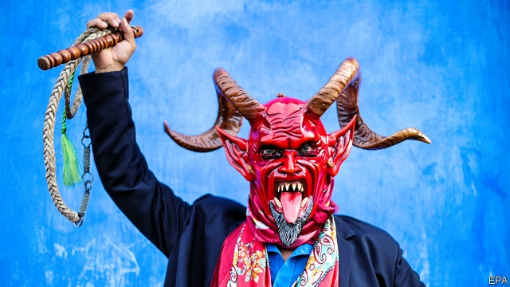

###### Pobre, pero sexy

# Can tourism boost one of Mexico’s poorest states? 

 

> print-edition iconPrint edition | The Americas | Jul 27th 2019 

IT IS A tricky time to be in the tourism business in Mexico. A record murder rate, and travel warnings, have put some foreigners off. The number of visitors to Quintana Roo, the jewel of the tourism industry, is expected to drop by 30% this year, due to pile-ups of seaweed on beaches so big that the navy is helping to clean them up. Last year the number of visitors to Mexico rose by 2.2m, its lowest increase since 2013. Just as the bad news mounts, Andrés Manuel López Obrador, the president, has disbanded the tourism-promotion body. 

Oaxaca, Mexico’s second-poorest state, is a bright exception. The number of foreigners flying into the capital, a colonial gem also called Oaxaca, soared by 49% in the year to March, a bigger rise than anywhere else. The fame of Yalitza Aparicio, the indigenous star of “Roma”, a film released last year, is likely to make the state still more popular. She is the face of this year’s Guelaguetza, a festival of indigenous culture, which ends on July 29th. 

The southern state is not for everyone. D.H. Lawrence, who spent three months there in the 1920s, thought it “queer and forlorn”. It is still queer. Teachers spend more time on strike than in classrooms. Roads are unpaved and the poverty rate is 70%. But many tourists are undaunted. Oaxaca’s Pacific coast is ideal for surfers (and seaweed-free). Mezcal, a globally popular spirit, can be quaffed in the villages where it is made. Mexico’s most indigenous state, Oaxaca prides itself on its creativity, which takes the form of vivid hand-spun textiles and carved wooden beasts, called alebrijes. 

In the town of San José del Pacifico, located in the chilly southern mountains, coffee shops with European breakfast menus cater to hippie hordes which arrive in June, when psychedelic mushrooms sprout on the hills nearby. A three-storey hotel, the first in this one-street village of 500 people, is under construction. Folk from nearby villages bring crafts to sell. 

The state government wants to lure richer travellers. A convention centre opened in the capital in 2017. People who attend business conferences there spend twice as many nights as do typical tourists and five times as much money per day, says Juan Carlos Rivera, the state’s tourism secretary. Unlike leisure travel, which spikes in winter, conferences are not seasonal. Mr Rivera expects more five-star chains to open alongside boutique hotels. 

Tourism is unlikely to enrich the poorest citizens. They live in villages far away from resorts and cities. San José del Pacifico is an exception. Nor do tourists help the state budget much. Value-added tax flows to the federal government. A tax on hotels will bring in only 50m pesos ($2.6m) this year, says Alejandro Murat, the governor. 

Still, Oaxaca is planning for more visitors. The airport is adding more gates and a second floor, enabling more flights. A motorway from the capital to Puerto Escondido, planned since 2006, will open by 2022. That will cut the journey between the state’s two tourist hotspots from seven hours to 90 minutes, says Mr Murat. Tourists will no longer need to take the winding, forested road on which San José del Pacifico sits. For some, the magic mushrooms will still make the trip worthwhile. ■ 

